# Lesson 17：Two-Dimensional Arrays 二維陣列

> 這堂課的重點：從陣列在記憶體中的排列方式出發，理解二維陣列其實是「元素本身也是陣列的陣列」，並使用雙重索引與巢狀迴圈表示、填入及輸出 `3 × 3` 九宮格。最後比較二維與一維表示法，並預覽如何將一維索引轉換成二維座標。

---

## Section I. 今天要做什麼？

1. 複習一般整數變數與陣列變數的記憶體配置。
2. 理解一維陣列由多個相同型態元素組成。
3. 理解陣列元素按照索引順序連續排列。
4. 認識「陣列的陣列」。
5. 讀懂宣告 `int v[2][3];`。
6. 理解第一個長度 `2` 與第二個長度 `3` 的角色。
7. 分辨外層陣列與內層陣列。
8. 計算二維陣列包含的基本元素總數。
9. 使用兩個索引存取二維陣列元素。
10. 理解 `v[1][2]` 的兩階段存取過程。
11. 認識二維陣列的列與欄。
12. 理解列索引與欄索引都從 `0` 開始。
13. 初始化 `3 × 3` 二維陣列。
14. 使用二維陣列表示九宮格。
15. 使用巢狀迴圈逐列輸出九宮格。
16. 分辨外層迴圈與內層迴圈的責任。
17. 使用變數 `k` 依序填入 `1–9`。
18. 將 `k` 消去，直接使用 `i * 3 + j + 1`。
19. 理解二維陣列的記憶體仍然是連續排列的。
20. 依序列出 `v[0][0]` 到 `v[2][2]`。
21. 比較 `v[i][j]` 與 `v[j][i]` 的輸出方向。
22. 使用一維陣列表示相同的九宮格。
23. 將列、欄座標轉換成一維索引。
24. 使用公式 `3 * row + column`。
25. 將一維索引轉回列與欄。
26. 使用除法取得列索引。
27. 使用餘數取得欄索引。
28. 使用單一迴圈每三個元素換行。
29. 比較二維表示法與一維表示法。
30. 認識資料在記憶體中的實際排列與畫面中的表格是不同層次。
31. 預覽一維陣列的交換式隨機排列。
32. 預覽如何把隨機一維索引轉成二維座標。
33. 使用 `r / 3` 與 `r % 3` 找出隨機位置。
34. 使用交換確保九宮格中的 `1–9` 不重複。
35. 找出二維索引越界、迴圈邊界與座標公式錯誤。
36. 為下一章的亂數與不重複亂數建立基礎。

---

## Section II. 今天的學習方式

1. 先畫出一維陣列的連續記憶體格子。
2. 再將每一段元素視為一個較小陣列。
3. 對 `int v[2][3]` 先從左到右讀：
   - `v` 有 `2` 個外層元素。
   - 每個外層元素都是包含 `3` 個 `int` 的陣列。
4. 在紙上標出：
   - `v[0]`
   - `v[1]`
   - `v[0][0]` 到 `v[1][2]`
5. 將第一個索引理解為先選哪一個內層陣列。
6. 將第二個索引理解為再選該內層陣列中的哪一個整數。
7. 先使用固定的 `3 × 3` 九宮格觀察規律。
8. 使用 `i` 控制第一個索引，使用 `j` 控制第二個索引。
9. 每完成一個內層陣列後輸出換行。
10. 先使用計數器 `k` 填值，再尋找 `i`、`j` 與資料值的公式。
11. 比較二維陣列的九個基本元素與一維陣列的九個元素。
12. 對每個座標寫出它的一維索引。
13. 使用：
    - 整數除法找列
    - 餘數找欄
14. 先完成固定資料輸出，再做交換式隨機排列。
15. 本章只預覽 `rand()`、`srand()` 與交換；亂數原理留在下一章。
16. 所有程式至少測試左上、右上、中央、左下與右下位置。
17. 每次存取元素前，都確認兩個索引位於合法範圍。

---

## Section III. 今天會學到的內容

| 主題 | 你需要知道的事 |
| --- | --- |
| 一般變數 | 保存一個指定型態的值 |
| 陣列變數 | 保存固定數量且型態相同的元素 |
| 連續配置 | 陣列元素依索引順序相鄰排列 |
| 外層陣列 | 二維陣列最左邊中括號所描述的陣列 |
| 內層陣列 | 外層陣列的每個元素所代表的陣列 |
| 二維陣列 | 元素型態本身也是陣列的陣列 |
| 列 row | 九宮格中的橫向一排 |
| 欄 column | 九宮格中的直向一排 |
| 第一個索引 | 先選擇外層元素，九宮格中通常視為列 |
| 第二個索引 | 再選擇內層元素，九宮格中通常視為欄 |
| `v[i][j]` | 第 `i` 個內層陣列中的第 `j` 個整數 |
| 有效列索引 | `0` 到列數減 `1` |
| 有效欄索引 | `0` 到欄數減 `1` |
| 九宮格 | `3 × 3`，共有 `9` 個基本元素 |
| 巢狀迴圈 | 外層走訪列，內層走訪欄 |
| 列優先走訪 | 先完成一整列，再進入下一列 |
| 連續基本元素 | `v[0][0]`、`v[0][1]`、… 依序排列 |
| 一維表示法 | 使用長度 `9` 的陣列表示九宮格 |
| 座標轉索引 | `row * width + column` |
| 索引轉列 | `index / width` |
| 索引轉欄 | `index % width` |
| 轉置式輸出 | 使用 `v[j][i]` 交換存取順序 |
| 交換 | 對調兩個元素，不新增或刪除數值 |
| 剩餘區間 | 隨機排列時尚未固定的位置 |
| 隨機平面索引 | 先選 `0–8` 中的位置，再轉成列與欄 |

---

## Section IV. 寫題目前的提醒

### 1. 陣列變數不是多個互不相關的普通變數

來源先比較：

```c
int v;
```

與：

```c
int v[6];
```

一般變數 `v` 保存一個 `int`。

陣列 `v` 則是一個完整的 `int[6]` 物件，其中包含：

```text
v[0] v[1] v[2] v[3] v[4] v[5]
```

---

### 2. 一維陣列的元素依索引順序排列

```c
int v[6] = {1, 2, 3, 4, 5, 6};
```

來源的記憶體圖依序顯示：

```text
v[0] → 1
v[1] → 2
v[2] → 3
v[3] → 4
v[4] → 5
v[5] → 6
```

這是理解二維陣列的起點。

---

### 3. `int v[2][3]` 是「兩個長度為 3 的整數陣列」

```c
int v[2][3];
```

可以分層理解：

```text
v
├── v[0]：int[3]
└── v[1]：int[3]
```

每個內層陣列再包含三個 `int`：

```text
v[0][0] v[0][1] v[0][2]
v[1][0] v[1][1] v[1][2]
```

總共有：

```text
2 × 3 = 6 個 int
```

---


<!-- AUTO-IMAGE: C_Lesson_17_img01_array_of_arrays.png -->
<p align="center">
  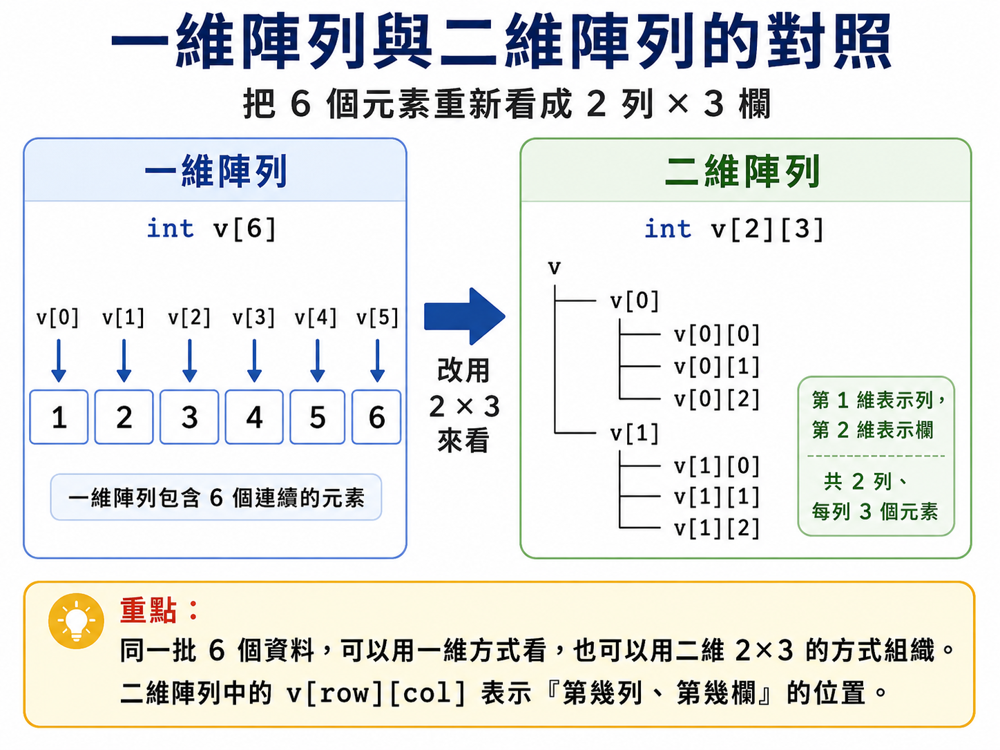
</p>
<!-- /AUTO-IMAGE: C_Lesson_17_img01_array_of_arrays.png -->

### 4. 第一個中括號不是欄數

對九宮格：

```c
int v[3][3];
```

本章將它理解成：

```text
3 列，每列 3 欄
```

第一個索引通常用來選列，第二個索引通常用來選欄。

---

### 5. `v[1][2]` 要分兩步理解

```c
v[1][2]
```

第一步：

```c
v[1]
```

取得第二個內層陣列。

第二步：

```c
v[1][2]
```

取得該內層陣列的第三個整數。

在來源九宮格中：

```text
v[1][2] = 6
```

---


<!-- AUTO-IMAGE: C_Lesson_17_img02_two_index_access.png -->
<p align="center">
  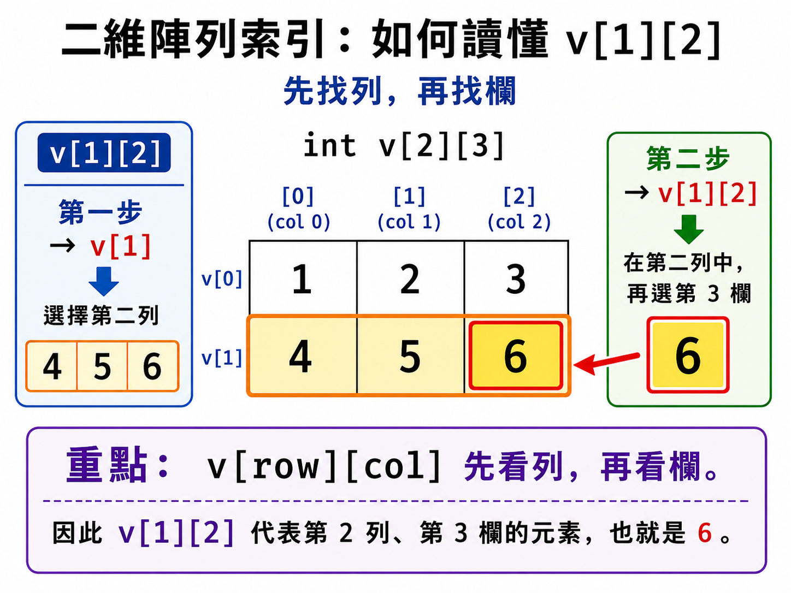
</p>
<!-- /AUTO-IMAGE: C_Lesson_17_img02_two_index_access.png -->

### 6. 二維陣列的兩個索引都從 `0` 開始

`3 × 3` 合法索引：

```text
列：0、1、2
欄：0、1、2
```

不合法：

```c
v[3][0]
v[0][3]
v[-1][0]
```

---


<!-- AUTO-IMAGE: C_Lesson_17_img03_row_column_indices.png -->
<p align="center">
  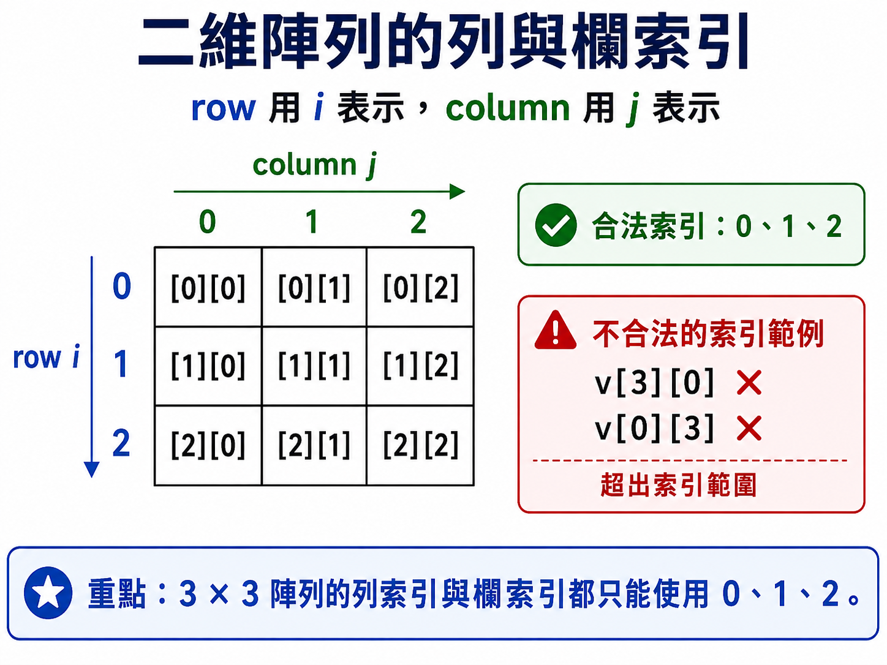
</p>
<!-- /AUTO-IMAGE: C_Lesson_17_img03_row_column_indices.png -->

### 7. 總元素數量是兩個長度相乘

```c
int v[3][3];
```

基本 `int` 元素數量：

```text
3 × 3 = 9
```

```c
int v[3][2];
```

基本 `int` 元素數量：

```text
3 × 2 = 6
```

---

### 8. 初始化時，內層大括號對應內層陣列

```c
int v[3][3] = {
    {1, 2, 3},
    {4, 5, 6},
    {7, 8, 9}
};
```

可分成：

```text
v[0] = {1, 2, 3}
v[1] = {4, 5, 6}
v[2] = {7, 8, 9}
```

---


<!-- AUTO-IMAGE: C_Lesson_17_img11_2x3_vs_3x2.png -->
<p align="center">
  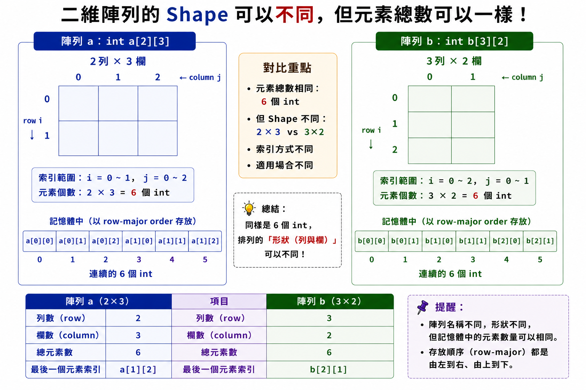
</p>
<!-- /AUTO-IMAGE: C_Lesson_17_img11_2x3_vs_3x2.png -->

### 9. 外層迴圈完成一列，內層迴圈完成一列中的所有欄

```c
for (i = 0; i < 3; i++) {
    for (j = 0; j < 3; j++) {
        printf("%d ", v[i][j]);
    }

    printf("\n");
}
```

換行應放在內層迴圈結束後。

---


<!-- AUTO-IMAGE: C_Lesson_17_img04_nested_loop_traversal.png -->
<p align="center">
  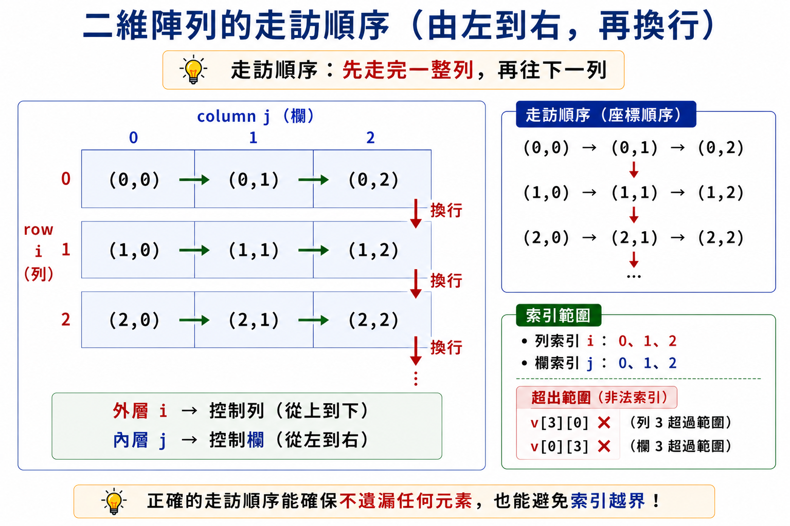
</p>
<!-- /AUTO-IMAGE: C_Lesson_17_img04_nested_loop_traversal.png -->

### 10. 把換行放進內層會變成每個數字一行

錯誤：

```c
for (j = 0; j < 3; j++) {
    printf("%d\n", v[i][j]);
}
```

這不會形成三欄表格。

---

### 11. 二維陣列在記憶體中仍然依序排列

來源圖示將九個元素畫成：

```text
v[0][0] v[0][1] v[0][2]
v[1][0] v[1][1] v[1][2]
v[2][0] v[2][1] v[2][2]
```

在記憶體中連續排列。

也就是先放完 `v[0]`，再放 `v[1]`，最後放 `v[2]`。

這種排列通常稱為**列優先 row-major**；這個名稱是對來源記憶體圖的標準術語補充。

---


<!-- AUTO-IMAGE: C_Lesson_17_img05_row_major_memory.png -->
<p align="center">
  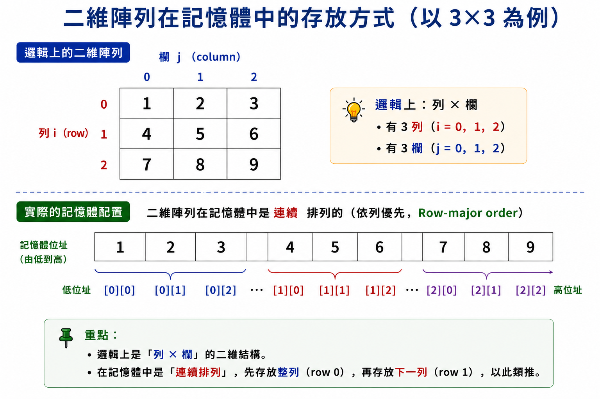
</p>
<!-- /AUTO-IMAGE: C_Lesson_17_img05_row_major_memory.png -->

### 12. 畫成九宮格只是資料的邏輯表示

實際記憶體是一段連續元素。

九宮格則是我們為了理解資料而使用的列、欄模型。

改變存取順序：

```c
v[i][j]
```

與：

```c
v[j][i]
```

可以用不同方向顯示相同資料。

---

### 13. 使用 `k` 填值時，必須先初始化

```c
int k = 1;
```

每次放入一格後：

```c
k++;
```

如果 `k` 未初始化，就不能可靠地產生 `1–9`。

---

### 14. `i * 3 + j + 1` 中的 `3` 是每列欄數

```c
v[i][j] = i * 3 + j + 1;
```

當 `i == 1`、`j == 2`：

```text
1 × 3 + 2 + 1 = 6
```

---

### 15. 一維陣列每三個元素換行

```c
if (i % 3 == 2) {
    printf("\n");
}
```

合法的每列最後索引：

```text
2、5、8
```

它們除以 `3` 的餘數都是 `2`。

---


<!-- AUTO-IMAGE: C_Lesson_17_img06_transpose_access.png -->
<p align="center">
  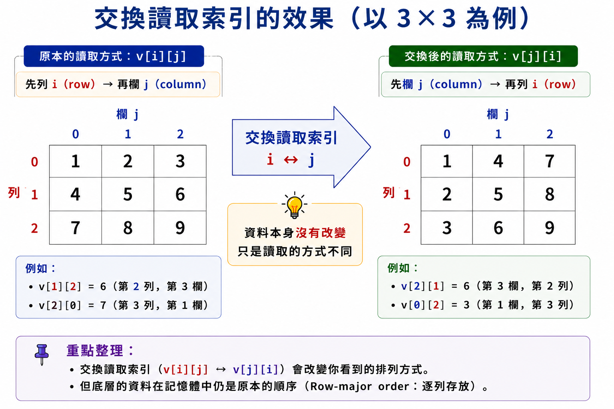
</p>
<!-- /AUTO-IMAGE: C_Lesson_17_img06_transpose_access.png -->

### 16. 二維座標轉成一維索引時，必須乘以寬度

九宮格寬度為 `3`：

```c
index = row * 3 + column;
```

若只寫：

```c
row + column
```

不同座標可能得到相同索引。

---

### 17. 一維索引轉回座標時，除法與餘數角色不同

```c
row = index / 3;
column = index % 3;
```

例如：

```text
index = 5
row = 5 / 3 = 1
column = 5 % 3 = 2
```

所以索引 `5` 對應：

```c
v[1][2]
```

---

### 18. 隨機排列時不能每格獨立產生 `1–9`

若每一格都使用：

```c
rand() % 9 + 1
```

可能出現重複數字，也可能漏掉某些數字。

來源使用：

> 先準備完整的 `1–9`，再交換位置。

這樣交換後仍然恰好包含一次 `1–9`。

---

### 19. 來源的二維隨機版本要使用最終修正版的 `k = 0`

來源練習的較早投影片中，`k` 曾只宣告而未初始化。

最後版本改成：

```c
int i, j, k = 0;
```

本章使用最後修正版，避免未初始化變數。

---


<!-- AUTO-IMAGE: C_Lesson_17_img07_coordinate_value_formula.png -->
<p align="center">
  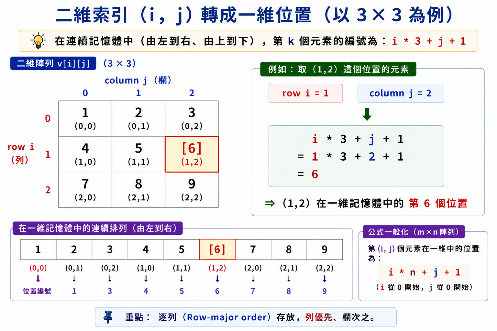
</p>
<!-- /AUTO-IMAGE: C_Lesson_17_img07_coordinate_value_formula.png -->

### 20. 本章的 `rand()` 用法只是下一章預覽

來源使用：

```c
srand(time(0));
rand()
```

本章只關注：

- 交換元素
- 一維索引與二維座標的轉換

亂數種子、偽亂數與不重複亂數方法會在下一章正式說明。

---

## Section V. 核心概念說明

## Section V-A. 從一般變數到陣列

### 1. 一般整數變數

```c
int v;
```

來源圖示將它表示為一個可以保存 `int` 的記憶體位置。

初始化：

```c
int v = 3;
```

該位置保存數值 `3`。

---

### 2. 一維整數陣列

```c
int v[6];
```

這個變數的型態是：

```text
int[6]
```

它是一個完整陣列，其中包含六個 `int` 元素。

---

### 3. 初始化後的元素

```c
int v[6] = {1, 2, 3, 4, 5, 6};
```

| 索引 | 元素值 |
| ---: | ---: |
| `v[0]` | 1 |
| `v[1]` | 2 |
| `v[2]` | 3 |
| `v[3]` | 4 |
| `v[4]` | 5 |
| `v[5]` | 6 |

---

## Section V-B. 陣列的陣列

### 4. 宣告 `2 × 3` 陣列

```c
int v[2][3];
```

`v` 的完整型態可以理解為：

```text
包含 2 個 int[3] 元素的陣列
```

---

### 5. 外層元素

```text
v[0]
v[1]
```

兩者的型態都是：

```text
int[3]
```

---

### 6. 基本整數元素

```text
v[0][0]
v[0][1]
v[0][2]
v[1][0]
v[1][1]
v[1][2]
```

每個最終元素的型態都是：

```text
int
```

---

### 7. 初始化 `2 × 3`

```c
int v[2][3] = {
    {1, 2, 3},
    {4, 5, 6}
};
```

記憶體中的基本元素順序：

```text
1 2 3 4 5 6
```

---

### 8. `3 × 2` 與 `2 × 3` 不相同

```c
int a[2][3] = {
    {1, 2, 3},
    {4, 5, 6}
};
```

表示：

```text
2 個內層陣列，每個長度 3
```

```c
int b[3][2] = {
    {1, 2},
    {3, 4},
    {5, 6}
};
```

表示：

```text
3 個內層陣列，每個長度 2
```

兩者都有六個 `int`，但列與欄的結構不同。

---

### 9. 完整輸出 `2 × 3`

```c
#include <stdio.h>

int main(void) {
    int row;
    int column;
    int v[2][3] = {
        {1, 2, 3},
        {4, 5, 6}
    };

    for (row = 0; row < 2; row++) {
        for (column = 0; column < 3; column++) {
            printf("%d ", v[row][column]);
        }

        printf("\n");
    }

    return 0;
}
```

輸出：

```text
1 2 3
4 5 6
```

---

## Section V-C. 使用二維陣列表示九宮格

### 10. 九宮格資料

```text
1 2 3
4 5 6
7 8 9
```

可以宣告：

```c
int v[3][3] = {
    {1, 2, 3},
    {4, 5, 6},
    {7, 8, 9}
};
```

---

### 11. 座標與元素

| 列 | 欄 | 元素 | 值 |
| ---: | ---: | --- | ---: |
| 0 | 0 | `v[0][0]` | 1 |
| 0 | 2 | `v[0][2]` | 3 |
| 1 | 1 | `v[1][1]` | 5 |
| 1 | 2 | `v[1][2]` | 6 |
| 2 | 0 | `v[2][0]` | 7 |
| 2 | 2 | `v[2][2]` | 9 |

---

### 12. 存取單一元素

```c
#include <stdio.h>

int main(void) {
    int v[3][3] = {
        {1, 2, 3},
        {4, 5, 6},
        {7, 8, 9}
    };

    printf("%d\n", v[1][2]);

    return 0;
}
```

輸出：

```text
6
```

---

### 13. 使用巢狀迴圈輸出

```c
#include <stdio.h>

int main(void) {
    int i;
    int j;
    int v[3][3] = {
        {1, 2, 3},
        {4, 5, 6},
        {7, 8, 9}
    };

    for (i = 0; i < 3; i++) {
        for (j = 0; j < 3; j++) {
            printf("%d ", v[i][j]);
        }

        printf("\n");
    }

    return 0;
}
```

---

### 14. 走訪順序

程式依序存取：

```text
v[0][0]
v[0][1]
v[0][2]
v[1][0]
v[1][1]
v[1][2]
v[2][0]
v[2][1]
v[2][2]
```

這個順序與來源記憶體配置圖一致。

---

## Section V-D. 改變存取順序

### 15. 交換索引輸出

相同陣列改成：

```c
printf("%d ", v[j][i]);
```

完整程式：

```c
#include <stdio.h>

int main(void) {
    int i;
    int j;
    int v[3][3] = {
        {1, 2, 3},
        {4, 5, 6},
        {7, 8, 9}
    };

    for (i = 0; i < 3; i++) {
        for (j = 0; j < 3; j++) {
            printf("%d ", v[j][i]);
        }

        printf("\n");
    }

    return 0;
}
```

輸出：

```text
1 4 7
2 5 8
3 6 9
```

資料沒有改變，只有讀取順序改變。

---

### 16. 這不是重新配置記憶體

陣列仍然保存：

```text
1 2 3 4 5 6 7 8 9
```

程式只是按照：

```text
第一欄
第二欄
第三欄
```

依序輸出。

---

## Section V-E. 使用迴圈填入九宮格

### 17. 使用計數器 `k`

```c
#include <stdio.h>

int main(void) {
    int i;
    int j;
    int k = 1;
    int v[3][3];

    for (i = 0; i < 3; i++) {
        for (j = 0; j < 3; j++) {
            v[i][j] = k;
            k++;
        }
    }

    for (i = 0; i < 3; i++) {
        for (j = 0; j < 3; j++) {
            printf("%d ", v[i][j]);
        }

        printf("\n");
    }

    return 0;
}
```

---

### 18. `k` 的變化

| `i` | `j` | 放入的 `k` |
| ---: | ---: | ---: |
| 0 | 0 | 1 |
| 0 | 1 | 2 |
| 0 | 2 | 3 |
| 1 | 0 | 4 |
| 1 | 1 | 5 |
| 1 | 2 | 6 |
| 2 | 0 | 7 |
| 2 | 1 | 8 |
| 2 | 2 | 9 |

---

### 19. 直接使用座標公式

來源將 `k` 化簡成：

```c
v[i][j] = i * 3 + j + 1;
```

完整程式：

```c
#include <stdio.h>

int main(void) {
    int i;
    int j;
    int v[3][3];

    for (i = 0; i < 3; i++) {
        for (j = 0; j < 3; j++) {
            v[i][j] = i * 3 + j + 1;
        }
    }

    for (i = 0; i < 3; i++) {
        for (j = 0; j < 3; j++) {
            printf("%d ", v[i][j]);
        }

        printf("\n");
    }

    return 0;
}
```

---

### 20. 公式追蹤

| `i` | `j` | `i * 3 + j + 1` |
| ---: | ---: | ---: |
| 0 | 0 | 1 |
| 0 | 2 | 3 |
| 1 | 0 | 4 |
| 1 | 2 | 6 |
| 2 | 0 | 7 |
| 2 | 2 | 9 |

---

## Section V-F. 使用一維陣列表示九宮格

### 21. 相同資料的一維版本

```c
int v[9] = {1, 2, 3, 4, 5, 6, 7, 8, 9};
```

記憶體中的基本元素數量仍然是九個。

---

### 22. 二維座標對應一維索引

來源以座標：

```text
列 1、欄 2
```

為例。

二維元素：

```c
grid[1][2]
```

一維索引：

```c
v[3 * 1 + 2]
```

也就是：

```c
v[5]
```

值為：

```text
6
```

---

### 23. 九宮格完整對照

| 列 `row` | 欄 `column` | 一維索引 `row * 3 + column` | 值 |
| ---: | ---: | ---: | ---: |
| 0 | 0 | 0 | 1 |
| 0 | 1 | 1 | 2 |
| 0 | 2 | 2 | 3 |
| 1 | 0 | 3 | 4 |
| 1 | 1 | 4 | 5 |
| 1 | 2 | 5 | 6 |
| 2 | 0 | 6 | 7 |
| 2 | 1 | 7 | 8 |
| 2 | 2 | 8 | 9 |

---

### 24. 單一迴圈輸出九宮格

```c
#include <stdio.h>

int main(void) {
    int i;
    int v[9] = {1, 2, 3, 4, 5, 6, 7, 8, 9};

    for (i = 0; i < 9; i++) {
        printf("%d ", v[i]);

        if (i % 3 == 2) {
            printf("\n");
        }
    }

    return 0;
}
```

---

### 25. 為什麼在餘數 `2` 時換行？

每列最後一個索引：

```text
2、5、8
```

計算：

```text
2 % 3 = 2
5 % 3 = 2
8 % 3 = 2
```

---


<!-- AUTO-IMAGE: C_Lesson_17_img09_modulo_line_break.png -->
<p align="center">
  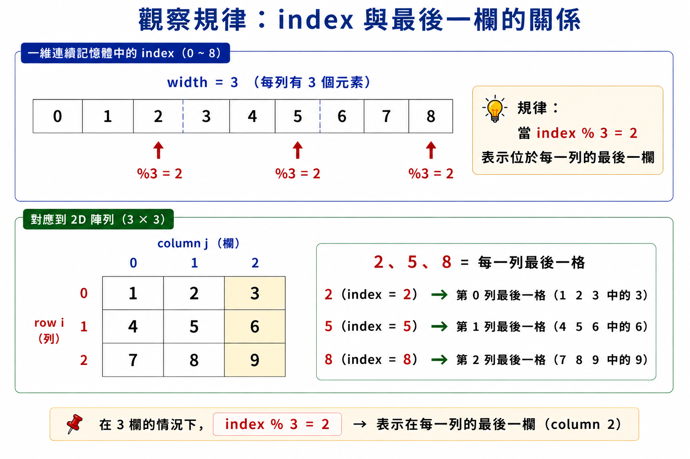
</p>
<!-- /AUTO-IMAGE: C_Lesson_17_img09_modulo_line_break.png -->

### 26. 使用迴圈填入一維九宮格

來源先使用 `k`：

```c
int k = 1;

for (i = 0; i < 9; i++) {
    v[i] = k;
    k++;
}
```

再化簡成：

```c
for (i = 0; i < 9; i++) {
    v[i] = i + 1;
}
```

---

### 27. 完整填入與輸出

```c
#include <stdio.h>

int main(void) {
    int i;
    int v[9];

    for (i = 0; i < 9; i++) {
        v[i] = i + 1;
    }

    for (i = 0; i < 9; i++) {
        printf("%d ", v[i]);

        if (i % 3 == 2) {
            printf("\n");
        }
    }

    return 0;
}
```

---

## Section V-G. 一維與二維座標轉換

### 28. 二維座標轉一維索引

九宮格：

```c
index = row * 3 + column;
```

一般寬度為 `width`：

```c
index = row * width + column;
```

一般公式是由來源的 `3 * row + column` 推廣而來。

---


<!-- AUTO-IMAGE: C_Lesson_17_img08_2d_1d_mapping.png -->
<p align="center">
  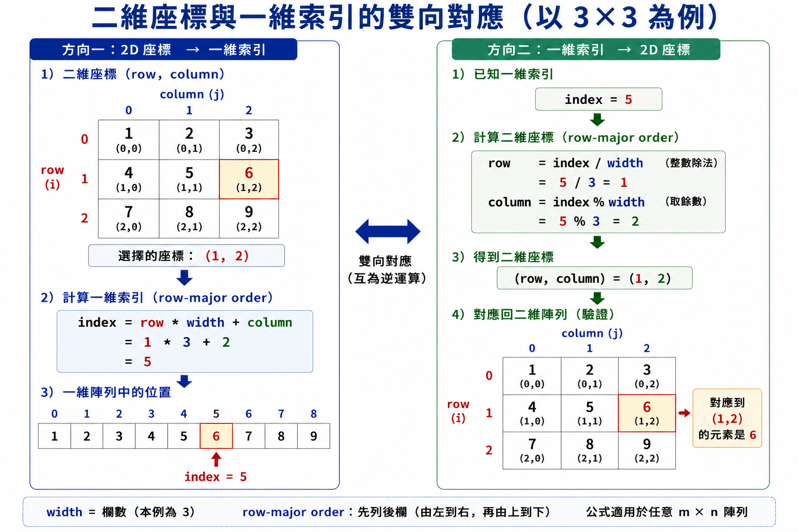
</p>
<!-- /AUTO-IMAGE: C_Lesson_17_img08_2d_1d_mapping.png -->

### 29. 一維索引轉二維座標

九宮格：

```c
row = index / 3;
column = index % 3;
```

例如：

```text
index = 7
row = 7 / 3 = 2
column = 7 % 3 = 1
```

所以：

```text
索引 7 ↔ 座標 (2, 1)
```

---

### 30. 座標轉換程式

```c
#include <stdio.h>

int main(void) {
    int row = 1;
    int column = 2;
    int index = row * 3 + column;

    printf("index = %d\n", index);
    printf("row = %d\n", index / 3);
    printf("column = %d\n", index % 3);

    return 0;
}
```

輸出：

```text
index = 5
row = 1
column = 2
```

---

## Section V-H. 比較一維與二維表示法

### 31. 二維表示法

```c
int grid[3][3];
```

存取：

```c
grid[row][column]
```

優點：

- 程式寫法直接對應列與欄。
- 巢狀迴圈容易表達表格。
- 閱讀九宮格程式時較直觀。

---

### 32. 一維表示法

```c
int grid[9];
```

存取：

```c
grid[row * 3 + column]
```

優點：

- 只有一個索引。
- 交換與完整走訪可以使用單一迴圈。
- 容易將所有位置視為 `0–8` 的連續範圍。

代價：

- 需要自行轉換列與欄。
- 公式中的寬度不能寫錯。

---

### 33. 兩種表示法的基本元素排列相同

二維：

```text
grid[0][0] grid[0][1] grid[0][2]
grid[1][0] grid[1][1] grid[1][2]
grid[2][0] grid[2][1] grid[2][2]
```

一維：

```text
grid[0] grid[1] grid[2] grid[3] grid[4]
grid[5] grid[6] grid[7] grid[8]
```

兩者都可依序保存：

```text
1 2 3 4 5 6 7 8 9
```

---

## Section V-I. 隨機排列九宮格：一維版本預覽

### 34. 先準備不重複資料

```c
int v[9] = {1, 2, 3, 4, 5, 6, 7, 8, 9};
```

不要重新產生九個獨立隨機數字，而是交換原有元素。

---

### 35. 從尚未固定的位置中選一格

當目前索引是 `i`：

```c
int selected = rand() % (9 - i) + i;
```

候選範圍：

```text
i 到 8
```

---

### 36. 交換目前位置與隨機位置

```c
int temporary = v[i];
v[i] = v[selected];
v[selected] = temporary;
```

完成後，位置 `i` 不再參與後續選擇。

---

### 37. 完整一維預覽程式

```c
#include <stdio.h>
#include <stdlib.h>
#include <time.h>

int main(void) {
    int i;
    int v[9] = {1, 2, 3, 4, 5, 6, 7, 8, 9};

    srand((unsigned)time(NULL));

    for (i = 0; i < 9; i++) {
        int selected = rand() % (9 - i) + i;
        int temporary = v[i];

        v[i] = v[selected];
        v[selected] = temporary;
    }

    for (i = 0; i < 9; i++) {
        printf("%d ", v[i]);

        if (i % 3 == 2) {
            printf("\n");
        }
    }

    return 0;
}
```

每次執行可能得到不同排列，但仍然只包含一次 `1–9`。

---

## Section V-J. 隨機排列九宮格：二維版本預覽

### 38. 使用 `k` 表示目前的一維位置

二維迴圈依序走訪九格：

```text
(i, j)
```

同時令：

```text
k = 0、1、2、...、8
```

關係：

```c
k = i * 3 + j;
```

來源程式使用 `k++` 逐格增加。

---

### 39. 先選剩餘區域中的一維索引

```c
int r = rand() % (9 - k) + k;
```

`r` 的範圍：

```text
k 到 8
```

---

### 40. 將 `r` 轉成二維座標

```c
int m = r / 3;
int n = r % 3;
```

- `m`：隨機列
- `n`：隨機欄

---


<!-- AUTO-IMAGE: C_Lesson_17_img10_random_index_to_coordinate.png -->
<p align="center">
  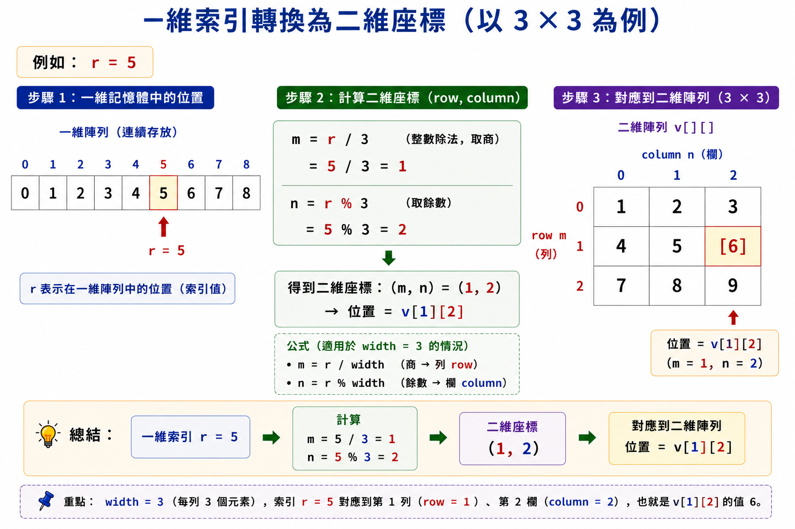
</p>
<!-- /AUTO-IMAGE: C_Lesson_17_img10_random_index_to_coordinate.png -->

### 41. 交換兩個二維元素

目前位置：

```c
v[i][j]
```

隨機位置：

```c
v[m][n]
```

交換：

```c
int temporary = v[i][j];
v[i][j] = v[m][n];
v[m][n] = temporary;
```

---


<!-- AUTO-IMAGE: C_Lesson_17_img12_swap_cells.png -->
<p align="center">
  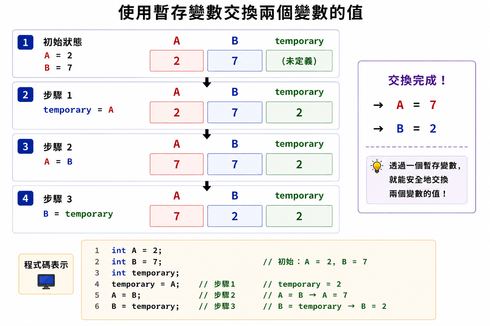
</p>
<!-- /AUTO-IMAGE: C_Lesson_17_img12_swap_cells.png -->

### 42. 完整二維預覽程式

```c
#include <stdio.h>
#include <stdlib.h>
#include <time.h>

int main(void) {
    int i;
    int j;
    int k = 0;
    int v[3][3] = {
        {1, 2, 3},
        {4, 5, 6},
        {7, 8, 9}
    };

    srand((unsigned)time(NULL));

    for (i = 0; i < 3; i++) {
        for (j = 0; j < 3; j++) {
            int r = rand() % (9 - k) + k;
            int m = r / 3;
            int n = r % 3;
            int temporary = v[i][j];

            v[i][j] = v[m][n];
            v[m][n] = temporary;
            k++;
        }
    }

    for (i = 0; i < 3; i++) {
        for (j = 0; j < 3; j++) {
            printf("%d ", v[i][j]);
        }

        printf("\n");
    }

    return 0;
}
```

---

### 43. 為什麼不會重複？

初始資料中：

```text
1–9 各出現一次
```

程式只交換位置：

- 沒有新增數值。
- 沒有刪除數值。
- 沒有複製數值到另一格而遺失原值。

因此結果仍然是 `1–9` 的一種排列。

---

## Section V-K. 容易搞混的重點

### 44. `v[3][3]` 不是索引最大值為 `3`

長度是 `3`，合法索引是：

```text
0、1、2
```

---

### 45. `v[1][2]` 不是第 1 列第 2 欄的人類編號

使用零起始索引時，它代表：

```text
第二列、第三欄
```

---

### 46. `v[i][j]` 與 `v[j][i]` 可能得到不同元素

只有在：

```text
i == j
```

或陣列剛好具有對稱資料時，兩者才一定相同。

---

### 47. 二維陣列不等於記憶體真的有上下兩個方向

列與欄是程式的邏輯模型。

實際基本元素仍按固定順序排列。

---

### 48. `i * 3 + j + 1` 與 `i * 3 + j` 用途不同

```c
i * 3 + j
```

得到零起始一維索引。

```c
i * 3 + j + 1
```

得到來源九宮格要填入的數值 `1–9`。

---

### 49. 一維輸出換行條件中的 `2` 來自寬度減一

寬度 `3` 的每列最後欄索引是：

```text
2
```

更一般的判斷可以寫：

```c
if (i % width == width - 1)
```

這是對來源固定寬度寫法的推廣。

---

### 50. 隨機位置 `r` 不是數值本身

```c
r
```

代表位置索引 `0–8`。

格子中保存的數值是：

```c
v[m][n]
```

---

### 51. `m = r / 3` 與 `n = r % 3` 不能交換

若交換，列與欄的映射會改變。

来源公式明确使用：

```c
m = r / 3;
n = r % 3;
```

---

### 52. 隨機交換時 `k` 必須每格增加一次

```c
k++;
```

若忘記增加，已經固定的位置仍可能再次被選入「剩餘區域」的起點計算中，流程不再符合來源方法。

---

## Section VI. 快速概念檢查

### Q1. `int v[2][3];` 一共有多少個 `int`？

<details>
<summary>查看答案</summary>

```text
2 × 3 = 6
```

</details>

---

### Q2. `v[0]` 的型態可以如何理解？

<details>
<summary>查看答案</summary>

它是包含三個 `int` 的內層陣列，也就是 `int[3]`。

</details>

---

### Q3. `3 × 3` 二維陣列的合法列索引有哪些？

<details>
<summary>查看答案</summary>

```text
0、1、2
```

</details>

---

### Q4. 来源九宮格中的 `v[1][2]` 是多少？

<details>
<summary>查看答案</summary>

```text
6
```

</details>

---

### Q5. 巢狀輸出時，換行應放在哪裡？

<details>
<summary>查看答案</summary>

放在內層迴圈結束後、外層迴圈本體內。

</details>

---

### Q6. `i == 2`、`j == 1` 時，`i * 3 + j + 1` 是多少？

<details>
<summary>查看答案</summary>

```text
2 × 3 + 1 + 1 = 8
```

</details>

---

### Q7. 座標 `(1, 2)` 對應哪個一維索引？

<details>
<summary>查看答案</summary>

```text
1 × 3 + 2 = 5
```

</details>

---

### Q8. 一維索引 `7` 對應哪個九宮格座標？

<details>
<summary>查看答案</summary>

```text
row = 7 / 3 = 2
column = 7 % 3 = 1
```

所以是：

```text
(2, 1)
```

</details>

---

### Q9. 為什麼一維輸出在 `i % 3 == 2` 時換行？

<details>
<summary>查看答案</summary>

因為索引 `2、5、8` 是每一列的最後一個元素。

</details>

---

### Q10. 使用交換排列後，會不會突然出現數字 `10`？

<details>
<summary>查看答案</summary>

不會。程式只交換原本的 `1–9`，不會建立新數值。

</details>

---

### Q11. 隨機一維索引 `r == 5` 時，`m` 與 `n` 是多少？

<details>
<summary>查看答案</summary>

```text
m = 5 / 3 = 1
n = 5 % 3 = 2
```

</details>

---

### Q12. 来源二維隨機最終版本中，`k` 應從多少開始？

<details>
<summary>查看答案</summary>

```text
0
```

</details>

---

## Section VII. 程式閱讀練習

### 題目 1：元素值

```c
int v[2][3] = {
    {10, 20, 30},
    {40, 50, 60}
};

printf("%d\n", v[1][0]);
```

<details>
<summary>查看答案</summary>

```text
40
```

</details>

---

### 題目 2：走訪順序

```c
for (i = 0; i < 2; i++) {
    for (j = 0; j < 3; j++) {
        printf("%d ", v[i][j]);
    }
}
```

<details>
<summary>查看答案</summary>

依序存取：

```text
v[0][0]
v[0][1]
v[0][2]
v[1][0]
v[1][1]
v[1][2]
```

</details>

---

### 題目 3：找出越界

```c
int v[3][3];

printf("%d\n", v[2][3]);
```

<details>
<summary>查看答案</summary>

欄索引 `3` 越界。

合法欄索引只有：

```text
0、1、2
```

</details>

---

### 題目 4：公式填值

```c
v[i][j] = i * 3 + j + 1;
```

當：

```text
i = 1
j = 1
```

<details>
<summary>查看答案</summary>

```text
1 × 3 + 1 + 1 = 5
```

</details>

---

### 題目 5：轉置式輸出

```c
int v[2][2] = {
    {1, 2},
    {3, 4}
};

for (i = 0; i < 2; i++) {
    for (j = 0; j < 2; j++) {
        printf("%d ", v[j][i]);
    }

    printf("\n");
}
```

<details>
<summary>查看答案</summary>

```text
1 3
2 4
```

</details>

---

### 題目 6：一維換行

```c
for (i = 0; i < 9; i++) {
    printf("%d ", v[i]);

    if (i % 3 == 2) {
        printf("\n");
    }
}
```

<details>
<summary>查看答案</summary>

每輸出三個元素換行，形成三列三欄。

</details>

---

### 題目 7：座標轉換

```c
int index = 2 * 3 + 0;
```

<details>
<summary>查看答案</summary>

```text
index = 6
```

代表第三列第一欄。

</details>

---

### 題目 8：隨機索引轉座標

```c
int r = 8;
int m = r / 3;
int n = r % 3;
```

<details>
<summary>查看答案</summary>

```text
m = 2
n = 2
```

即右下角。

</details>

---

## Section VIII. 實作練習 / 實作檢測題

### TODO 1：輸出 `2 × 3` 陣列

建立：

```c
int v[2][3] = {
    {1, 2, 3},
    {4, 5, 6}
};
```

使用巢狀迴圈輸出兩列。

---

### TODO 2：查詢指定座標

建立来源九宮格，輸入列索引與欄索引，輸出對應元素。

必須先檢查：

```text
row 與 column 是否位於 0–2
```

---

### TODO 3：輸入 `3 × 3` 九宮格

使用巢狀迴圈讀入九個整數，再依三列三欄輸出。

---

### TODO 4：使用 `k` 填入 `1–9`

不得使用初始化清單。

---

### TODO 5：使用座標公式填入 `1–9`

不得使用額外計數器 `k`：

```c
v[i][j] = i * 3 + j + 1;
```

---

### TODO 6：逐欄輸出

使用：

```c
v[j][i]
```

將九宮格輸出成：

```text
1 4 7
2 5 8
3 6 9
```

---

### TODO 7：主對角線

輸出：

```text
v[0][0]
v[1][1]
v[2][2]
```

預期：

```text
1 5 9
```

---

### TODO 8：另一條對角線

輸出：

```text
v[0][2]
v[1][1]
v[2][0]
```

預期：

```text
3 5 7
```

---

### TODO 9：每列總和（延伸）

對每一列建立 `sum`，輸出三個列總和。

這是使用巢狀迴圈的延伸，不是來源投影片的主要例題。

---

### TODO 10：每欄總和（延伸）

外層控制欄、內層控制列，輸出三個欄總和。

---

### TODO 11：一維九宮格

使用：

```c
int v[9];
```

填入 `1–9`，每三個元素換行。

---

### TODO 12：座標與索引互換

輸入 `row column`，輸出一維索引。

再輸入 `index`，輸出列與欄。

---

### TODO 13：比較兩種表示法

同時建立：

```c
int two_d[3][3];
int one_d[9];
```

確認每個座標都符合：

```c
two_d[row][column] ==
one_d[row * 3 + column]
```

---

### TODO 14：一維交換式排列預覽

依來源方法交換 `1–9`，確認輸出沒有重複。

亂數原理留待下一章。

---

### TODO 15：二維交換式排列預覽

使用：

```c
r = rand() % (9 - k) + k;
m = r / 3;
n = r % 3;
```

將隨機一維位置轉為二維座標後交換。

---

## Section IX. 做題時可以使用的提示

### 1. 先把宣告拆成兩層

```c
int v[rows][columns];
```

先問：

```text
外層有幾個元素？
每個外層元素又有幾個整數？
```

---

### 2. 畫出索引標籤

```text
       column
       0 1 2
row 0
    1
    2
```

再填入元素。

---

### 3. 追蹤 `v[i][j]` 時先看 `i`

```text
i 決定哪個內層陣列
j 決定內層中的哪個元素
```

---

### 4. 輸出形狀錯誤時檢查換行

換行應：

```text
每完成一個外層迴圈後執行一次
```

---

### 5. 公式錯誤時列出小表格

| row | column | 預期 index |
| ---: | ---: | ---: |
| 0 | 0 | 0 |
| 0 | 2 | 2 |
| 1 | 0 | 3 |
| 1 | 2 | 5 |
| 2 | 2 | 8 |

檢查公式是否全部符合。

---

### 6. 一維轉二維時記住

```text
除法回答「第幾列」
餘數回答「該列第幾欄」
```

---

### 7. 隨機交換前先測試固定索引

先暫時指定：

```c
r = 5;
```

確認：

```text
m = 1
n = 2
```

再換回 `rand()`。

---

### 8. 建議測試位置

```text
(0, 0)
(0, 2)
(1, 1)
(2, 0)
(2, 2)
```

---

## Section X. 課後小練習

### 練習 1：`2 × 4` 表格

建立兩列四欄陣列，填入 `1–8`。

推導：

```c
value = row * 4 + column + 1;
```

---

### 練習 2：一般寬度的一維映射

使用：

```c
index = row * width + column;
```

分別測試寬度 `3` 與 `4`。

---

### 練習 3：棋盤座標

建立 `4 × 4` 整數陣列，讓每格保存：

```c
row * 10 + column
```

觀察座標與數值的關係。

---

### 練習 4：轉置輸出

建立 `2 × 3` 陣列，思考為什麼單純交換索引時，輸出迴圈範圍也要跟著交換。

---

### 練習 5：找出最大元素座標

走訪九宮格，保存最大值及其列、欄索引。

---

### 練習 6：計算全部元素總和

使用巢狀迴圈累加九個元素。

---

### 練習 7：一維陣列輸出矩形

使用長度 `12` 的一維陣列表示 `3 × 4` 表格，每四個元素換行。

---

### 練習 8：驗證隨機排列

建立次數陣列，檢查交換後的結果中 `1–9` 是否各出現一次。

這會連接下一章的亂數與次數統計。

---

## Section XI. 重點複習

1. 一般變數保存一個值。
2. 一維陣列保存固定數量的同型態元素。
3. 陣列元素按索引順序相鄰排列。
4. 二維陣列是元素型態本身也是陣列的陣列。
5. `int v[2][3]` 包含兩個 `int[3]`。
6. `int v[2][3]` 共有六個基本 `int`。
7. `v[0]` 與 `v[1]` 是內層陣列。
8. `v[i][j]` 需要兩次索引選擇。
9. 第一個索引通常表示列。
10. 第二個索引通常表示欄。
11. 列與欄索引都從 `0` 開始。
12. `3 × 3` 九宮格共有九個基本元素。
13. 二維初始化的內層大括號對應每個內層陣列。
14. `v[1][2]` 在來源九宮格中是 `6`。
15. 巢狀迴圈可以完整走訪二維陣列。
16. 外層通常控制列，內層通常控制欄。
17. 換行放在內層迴圈之後。
18. 二維陣列的基本元素仍然連續排列。
19. 使用 `v[j][i]` 可以改變顯示方向。
20. 使用 `k` 可以依序填入 `1–9`。
21. `i * 3 + j + 1` 可以直接計算格子值。
22. 一維陣列也能表示相同九宮格。
23. 九宮格座標轉索引為 `row * 3 + column`。
24. 一般座標轉索引為 `row * width + column`。
25. 索引轉列使用整數除法。
26. 索引轉欄使用餘數。
27. 一維陣列可在 `i % 3 == 2` 時換行。
28. 二維與一維表示法保存的基本資料可以相同。
29. 隨機排列應交換完整的 `1–9`，而不是獨立產生每格。
30. 隨機一維位置可用 `/ 3` 與 `% 3` 轉成列、欄。
31. 来源二維隨機最終版本將 `k` 初始化為 `0`。
32. 亂數細節將在下一章正式學習。

---

## Section XII. 常見錯誤提醒

<!-- AUTO-IMAGE: C_Lesson_17_img13_index_bounds.png -->
<p align="center">
  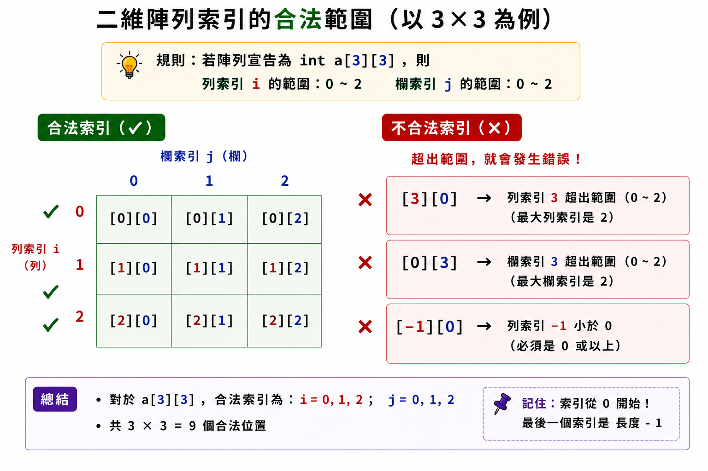
</p>
<!-- /AUTO-IMAGE: C_Lesson_17_img13_index_bounds.png -->


### 錯誤 1：把 `v[3][3]` 的索引寫成 `1–3`

C 陣列仍然使用零起始索引。

---

### 錯誤 2：只檢查其中一個索引

即使列索引合法，欄索引仍可能越界。

---

### 錯誤 3：把列與欄長度寫反

對非正方形陣列：

```c
int v[2][3];
```

外層到 `2`，內層到 `3`。

---

### 錯誤 4：內層使用錯誤條件

錯誤：

```c
for (j = 0; j < 2; j++)
```

會漏掉第三欄。

---

### 錯誤 5：換行放在內層

每個元素都會單獨一行。

---

### 錯誤 6：填值公式少乘欄數

錯誤：

```c
v[i][j] = i + j + 1;
```

會產生重複值。

---

### 錯誤 7：一維映射使用 `row + column`

不同座標會映射到相同位置。

---

### 錯誤 8：索引轉列與欄時交換 `/` 與 `%`

来源使用：

```c
row = index / 3;
column = index % 3;
```

---

### 錯誤 9：一維九宮格在 `i % 3 == 0` 時換行

這會在索引 `0、3、6` 後換行，使第一列只有一個元素。

---

### 錯誤 10：認為二維陣列在記憶體中有真正的上下方向

表格是邏輯表示；基本元素仍按順序排列。

---

### 錯誤 11：隨機填每一格而未處理重複

```c
v[i][j] = rand() % 9 + 1;
```

不能保證 `1–9` 各出現一次。

---

### 錯誤 12：交換時覆蓋原值

必須使用暫存變數保存其中一格。

---

### 錯誤 13：二維隨機版本忘記初始化 `k`

應使用來源最後版本：

```c
int k = 0;
```

---

### 錯誤 14：`k == 9` 時仍計算 `rand() % (9 - k)`

来源迴圈只處理九格，最後一次計算時 `k == 8`，除數為 `1`；之後迴圈結束。

---

## Section XIII. Mermaid 流程圖

### 1. 陣列的陣列

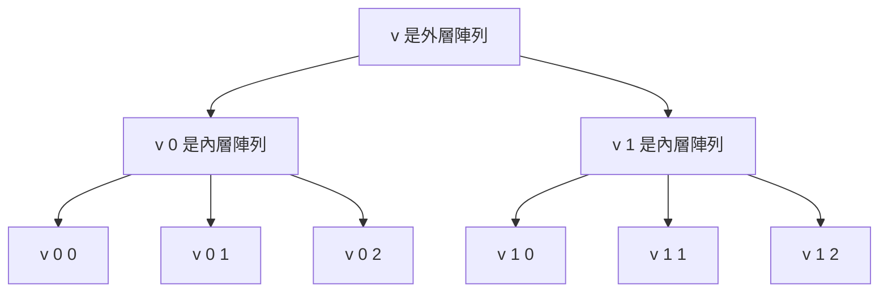
```mermaid
flowchart TD
    A[v 是外層陣列] --> B[v 0 是內層陣列]
    A --> C[v 1 是內層陣列]
    B --> D[v 0 0]
    B --> E[v 0 1]
    B --> F[v 0 2]
    C --> G[v 1 0]
    C --> H[v 1 1]
    C --> I[v 1 2]
```

---

### 2. 二維元素存取

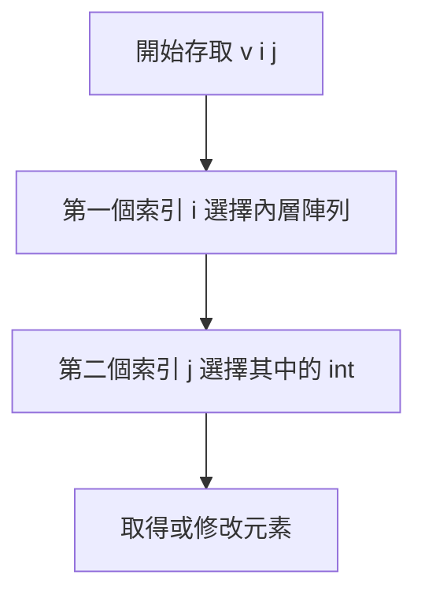
```mermaid
flowchart TD
    A[開始存取 v i j] --> B[第一個索引 i 選擇內層陣列]
    B --> C[第二個索引 j 選擇其中的 int]
    C --> D[取得或修改元素]
```

---

### 3. 巢狀迴圈輸出九宮格

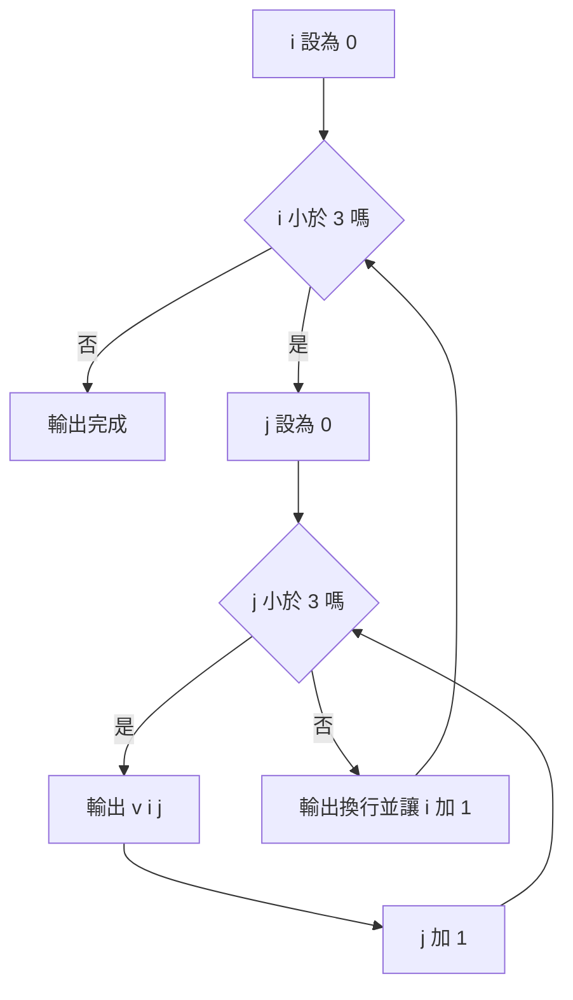
```mermaid
flowchart TD
    A[i 設為 0] --> B{i 小於 3 嗎}
    B -- 否 --> H[輸出完成]
    B -- 是 --> C[j 設為 0]
    C --> D{j 小於 3 嗎}
    D -- 是 --> E[輸出 v i j]
    E --> F[j 加 1]
    F --> D
    D -- 否 --> G[輸出換行並讓 i 加 1]
    G --> B
```

---

### 4. 座標轉一維索引

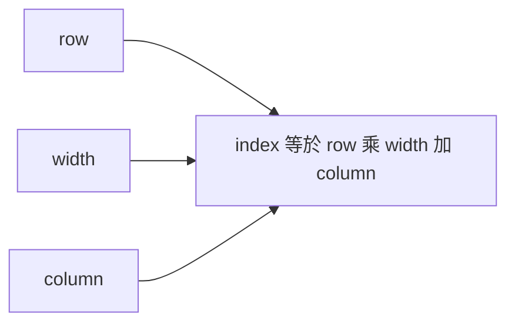
```mermaid
flowchart LR
    A[row] --> D[index 等於 row 乘 width 加 column]
    B[width] --> D
    C[column] --> D
```

---

### 5. 一維索引轉座標

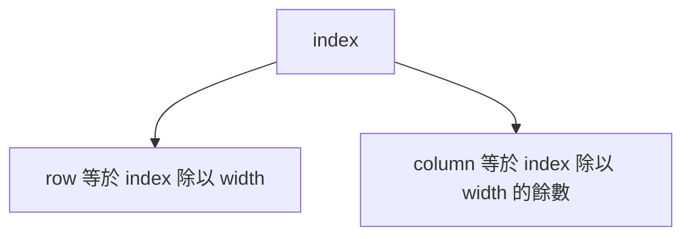
```mermaid
flowchart TD
    A[index] --> B[row 等於 index 除以 width]
    A --> C[column 等於 index 除以 width 的餘數]
```

---

### 6. 一維九宮格輸出

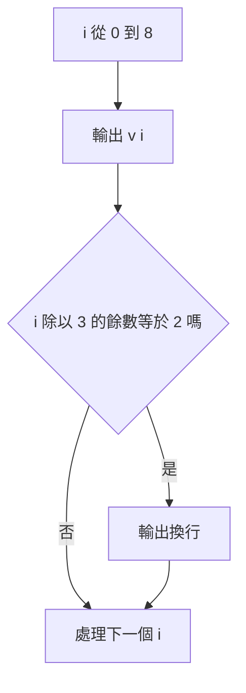
```mermaid
flowchart TD
    A[i 從 0 到 8] --> B[輸出 v i]
    B --> C{i 除以 3 的餘數等於 2 嗎}
    C -- 是 --> D[輸出換行]
    C -- 否 --> E[處理下一個 i]
    D --> E
```

---

### 7. 二維隨機索引轉換

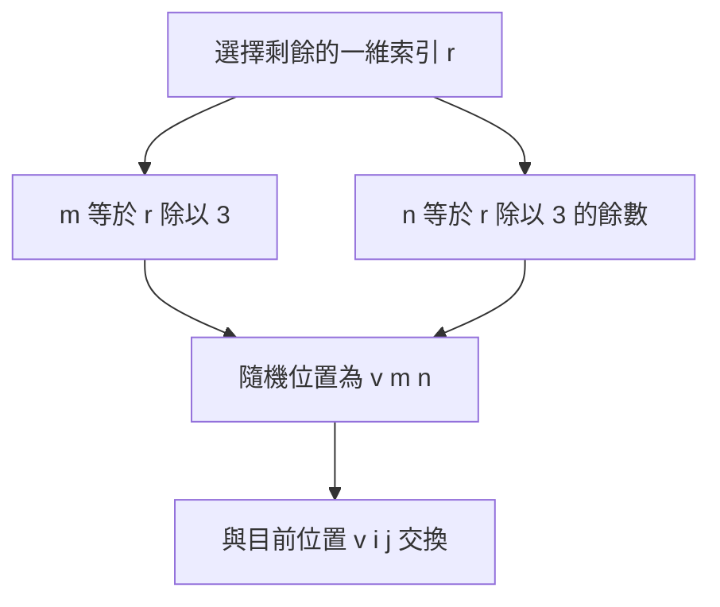
```mermaid
flowchart TD
    A[選擇剩餘的一維索引 r] --> B[m 等於 r 除以 3]
    A --> C[n 等於 r 除以 3 的餘數]
    B --> D[隨機位置為 v m n]
    C --> D
    D --> E[與目前位置 v i j 交換]
```

---

## 本章完成標準

完成本章後，你應該能做到：

1. 說明一般變數與陣列變數的差異。
2. 說明一維陣列元素的排列順序。
3. 將二維陣列解釋成陣列的陣列。
4. 讀懂 `int v[2][3];` 的兩層結構。
5. 計算二維陣列的基本元素數量。
6. 列出 `2 × 3` 陣列的所有合法元素。
7. 使用兩個索引存取單一元素。
8. 解釋 `v[1][2]` 的存取過程。
9. 正確初始化 `3 × 3` 九宮格。
10. 使用巢狀迴圈輸出二維陣列。
11. 正確安排每列後的換行。
12. 說明二維陣列基本元素的連續排列。
13. 使用 `v[j][i]` 改變輸出方向。
14. 使用 `k` 將 `1–9` 填入九宮格。
15. 使用 `i * 3 + j + 1` 直接計算格子值。
16. 使用一維陣列表示同一九宮格。
17. 每三個一維元素輸出一次換行。
18. 使用 `row * 3 + column` 計算一維索引。
19. 使用 `/ 3` 與 `% 3` 還原列與欄。
20. 比較一維與二維表示法的寫法。
21. 解釋表格模型與記憶體排列的差異。
22. 使用交換保留 `1–9` 的不重複性。
23. 將隨機一維位置轉成二維座標。
24. 使用來源最終修正版的 `k = 0`。
25. 找出索引、換行、公式及交換的常見錯誤。
26. 準備進入下一章的亂數。
