# Lesson 18：Random Numbers 亂數

> 這堂課的重點：使用 C 標準函式庫的 `rand()` 與 `srand()` 產生偽亂數，將亂數轉換到指定整數範圍，模擬骰子與猜數字遊戲，再使用逐筆檢查、建表法與交換法產生不重複序列。後半段會從全域變數、`static` 區域變數與無號整數溢位出發，實作一個簡化的線性同餘偽亂數產生器。

---

## Section I. 今天要做什麼？

1. 認識 C 標準函式庫中的 `rand()`。
2. 使用 `<stdlib.h>` 取得 `rand()` 與 `srand()` 的宣告。
3. 理解 `rand()` 會回傳一個偽亂數整數。
4. 認識 `RAND_MAX`。
5. 連續呼叫 `rand()` 取得一串數字。
6. 觀察同一程式多次執行時，預設亂數序列可能相同。
7. 使用 `srand()` 設定亂數種子。
8. 理解相同種子會產生相同序列。
9. 理解一個程式通常只需要設定一次種子。
10. 使用 `time()` 取得會隨時間改變的種子。
11. 使用 `srand((unsigned)time(NULL))` 初始化標準亂數產生器。
12. 使用 `%` 將亂數限制在 `0` 到 `N - 1`。
13. 使用位移公式產生 `minimum` 到 `maximum`。
14. 使用 `rand() % 6 + 1` 模擬六面骰子。
15. 模擬連續擲五次骰子。
16. 將猜數字程式的固定答案改成偽亂數答案。
17. 使用 `rand() % 100` 產生 `0–99` 的答案。
18. 理解一般亂數呼叫可能產生重複值。
19. 產生由 `1–10` 組成、而且沒有重複的序列。
20. 使用陣列儲存已產生的答案。
21. 使用巢狀迴圈逐一比較新數字與舊數字。
22. 使用 `do-while` 在發現重複時重新抽取。
23. 使用迴圈控制變數的最後值判斷是否重複。
24. 使用建表法記錄某個值是否已經使用。
25. 使用 `counter[number - 1]` 表示 `number` 是否出現過。
26. 比較逐筆檢查法與建表法。
27. 先建立完整的 `1–10`，再使用交換法打亂順序。
28. 使用逐步縮小的候選範圍。
29. 推導來源公式 `rand() % (11 - i) + i`。
30. 理解交換法為什麼一定不會產生重複。
31. 比較重新抽取法與交換法。
32. 認識未初始化區域變數的問題。
33. 認識全域變數會自動初始化為 `0`。
34. 理解全域變數在 `main()` 開始前已完成初始化。
35. 認識全域初始化式必須符合靜態初始化限制。
36. 比較普通區域變數、全域變數與 `static` 區域變數。
37. 理解普通區域變數每次呼叫都會建立新的一份。
38. 理解全域變數與 `static` 區域變數可以儲存跨呼叫狀態。
39. 使用 `static` 區域變數實作計數器。
40. 認識有號整數溢位屬於未定義行為。
41. 使用 `<limits.h>` 檢視 `INT_MAX`、`INT_MIN` 與 `UINT_MAX`。
42. 理解無號整數溢位會按照 `UINT_MAX + 1` 取餘數。
43. 使用簡單數列觀察偽亂數的週期。
44. 認識線性同餘法。
45. 使用公式 `X(n+1) = (X(n) * a + c) % m`。
46. 使用種子決定數列的起點。
47. 追蹤模數 `16` 的小型線性同餘數列。
48. 理解有限狀態的偽亂數序列最終會迴圈。
49. 使用來源常數 `1103515245` 與 `12345`。
50. 利用 32 位無號整數的自然回繞實作模數 `2^32`。
51. 從內部狀態的較高位取出 `0–32767` 的結果。
52. 將偽亂數計算整理成自訂函式。
53. 觀察將狀態宣告為普通區域變數時為什麼每次結果相同。
54. 使用全域變數儲存內部狀態。
55. 使用 `static` 區域變數儲存內部狀態。
56. 撰寫自訂種子設定函式。
57. 避免自訂函式名稱與標準 `rand()`、`srand()` 發生衝突。
58. 分辨教學用偽亂數產生器與安全用途亂數。
59. 找出種子位置、範圍公式、重複檢查、交換範圍與溢位型態的常見錯誤。
60. 為下一章的陣列與函式建立跨函式狀態與陣列處理基礎。

---

## Section II. 今天的學習方式

1. 先直接輸出多次 `rand()`，觀察數列。
2. 再使用固定種子比較兩次執行結果。
3. 改用不同固定種子，觀察序列是否改變。
4. 最後才使用目前時間作為種子。
5. 每次處理範圍轉換時，先寫出：
   - 最小可能值
   - 最大可能值
   - 總共有幾個可能值
6. 骰子題先從 `0–5` 推導到 `1–6`。
7. 猜數字題要明確寫出答案範圍是 `0–99` 還是 `1–100`。
8. 產生不重複序列時，先保留每次新抽到的候選值。
9. 使用小陣列手動追蹤新值與舊值的比較。
10. 建表法先畫出「數值 → 索引」對照。
11. 交換法先將陣列初始化成完整且不重複的資料。
12. 每一輪都標出：
    - 已固定區域
    - 尚未固定區域
13. 全域與 `static` 章節先使用簡單計數器觀察狀態是否儲存。
14. 溢位章節必須分開討論：
    - `signed int`
    - `unsigned int`
15. 線性同餘法先使用模數 `16` 的小例子。
16. 手動列出完整週期，再觀察何時回到種子。
17. 實作來源的大型常數前，先確認使用無號型態。
18. 自訂函式時，先觀察錯誤版本，再逐步移動狀態變數。
19. 本章自訂產生器主要用來理解原理，不用於密碼、驗證碼或安全權杖。
20. 所有完整程式都以嚴格編譯選項測試。

---

## Section III. 今天會學到的內容

| 主題 | 你需要知道的事 |
| --- | --- |
| `rand()` | 回傳偽亂數整數的標準函式 |
| `RAND_MAX` | `rand()` 可以回傳的最大值 |
| `srand()` | 設定標準亂數產生器的種子 |
| 種子 seed | 決定偽亂數序列起點的值 |
| `time()` | 取得目前時間，用來提供變動種子 |
| 固定種子 | 每次可重現相同序列 |
| 時間種子 | 不同時間執行通常得到不同序列 |
| 範圍縮放 | 使用餘數與位移改變結果範圍 |
| `rand() % n` | 產生 `0–n-1` |
| `rand() % 6 + 1` | 產生骰子點數 `1–6` |
| 重複值 | 獨立亂數呼叫可能得到相同結果 |
| 逐筆檢查法 | 將新值與先前所有值比較 |
| 建表法 | 直接記錄某個值是否已使用 |
| 交換法 | 將完整不重複資料隨機重新排列 |
| 重新抽取 | 候選值已使用時再次呼叫 `rand()` |
| 已固定區域 | 交換法中不再參與選取的前段 |
| 剩餘區域 | 尚可被選取與交換的後段 |
| 全域變數 | 宣告在函式外，具有靜態儲存期 |
| 普通區域變數 | 每次進入區塊時建立新的值 |
| `static` 區域變數 | 作用域在函式內，但值可跨呼叫儲存 |
| 靜態初始化 | 程式開始前完成的初始化 |
| 有號溢位 | C 中屬於未定義行為 |
| 無號溢位 | 按照 `UINT_MAX + 1` 回繞 |
| 偽亂數 | 由確定公式產生、看起來混亂的數列 |
| 線性同餘法 | `X(n+1) = (X(n) * a + c) % m` |
| 狀態 state | 產生下一個數字所需的上一個數字 |
| 週期 period | 數列開始重複前的長度 |
| 高位輸出 | 從較高位取出結果，隱藏部分低位規律 |
| 自訂種子函式 | 修改產生器內部狀態的起點 |
| 教學用產生器 | 用來理解原理，不代表適合安全用途 |

---

## Section IV. 寫題目前的提醒

### 1. `rand()` 需要 `<stdlib.h>`

```c
#include <stdlib.h>
```

若要使用目前時間：

```c
#include <time.h>
```

---

### 2. `rand()` 產生的是偽亂數

相同的初始狀態與相同的呼叫順序，會得到相同數列。

這是偽亂數可以被重現的重要特徵。

---

### 3. `srand()` 一個程式通常只呼叫一次

常見位置：

```c
int main(void) {
    srand((unsigned)time(NULL));

    /* 後面再多次呼叫 rand() */
}
```

不要把 `srand()` 放進每次擲骰或每次迴圈中。

---

### 4. 相同種子會得到相同序列

```c
srand(1);
```

每次程式都從同一內部狀態開始。

這對測試與除錯很有用。

---

### 5. 時間種子不代表真正隨機

```c
srand((unsigned)time(NULL));
```

只是讓起點通常隨執行時間改變。

產生器本身仍然依確定規則運作。

---

### 6. `rand() % n` 要求 `n > 0`

錯誤：

```c
rand() % 0
```

除數不能是 `0`。

一般範圍公式使用前，應確認：

```text
maximum >= minimum
```

---

### 7. `rand() % 6` 產生 `0–5`

| `rand()` 餘數 | 結果 |
| ---: | ---: |
| 0 | 0 |
| 1 | 1 |
| 2 | 2 |
| 3 | 3 |
| 4 | 4 |
| 5 | 5 |

要得到骰子點數，還要：

```c
+ 1
```

---

### 8. `rand() % 7` 會產生 `0–6`

來源投影片用表格展示 `% 7` 的結果。

其中仍包含不合法骰子點數 `0`，所以不能直接模擬 `1–6`。

正確來源結論：

```c
rand() % 6 + 1
```

---

### 9. 猜數字來源使用 `rand() % 100`

它的實際範圍是：

```text
0–99
```

若題目要 `1–100`，應改成：

```c
rand() % 100 + 1
```

本章會明確區分這兩種版本。

---

### 10. 一般 `rand()` 呼叫可能重複

```c
rand() % 10 + 1
```

呼叫十次，不保證剛好得到 `1–10` 各一次。

「可能值有十個」與「十次結果不重複」是不同要求。

---

### 11. 逐筆檢查法要先儲存候選值

來源使用：

```c
numbers[i - 1] = rand() % 10 + 1;
```

再將它與：

```c
numbers[0] 到 numbers[i - 2]
```

逐一比較。

---

### 12. 發現重複後可以立即 `break`

```c
if (numbers[i - 1] == numbers[j - 1]) {
    is_used = 1;
    break;
}
```

既然已確定重複，不需要再比較其他舊元素。

---

### 13. 來源使用 `j == i` 判斷未找到重複

內層：

```c
for (j = 1; j < i; j++)
```

如果正常檢查完所有舊值，結束時：

```text
j == i
```

如果中途找到重複並 `break`，則：

```text
j < i
```

因此來源最後可以使用：

```c
while (j != i);
```

---

### 14. 建表法的陣列必須初始化為 `0`

```c
int counter[10] = {0};
```

含義：

- `counter[k] == 0`：數值 `k + 1` 尚未使用
- `counter[k] != 0`：數值 `k + 1` 已使用

---

### 15. 建表法要先確認未使用，再標記使用

```c
do {
    number = rand() % 10 + 1;
} while (counter[number - 1] != 0);

printf("%d ", number);
counter[number - 1]++;
```

若在檢查前就增加，第一次也會被視為已使用。

---

### 16. 重新抽取法越到後面可能越慢

當九個數字都已使用，只剩最後一個數字時，隨機抽到已使用值的機率很高。

它仍能完成，但可能反覆重抽。

---

### 17. 交換法先建立完整資料

```c
for (i = 1; i <= 10; i++) {
    numbers[i - 1] = i;
}
```

此時陣列已經包含：

```text
1 2 3 4 5 6 7 8 9 10
```

後面只改變位置。

---

### 18. 交換法的隨機索引必須從目前位置開始

來源使用一開始以 `1` 為基準的寫法：

```c
int j = rand() % (11 - i) + i;
```

當：

```text
i = 1
```

`j` 的範圍是 `1–10`。

當：

```text
i = 2
```

`j` 的範圍是 `2–10`。

已固定的位置不再被選取。

---

### 19. 交換使用陣列索引時要減 `1`

來源的 `i`、`j` 是 `1–10`：

```c
numbers[i - 1]
numbers[j - 1]
```

不要直接寫成 `numbers[10]`。

---

### 20. 全域變數未明確初始化時會初始化為 `0`

```c
int global_value;
```

在程式開始時具有值：

```text
0
```

普通區域變數則不會自動得到可安全讀取的值。

---


<!-- AUTO-IMAGE: C_Lesson_18_img05_duplicate_scan.png -->
<p align="center">
  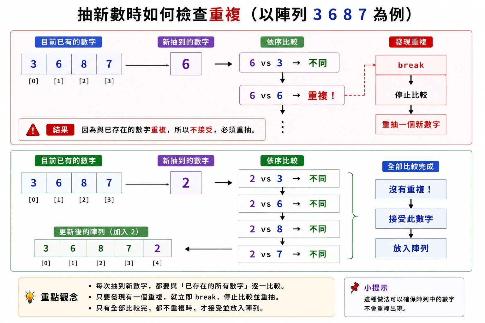
</p>
<!-- /AUTO-IMAGE: C_Lesson_18_img05_duplicate_scan.png -->

### 21. 不可讀取未初始化普通區域變數

```c
int main(void) {
    int value;
    printf("%d\n", value);  /* 錯誤 */
}
```

讀取未初始化自動儲存期變數的值不是可靠行為。

---

### 22. 全域初始化在 `main()` 之前完成

來源流程：

```text
初始化全域變數
→ 呼叫 main()
```

因此所有函式開始執行前，全域狀態已準備好。

---

### 23. 全域變數初始化式不能任意呼叫函式

來源示範：

```c
int make_value(void) {
    return 0;
}

int global_value = make_value();  /* 編譯失敗 */
```

靜態儲存期物件的初始化有比普通執行期賦值更嚴格的限制。

---

### 24. 一個全域變數不能用另一個普通全域變數的執行期值初始化

來源示範：

```c
int first = 0;
int second = first;  /* 來源環境中編譯失敗 */
```

本章保留來源的重點：

> 全域初始化不是像 `main()` 中的普通述句那樣依序執行。

---

### 25. 普通區域變數每次呼叫都重新建立

```c
int count(void) {
    int value = 0;
    value++;
    return value;
}
```

連續呼叫五次：

```text
1
1
1
1
1
```

---

### 26. `static` 區域變數只初始化一次

```c
int count(void) {
    static int value = 0;
    value++;
    return value;
}
```

連續呼叫：

```text
1
2
3
4
5
```

---

### 27. `static` 區域變數作用域仍在函式內

其他函式不能直接用名稱 `value` 存取它。

它保留了區域作用域，又具有跨呼叫儲存狀態的特性。

---

### 28. 有號整數溢位不是可依賴的回繞

來源明確指出：

```text
有號整數溢位是未定義行為
```

不要根據某次測試中出現的負數結果推斷所有環境都會一樣。

---

### 29. 無號整數溢位會取模

如果型態是：

```c
unsigned int
```

運算結果超過 `UINT_MAX` 時，會按照：

```text
UINT_MAX + 1
```

取餘數。

---

### 30. 來源的大型偽亂數公式依賴無號回繞

```c
state = state * 1103515245u + 12345u;
```

若 `unsigned int` 為 32 位，這等同於：

```text
(state * 1103515245 + 12345) % 2^32
```

來源投影片使用：

```text
4294967296
```

作為模數。

---

### 31. 輸出高位公式的來源版本

```c
(state / 65536u) % 32768u
```

等同概念：

```text
先移除低 16 位
再保留 15 位
```

因此輸出範圍：

```text
0–32767
```

---

### 32. 來源輸出變數是 `unsigned int`，格式應匹配

本章使用：

```c
printf("%u\n", state);
```

若變數型態是 `unsigned int`，不應使用與型態不相符的格式。

---

### 33. 自訂亂數函式中的狀態不能是每次重設的普通區域變數

錯誤：

```c
int my_rand(void) {
    unsigned int state = 1u;
    state = state * 1103515245u + 12345u;
    return (int)((state / 65536u) % 32768u);
}
```

每次呼叫都從 `1` 開始，所以每次結果相同。

---

### 34. 可以使用全域或 `static` 區域變數儲存狀態

全域版本：

```c
static unsigned int generator_state = 1u;
```

函式內 `static` 版本：

```c
static unsigned int state = 1u;
```

兩者都能跨呼叫儲存值。

---

### 35. 本章自訂函式使用 `my_rand()` 與 `my_srand()`

來源最後以 `rand()`、`srand()` 為名稱重新實作。

為避免與標準函式庫的保留名稱混淆，本講義完整可執行版本改用：

```c
my_rand()
my_srand()
```

演算法與來源相同。

---

### 36. 教學用產生器不適合安全用途

線性同餘法可以被預測，週期與統計品質也受到引數限制。

不要用本章產生器建立：

- 密碼
- 驗證碼
- 會話權杖
- 加密金鑰

---

## Section V. 核心概念說明

## Section V-A. 使用 `rand()` 產生整數

### 1. 最基本的五次呼叫

```c
#include <stdio.h>
#include <stdlib.h>

int main(void) {
    int i;

    for (i = 1; i <= 5; i++) {
        printf("%d\n", rand());
    }

    return 0;
}
```

每一次呼叫 `rand()`，都會取得目前偽亂數產生器的下一個值。

---

### 2. 檢視 `RAND_MAX`

```c
#include <stdio.h>
#include <stdlib.h>

int main(void) {
    printf("RAND_MAX = %d\n", RAND_MAX);

    return 0;
}
```

標準保證：

```text
rand() 的結果位於 0 到 RAND_MAX
```

不同 C 實作的 `RAND_MAX` 可能不同。

---

### 3. 固定種子

```c
#include <stdio.h>
#include <stdlib.h>

int main(void) {
    int i;

    srand(1u);

    for (i = 1; i <= 5; i++) {
        printf("%d\n", rand());
    }

    return 0;
}
```

每次使用相同環境執行這個程式，會重現相同的五個結果。

---

### 4. 不同固定種子

```c
srand(2u);
```

會從不同起點產生另一串數列。

固定種子的好處是：

- 測試可重現
- 程式錯誤容易追蹤
- 教學輸出較容易比較

---

### 5. 使用目前時間作為種子

```c
#include <stdio.h>
#include <stdlib.h>
#include <time.h>

int main(void) {
    int i;

    srand((unsigned)time(NULL));

    for (i = 1; i <= 5; i++) {
        printf("%d\n", rand());
    }

    return 0;
}
```

---

### 6. 種子設定流程

```text
取得時間
→ 轉成 unsigned
→ 呼叫 srand()
→ 多次呼叫 rand()
```

---


<!-- AUTO-IMAGE: C_Lesson_18_img01_seed_sequence.png -->
<p align="center">
  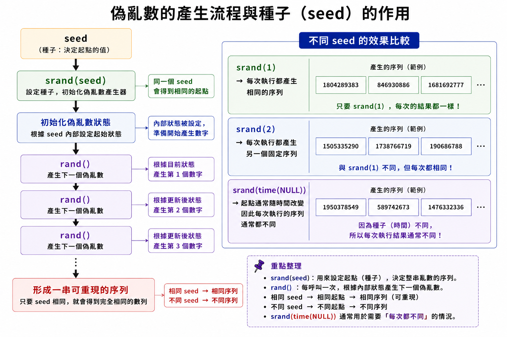
</p>
<!-- /AUTO-IMAGE: C_Lesson_18_img01_seed_sequence.png -->

## Section V-B. 將亂數轉換到指定範圍

### 7. 產生 `0–N-1`

```c
int result = rand() % n;
```

前提：

```text
n > 0
```

---

### 8. 產生 `1–N`

```c
int result = rand() % n + 1;
```

---

### 9. 產生 `minimum–maximum`

可能值數量：

```c
int count = maximum - minimum + 1;
```

結果：

```c
int result = rand() % count + minimum;
```

完整函式：

```c
int random_inclusive(int minimum, int maximum) {
    int count = maximum - minimum + 1;

    return rand() % count + minimum;
}
```

這是由來源的骰子與猜數字公式推廣出的通用版本。

---

### 10. 範圍追蹤

產生 `20–25`：

```text
count = 25 - 20 + 1 = 6
rand() % 6       → 0–5
rand() % 6 + 20  → 20–25
```

---


<!-- AUTO-IMAGE: C_Lesson_18_img02_range_mapping.png -->
<p align="center">
  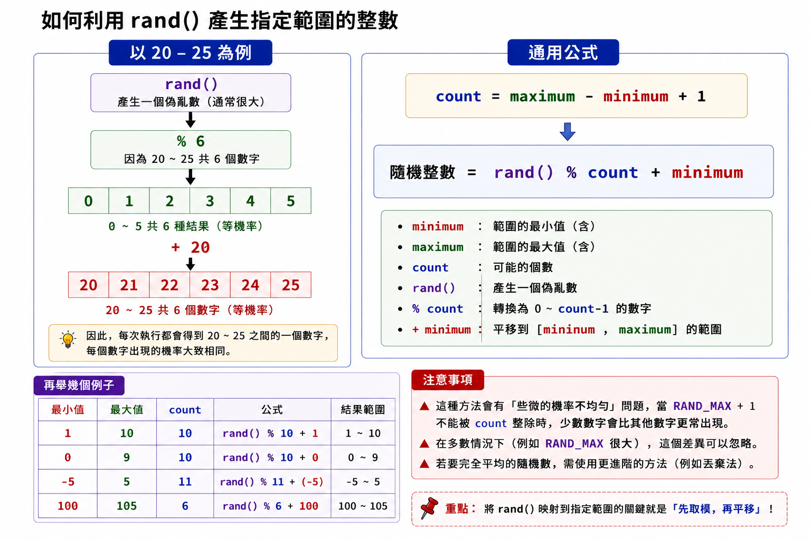
</p>
<!-- /AUTO-IMAGE: C_Lesson_18_img02_range_mapping.png -->

## Section V-C. 模擬公正六面骰子

### 11. 骰子點數公式

```c
int dice = rand() % 6 + 1;
```

推導：

```text
rand() % 6 → 0、1、2、3、4、5
加 1       → 1、2、3、4、5、6
```

---

### 12. 擲五次骰子

```c
#include <stdio.h>
#include <stdlib.h>
#include <time.h>

int main(void) {
    int i;

    srand((unsigned)time(NULL));

    for (i = 1; i <= 5; i++) {
        int dice = rand() % 6 + 1;
        printf("%d\n", dice);
    }

    return 0;
}
```

---

### 13. 整理成骰子函式

```c
#include <stdio.h>
#include <stdlib.h>
#include <time.h>

int roll_die(void) {
    return rand() % 6 + 1;
}

int main(void) {
    int i;

    srand((unsigned)time(NULL));

    for (i = 1; i <= 5; i++) {
        printf("%d\n", roll_die());
    }

    return 0;
}
```

`roll_die()` 負責：

```text
產生一個 1–6 的點數
```

`main()` 負責：

```text
設定種子與重複呼叫
```

---


<!-- AUTO-IMAGE: C_Lesson_18_img03_dice_mapping.png -->
<p align="center">
  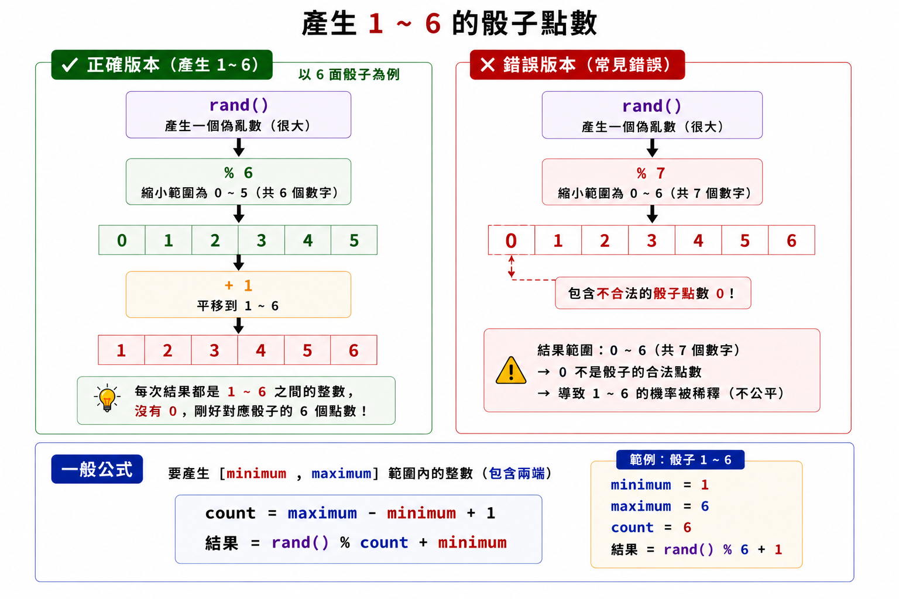
</p>
<!-- /AUTO-IMAGE: C_Lesson_18_img03_dice_mapping.png -->

## Section V-D. 猜數字遊戲

### 14. 固定答案版本

```c
#include <stdio.h>

int main(void) {
    int answer = 4;
    int guess;

    do {
        printf("Please enter your guess: ");
        scanf("%d", &guess);

        if (guess > answer) {
            printf("Too large!\n");
        } else if (guess < answer) {
            printf("Too small!\n");
        } else {
            printf("Correct!\n");
        }
    } while (guess != answer);

    return 0;
}
```

---

### 15. 來源的 `0–99` 偽亂數答案

```c
#include <stdio.h>
#include <stdlib.h>
#include <time.h>

int main(void) {
    int answer;
    int guess;

    srand((unsigned)time(NULL));
    answer = rand() % 100;

    do {
        printf("Please enter your guess: ");
        scanf("%d", &guess);

        if (guess > answer) {
            printf("Too large!\n");
        } else if (guess < answer) {
            printf("Too small!\n");
        } else {
            printf("Correct!\n");
        }
    } while (guess != answer);

    return 0;
}
```

---

### 16. 如果題目要 `1–100`

只修改：

```c
answer = rand() % 100 + 1;
```

輸入提示也應明確告訴使用者合法範圍。

---

## Section V-E. 不重複亂數：逐筆檢查法

### 17. 題目

產生十個數字：

```text
1–10
```

要求：

```text
每個數字恰好出現一次
```

範例：

```text
3 6 8 7 2 5 1 10 9 4
```

---

### 18. 單純呼叫十次不夠

```c
for (i = 1; i <= 10; i++) {
    int number = rand() % 10 + 1;
    printf("%d ", number);
}
```

這個版本可能重複。

---

### 19. 使用陣列儲存結果

```c
int numbers[10];
```

第 `i` 個新候選放在：

```c
numbers[i - 1]
```

---

### 20. 使用狀態變數檢查重複

```c
#include <stdio.h>
#include <stdlib.h>
#include <time.h>

int main(void) {
    int i;
    int numbers[10];

    srand((unsigned)time(NULL));

    for (i = 1; i <= 10; i++) {
        int is_used;

        do {
            int j;

            numbers[i - 1] = rand() % 10 + 1;
            is_used = 0;

            for (j = 1; j < i; j++) {
                if (numbers[i - 1] == numbers[j - 1]) {
                    is_used = 1;
                    break;
                }
            }
        } while (is_used);

        printf("%d ", numbers[i - 1]);
    }

    printf("\n");

    return 0;
}
```

---

### 21. 使用 `j` 的最後值判斷

來源化簡成：

```c
#include <stdio.h>
#include <stdlib.h>
#include <time.h>

int main(void) {
    int i;
    int numbers[10];

    srand((unsigned)time(NULL));

    for (i = 1; i <= 10; i++) {
        int j;

        do {
            numbers[i - 1] = rand() % 10 + 1;

            for (j = 1; j < i; j++) {
                if (numbers[i - 1] == numbers[j - 1]) {
                    break;
                }
            }
        } while (j != i);

        printf("%d ", numbers[i - 1]);
    }

    printf("\n");

    return 0;
}
```

當 `i == 1` 時，內層迴圈不執行，`j` 的初始值已是 `1`，因此第一個數字直接接受。

---


<!-- AUTO-IMAGE: C_Lesson_18_img04_random_vs_unique.png -->
<p align="center">
  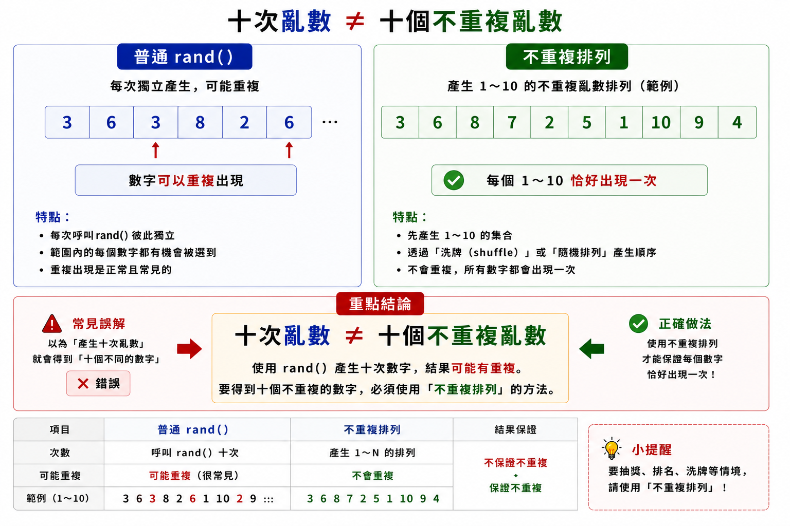
</p>
<!-- /AUTO-IMAGE: C_Lesson_18_img04_random_vs_unique.png -->

## Section V-F. 不重複亂數：建表法

### 22. 建立使用狀態表

```c
int counter[10] = {0};
```

對應：

| 數字 | 狀態索引 |
| ---: | ---: |
| 1 | 0 |
| 2 | 1 |
| ... | ... |
| 10 | 9 |

---

### 23. 完整建表法

```c
#include <stdio.h>
#include <stdlib.h>
#include <time.h>

int main(void) {
    int i;
    int counter[10] = {0};

    srand((unsigned)time(NULL));

    for (i = 1; i <= 10; i++) {
        int number;

        do {
            number = rand() % 10 + 1;
        } while (counter[number - 1] != 0);

        printf("%d ", number);
        counter[number - 1]++;
    }

    printf("\n");

    return 0;
}
```

---

### 24. 建表法流程

```text
抽一個 1–10
→ 檢視對應 counter
→ 已使用：重新抽
→ 未使用：輸出並標記
```

---

### 25. 與逐筆比較法的差異

逐筆比較：

```text
新值要與所有舊值逐一比較
```

建表法：

```text
直接檢視該數值對應的一個位置
```

兩者都可能因為重複而重新抽取。

---


<!-- AUTO-IMAGE: C_Lesson_18_img06_used_table.png -->
<p align="center">
  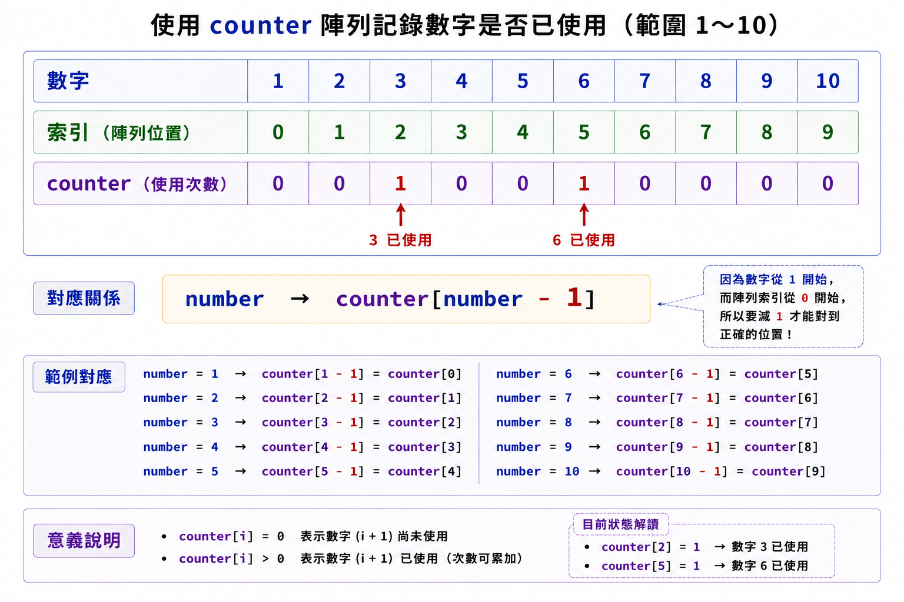
</p>
<!-- /AUTO-IMAGE: C_Lesson_18_img06_used_table.png -->

## Section V-G. 不重複亂數：交換法

### 26. 初始化完整序列

```c
int numbers[10];

for (i = 1; i <= 10; i++) {
    numbers[i - 1] = i;
}
```

---

### 27. 第一輪候選範圍

當：

```text
i = 1
```

選擇：

```c
j = rand() % 10 + 1;
```

範圍：

```text
1–10
```

交換：

```c
numbers[0]
numbers[j - 1]
```

---

### 28. 第二輪候選範圍

當：

```text
i = 2
```

索引 `1` 之前的位置已經固定。

選擇範圍應為：

```text
2–10
```

公式：

```c
j = rand() % 9 + 2;
```

---

### 29. 一般來源公式

```c
j = rand() % (11 - i) + i;
```

檢查：

| `i` | 除數 | `j` 範圍 |
| ---: | ---: | --- |
| 1 | 10 | 1–10 |
| 2 | 9 | 2–10 |
| 3 | 8 | 3–10 |
| ... | ... | ... |
| 10 | 1 | 10 |

---

### 30. 完整交換法

```c
#include <stdio.h>
#include <stdlib.h>
#include <time.h>

int main(void) {
    int i;
    int numbers[10];

    srand((unsigned)time(NULL));

    for (i = 1; i <= 10; i++) {
        numbers[i - 1] = i;
    }

    for (i = 1; i <= 10; i++) {
        int j = rand() % (11 - i) + i;
        int temporary = numbers[i - 1];

        numbers[i - 1] = numbers[j - 1];
        numbers[j - 1] = temporary;

        printf("%d ", numbers[i - 1]);
    }

    printf("\n");

    return 0;
}
```

---

### 31. 零起始的等價版本

```c
#include <stdio.h>
#include <stdlib.h>
#include <time.h>

int main(void) {
    int i;
    int numbers[10];

    srand((unsigned)time(NULL));

    for (i = 0; i < 10; i++) {
        numbers[i] = i + 1;
    }

    for (i = 0; i < 10; i++) {
        int selected = rand() % (10 - i) + i;
        int temporary = numbers[i];

        numbers[i] = numbers[selected];
        numbers[selected] = temporary;
    }

    for (i = 0; i < 10; i++) {
        printf("%d ", numbers[i]);
    }

    printf("\n");

    return 0;
}
```

這與上一章九宮格預覽使用的是同一類交換流程。

---


<!-- AUTO-IMAGE: C_Lesson_18_img07_shuffle_fixed_remaining.png -->
<p align="center">
  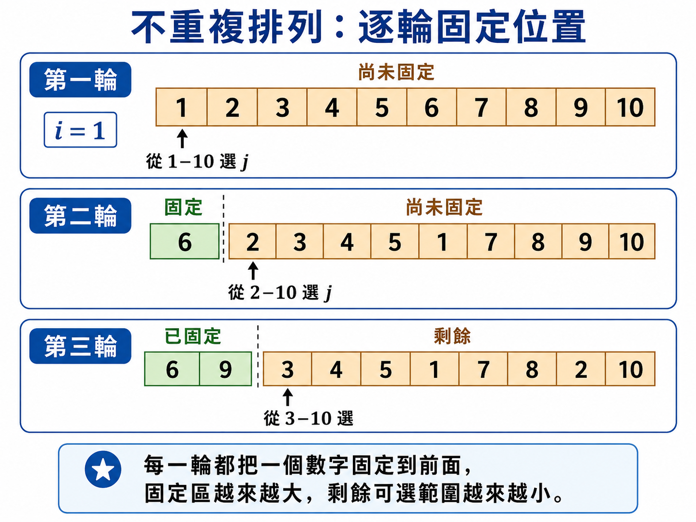
</p>
<!-- /AUTO-IMAGE: C_Lesson_18_img07_shuffle_fixed_remaining.png -->

## Section V-H. 三種不重複方法比較

| 方法 | 主要資料 | 重複時 | 特點 |
| --- | --- | --- | --- |
| 逐筆檢查 | 已產生結果陣列 | 與舊結果逐一比較後重抽 | 容易從問題直接推導 |
| 建表法 | 使用狀態陣列 | 查到已使用後重抽 | 檢查位置直接 |
| 交換法 | 完整不重複陣列 | 不需要重抽舊值 | 每輪固定一個位置 |

交換法的核心優勢：

> 它不是「希望抽到沒有用過的數字」，而是直接從剩餘數字中選擇一個。

---


<!-- AUTO-IMAGE: C_Lesson_18_img08_unique_methods_compare.png -->
<p align="center">
  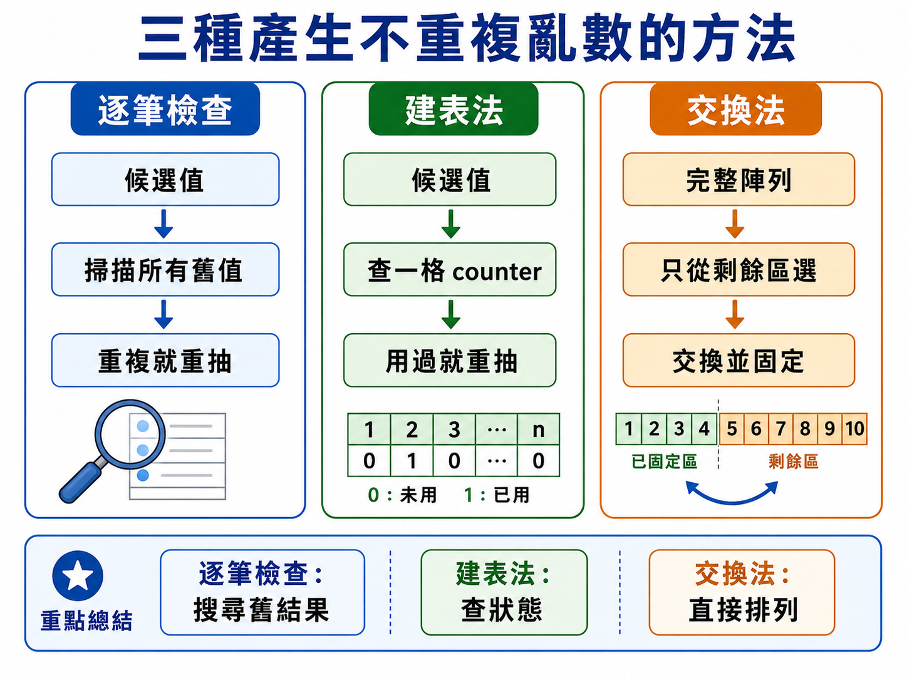
</p>
<!-- /AUTO-IMAGE: C_Lesson_18_img08_unique_methods_compare.png -->

## Section V-I. 全域變數的特殊性

### 32. 普通區塊變數未初始化

```c
#include <stdio.h>

int main(void) {
    int value;

    /* 不要讀取 value */
    value = 0;
    printf("%d\n", value);

    return 0;
}
```

必須先賦值，再讀取。

---

### 33. 全域變數自動初始化

```c
#include <stdio.h>

int value;

int main(void) {
    printf("%d\n", value);

    return 0;
}
```

輸出：

```text
0
```

---

### 34. 全域變數可被多個函式存取

```c
#include <stdio.h>

int value = 0;

void increase(void) {
    value++;
}

int main(void) {
    increase();
    printf("%d\n", value);

    return 0;
}
```

輸出：

```text
1
```

但來源也提醒：

> 大量使用全域變數會讓函式關係難以理解。

---

### 35. 程式開始前的初始化

概念流程：

```text
準備與初始化靜態儲存期物件
→ 進入 main()
→ 執行程式述句
```

全域初始化不是在 `main()` 某一行才臨時發生。

---

### 36. 全域初始化式限制示例

下面不是普通執行期函式呼叫：

```c
int make_value(void) {
    return 0;
}

/* 不可作為來源示例中的全域動態初始化 */
```

應在 `main()` 中賦值：

```c
int value;

int main(void) {
    value = make_value();

    return 0;
}
```

---

## Section V-J. 全域狀態與 `static` 區域變數

### 37. 普通區域計數器

```c
#include <stdio.h>

int count(void) {
    int value = 0;

    value++;
    return value;
}

int main(void) {
    int i;

    for (i = 1; i <= 5; i++) {
        printf("%d\n", count());
    }

    return 0;
}
```

輸出：

```text
1
1
1
1
1
```

---

### 38. 全域計數器

```c
#include <stdio.h>

int counter_value = 0;

int count(void) {
    counter_value++;
    return counter_value;
}

int main(void) {
    int i;

    for (i = 1; i <= 5; i++) {
        printf("%d\n", count());
    }

    return 0;
}
```

輸出：

```text
1
2
3
4
5
```

---

### 39. `static` 區域計數器

```c
#include <stdio.h>

int count(void) {
    static int value = 0;

    value++;
    return value;
}

int main(void) {
    int i;

    for (i = 1; i <= 5; i++) {
        printf("%d\n", count());
    }

    return 0;
}
```

---

### 40. 三種狀態比較

| 宣告位置 | 可見範圍 | 是否跨呼叫儲存 |
| --- | --- | --- |
| 普通區塊變數 | 當前區塊 | 否 |
| 全域變數 | 可見的多個函式 | 是 |
| `static` 區域變數 | 當前函式或區塊 | 是 |

---


<!-- AUTO-IMAGE: C_Lesson_18_img09_storage_duration.png -->
<p align="center">
  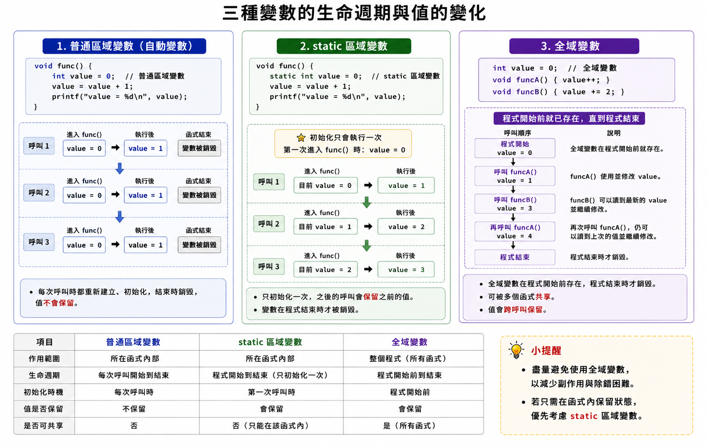
</p>
<!-- /AUTO-IMAGE: C_Lesson_18_img09_storage_duration.png -->

## Section V-K. 整數溢位

### 41. 有號整數示例

```c
#include <stdio.h>

int main(void) {
    int a = 1000;
    int b = a * a * a;

    printf("%d\n", b);

    return 0;
}
```

`1000^3` 為：

```text
1,000,000,000
```

在常見 32 位 `int` 中仍可能表示。

再多乘一個 `1000`，數學結果遠超常見 `int` 範圍。

---

### 42. 檢視整數範圍

```c
#include <limits.h>
#include <stdio.h>

int main(void) {
    printf("INT_MAX  = %d\n", INT_MAX);
    printf("INT_MIN  = %d\n", INT_MIN);
    printf("UINT_MAX = %u\n", UINT_MAX);

    return 0;
}
```

---

### 43. 不要執行有號溢位來學習迴繞

來源截圖展示某一環境的結果，但同時明確標註：

```text
signed integer overflow is undefined behavior
```

因此本講義不提供一個故意觸發有號溢位的完整可執行示例。

---

### 44. 無號整數迴繞

```c
#include <limits.h>
#include <stdio.h>

int main(void) {
    unsigned int value = UINT_MAX;

    printf("%u\n", value);
    value++;
    printf("%u\n", value);

    return 0;
}
```

輸出：

```text
UINT_MAX
0
```

---

### 45. 模數解釋

無號結果相當於：

```text
真實數學結果 % (UINT_MAX + 1)
```

如果 `unsigned int` 為 32 位：

```text
UINT_MAX + 1 = 4294967296 = 2^32
```

---


<!-- AUTO-IMAGE: C_Lesson_18_img11_signed_unsigned_overflow.png -->
<p align="center">
  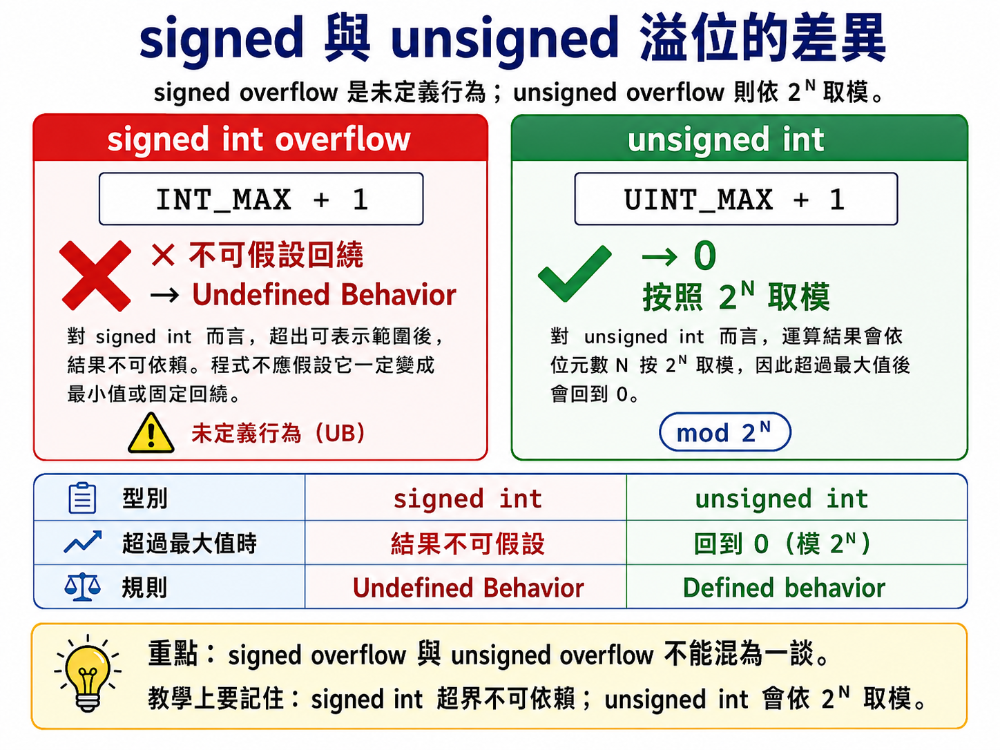
</p>
<!-- /AUTO-IMAGE: C_Lesson_18_img11_signed_unsigned_overflow.png -->

## Section V-L. 自行產生偽亂數：小型模型

### 46. 只乘以 `5`

從 `1` 開始：

```text
1, 5, 25, 125, 625, 3125, ...
```

來源投影片中的部分數列用於觀察：

> 簡單遞推式會產生完全可預測的數列。

---

### 47. 乘以 `5` 再加 `3`

```text
1, 8, 43, 218, 1093, 5468, ...
```

仍然持續增長，並不限制在固定範圍。

---

### 48. 再對 `16` 取餘數

遞推：

```text
X(0) = 1
X(n+1) = (X(n) * 5 + 3) % 16
```

數列：

```text
1, 8, 11, 10, 5, 12, 15, 14,
9, 0, 3, 2, 13, 4, 7, 6, 1, ...
```

---

### 49. 週期

回到：

```text
1
```

以後，後續數列會完全重複。

這個例子在 `0–15` 中每個值都出現一次後才迴圈。

---

### 50. 小型產生器程式

```c
#include <stdio.h>

int main(void) {
    int i;
    unsigned int state = 1u;

    for (i = 1; i <= 16; i++) {
        state = (state * 5u + 3u) % 16u;
        printf("%u ", state);
    }

    printf("\n");

    return 0;
}
```

---

## Section V-M. 線性同餘法

### 51. 一般公式

```text
X(n+1) = (X(n) * a + c) % m
```

| 符號 | 意義 |
| --- | --- |
| `X(n)` | 當前內部狀態 |
| `a` | 乘數 |
| `c` | 增量 |
| `m` | 模數 |
| `X(0)` | 種子 |

---

### 52. 來源大型引數

```text
X(0) = 1
a = 1103515245
c = 12345
m = 4294967296
```

遞推：

```text
X(n+1)
= (X(n) * 1103515245 + 12345)
  % 4294967296
```

---

### 53. 使用無號整數自然迴繞

來源實作省略顯式 `% 4294967296`：

```c
state = state * 1103515245u + 12345u;
```

在 32 位 `unsigned int` 環境中，溢位自然完成模數 `2^32`。

---

### 54. 輸出內部狀態

```c
#include <stdio.h>

int main(void) {
    int i;
    unsigned int state = 1u;

    for (i = 1; i <= 5; i++) {
        state = state * 1103515245u + 12345u;
        printf("%u\n", state);
    }

    return 0;
}
```

來源展示的 32 位結果序列為：

```text
1103527590
2524885223
662824084
3295386429
4182499122
```

這個精確序列依賴 `unsigned int` 為 32 位。

---

### 55. 取出較高位

```c
int result =
    (int)((state / 65536u) % 32768u);
```

來源輸出：

```text
16838
5758
10113
17515
31051
```

---

### 56. 為什麼範圍是 `0–32767`？

```text
% 32768
```

結果可能值：

```text
0 到 32767
```

---


<!-- AUTO-IMAGE: C_Lesson_18_img10_lcg_state_machine.png -->
<p align="center">
  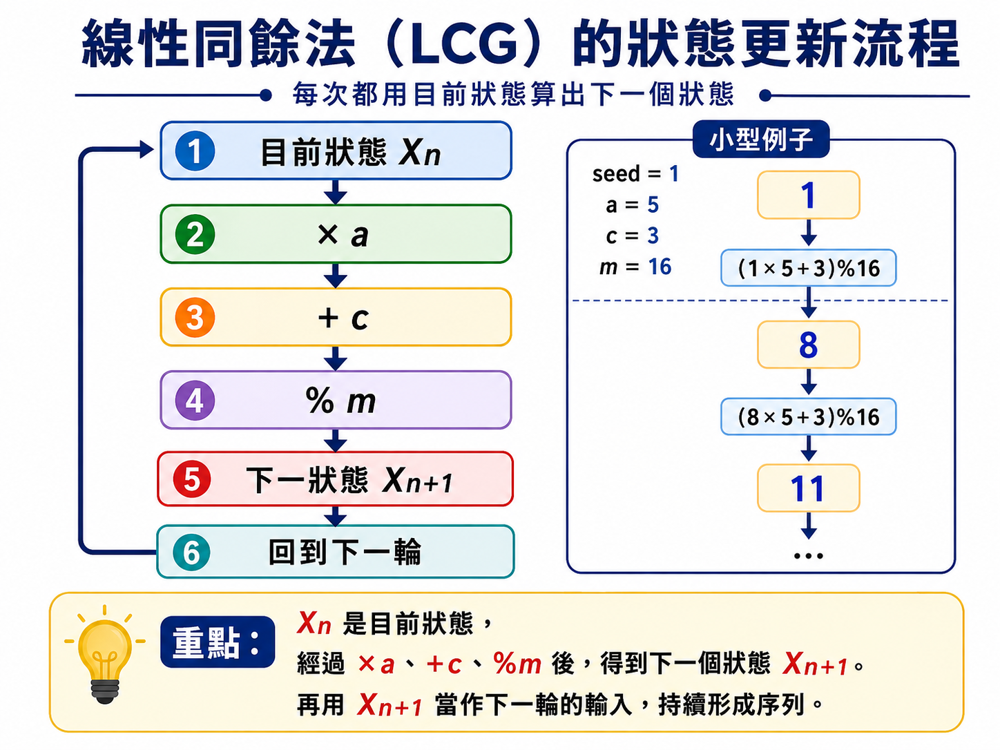
</p>
<!-- /AUTO-IMAGE: C_Lesson_18_img10_lcg_state_machine.png -->

## Section V-N. 自訂偽亂數函式

### 57. 錯誤版本：狀態每次重設

```c
#include <stdio.h>

int broken_rand(void) {
    unsigned int state = 1u;

    state = state * 1103515245u + 12345u;
    return (int)((state / 65536u) % 32768u);
}

int main(void) {
    int i;

    for (i = 1; i <= 5; i++) {
        printf("%d\n", broken_rand());
    }

    return 0;
}
```

每次呼叫都會輸出相同結果，因為：

```c
state = 1u;
```

每次都重新執行。

---

### 58. 全域狀態版本

```c
#include <stdio.h>

static unsigned int generator_state = 1u;

int my_rand(void) {
    generator_state =
        generator_state * 1103515245u + 12345u;

    return (int)(
        (generator_state / 65536u) % 32768u
    );
}

int main(void) {
    int i;

    for (i = 1; i <= 5; i++) {
        printf("%d\n", my_rand());
    }

    return 0;
}
```

---

### 59. `static` 區域狀態版本

```c
#include <stdio.h>

int my_rand(void) {
    static unsigned int state = 1u;

    state = state * 1103515245u + 12345u;

    return (int)((state / 65536u) % 32768u);
}

int main(void) {
    int i;

    for (i = 1; i <= 5; i++) {
        printf("%d\n", my_rand());
    }

    return 0;
}
```

狀態只能在 `my_rand()` 內直接存取，但會跨呼叫儲存。

---

### 60. 加入自訂種子函式

要讓另一個函式修改狀態，來源最後將狀態放到檔案範圍。

本講義使用不同於標準函式庫的名稱：

```c
#include <stdio.h>
#include <time.h>

static unsigned int generator_state = 1u;

int my_rand(void) {
    generator_state =
        generator_state * 1103515245u + 12345u;

    return (int)(
        (generator_state / 65536u) % 32768u
    );
}

void my_srand(unsigned int seed) {
    generator_state = seed;
}

int main(void) {
    int i;

    my_srand((unsigned)time(NULL));

    for (i = 1; i <= 5; i++) {
        printf("%d\n", my_rand());
    }

    return 0;
}
```

---

### 61. 檔案內部狀態

```c
static unsigned int generator_state;
```

這裡的檔案範圍 `static` 表示：

> 該名稱只在當前原始檔中可見。

這延續來源最後的「狀態不應隨意暴露給其他檔案」概念。

---


<!-- AUTO-IMAGE: C_Lesson_18_img12_prng_state_persistence.png -->
<p align="center">
  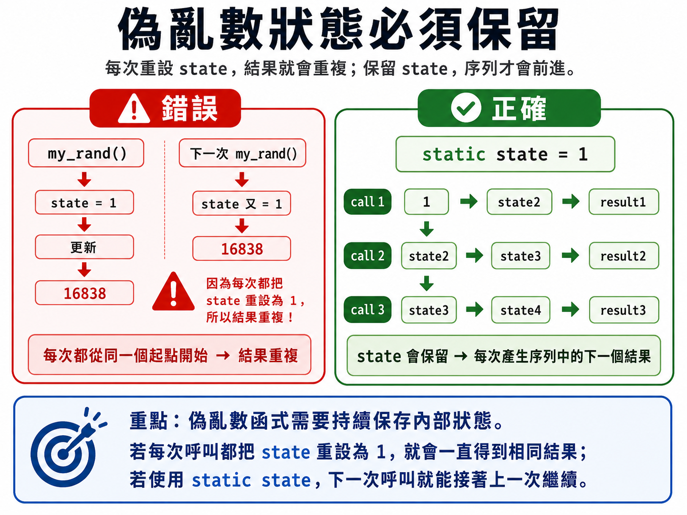
</p>
<!-- /AUTO-IMAGE: C_Lesson_18_img12_prng_state_persistence.png -->

## Section V-O. 容易搞混的重點

### 62. 亂數種子不是每次輸出的亂數

種子只決定初始狀態。

後續每次 `rand()` 會根據內部狀態產生下一值。

---

### 63. `srand()` 不會直接回傳亂數

```c
srand(seed);
```

回傳型態是 `void`。

真正取得結果使用：

```c
rand();
```

---

### 64. `%` 是範圍轉換，不是產生亂數本身

```c
rand() % 6
```

先由 `rand()` 產生數，再由 `% 6` 取餘數。

---

### 65. 「十個亂數」不等於「十個不重複亂數」

前者允許重複。

後者需要額外演算法。

---

### 66. 建表法的表儲存狀態，不儲存輸出順序

```c
counter[3]
```

只表示數字 `4` 是否已經使用。

真正的輸出順序由每次抽到的 `number` 決定。

---

### 67. 交換法不是每輪從完整範圍抽取

每輪只能從尚未固定的後段選擇。

否則前面已經輸出或固定的元素可能被再次打亂。

---

### 68. 全域變數與 `static` 區域變數都有靜態儲存期

差別主要在名稱可見範圍：

- 全域名稱可能被多個函式看到
- `static` 區域名稱只在區塊內看到

---

### 69. `static` 有不止一種用法

本章出現：

```c
static int value;
```

在函式內部：

```text
儲存跨呼叫狀態
```

在檔案範圍：

```text
限制名稱只在當前原始檔可見
```

---

### 70. 有號與無號溢位規則不同

不能因為無號會迴繞，就假設 `int` 也會可靠迴繞。

---

### 71. 產生器的內部狀態不等於最後輸出

來源先更新 32 位狀態，再只取其中一部分作為 `0–32767` 結果。

---

### 72. 數列看起來混亂，不代表不可預測

線性同餘法完全由公式、引數與種子決定。

---

## Section VI. 快速概念檢查

### Q1. 使用 `rand()` 需要包含哪個標頭檔？

<details>
<summary>檢視答案</summary>

```c
#include <stdlib.h>
```

</details>

---

### Q2. `rand() % 6` 的範圍是什麼？

<details>
<summary>檢視答案</summary>

```text
0–5
```

</details>

---

### Q3. 骰子點數公式是什麼？

<details>
<summary>檢視答案</summary>

```c
rand() % 6 + 1
```

</details>

---

### Q4. 為什麼相同種子可以重現相同序列？

<details>
<summary>檢視答案</summary>

因為偽亂數產生器依確定規則從種子開始更新狀態。

</details>

---

### Q5. `rand() % 100` 的範圍是什麼？

<details>
<summary>檢視答案</summary>

```text
0–99
```

</details>

---

### Q6. 為什麼呼叫十次 `rand() % 10 + 1` 不能保證不重複？

<details>
<summary>檢視答案</summary>

每次呼叫是獨立取得一個允許重複的候選值，程式沒有記錄過去結果。

</details>

---

### Q7. 建表法中 `counter[number - 1] == 0` 表示什麼？

<details>
<summary>檢視答案</summary>

表示 `number` 尚未使用。

</details>

---

### Q8. 交換法第 `i` 輪為什麼只從 `i–10` 選取？

<details>
<summary>檢視答案</summary>

因為 `1–i-1` 的位置已經固定，不應再次被交換。

</details>

---

### Q9. 未初始化全域 `int` 的初始值是什麼？

<details>
<summary>檢視答案</summary>

```text
0
```

</details>

---

### Q10. 普通區域變數會跨函式呼叫儲存值嗎？

<details>
<summary>檢視答案</summary>

不會。每次進入函式會建立新的例項。

</details>

---

### Q11. `static` 區域變數會初始化幾次？

<details>
<summary>檢視答案</summary>

一次，之後的呼叫繼續使用儲存的值。

</details>

---

### Q12. 有號整數溢位可以依賴它變成負數嗎？

<details>
<summary>檢視答案</summary>

不可以。有號整數溢位屬於未定義行為。

</details>

---

### Q13. 無號整數超過 `UINT_MAX` 後會怎樣？

<details>
<summary>檢視答案</summary>

按照 `UINT_MAX + 1` 取模迴繞。

</details>

---

### Q14. 線性同餘法的一般公式是什麼？

<details>
<summary>檢視答案</summary>

```text
X(n+1) = (X(n) * a + c) % m
```

</details>

---

### Q15. 自訂產生器的狀態為何不能是每次設為 `1` 的普通區域變數？

<details>
<summary>檢視答案</summary>

因為每次呼叫都會從相同狀態重新開始，產生相同結果。

</details>

---

## Section VII. 程式閱讀練習

### 題目 1：範圍

```c
int value = rand() % 8 + 3;
```

<details>
<summary>檢視答案</summary>

```text
3–10
```

</details>

---

### 題目 2：骰子錯誤

```c
int dice = rand() % 7;
```

<details>
<summary>檢視答案</summary>

會產生：

```text
0–6
```

包含不合法點數 `0`。

</details>

---

### 題目 3：建表狀態

```c
int used[5] = {0};
int number = 3;

used[number - 1]++;
```

<details>
<summary>檢視答案</summary>

```text
used[2]
```

增加為 `1`，表示數字 `3` 已使用。

</details>

---

### 題目 4：交換範圍

```c
int i = 4;
int selected = rand() % (10 - i) + i;
```

<details>
<summary>檢視答案</summary>

零起始版本中：

```text
selected = 4–9
```

</details>

---

### 題目 5：普通區域計數器

```c
int count(void) {
    int value = 10;
    value++;
    return value;
}
```

連續呼叫三次。

<details>
<summary>檢視答案</summary>

每次都是：

```text
11
```

</details>

---

### 題目 6：靜態區域計數器

```c
int count(void) {
    static int value = 10;
    value++;
    return value;
}
```

連續呼叫三次。

<details>
<summary>檢視答案</summary>

```text
11
12
13
```

</details>

---

### 題目 7：小型線性同餘

```c
state = (state * 5u + 3u) % 16u;
```

初始 `state = 1`，第一個新狀態是多少？

<details>
<summary>檢視答案</summary>

```text
(1 × 5 + 3) % 16 = 8
```

</details>

---

### 題目 8：自訂函式錯誤

```c
int my_rand(void) {
    unsigned int state = 1u;
    state = state * 1103515245u + 12345u;
    return (int)((state / 65536u) % 32768u);
}
```

<details>
<summary>檢視答案</summary>

`state` 每次呼叫都重新設為 `1`，所以每次回傳相同結果。

</details>

---

## Section VIII. 實作練習 / 實作檢測題

### TODO 1：輸出十個標準偽亂數

先使用固定種子 `1`，再改成時間種子，比較輸出。

---

### TODO 2：範圍函式

撰寫：

```c
int random_inclusive(int minimum, int maximum);
```

呼叫前確保 `maximum >= minimum`。

---

### TODO 3：模擬十次骰子

輸出十個 `1–6` 點數。

---

### TODO 4：骰子點數統計

模擬 `6000` 次骰子，使用長度 `6` 的次數陣列統計每個點數。

這是結合前面陣列統計章節的延伸。

---

### TODO 5：猜數字 `1–100`

將來源 `0–99` 版本修改成 `1–100`，並加入猜測次數。

---

### TODO 6：逐筆檢查不重複序列

產生 `1–10` 各一次，使用先前結果陣列檢查重複。

---

### TODO 7：建表法不重複序列

使用：

```c
int used[10] = {0};
```

不得掃描先前所有輸出值。

---

### TODO 8：交換法不重複序列

先建立 `1–10`，再從剩餘區間交換。

---

### TODO 9：比較重抽次數

在逐筆檢查法和建表法中，記錄總共呼叫了多少次 `rand()`。

---

### TODO 10：隨機九宮格

使用交換法打亂 `1–9`，每三個元素換行。

可複用上一章的索引與座標知識。

---

### TODO 11：普通、全域與 static 計數器

分別輸出五次，比較三種結果。

---

### TODO 12：無號迴繞實驗

從 `UINT_MAX - 2` 開始連續增加五次，觀察結果。

---

### TODO 13：小型線性同餘產生器

使用：

```text
a = 5
c = 3
m = 16
seed = 1
```

輸出直到再次回到 `1`，並計算週期。

---

### TODO 14：自訂 `my_rand()`

使用來源大型常數與 `static` 區域狀態，輸出前五個結果。

---

### TODO 15：自訂 `my_srand()`

讓使用者輸入種子，呼叫兩次相同種子，驗證序列可重現。

---

## Section IX. 做題時可以使用的提示

### 1. 範圍公式先算可能值數量

```text
count = maximum - minimum + 1
```

再寫：

```c
rand() % count + minimum
```

---

### 2. 不重複問題先確認是哪一種要求

```text
從範圍中抽若幹次，允許重複？
還是要完整隨機排列？
```

完整排列通常更適合交換法。

---

### 3. 重抽法卡住時列印候選值

觀察後段是否不斷抽到已使用數字。

---

### 4. 交換法畫出分隔線

```text
已固定 | 剩餘可選
```

每輪把分隔線向右移動一格。

---

### 5. 狀態儲存錯誤時列印每次呼叫前的狀態

如果每次都是 `1`，表示變數被重新初始化。

---

### 6. 溢位問題先檢查型態

```text
int？
unsigned int？
```

兩者規則不同。

---

### 7. 線性同餘法先使用小模數

模數 `16` 容易手算完整週期。

確認邏輯後，再使用大型常數。

---

### 8. 建議測試

標準亂數：

```text
srand(1)
srand(1)
srand(2)
```

範圍：

```text
1–1
1–6
20–25
```

不重複：

```text
1–3
1–10
```

狀態：

```text
普通區域
全域
static 區域
```

---

## Section X. 課後小練習

### 練習 1：隨機字母

產生：

```text
'A'–'Z'
```

提示：

```c
'A' + rand() % 26
```

---

### 練習 2：隨機密碼練習（非安全用途）

只用於練習陣列與範圍轉換，產生八個英文字母。

必須標註：

> 這個方法不適合作為真實密碼產生器。

---

### 練習 3：抽籤

將學號 `1–30` 放入陣列，使用交換法決定完整抽籤順序。

---

### 練習 4：隨機選擇 K 個不重複值

先交換完整陣列，只取前 `K` 個。

---

### 練習 5：建表法剩餘數字

產生前五個不重複值後，輸出哪些數字尚未使用。

---

### 練習 6：不同種子的週期

對小型線性同餘法分別使用種子：

```text
0、1、2、3
```

觀察週期是否相同。

---

### 練習 7：改變引數

保持 `m = 16`，修改 `a` 或 `c`，觀察是否提早進入短迴圈。

---

### 練習 8：封裝產生器狀態

設計：

```c
void my_srand(unsigned int seed);
int my_rand(void);
```

讓 `main()` 不直接修改狀態變數。

---

## Section XI. 重點複習

1. `rand()` 來自 `<stdlib.h>`。
2. `rand()` 回傳 `0–RAND_MAX` 的偽亂數整數。
3. `srand()` 用來設定種子。
4. 相同種子可以重現相同序列。
5. 一個程式通常只設定一次種子。
6. `time(NULL)` 可以提供隨時間變化的種子。
7. 時間種子仍然產生偽亂數。
8. `rand() % n` 產生 `0–n-1`。
9. `rand() % n + 1` 產生 `1–n`。
10. 骰子點數使用 `rand() % 6 + 1`。
11. 來源猜數字使用 `rand() % 100`，範圍是 `0–99`。
12. 多次呼叫 `rand()` 可能得到重複值。
13. 不重複序列需要額外記錄或重新排列。
14. 逐筆檢查法比較新值與所有舊值。
15. 發現重複後可以 `break` 並重新抽取。
16. 建表法用一個索引直接表示某值是否已使用。
17. 建表陣列必須初始化為 `0`。
18. 重抽法越接近完成時可能需要更多嘗試。
19. 交換法先建立完整不重複資料。
20. 交換法每輪只從剩餘區域選擇。
21. 交換法一定保留原本的元素集合。
22. 普通區域變數不會自動儲存跨呼叫狀態。
23. 未初始化普通區域變數不可安全讀取。
24. 全域變數未指定初值時會初始化為 `0`。
25. 全域變數在進入 `main()` 前完成初始化。
26. 全域狀態會讓函式間關係較不明顯。
27. `static` 區域變數只初始化一次。
28. `static` 區域變數的名稱仍只在函式內可見。
29. 有號整數溢位屬於未定義行為。
30. 無號整數按照 `UINT_MAX + 1` 迴繞。
31. 線性同餘法使用當前狀態計算下一狀態。
32. 種子是狀態數列的起點。
33. 有限狀態偽亂數序列最終一定會迴圈。
34. 來源小例子在模數 `16` 下產生完整迴圈。
35. 來源大型產生器使用 `1103515245` 與 `12345`。
36. 32 位無號迴繞可實現模數 `2^32`。
37. 來源從內部狀態較高位取得 `0–32767`。
38. 自訂函式必須儲存上一次狀態。
39. 狀態可以放在全域或 `static` 區域變數中。
40. 自訂種子函式用來重設內部狀態。
41. 本講義使用 `my_rand()`、`my_srand()` 避免衝突。
42. 教學線性同餘產生器不可用於安全用途。

---

## Section XII. 常見錯誤提醒

### 錯誤 1：忘記包含 `<stdlib.h>`

`rand()` 與 `srand()` 的宣告位於該標頭檔。

---

### 錯誤 2：每輪都呼叫 `srand(time(NULL))`

短時間內可能不斷使用相同種子，破壞預期序列。

---

### 錯誤 3：骰子使用 `% 7`

會得到 `0–6`。

---

### 錯誤 4：範圍公式少寫 `+ 1`

`minimum–maximum` 是閉區間，可能值數量要包含兩端。

---

### 錯誤 5：把 `rand() % 100` 說成 `1–100`

實際是 `0–99`。

---

### 錯誤 6：以為十次呼叫會自動不重複

標準 `rand()` 沒有這項保證。

---

### 錯誤 7：重抽前沒有檢查所有已產生值

可能遺漏較早出現的重複。

---

### 錯誤 8：建表陣列未初始化

狀態表會從不確定內容開始。

---

### 錯誤 9：建表索引寫成 `counter[number]`

數字 `10` 會存取 `counter[10]`，超出長度 `10` 的合法索引。

---

### 錯誤 10：交換法每輪仍從完整範圍選擇

已固定位置可能被再次交換。

---

### 錯誤 11：交換時沒有暫存變數

其中一個值會被覆蓋並遺失。

---

### 錯誤 12：讀取未初始化普通區域變數

必須先賦值。

---

### 錯誤 13：過度依賴全域變數

函式輸入與輸出會變得不明顯。

---

### 錯誤 14：以為 `static` 區域變數每次都重新設為初值

它只初始化一次。

---

### 錯誤 15：依賴有號溢位迴繞

編譯器可以基於“溢位不會發生”的規則進行最佳化，結果不可預測。

---

### 錯誤 16：使用 `%lu` 輸出 `unsigned int`

應使用與實際型態相符的 `%u`。

---

### 錯誤 17：自訂產生器把狀態宣告成普通區域變數

每次呼叫都會重置數列。

---

### 錯誤 18：使用標準函式庫保留名稱重新定義函式

本講義改用 `my_rand()` 與 `my_srand()`。

---

### 錯誤 19：認為看到完整 `0–15` 就永遠不會重複

回到種子後，整個序列會迴圈。

---

### 錯誤 20：將教學偽亂數用於安全性資料

線性同餘產生器可以被預測。

---

## Section XIII. Mermaid 流程圖

### 1. 標準偽亂數流程

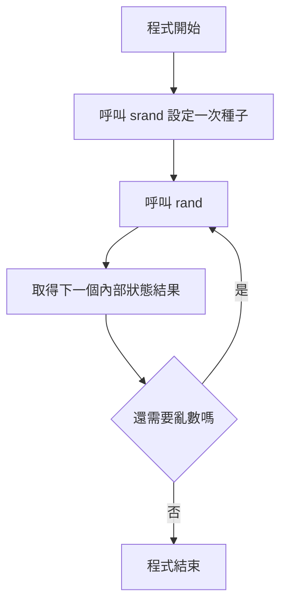
```mermaid
flowchart TD
    A[程式開始] --> B[呼叫 srand 設定一次種子]
    B --> C[呼叫 rand]
    C --> D[取得下一個內部狀態結果]
    D --> E{還需要亂數嗎}
    E -- 是 --> C
    E -- 否 --> F[程式結束]
```

---

### 2. 骰子範圍轉換

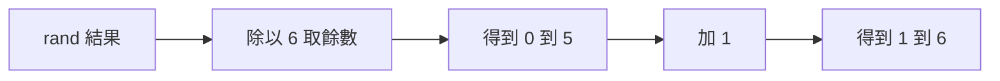
```mermaid
flowchart LR
    A[rand 結果] --> B[除以 6 取餘數]
    B --> C[得到 0 到 5]
    C --> D[加 1]
    D --> E[得到 1 到 6]
```

---

### 3. 逐筆檢查法

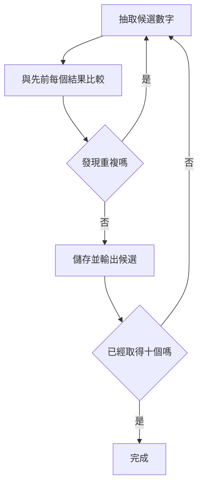
```mermaid
flowchart TD
    A[抽取候選數字] --> B[與先前每個結果比較]
    B --> C{發現重複嗎}
    C -- 是 --> A
    C -- 否 --> D[儲存並輸出候選]
    D --> E{已經取得十個嗎}
    E -- 否 --> A
    E -- 是 --> F[完成]
```

---

### 4. 建表法

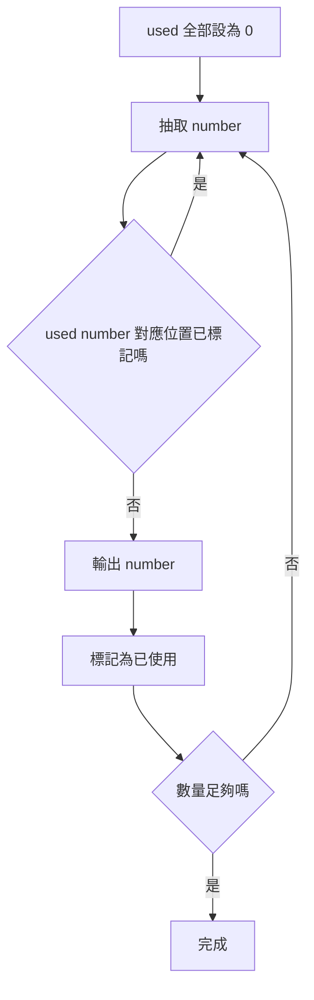
```mermaid
flowchart TD
    A[used 全部設為 0] --> B[抽取 number]
    B --> C{used number 對應位置已標記嗎}
    C -- 是 --> B
    C -- 否 --> D[輸出 number]
    D --> E[標記為已使用]
    E --> F{數量足夠嗎}
    F -- 否 --> B
    F -- 是 --> G[完成]
```

---

### 5. 交換法

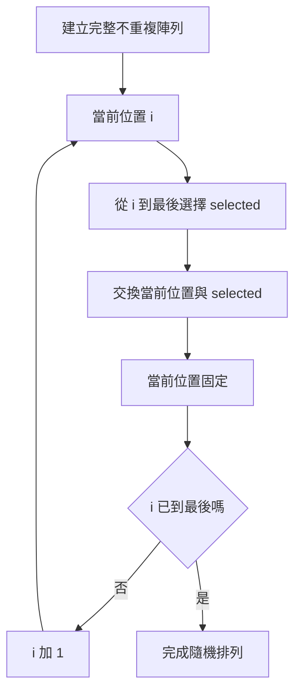
```mermaid
flowchart TD
    A[建立完整不重複陣列] --> B[當前位置 i]
    B --> C[從 i 到最後選擇 selected]
    C --> D[交換當前位置與 selected]
    D --> E[當前位置固定]
    E --> F{i 已到最後嗎}
    F -- 否 --> G[i 加 1]
    G --> B
    F -- 是 --> H[完成隨機排列]
```

---

### 6. 普通區域與 static 狀態

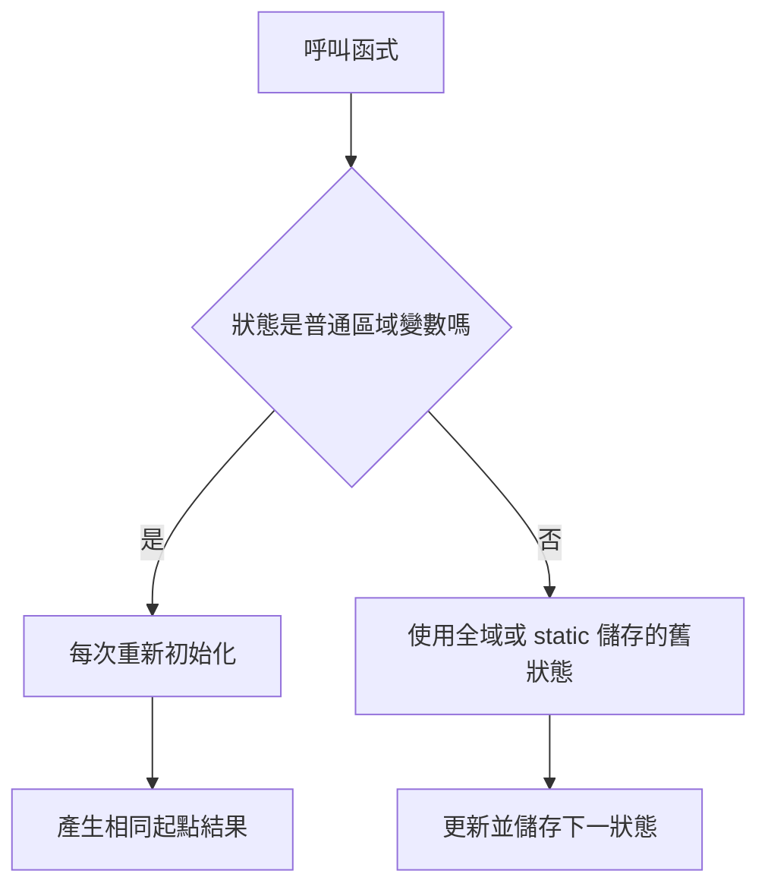
```mermaid
flowchart TD
    A[呼叫函式] --> B{狀態是普通區域變數嗎}
    B -- 是 --> C[每次重新初始化]
    B -- 否 --> D[使用全域或 static 儲存的舊狀態]
    C --> E[產生相同起點結果]
    D --> F[更新並儲存下一狀態]
```

---

### 7. 線性同餘產生器

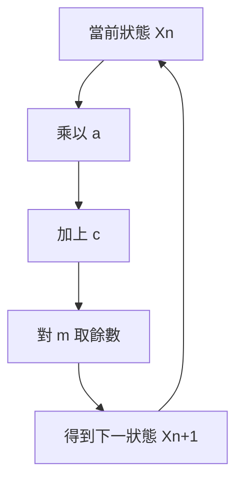
```mermaid
flowchart TD
    A[當前狀態 Xn] --> B[乘以 a]
    B --> C[加上 c]
    C --> D[對 m 取餘數]
    D --> E[得到下一狀態 Xn+1]
    E --> A
```

---

### 8. 自訂產生器

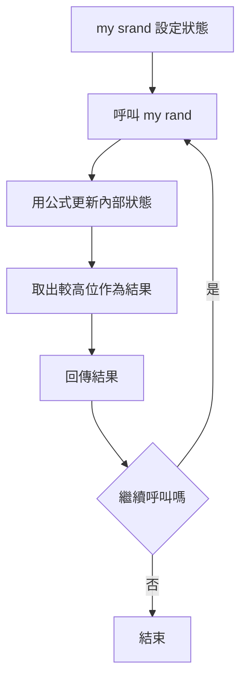
```mermaid
flowchart TD
    A[my srand 設定狀態] --> B[呼叫 my rand]
    B --> C[用公式更新內部狀態]
    C --> D[取出較高位作為結果]
    D --> E[回傳結果]
    E --> F{繼續呼叫嗎}
    F -- 是 --> B
    F -- 否 --> G[結束]
```

---

## 本章完成標準

完成本章後，你應該能夠：

1. 正確包含並呼叫 `rand()`。
2. 說明 `rand()` 產生的是偽亂數。
3. 使用固定種子重現數列。
4. 使用時間種子改變數列起點。
5. 將種子設定放在程式開始處一次完成。
6. 推導 `0–N-1`、`1–N` 與任意閉區間公式。
7. 使用 `rand() % 6 + 1` 模擬骰子。
8. 將骰子邏輯整理成函式。
9. 將猜數字答案改成偽亂數。
10. 正確說明 `rand() % 100` 的範圍。
11. 解釋為什麼普通亂數可能重複。
12. 使用逐筆檢查法產生不重複序列。
13. 使用建表法產生不重複序列。
14. 使用交換法產生完整隨機排列。
15. 解釋交換法候選範圍為什麼逐步縮小。
16. 避免所有不重複方法中的索引越界。
17. 分辨普通區域、全域與 `static` 區域變數。
18. 解釋全域變數的零初始化。
19. 解釋狀態為何必須跨呼叫儲存。
20. 使用 `static` 區域變數實作計數器。
21. 分辨有號與無號整數溢位規則。
22. 使用 `<limits.h>` 檢視整數範圍。
23. 解釋無號迴繞與模數的關係。
24. 寫出線性同餘法的一般公式。
25. 手動追蹤模數 `16` 的來源數列。
26. 找出數列週期並說明重複原因。
27. 使用來源大型常數更新無號狀態。
28. 從狀態較高位產生 `0–32767`。
29. 將更新邏輯整理成自訂亂數函式。
30. 找出普通區域狀態導致相同輸出的問題。
31. 使用全域或 `static` 狀態修正。
32. 撰寫自訂種子設定函式。
33. 避免與標準 `rand()`、`srand()` 名稱衝突。
34. 說明教學用產生器不適用於安全用途。
