# Lesson 19：Arrays and Functions 陣列與函式

> 這堂課的重點：理解陣列為什麼不能像普通變數一樣直接使用 `=` 複製、陣列傳入函式後為什麼能修改原本的元素，以及函式為什麼通常還需要另外取得陣列長度。後半段會從 `sizeof`、保留值、陣列越界與記憶體位址公式，說明陣列元素存取及函式間傳遞陣列的原理。

---

## Section I. 今天要做什麼？

1. 複習一維陣列由多個相同型態元素組成。
2. 理解「複製一個普通變數」與「複製一整個陣列」的差異。
3. 觀察陣列不能直接放在賦值運算子左邊。
4. 找出 `v = n;` 為什麼無法編譯。
5. 找出 `int v[10] = n;` 為什麼不是合法的陣列複製。
6. 使用 `for` 迴圈逐一複製陣列元素。
7. 確認複製後兩個陣列各自具有獨立元素。
8. 將重複的陣列輸出程式整理成函式。
9. 撰寫固定長度的 `array_print()`。
10. 將陣列傳入函式並逐一讀取元素。
11. 將求最大值的程式整理成 `array_max()`。
12. 理解函式可以回傳一個 `int`，但不能直接回傳陣列型態。
13. 將產生亂數陣列的工作整理成 `array_randomize()`。
14. 理解由函式修改陣列後，呼叫端會看到相同修改。
15. 比較普通整數參數與陣列參數的行為。
16. 使用三個獨立整數撰寫 `max3()`。
17. 改成使用長度為 `3` 的陣列撰寫 `max3()`。
18. 觀察長度 `3` 與長度 `5` 需要兩個幾乎相同的函式。
19. 將固定函式合併成可以處理不同大小陣列的 `maxv()`。
20. 將陣列長度 `N` 一起傳入函式。
21. 理解 `int v[3]`、`int v[5]` 與 `int v[]` 出現在函式參數時的特殊性。
22. 理解來源程式假設 `N >= 1`。
23. 使用 `N` 控制合法的陣列走訪範圍。
24. 認識陣列索引運算式必須是整數型態。
25. 理解 `v[3 / 2]` 實際等於 `v[1]`。
26. 找出 `v[0.5]` 與 `v[3 / 2.]` 的編譯錯誤。
27. 找出 `v[3]`、`v[4]` 與 `v[-1]` 的陣列越界問題。
28. 理解越界存取可能通過編譯，但屬於未定義行為。
29. 認識 `sizeof` 運算子。
30. 理解 `sizeof` 結果的型態為 `size_t`。
31. 使用 `%zu` 輸出 `sizeof` 結果。
32. 比較 `sizeof(int)`、`sizeof(v[0])` 與 `sizeof(v)`。
33. 使用 `sizeof(v) / sizeof(v[0])` 計算陣列長度。
34. 理解資料型態大小可能因實作與平台而不同。
35. 觀察同一個 `sizeof` 公式放進函式後為什麼失效。
36. 理解函式參數中的陣列大小標記不能保存原陣列總大小。
37. 使用特定保留值標記有效資料結束位置。
38. 使用 `-1` 作為來源範例的保留值。
39. 撰寫 `array_length()` 找出保留值前的元素數量。
40. 注意來源推導中 `return i + 1` 後來修正為 `return i`。
41. 使用保留值版本的 `maxv()`，不另外傳入 `N`。
42. 理解保留值不能與一般合法資料衝突。
43. 理解缺少保留值會造成繼續讀取陣列外部。
44. 認識陣列元素依序配置於連續記憶體位置。
45. 理解來源圖中的位址只是示意，實際位址可能不同。
46. 推導第 `i` 個元素的起始位址公式。
47. 使用「第一個元素位址 + `i × sizeof(元素型態)`」理解 `v[i]`。
48. 理解最後一個元素之後的位置不等於合法元素。
49. 觀察呼叫 `maxv(a, 3)` 時，函式如何取得 `a[0]` 的位置資訊。
50. 觀察呼叫 `maxv(b, 5)` 時，同一函式如何處理另一個陣列。
51. 理解傳入函式的不是一整份陣列內容副本。
52. 理解函式取得的是第一個元素的位址資訊。
53. 理解 `v[i]` 在函式中仍然會存取呼叫端陣列的元素。
54. 認識「指標」是後續正式處理位址的工具。
55. 分辨陣列本體、第一個元素位址、元素數量與保留值。
56. 找出陣列複製、函式參數、`sizeof`、保留值與越界的常見錯誤。
57. 使用概念檢查、程式閱讀與實作題整合本章內容。
58. 為下一章字串中的字元陣列與結束字元建立基礎。

---

## Section II. 今天的學習方式

1. 先從長度很小的陣列開始，例如：
   ```text
   1 2 3
   ```
2. 每次複製一個元素後，分別畫出來源陣列與目標陣列。
3. 比較普通變數的：
   ```c
   b = a;
   ```
   與陣列不能使用的：
   ```c
   target = source;
   ```
4. 將程式中重複的工作框起來，再整理成函式。
5. 先建立固定長度版本，再推廣成任意長度版本。
6. 函式處理陣列時，每一次都確認：
   - 陣列從哪裡來
   - 合法元素有多少個
   - 函式是否會修改元素
7. 追蹤 `maxv(a, 3)` 與 `maxv(b, 5)` 的不同長度。
8. 陣列越界題要分成兩類：
   - 索引型態不合法，造成編譯錯誤
   - 索引是整數但超出範圍，造成未定義行為
9. 學習 `sizeof` 時，不背固定位元組數；先理解它回傳的是實際型態大小。
10. 只在「目前名稱仍代表完整陣列」的作用域中使用陣列長度公式。
11. 保留值方法先明確寫出：
    ```text
    哪個值不允許當成一般資料？
    ```
12. 畫記憶體位置時，將位址視為示意數字，不假設每次執行都相同。
13. 先使用元素型態大小計算下一格位置，再理解索引。
14. 本章只預覽位址與指標概念，不要求撰寫一般指標運算。
15. 所有完整且應合法的程式，都使用嚴格 C17 選項編譯檢查。

---

## Section III. 今天會學到的內容

| 主題 | 你需要知道的事 |
| --- | --- |
| 陣列複製 | 將來源陣列的每個元素複製到目標陣列 |
| 陣列賦值 | C 不允許在宣告完成後用 `=` 對整個陣列賦值 |
| 元素複製 | 使用 `target[i] = source[i]` |
| 獨立陣列 | 複製後兩個陣列具有各自的元素儲存空間 |
| 陣列參數 | 讓函式依索引存取呼叫端的陣列元素 |
| 修改效果 | 函式內修改元素會反映到呼叫端陣列 |
| 陣列回傳 | 函式不能直接宣告成回傳陣列型態 |
| 固定長度函式 | 只針對特定元素數量撰寫的函式 |
| 任意長度函式 | 另外接收陣列長度，由長度控制迴圈 |
| `N` | 來源函式中代表要處理的元素數量 |
| 合法索引 | `0` 到 `N - 1` |
| 陣列越界 | 存取不屬於陣列的元素位置 |
| 未定義行為 | C 標準不規定必須出現哪一種結果 |
| `sizeof` | 求某個值或型態所占記憶體大小 |
| `size_t` | `sizeof` 結果的無號整數型態 |
| `%zu` | 輸出 `size_t` 的格式 |
| 陣列總大小 | `sizeof(array)` |
| 單一元素大小 | `sizeof(array[0])` |
| 陣列長度公式 | `sizeof(array) / sizeof(array[0])` |
| 保留值 sentinel | 用一個不屬於一般資料的值標示結束 |
| `-1` | 來源整數陣列範例採用的保留值 |
| 第一個元素位址 | 元素位置計算的起點 |
| 元素偏移 | `i * sizeof(元素型態)` |
| 陣列參數調整 | 函式參數中的陣列寫法實際以位址資訊處理 |
| 指標 | C 中用來儲存與操作記憶體位址的工具 |
| 呼叫端陣列 | 真正擁有完整陣列儲存空間的變數 |
| 參數中的大小標記 | 不會讓函式自動知道呼叫端陣列長度 |

---

## Section IV. 寫題目前的提醒

### 1. 陣列不能直接放在賦值運算子左邊

錯誤：

```c
int source[10];
int target[10];

target = source;
```

這不是合法的 C 陣列複製。

---

### 2. 陣列初始化與陣列賦值不是同一件事

合法初始化：

```c
int values[5] = {1, 2, 3, 4, 5};
```

錯誤的「使用另一個陣列初始化」：

```c
int source[5] = {1, 2, 3, 4, 5};
int target[5] = source;
```

陣列初始化必須符合陣列初始化語法，不能直接使用另一個陣列名稱表示整份內容。

---


<!-- AUTO-IMAGE: C_Lesson_19_img01_scalar_vs_array_assignment.png -->
<p align="center">
  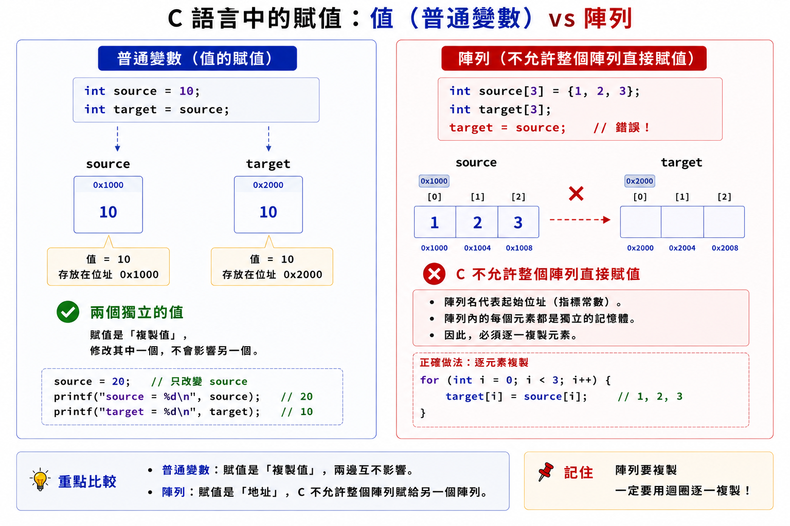
</p>
<!-- /AUTO-IMAGE: C_Lesson_19_img01_scalar_vs_array_assignment.png -->

### 3. 陣列複製要逐元素完成

```c
for (i = 0; i < length; i++) {
    target[i] = source[i];
}
```

每一次賦值都是普通 `int` 的複製。

---

### 4. 來源陣列與目標陣列長度必須足夠

若迴圈執行十次：

```c
for (i = 0; i < 10; i++)
```

來源與目標都必須至少具有十個合法元素。

---


<!-- AUTO-IMAGE: C_Lesson_19_img02_element_copy.png -->
<p align="center">
  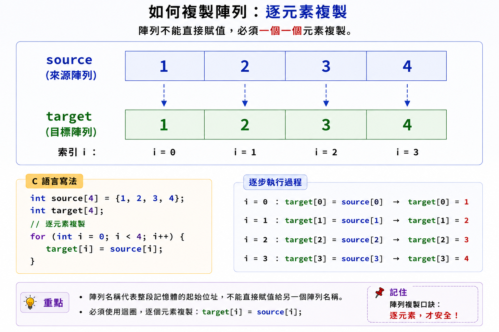
</p>
<!-- /AUTO-IMAGE: C_Lesson_19_img02_element_copy.png -->

### 5. 普通整數參數會取得一份數值副本

```c
void increase(int number) {
    number++;
}
```

函式中的 `number` 增加，不會改變呼叫端普通整數。

---


<!-- AUTO-IMAGE: C_Lesson_19_img03_independent_arrays.png -->
<p align="center">
  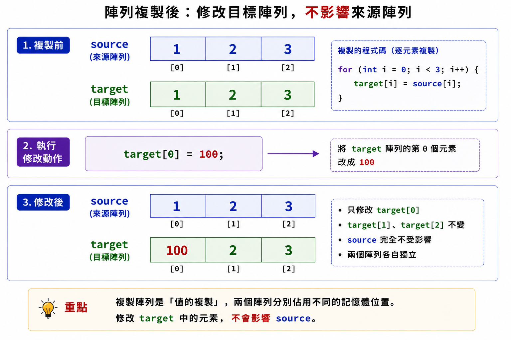
</p>
<!-- /AUTO-IMAGE: C_Lesson_19_img03_independent_arrays.png -->

### 6. 陣列參數的行為不同

```c
void increase_all(int values[3]) {
    int i;

    for (i = 0; i < 3; i++) {
        values[i]++;
    }
}
```

函式中的元素修改會反映到呼叫端陣列。

---

### 7. 函式不能直接回傳陣列

來源嘗試的概念：

```c
int[10] make_array(void);   /* 不合法 */
```

C 函式不能以陣列型態作為直接回傳型態。

來源採用的替代方法是：

> 呼叫端先建立陣列，再把陣列交給函式填入。

---

### 8. 固定長度參數中的數字不能用來自動求長度

```c
int max3(int values[3]);
int max5(int values[5]);
```

這些數字可以幫助讀者理解預期用途，但在函式參數位置，不會讓函式保有完整陣列大小資訊。

---

### 9. 任意長度函式需要另外取得元素數量

```c
int maxv(int values[], int length);
```

呼叫：

```c
maxv(a, 3);
maxv(b, 5);
```

---

### 10. 來源的最大值函式假設長度至少為 1

```c
int maximum = values[0];
```

如果：

```text
length == 0
```

就沒有合法的 `values[0]`。

因此來源函式的前提是：

```text
length >= 1
```

---

### 11. 傳入錯誤長度仍然可能造成越界

```c
int values[3] = {3, 9, 7};

maxv(values, 5);   /* 錯誤 */
```

函式會嘗試讀取不存在的 `values[3]` 與 `values[4]`。

---


<!-- AUTO-IMAGE: C_Lesson_19_img04_scalar_vs_array_parameter.png -->
<p align="center">
  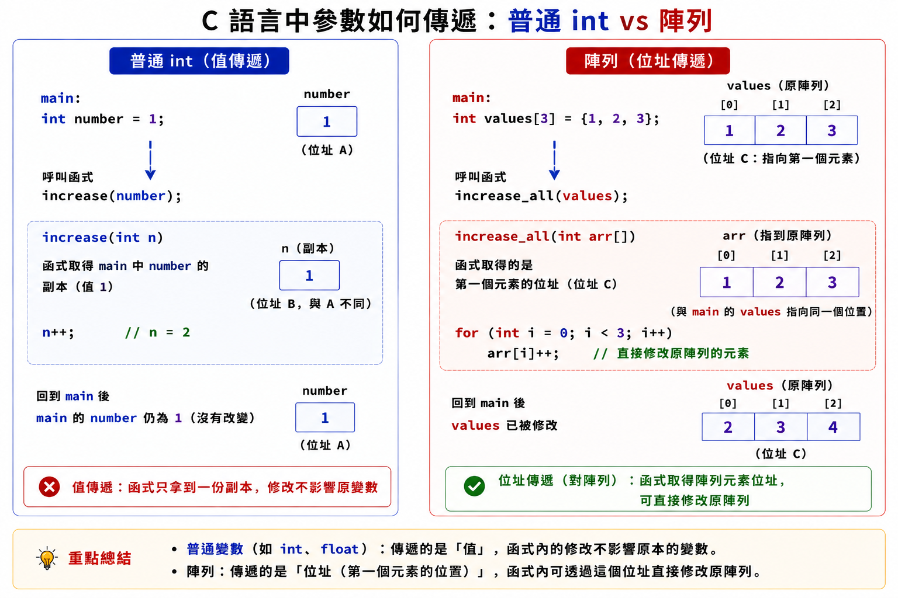
</p>
<!-- /AUTO-IMAGE: C_Lesson_19_img04_scalar_vs_array_parameter.png -->

### 12. 陣列索引必須具有整數型態

合法：

```c
values[0]
values[2]
values[3 / 2]
```

因為：

```text
3 / 2 使用整數除法，結果是 1
```

---

### 13. 浮點數索引會造成編譯錯誤

錯誤：

```c
values[0.5]
values[3 / 2.]
```

兩個運算式的結果都是浮點型態，不能作為陣列索引。

---

### 14. 索引是整數不代表位置一定合法

```c
int values[3] = {1, 2, 3};
```

合法：

```text
0、1、2
```

不合法但通常能通過語法分析：

```c
values[3]
values[4]
values[-1]
```

它們會造成未定義行為。

---

### 15. 「程式沒有立即當掉」不代表越界是安全的

越界可能造成：

- 看似合理的錯誤數值
- 每次執行結果不同
- 覆蓋其他變數
- 程式異常終止
- 在最佳化後出現完全不同的行為

不能依賴任何一種表現。

---

### 16. `sizeof` 回傳位元組數

```c
sizeof(int)
sizeof(values[0])
sizeof(values)
```

單位是位元組。

---

### 17. 不要假設 `int` 永遠等於 4 位元組

來源執行環境的範例顯示：

```text
sizeof(int) == 4
```

但資料型態大小屬於實作定義，應由 `sizeof` 實際查詢。

---

### 18. `sizeof` 結果使用 `%zu`

```c
printf("%zu\n", sizeof(int));
```

`sizeof` 的結果型態是：

```text
size_t
```

---

### 19. 陣列長度公式只在名稱代表完整陣列時成立

```c
size_t length =
    sizeof(values) / sizeof(values[0]);
```

在 `main()` 中，若 `values` 是真正宣告的陣列，公式成立。

---

### 20. 在函式參數中套用相同公式會得到錯誤長度

來源 64 位元環境的範例中：

```text
sizeof(v) == 8
sizeof(v[0]) == 4
```

結果：

```text
8 / 4 == 2
```

即使呼叫端傳入長度 `3` 或長度 `5` 的陣列，函式中仍得到 `2`。

原因是函式參數 `v` 不再代表完整陣列物件。

---

### 21. 函式參數寫 `[3]`、`[5]` 或 `[]`，仍無法保存原長度

```c
void inspect(int values[3]);
void inspect(int values[5]);
void inspect(int values[]);
```

在函式參數的位置，三者都以相同的位址資訊形式處理。

---

### 22. 保留值必須是不能出現在一般資料中的值

來源使用：

```text
-1
```

因此一般有效資料不能包含 `-1`。

---

### 23. 保留值本身通常不算有效資料元素

```c
int values[] = {1, 2, 3, -1};
```

有效資料長度：

```text
3
```

不是 `4`。

---

### 24. 來源的長度函式最後回傳 `i`

推導中曾出現：

```c
return i + 1;
```

後續投影片修正為：

```c
return i;
```

因為 `i` 停在保留值索引，而有效元素數量正好等於該索引。

---

### 25. 缺少保留值會持續越界搜尋

```c
while (values[i] != -1) {
    i++;
}
```

若陣列中沒有 `-1`，迴圈會離開合法範圍並產生未定義行為。

---

### 26. 保留值不是實際配置長度

```c
int values[20] = {3, 9, 7, -1};
```

- 配置容量：`20`
- 保留值前有效資料數量：`3`

兩者是不同概念。

---

### 27. 記憶體位址圖中的數字只是示意

來源以：

```text
20000、20004、20008
```

示範假設 `int` 占 4 位元組的排列。

實際位址由執行環境決定，可能每次執行都不同。

---


<!-- AUTO-IMAGE: C_Lesson_19_img08_sizeof_array_length.png -->
<p align="center">
  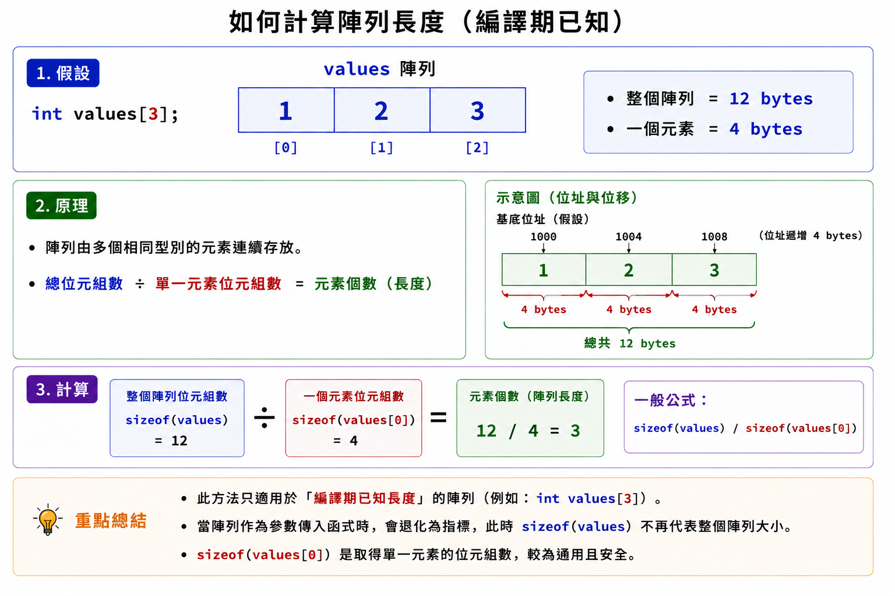
</p>
<!-- /AUTO-IMAGE: C_Lesson_19_img08_sizeof_array_length.png -->

### 28. 第 `i` 個元素位置取決於元素大小

概念公式：

```text
values[i] 的起始位址
= 第一個元素的起始位址
+ i × sizeof(int)
```

一般化：

```text
array[i] 的起始位址
= 第一個元素的起始位址
+ i × sizeof(array[0])
```

---

### 29. 陣列最後之後的位址可以計算，但不能當成元素讀取

長度為 `3`：

```text
values[0] values[1] values[2]
```

`values[3]` 所對應的是最後一個元素之後的位置，不是合法的第四個元素。

---

### 30. 陣列傳入函式時，來源圖示複製的是第一個元素位址

呼叫：

```c
maxv(a, 3);
```

函式參數取得：

```text
a[0] 的起始位址
```

而不是複製 `a[0]、a[1]、a[2]` 三個整數。

---

### 31. 函式使用同一個位址公式存取呼叫端元素

函式內的：

```c
values[i]
```

仍按照：

```text
第一個元素位址 + i × sizeof(int)
```

找到呼叫端陣列的實際元素。

---


<!-- AUTO-IMAGE: C_Lesson_19_img09_sizeof_array_vs_parameter.png -->
<p align="center">
  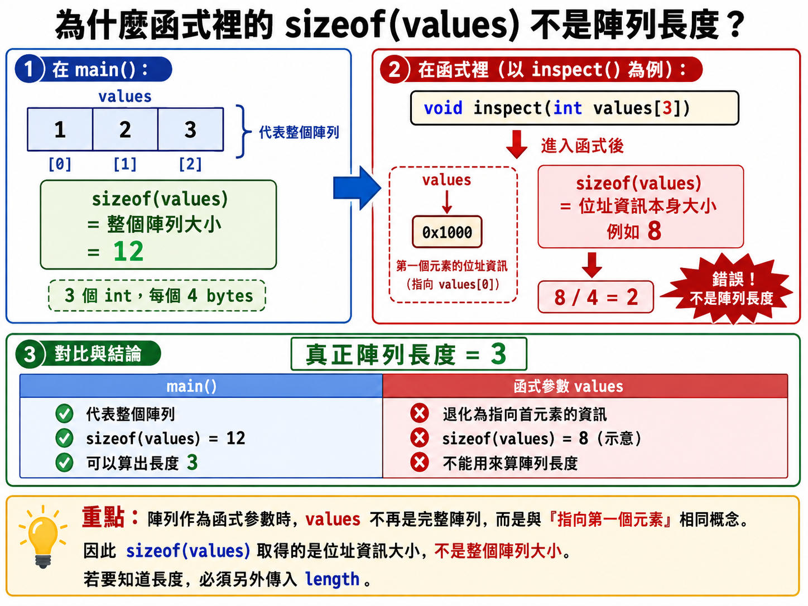
</p>
<!-- /AUTO-IMAGE: C_Lesson_19_img09_sizeof_array_vs_parameter.png -->

### 32. 指標是後續正式表示位址的語言工具

來源最後說明：

> C 語言導入指標來處理陣列複製與存取的行為。

本章先建立位址概念，正式指標語法會在後續章節學習。

---

## Section V. 核心概念說明

## Section V-A. 為什麼陣列不能直接複製？

### 1. 普通變數可以直接複製

```c
#include <stdio.h>

int main(void) {
    int source = 10;
    int target = source;

    target++;

    printf("source = %d\n", source);
    printf("target = %d\n", target);

    return 0;
}
```

輸出：

```text
source = 10
target = 11
```

`target` 取得的是一份獨立的整數值。

---

### 2. 陣列不能使用整體賦值

錯誤範例：

```c
int source[3] = {1, 2, 3};
int target[3];

target = source;   /* 編譯錯誤 */
```

C 的陣列物件不能作為整體賦值的左運算元。

---

### 3. 宣告時也不能直接使用另一個陣列名稱

錯誤：

```c
int source[3] = {1, 2, 3};
int target[3] = source;   /* 編譯錯誤 */
```

---

### 4. 正確方式：逐元素複製

```c
#include <stdio.h>

int main(void) {
    int i;
    int source[8] = {1, 2, 3, 4, 5, 6, 7, 8};
    int target[8];

    for (i = 0; i < 8; i++) {
        target[i] = source[i];
    }

    for (i = 0; i < 8; i++) {
        printf("%d ", target[i]);
    }

    printf("\n");

    return 0;
}
```

---

### 5. 複製後修改目標陣列

```c
#include <stdio.h>

int main(void) {
    int i;
    int source[3] = {1, 2, 3};
    int target[3];

    for (i = 0; i < 3; i++) {
        target[i] = source[i];
    }

    target[0] = 100;

    printf("source[0] = %d\n", source[0]);
    printf("target[0] = %d\n", target[0]);

    return 0;
}
```

輸出：

```text
source[0] = 1
target[0] = 100
```

逐元素複製後，兩個陣列具有各自獨立的元素。

---

## Section V-B. 將陣列輸出整理成函式

### 6. 原本的重複輸出

```c
for (i = 0; i < 10; i++) {
    printf("%d ", first[i]);
}

printf("\n");

for (i = 0; i < 10; i++) {
    printf("%d ", second[i]);
}

printf("\n");
```

兩段程式只有陣列名稱不同。

---

### 7. 固定長度輸出函式

```c
#include <stdio.h>

void array_print(int values[10]);

int main(void) {
    int first[10] = {
        1, 2, 3, 4, 5,
        6, 7, 8, 9, 10
    };
    int second[10] = {
        10, 9, 8, 7, 6,
        5, 4, 3, 2, 1
    };

    array_print(first);
    array_print(second);

    return 0;
}

void array_print(int values[10]) {
    int i;

    for (i = 0; i < 10; i++) {
        printf("%d ", values[i]);
    }

    printf("\n");
}
```

---

### 8. 參數名稱不必和呼叫端相同

呼叫端：

```c
array_print(first);
```

函式中：

```c
void array_print(int values[10])
```

`first` 與 `values` 是不同名稱，但函式可以使用 `values[i]` 存取 `first[i]`。

---

## Section V-C. 由函式修改陣列

### 9. 普通整數不會被修改

```c
#include <stdio.h>

void increase(int number);

int main(void) {
    int number = 1;

    increase(number);
    printf("number = %d\n", number);

    return 0;
}

void increase(int number) {
    number++;
    printf("inside = %d\n", number);
}
```

輸出：

```text
inside = 2
number = 1
```

---

### 10. 陣列元素會被修改

```c
#include <stdio.h>

void increase_all(int values[3]);

int main(void) {
    int i;
    int values[3] = {1, 2, 3};

    increase_all(values);

    for (i = 0; i < 3; i++) {
        printf("values[%d] = %d\n", i, values[i]);
    }

    return 0;
}

void increase_all(int values[3]) {
    int i;

    for (i = 0; i < 3; i++) {
        values[i]++;
    }
}
```

輸出：

```text
values[0] = 2
values[1] = 3
values[2] = 4
```

---

### 11. 為什麼行為不同？

普通整數參數：

```text
複製整數值
```

陣列參數：

```text
函式取得第一個元素的位置資訊
```

因此函式內的 `values[i]` 會找到呼叫端的實際元素。

---

## Section V-D. 由函式填入陣列

### 12. 函式不能回傳整個陣列

來源曾嘗試將：

```text
產生十個亂數並回傳陣列
```

整理成函式。

但直接回傳陣列型態不是合法 C 語法。

---

### 13. 改成讓呼叫端先建立陣列

```c
#include <stdio.h>
#include <stdlib.h>
#include <time.h>

void array_randomize(int values[10]);
void array_print(int values[10]);
int array_max(int values[10]);

int main(void) {
    int values[10];

    srand((unsigned)time(NULL));

    array_randomize(values);
    array_print(values);
    printf("Max: %d\n", array_max(values));

    return 0;
}

void array_randomize(int values[10]) {
    int i;

    for (i = 0; i < 10; i++) {
        values[i] = rand() % 100;
    }
}

void array_print(int values[10]) {
    int i;

    for (i = 0; i < 10; i++) {
        printf("%d ", values[i]);
    }

    printf("\n");
}

int array_max(int values[10]) {
    int i;
    int maximum = values[0];

    for (i = 1; i < 10; i++) {
        if (values[i] > maximum) {
            maximum = values[i];
        }
    }

    return maximum;
}
```

這個程式將三種工作分成：

- 填入資料
- 輸出資料
- 計算最大值

---

## Section V-E. 從 `max3()` 到任意長度 `maxv()`

### 14. 三個獨立參數版本

```c
#include <stdio.h>

int max3(int a, int b, int c);

int main(void) {
    printf("Max: %d\n", max3(3, 9, 7));

    return 0;
}

int max3(int a, int b, int c) {
    int maximum = a;

    if (b > maximum) {
        maximum = b;
    }

    if (c > maximum) {
        maximum = c;
    }

    return maximum;
}
```

---

### 15. 長度為 3 的陣列版本

```c
#include <stdio.h>

int max3(int values[3]);

int main(void) {
    int values[3] = {3, 9, 7};

    printf("Max: %d\n", max3(values));

    return 0;
}

int max3(int values[3]) {
    int i;
    int maximum = values[0];

    for (i = 1; i < 3; i++) {
        if (values[i] > maximum) {
            maximum = values[i];
        }
    }

    return maximum;
}
```

---

### 16. 為長度 5 再寫一個函式的問題

```c
int max3(int values[3]);
int max5(int values[5]);
```

兩個函式只有：

```text
3 與 5
```

不同。

---

### 17. 將長度改成參數

```c
#include <stdio.h>

int maxv(int values[], int length);

int main(void) {
    int first[3] = {3, 9, 7};
    int second[5] = {3, 9, 1, 2, 7};

    printf("Max: %d\n", maxv(first, 3));
    printf("Max: %d\n", maxv(second, 5));

    return 0;
}

int maxv(int values[], int length) {
    int i;
    int maximum = values[0];

    for (i = 1; i < length; i++) {
        if (values[i] > maximum) {
            maximum = values[i];
        }
    }

    return maximum;
}
```

---

### 18. `length` 的責任

```c
for (i = 1; i < length; i++)
```

`length` 決定：

- 最後要檢查到哪個元素
- 哪些索引被視為合法
- 函式何時停止

---

### 19. 對空長度加入保護的延伸版本

來源函式假設 `length >= 1`。

若介面需要處理錯誤輸入，可以另外設計狀態回傳；本章先使用簡單版本：

```c
int maxv_checked(
    int values[],
    int length,
    int *result
);
```

這會正式用到指標，因此留待後續章節。

目前應遵守：

```text
呼叫 maxv() 時，length 必須至少為 1。
```

---

## Section V-F. 陣列索引與越界

### 20. 合法整數索引

```c
#include <stdio.h>

int main(void) {
    int values[3] = {1, 2, 3};

    printf("%d\n", values[0]);
    printf("%d\n", values[2]);
    printf("%d\n", values[3 / 2]);

    return 0;
}
```

輸出：

```text
1
3
2
```

因為：

```text
3 / 2 == 1
```

---

### 21. 浮點索引是編譯錯誤

```c
values[0.5]
values[3 / 2.]
```

中括號內運算式不是整數型態。

---

### 22. 整數越界不一定是編譯錯誤

```c
values[3]
values[4]
values[-1]
```

這些語法可能通過編譯，但沒有合法元素與它們對應。

---

### 23. 用迴圈避免越界

長度為 `3`：

```c
for (i = 0; i < 3; i++) {
    printf("%d\n", values[i]);
}
```

不要寫：

```c
i <= 3
```

因為最後一次會存取 `values[3]`。

---

### 24. 陣列函式中的錯誤長度

```c
int values[3] = {3, 9, 7};

maxv(values, 5);
```

即使 `maxv()` 本身的迴圈寫法正確，錯誤的參數仍會讓它越界。

---


<!-- AUTO-IMAGE: C_Lesson_19_img07_array_bounds.png -->
<p align="center">
  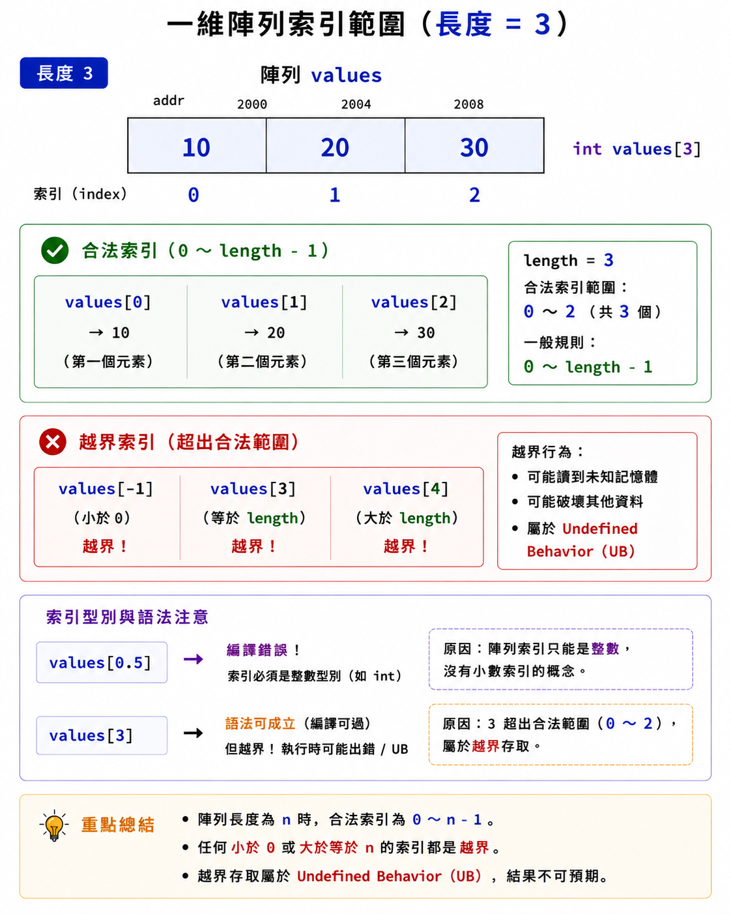
</p>
<!-- /AUTO-IMAGE: C_Lesson_19_img07_array_bounds.png -->

## Section V-G. 使用 `sizeof` 計算陣列長度

### 25. 查詢型態大小

```c
#include <stdio.h>

int main(void) {
    printf("sizeof(int) = %zu\n", sizeof(int));
    printf("sizeof(long int) = %zu\n",
           sizeof(long int));
    printf("sizeof(3) = %zu\n", sizeof(3));

    return 0;
}
```

---

### 26. 查詢元素與整個陣列大小

```c
#include <stdio.h>

int main(void) {
    int values[3] = {1, 2, 3};

    printf("sizeof(int) = %zu\n",
           sizeof(int));
    printf("sizeof(values[0]) = %zu\n",
           sizeof(values[0]));
    printf("sizeof(values) = %zu\n",
           sizeof(values));

    return 0;
}
```

在來源示範環境中：

```text
sizeof(int)       = 4
sizeof(values[0]) = 4
sizeof(values)    = 12
```

---

### 27. 陣列長度公式

```c
#include <stdio.h>

int main(void) {
    int values[3] = {1, 2, 3};
    size_t length =
        sizeof(values) / sizeof(values[0]);

    printf("Length: %zu\n", length);

    return 0;
}
```

輸出：

```text
Length: 3
```

---

### 28. 為什麼使用第一個元素大小？

陣列所有元素型態相同，因此：

```c
sizeof(values[0])
```

就是每個元素所占空間。

---

### 29. 不建議手動除以固定數字

不應寫：

```c
sizeof(values) / 4
```

因為 `int` 不保證在所有環境都是 4 位元組。

應寫：

```c
sizeof(values) / sizeof(values[0])
```

---

## Section V-H. 為什麼函式內不能用相同方法？

### 30. 來源的觀察程式

概念上：

```c
void inspect(int values[3]) {
    printf("%zu\n", sizeof(values));
}
```

編譯器會將函式參數中的陣列寫法調整成位址參數。

因此 `sizeof(values)` 得到的是位址資訊本身的大小，而不是呼叫端陣列的總大小。

---

### 31. 來源 64 位元環境的結果

傳入：

```c
int values[3] = {1, 2, 3};
```

函式中可能得到：

```text
sizeof(values)    = 8
sizeof(values[0]) = 4
8 / 4             = 2
```

這個 `2` 不是陣列長度。

---

### 32. 將參數寫成 `[5]` 也不會改變結果

```c
void inspect(int values[5]);
```

來源仍得到：

```text
sizeof(values) == 8
```

函式參數中的 `5` 不會配置五個元素副本。

---

### 33. 將參數寫成 `[]` 更能表達實際需求

```c
int maxv(int values[], int length);
```

這提醒讀者：

> 函式必須另外取得長度，不能從參數陣列自動推回原大小。

---

## Section V-I. 用保留值標記有效長度

### 34. 在最後加入 `-1`

```c
int values[] = {1, 2, 3, -1};
```

`-1` 不作為一般資料，而是結束記號。

---

### 35. 長度函式

```c
#include <stdio.h>

int array_length(int values[]);

int main(void) {
    int first[] = {1, 2, 3, -1};
    int second[] = {1, 2, 3, 4, 5, -1};

    printf("%d\n", array_length(first));
    printf("%d\n", array_length(second));

    return 0;
}

int array_length(int values[]) {
    int i = 0;

    while (values[i] != -1) {
        i++;
    }

    return i;
}
```

輸出：

```text
3
5
```

---


<!-- AUTO-IMAGE: C_Lesson_19_img10_sentinel_length.png -->
<p align="center">
  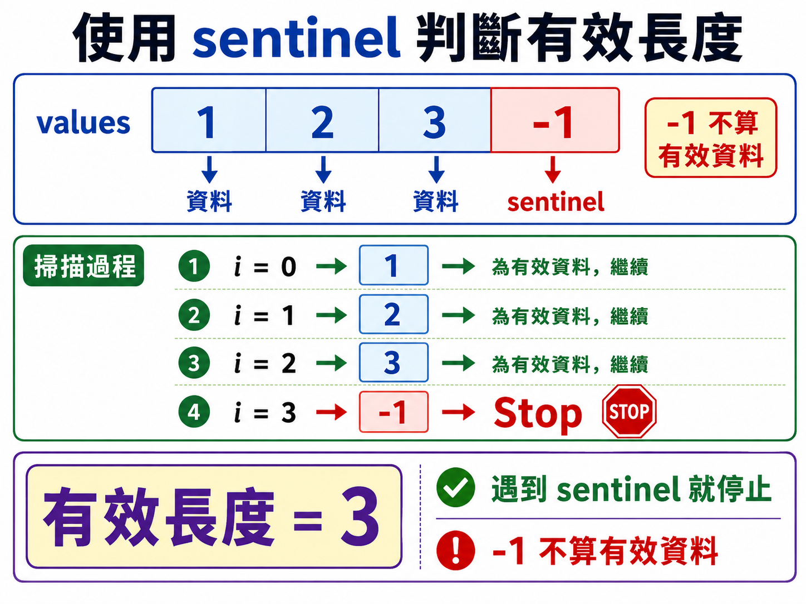
</p>
<!-- /AUTO-IMAGE: C_Lesson_19_img10_sentinel_length.png -->

### 36. 保留值最大值函式

```c
#include <stdio.h>

int maxv_sentinel(int values[]);

int main(void) {
    int first[] = {3, 9, 7, -1};
    int second[] = {3, 2, 1, 9, 7, -1};

    printf("Max: %d\n", maxv_sentinel(first));
    printf("Max: %d\n", maxv_sentinel(second));

    return 0;
}

int maxv_sentinel(int values[]) {
    int i = 1;
    int maximum = values[0];

    while (values[i] != -1) {
        if (values[i] > maximum) {
            maximum = values[i];
        }

        i++;
    }

    return maximum;
}
```

---

### 37. 保留值版本的前提

這個版本假設：

1. 至少有一個有效元素。
2. 有效資料不會包含 `-1`。
3. 陣列末端一定存在 `-1`。
4. `-1` 之前的所有元素都可以安全存取。

---

### 38. 保留值與長度參數比較

| 方法 | 優點 | 限制 |
| --- | --- | --- |
| 傳入 `length` | 所有整數都可作為資料 | 呼叫端必須提供正確長度 |
| 使用 `-1` | 函式不需另收長度 | `-1` 不能作為一般資料，且必須保證存在 |

---


<!-- AUTO-IMAGE: C_Lesson_19_img12_length_vs_sentinel.png -->
<p align="center">
  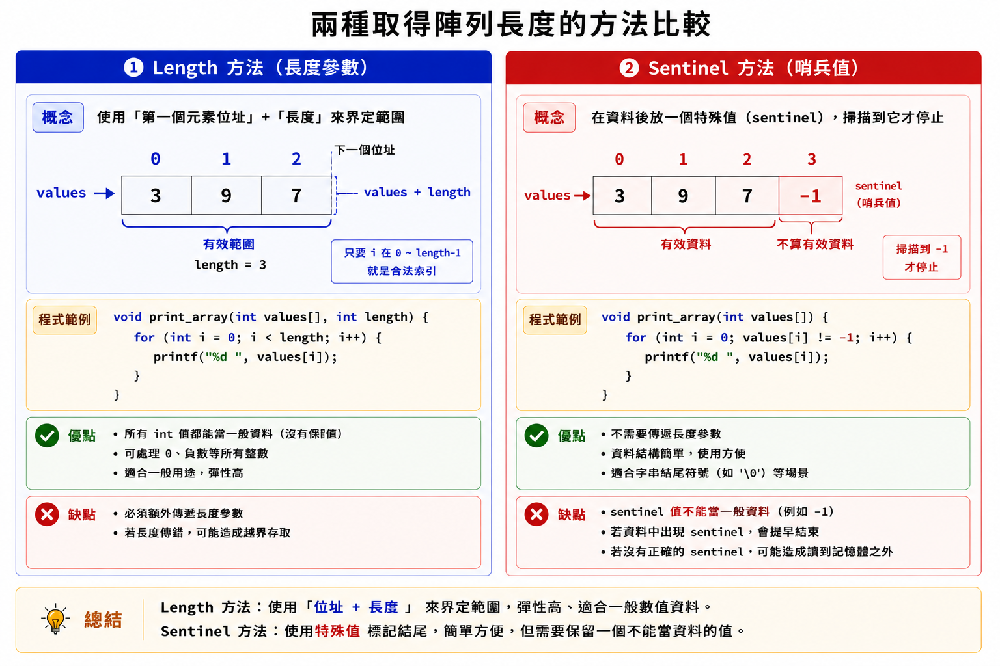
</p>
<!-- /AUTO-IMAGE: C_Lesson_19_img12_length_vs_sentinel.png -->

## Section V-J. 陣列元素的記憶體位置

### 39. 連續配置

```c
int values[3] = {1, 2, 3};
```

若只作示意，假設：

```text
values[0] 位址：20000
sizeof(int)：4
```

則：

```text
values[1] 位址：20004
values[2] 位址：20008
```

---

### 40. 位址公式

```text
values[i] 的起始位址
= values[0] 的起始位址
+ i × sizeof(int)
```

例如：

```text
values[2]
= 20000 + 2 × 4
= 20008
```

---


<!-- AUTO-IMAGE: C_Lesson_19_img11_contiguous_memory.png -->
<p align="center">
  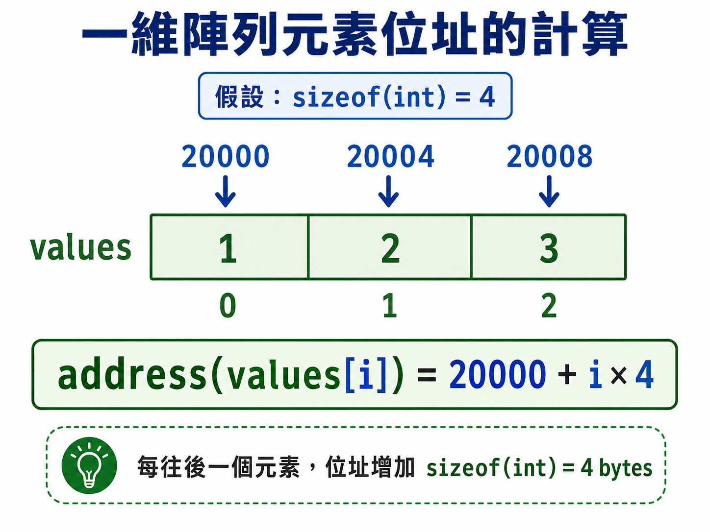
</p>
<!-- /AUTO-IMAGE: C_Lesson_19_img11_contiguous_memory.png -->

### 41. 一般化公式

```text
array[i] 的起始位址
= 第一個元素的起始位址
+ i × sizeof(array[0])
```

陣列元素型態不同時，偏移大小也會不同。

---

### 42. `values[3]` 的位置

依公式：

```text
20000 + 3 × 4 = 20012
```

這是陣列最後之後的位置。

它有可計算的位置，但不是合法的 `int` 元素。

---

## Section V-K. 函式間傳遞陣列的原理

### 43. 兩個不同陣列

```c
int first[3] = {3, 9, 7};
int second[5] = {3, 9, 1, 2, 7};
```

示意位址：

```text
first[0]  → 20000
second[0] → 20012
```

---

### 44. 呼叫第一個陣列

```c
maxv(first, 3);
```

函式取得：

```text
第一個元素位址 20000
長度 3
```

---


<!-- AUTO-IMAGE: C_Lesson_19_img05_array_function_address.png -->
<p align="center">
  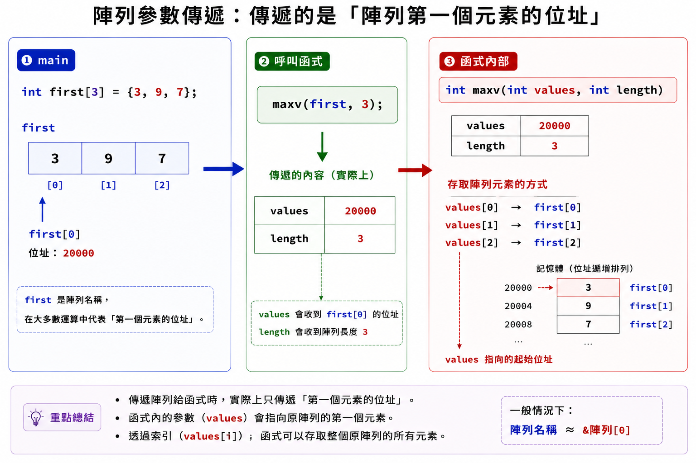
</p>
<!-- /AUTO-IMAGE: C_Lesson_19_img05_array_function_address.png -->

### 45. 函式存取 `values[i]`

函式內：

```c
values[i]
```

使用：

```text
20000 + i × sizeof(int)
```

因此會依序找到：

```text
first[0]
first[1]
first[2]
```

---

### 46. 呼叫第二個陣列

```c
maxv(second, 5);
```

函式這次取得：

```text
第一個元素位址 20012
長度 5
```

同一份函式程式碼便會找到 `second` 的五個元素。

---

### 47. 為什麼修改會作用到原陣列？

因為函式不是修改一份元素副本。

函式依位址直接找到呼叫端的元素位置。

---

### 48. 為什麼函式仍需要 `length`？

第一個元素位址只能告訴函式：

```text
元素從哪裡開始
```

它不能單獨告訴函式：

```text
後面有幾個合法元素
```

因此需要：

- 額外長度
- 保留值
- 或其他能表示範圍的設計

---


<!-- AUTO-IMAGE: C_Lesson_19_img06_address_needs_length.png -->
<p align="center">
  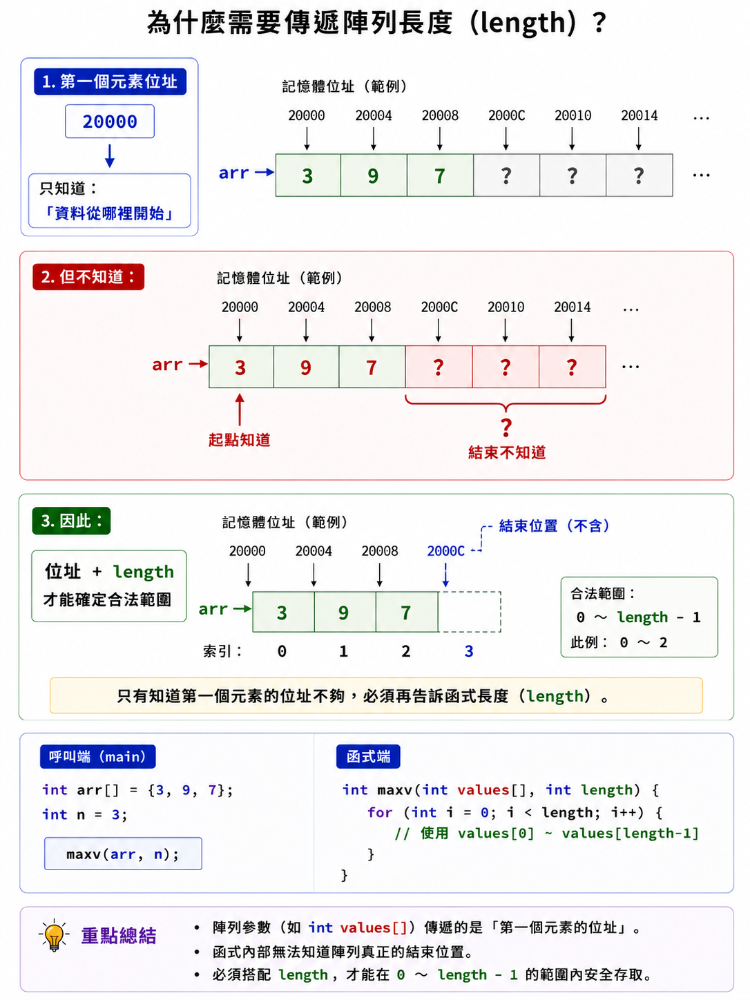
</p>
<!-- /AUTO-IMAGE: C_Lesson_19_img06_address_needs_length.png -->

## Section V-L. 容易搞混的重點

### 49. 陣列名稱不是陣列內容的整體可賦值值

```c
target = source;
```

不會自動逐元素複製。

---

### 50. 函式參數中的 `[10]` 不代表建立十個元素副本

```c
void array_print(int values[10]);
```

它表達函式預期以陣列方式使用參數，但不複製十個元素。

---

### 51. 函式能修改陣列，不代表 C 使用一般的「參考傳遞」

來源以「陣列不會複製」說明初學者可觀察到的效果。

更精確地說：

> 傳入的是第一個元素的位址值，位址值本身仍然是以值傳遞。

正式語法會在指標章節說明。

---

### 52. 陣列參數的數字不會接受執行期檢查

```c
void f(int values[3]);
```

呼叫端仍可能傳入不同大小的陣列。

編譯器不會根據 `[3]` 自動阻止所有不相符呼叫。

---

### 53. `sizeof` 不是函式

它是運算子。

寫法通常是：

```c
sizeof(values)
sizeof(int)
```

---

### 54. `sizeof(values)` 是否得到陣列大小，取決於目前的 `values`

在陣列宣告作用域：

```text
完整陣列
```

在函式陣列參數中：

```text
位址參數
```

名稱相同，語意不同。

---

### 55. 保留值不是萬用長度解法

當所有 `int` 都可能是合法資料時，就找不到可安全保留的整數值。

這時應使用長度參數或其他資料結構。

---

### 56. 一個位址無法推回完整陣列長度

只知道第一個元素在哪裡，不代表知道配置結束在哪裡。

---

## Section VI. 快速概念檢查

### Q1. 為什麼 `target = source;` 不能複製陣列？

<details>
<summary>查看答案</summary>

C 不允許在陣列宣告完成後，使用賦值運算子對整個陣列物件賦值。

</details>

---

### Q2. 正確複製陣列元素的基本寫法是什麼？

<details>
<summary>查看答案</summary>

```c
for (i = 0; i < length; i++) {
    target[i] = source[i];
}
```

</details>

---

### Q3. 普通整數傳入函式後在函式中增加，會改變原變數嗎？

<details>
<summary>查看答案</summary>

不會。函式參數取得普通整數值的副本。

</details>

---

### Q4. 為什麼函式內修改陣列元素會影響呼叫端？

<details>
<summary>查看答案</summary>

函式取得第一個元素的位址資訊，並依該位址找到呼叫端的實際元素。

</details>

---

### Q5. C 函式可以直接回傳 `int[10]` 嗎？

<details>
<summary>查看答案</summary>

不可以。函式不能直接以陣列型態作為回傳型態。

</details>

---

### Q6. 任意長度最大值函式為什麼需要 `length`？

<details>
<summary>查看答案</summary>

陣列參數本身不包含可供函式查詢的原始陣列長度。

</details>

---

### Q7. 長度為 `3` 的陣列有哪些合法索引？

<details>
<summary>查看答案</summary>

```text
0、1、2
```

</details>

---

### Q8. `values[3 / 2]` 會存取哪個元素？

<details>
<summary>查看答案</summary>

`3 / 2` 是整數除法，結果為 `1`，所以存取：

```c
values[1]
```

</details>

---

### Q9. `values[0.5]` 是越界還是編譯錯誤？

<details>
<summary>查看答案</summary>

是編譯錯誤，因為索引不是整數型態。

</details>

---

### Q10. `values[3]` 對長度 `3` 的陣列是什麼問題？

<details>
<summary>查看答案</summary>

陣列越界，存取會造成未定義行為。

</details>

---

### Q11. `sizeof` 的結果使用哪個輸出格式？

<details>
<summary>查看答案</summary>

```text
%zu
```

</details>

---

### Q12. 陣列長度公式是什麼？

<details>
<summary>查看答案</summary>

```c
sizeof(values) / sizeof(values[0])
```

但只能在 `values` 仍代表完整陣列的作用域中使用。

</details>

---

### Q13. 為什麼函式中的相同公式可能得到 `2`？

<details>
<summary>查看答案</summary>

函式陣列參數實際以位址資訊處理；在來源 64 位元環境中，位址大小為 `8`，`int` 大小為 `4`，所以錯誤公式得到 `8 / 4 == 2`。

</details>

---

### Q14. `{1, 2, 3, -1}` 的有效資料長度是多少？

<details>
<summary>查看答案</summary>

```text
3
```

`-1` 是結束記號，不算一般資料。

</details>

---

### Q15. 保留值法最大的限制是什麼？

<details>
<summary>查看答案</summary>

保留值不能同時作為一般合法資料，而且陣列必須確實包含該保留值。

</details>

---

### Q16. 假設第一個元素位址為 `20000`、`sizeof(int) == 4`，`values[2]` 位址是多少？

<details>
<summary>查看答案</summary>

```text
20000 + 2 × 4 = 20008
```

</details>

---

### Q17. 傳入陣列時，函式取得完整元素副本嗎？

<details>
<summary>查看答案</summary>

不是。來源圖示說明函式取得的是第一個元素位址資訊。

</details>

---

## Section VII. 程式閱讀練習

### 題目 1：複製後是否互相影響？

```c
int source[3] = {1, 2, 3};
int target[3];
int i;

for (i = 0; i < 3; i++) {
    target[i] = source[i];
}

target[1] = 99;
```

<details>
<summary>查看答案</summary>

```text
source[1] 仍為 2
target[1] 變成 99
```

兩個陣列具有獨立元素。

</details>

---

### 題目 2：普通參數

```c
void change(int value) {
    value = 100;
}
```

呼叫端：

```c
int number = 1;
change(number);
```

<details>
<summary>查看答案</summary>

`number` 仍為 `1`。

</details>

---

### 題目 3：陣列參數

```c
void change(int values[3]) {
    values[0] = 100;
}
```

呼叫端：

```c
int numbers[3] = {1, 2, 3};
change(numbers);
```

<details>
<summary>查看答案</summary>

```text
numbers[0] == 100
```

</details>

---

### 題目 4：最大值

```c
int values[5] = {3, 9, 1, 2, 7};

printf("%d\n", maxv(values, 5));
```

<details>
<summary>查看答案</summary>

```text
9
```

</details>

---

### 題目 5：錯誤長度

```c
int values[3] = {3, 9, 7};

maxv(values, 2);
```

<details>
<summary>查看答案</summary>

函式只檢查前兩個元素，因此結果仍可能是 `9`，但第三個元素完全被忽略。

</details>

---

### 題目 6：更大的錯誤長度

```c
int values[3] = {3, 9, 7};

maxv(values, 4);
```

<details>
<summary>查看答案</summary>

函式會嘗試讀取 `values[3]`，造成未定義行為。

</details>

---

### 題目 7：索引型態

```c
int values[3] = {10, 20, 30};

printf("%d\n", values[5 / 2]);
```

<details>
<summary>查看答案</summary>

```text
5 / 2 == 2
```

所以輸出：

```text
30
```

</details>

---

### 題目 8：長度公式

```c
double values[6];

size_t length =
    sizeof(values) / sizeof(values[0]);
```

<details>
<summary>查看答案</summary>

```text
6
```

公式不需要知道 `double` 的固定大小。

</details>

---

### 題目 9：保留值長度

```c
int values[] = {4, 8, 15, 16, 23, 42, -1};
```

<details>
<summary>查看答案</summary>

有效資料長度：

```text
6
```

</details>

---

### 題目 10：位址計算

假設：

```text
第一個元素位址 = 1000
sizeof(int) = 4
i = 5
```

<details>
<summary>查看答案</summary>

```text
1000 + 5 × 4 = 1020
```

</details>

---

## Section VIII. 實作練習 / 實作檢測題

### TODO 1：複製五個整數

建立來源與目標陣列，使用迴圈完成複製並輸出兩者。

---

### TODO 2：驗證獨立性

完成 TODO 1 後修改目標陣列其中一格，證明來源陣列沒有改變。

---

### TODO 3：`array_copy()`

撰寫：

```c
void array_copy(
    int target[],
    int source[],
    int length
);
```

使用長度控制逐元素複製。

---

### TODO 4：固定長度輸出函式

撰寫：

```c
void print10(int values[10]);
```

輸出十個元素。

---

### TODO 5：任意長度輸出函式

修改成：

```c
void array_print(int values[], int length);
```

測試長度 `3` 與 `5`。

---

### TODO 6：任意長度最大值

依來源撰寫：

```c
int maxv(int values[], int length);
```

測試正數與負數陣列。

---

### TODO 7：任意長度最小值

將最大值函式修改成：

```c
int minv(int values[], int length);
```

---

### TODO 8：函式內修改全部元素

撰寫：

```c
void add_one(int values[], int length);
```

讓每個元素增加 `1`。

---

### TODO 9：陣列長度巨集前的手動公式

在 `main()` 中建立三種不同型態陣列，分別使用：

```c
sizeof(array) / sizeof(array[0])
```

計算長度。

---

### TODO 10：比較 `sizeof`

在陣列宣告作用域輸出：

```c
sizeof(values)
sizeof(values[0])
```

再觀察函式參數中的差異。

注意：編譯器可能對函式參數中的 `sizeof` 發出警告，這正是本題要觀察的問題。

---

### TODO 11：保留值長度

撰寫：

```c
int array_length(int values[]);
```

使用 `-1` 作為結束記號。

---

### TODO 12：保留值總和

撰寫：

```c
int array_sum_sentinel(int values[]);
```

累加到 `-1` 前停止。

---

### TODO 13：保留值最大值

完成來源的：

```c
int maxv_sentinel(int values[]);
```

明確寫出使用前提。

---

### TODO 14：錯誤長度測試分析

不要故意執行危險程式。

在紙上分析：

```c
int values[3] = {1, 2, 3};

maxv(values, 0);
maxv(values, 2);
maxv(values, 4);
```

各自會有什麼問題。

---

### TODO 15：位址公式練習

假設：

```text
第一個元素位址 = 5000
sizeof(short) = 2
```

計算索引 `0–5` 的元素起始位址。

---

## Section IX. 做題時可以使用的提示

### 1. 陣列複製先畫兩排格子

```text
source: [ ][ ][ ]
target: [ ][ ][ ]
```

每次執行：

```c
target[i] = source[i];
```

就畫一支箭頭。

---

### 2. 函式處理陣列時先寫介面契約

例如：

```text
values：至少有 length 個合法元素
length：至少為 1
函式是否修改 values：否
```

---

### 3. 發現越界時先找最後合法索引

```text
最後合法索引 = length - 1
```

---

### 4. `sizeof` 長度公式要問目前名稱代表什麼

```text
完整陣列？
還是函式中的位址參數？
```

---

### 5. 保留值法先確認資料範圍

若資料允許任意負數，就不應任意保留 `-1`。

---

### 6. 位址公式不要直接背示意位址

只需要記住：

```text
起點 + 索引 × 元素大小
```

---

### 7. 建議測試資料

陣列複製：

```text
1 2 3
全部相同值
包含負數
```

最大值：

```text
3 9 7
-3 -9 -1
只有一個元素
```

保留值：

```text
1 2 3 -1
5 -1
缺少 -1（只分析，不執行）
```

---

## Section X. 課後小練習

### 練習 1：反向複製

將來源陣列反向複製到目標陣列：

```text
1 2 3 4 5
→
5 4 3 2 1
```

---

### 練習 2：只複製前 N 個元素

撰寫函式，將來源前 `N` 個元素複製到目標。

呼叫端必須保證目標容量足夠。

---

### 練習 3：比較兩個陣列

撰寫：

```c
int arrays_equal(
    int first[],
    int second[],
    int length
);
```

相同回傳 `1`，不同回傳 `0`。

---

### 練習 4：在函式中交換元素

撰寫：

```c
void swap_elements(
    int values[],
    int first_index,
    int second_index
);
```

呼叫前先檢查索引合法。

---

### 練習 5：循環左移一格

```text
1 2 3 4 5
→
2 3 4 5 1
```

這會連接下一份來源教材的陣列循環移位練習。

---

### 練習 6：保留值輸出

輸出 `-1` 之前所有元素，但不要輸出 `-1`。

---

### 練習 7：容量與有效長度

建立容量 `10` 的陣列，只放入四筆資料並加上 `-1`。

分別說明：

```text
容量
有效資料長度
實際初始化元素數量
```

---

### 練習 8：一個函式處理兩個不同大小陣列

使用同一個 `array_sum()`，分別計算長度 `3` 與長度 `7` 的陣列總和。

---

## Section XI. 重點複習

1. 普通變數可以使用 `=` 複製值。
2. C 陣列不能在宣告完成後使用整體賦值。
3. `target = source` 不能逐元素複製陣列。
4. 陣列複製要使用迴圈逐元素完成。
5. 複製後來源與目標陣列彼此獨立。
6. 重複的陣列處理程式可以整理成函式。
7. 函式可以使用陣列參數逐一讀取元素。
8. 普通整數參數取得數值副本。
9. 陣列參數不會複製一整份元素內容。
10. 函式修改陣列元素會影響呼叫端陣列。
11. C 函式不能直接回傳陣列型態。
12. 可以讓呼叫端先建立陣列，再交給函式填入。
13. 固定長度函式只能直接處理預定元素數量。
14. 任意長度函式要另外傳入長度。
15. `maxv(values, length)` 假設 `length >= 1`。
16. 錯誤長度會造成漏讀或越界。
17. 陣列索引必須具有整數型態。
18. 整數除法結果可以作為索引。
19. 浮點索引會造成編譯錯誤。
20. 整數索引超出範圍會造成未定義行為。
21. 陣列合法索引為 `0` 到 `length - 1`。
22. `sizeof` 求值或型態所占記憶體大小。
23. `sizeof` 結果型態為 `size_t`。
24. 輸出 `size_t` 使用 `%zu`。
25. 型態大小可能依實作而不同。
26. 完整陣列大小可使用 `sizeof(array)`。
27. 元素大小可使用 `sizeof(array[0])`。
28. 陣列長度公式為兩者相除。
29. 長度公式不能在函式陣列參數中取得原長度。
30. 函式參數中的 `[3]`、`[5]` 與 `[]` 都不保留完整陣列大小。
31. 保留值可以標記有效資料結束位置。
32. 來源使用 `-1` 作為整數保留值。
33. 保留值本身不計入有效資料長度。
34. 來源長度函式最後應回傳 `i`，不是 `i + 1`。
35. 保留值不能同時作為一般合法資料。
36. 缺少保留值會造成越界。
37. 陣列元素依序配置於連續記憶體。
38. 元素位址由起點、索引與元素大小決定。
39. 最後元素之後的位置不是合法元素。
40. 傳入陣列時，函式取得第一個元素位址資訊。
41. 函式依相同位址公式找到呼叫端元素。
42. 第一個元素位址本身不能表示陣列長度。
43. 指標是後續正式處理位址的工具。
44. 下一章會將相同概念應用到字元陣列與字串。

---

## Section XII. 常見錯誤提醒

### 錯誤 1：直接對陣列使用整體賦值

```c
target = source;
```

---

### 錯誤 2：用另一個陣列名稱初始化陣列

```c
int target[5] = source;
```

---

### 錯誤 3：複製迴圈超過目標容量

```c
for (i = 0; i < 10; i++)
```

但目標只有五個元素。

---

### 錯誤 4：以為陣列參數會建立完整副本

函式內修改元素會作用到呼叫端。

---

### 錯誤 5：嘗試回傳陣列型態

C 函式不能直接回傳陣列。

---

### 錯誤 6：固定長度函式與實際長度不一致

```c
max3(five_element_array);
```

函式只會檢查前三個元素。

---

### 錯誤 7：任意長度函式沒有傳入長度

函式無法只由第一個元素位置知道合法範圍。

---

### 錯誤 8：傳入比實際容量更大的長度

會造成陣列越界。

---

### 錯誤 9：使用浮點數作為索引

```c
values[0.5]
```

---

### 錯誤 10：迴圈條件使用 `<= length`

最後一次會存取 `values[length]`。

---

### 錯誤 11：依賴越界後看見的數值

越界屬於未定義行為。

---

### 錯誤 12：輸出 `sizeof` 時使用 `%d`

`sizeof` 結果是 `size_t`，應使用 `%zu`。

---

### 錯誤 13：假設 `sizeof(int)` 永遠是 `4`

應由執行環境實際查詢。

---

### 錯誤 14：在函式參數中使用陣列長度公式

```c
sizeof(values) / sizeof(values[0])
```

得到的是位址大小與元素大小的比例，不是原陣列長度。

---

### 錯誤 15：以為參數中的 `[100]` 會自動檢查容量

它不會讓函式知道呼叫端實際長度。

---

### 錯誤 16：保留值與合法資料衝突

若 `-1` 是有效資料，就不能同時用來表示結束。

---

### 錯誤 17：長度函式把保留值算進去

來源最後修正為：

```c
return i;
```

---

### 錯誤 18：陣列中沒有放入保留值

搜尋會離開合法元素範圍。

---

### 錯誤 19：把示意位址當成每次都固定

實際位址可能因執行環境而改變。

---

### 錯誤 20：計算位址時忘記乘元素大小

```text
起始位址 + i
```

不是一般正確公式。

應為：

```text
起始位址 + i × sizeof(元素型態)
```

---

## Section XIII. Mermaid 流程圖

### 1. 陣列逐元素複製

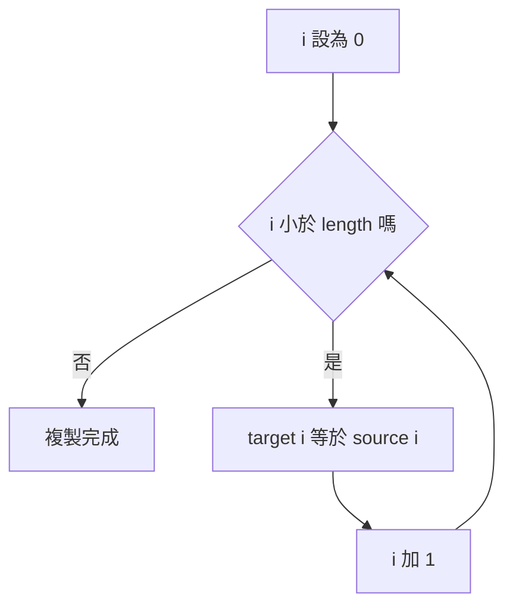
```mermaid
flowchart TD
    A[i 設為 0] --> B{i 小於 length 嗎}
    B -- 否 --> F[複製完成]
    B -- 是 --> C[target i 等於 source i]
    C --> D[i 加 1]
    D --> B
```

---

### 2. 陣列傳入函式

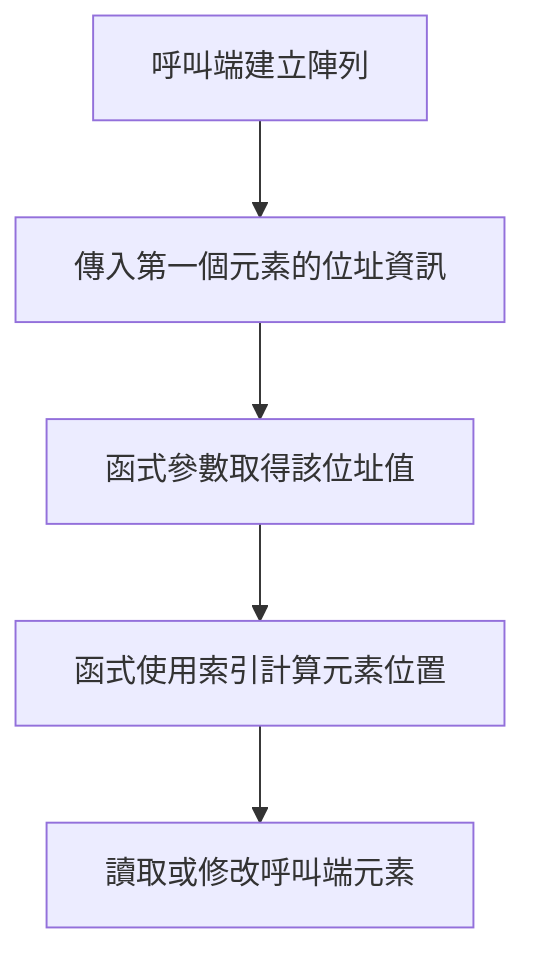
```mermaid
flowchart TD
    A[呼叫端建立陣列] --> B[傳入第一個元素的位址資訊]
    B --> C[函式參數取得該位址值]
    C --> D[函式使用索引計算元素位置]
    D --> E[讀取或修改呼叫端元素]
```

---

### 3. 任意長度最大值

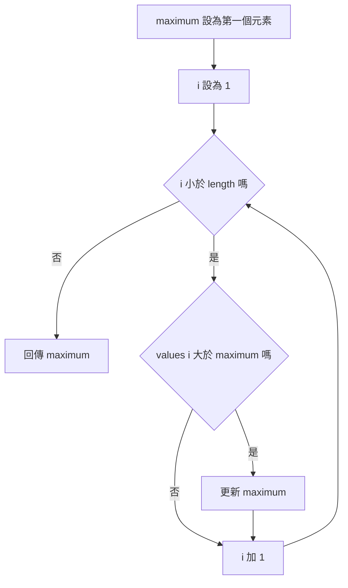
```mermaid
flowchart TD
    A[maximum 設為第一個元素] --> B[i 設為 1]
    B --> C{i 小於 length 嗎}
    C -- 否 --> G[回傳 maximum]
    C -- 是 --> D{values i 大於 maximum 嗎}
    D -- 是 --> E[更新 maximum]
    D -- 否 --> F[i 加 1]
    E --> F
    F --> C
```

---

### 4. 合法索引範圍


```mermaid
flowchart LR
    A[索引 0] --> B[索引 1]
    B --> C[直到索引 length 減 1]
    C --> D[索引 length 不屬於陣列]
```

---

### 5. `sizeof` 計算長度

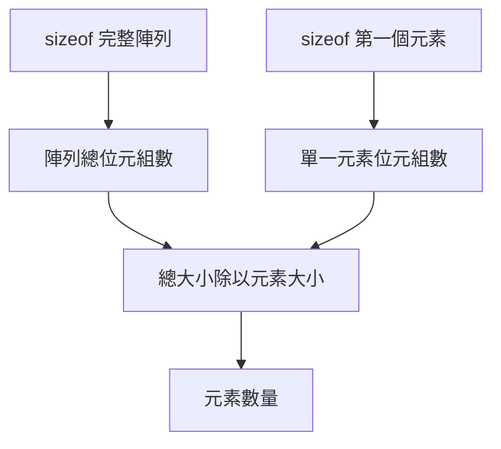
```mermaid
flowchart TD
    A[sizeof 完整陣列] --> C[陣列總位元組數]
    B[sizeof 第一個元素] --> D[單一元素位元組數]
    C --> E[總大小除以元素大小]
    D --> E
    E --> F[元素數量]
```

---

### 6. 保留值長度

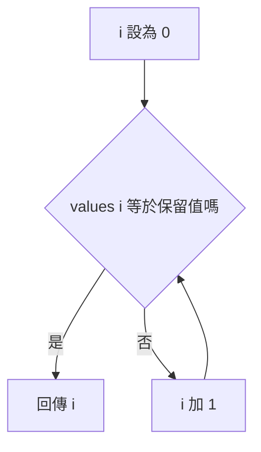
```mermaid
flowchart TD
    A[i 設為 0] --> B{values i 等於保留值嗎}
    B -- 是 --> E[回傳 i]
    B -- 否 --> C[i 加 1]
    C --> B
```

---

### 7. 元素位址公式

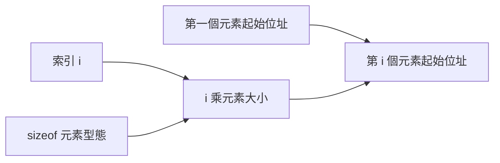
```mermaid
flowchart LR
    A[第一個元素起始位址] --> D[第 i 個元素起始位址]
    B[索引 i] --> C[i 乘元素大小]
    E[sizeof 元素型態] --> C
    C --> D
```

---

### 8. 為什麼函式需要長度

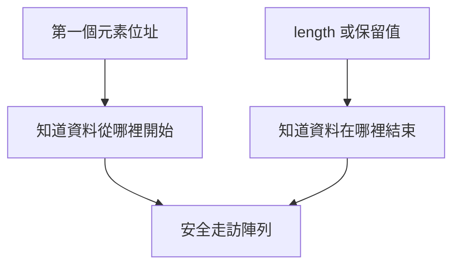
```mermaid
flowchart TD
    A[第一個元素位址] --> C[知道資料從哪裡開始]
    B[length 或保留值] --> D[知道資料在哪裡結束]
    C --> E[安全走訪陣列]
    D --> E
```

---

## 本章完成標準

完成本章後，你應該能做到：

1. 說明普通變數與陣列複製的差異。
2. 找出陣列整體賦值的編譯錯誤。
3. 使用迴圈逐元素複製陣列。
4. 驗證複製後來源與目標彼此獨立。
5. 將重複的陣列輸出整理成函式。
6. 使用陣列參數讀取呼叫端元素。
7. 使用陣列參數修改呼叫端元素。
8. 說明普通參數與陣列參數的行為差異。
9. 說明函式不能直接回傳陣列型態。
10. 使用呼叫端陣列承接函式填入結果。
11. 將固定長度最大值函式推廣成任意長度。
12. 正確傳入陣列與元素數量。
13. 說明 `length >= 1` 的前提。
14. 避免錯誤長度造成漏讀或越界。
15. 分辨合法整數索引、浮點索引與越界索引。
16. 說明越界屬於未定義行為。
17. 使用 `sizeof` 查詢型態、元素與陣列大小。
18. 使用 `%zu` 輸出 `size_t`。
19. 使用大小相除公式計算完整陣列長度。
20. 說明該公式為什麼在函式陣列參數中失效。
21. 說明參數中的大小標記不能保存原陣列總大小。
22. 使用 `-1` 標記整數陣列有效資料結束。
23. 正確撰寫保留值長度函式。
24. 注意來源由 `return i + 1` 修正為 `return i`。
25. 使用保留值撰寫最大值函式。
26. 說明保留值法的限制。
27. 說明陣列元素的連續記憶體配置。
28. 使用起點、索引與元素大小計算元素位置。
29. 說明最後元素之後的位置不是合法元素。
30. 說明函式取得第一個元素位址資訊。
31. 說明同一函式如何處理不同陣列。
32. 說明第一個元素位址不能自動表示陣列長度。
33. 認識指標將在後續章節正式處理位址。
34. 準備進入下一章的字串。
