# Lesson 20：Strings 字串

> 這堂課的重點：理解 C 語言字串其實是以 `'\0'` 結束的 `char` 陣列，分辨陣列配置大小與文字實際長度，並從標準輸入 `stdin` 逐字元讀入一整行文字。接著處理輸入長度超過陣列容量時的緩衝區溢位與剩餘輸入問題，最後學會檢查 `scanf()` 的回傳值，避免讀取失敗後使用未初始化資料或陷入無限重試。

---

## Section I. 今天要做什麼？

1. 複習 `char` 型態與一維陣列。
2. 理解 C 語言沒有獨立的內建字串型態。
3. 使用 `char` 陣列保存一串文字。
4. 使用字串字面常數初始化字元陣列。
5. 觀察 `"Hello world"` 實際需要多少個陣列元素。
6. 使用 `sizeof()` 查看完整字元陣列配置大小。
7. 分辨「陣列配置大小」與「字串文字長度」。
8. 認識字串結束字元 `'\0'`。
9. 理解 `'\0'` 的數值是 `0`。
10. 找出字串中第一個 `'\0'` 的位置。
11. 撰寫來源中的 `str_len()` 函式。
12. 使用迴圈逐一檢查字串字元。
13. 理解字串長度不包含 `'\0'`。
14. 理解 `sizeof()` 會包含陣列中所有配置元素。
15. 手動使用字元清單初始化字串。
16. 理解部分初始化後，剩餘陣列元素會被設為 `0`。
17. 比較 `char str[12]`、`char str[15]` 與 `char str[]`。
18. 找出容量不足的字串初始化。
19. 理解 `char str[11] = "Hello world";` 可以形成沒有 `'\0'` 的字元陣列。
20. 說明沒有 `'\0'` 的字元陣列為什麼不能安全地當成一般 C 字串。
21. 使用 `%s` 輸出字串。
22. 理解 `%s` 會一直輸出到第一個 `'\0'`。
23. 認識標準輸入 `stdin`。
24. 將 `stdin` 理解成程式可以讀取的輸入資料流。
25. 理解一般終端輸入通常在按下 Enter 後送入 `stdin`。
26. 理解 `scanf()` 會從 `stdin` 讀取資料。
27. 理解沒有可讀資料時，輸入函式可能等待使用者輸入。
28. 使用 `%c` 一次讀入一個字元。
29. 使用迴圈讀到換行字元 `'\n'`。
30. 將換行字元的位置改成 `'\0'`。
31. 撰寫來源中的 `str_read()`。
32. 讀入含有空白的完整一行文字。
33. 理解 `%c` 不會自動忽略空白。
34. 發現沒有容量限制的 `str_read()` 會造成陣列越界。
35. 理解字串陣列必須保留一格給 `'\0'`。
36. 將可讀取的最大文字長度傳入函式。
37. 將無限迴圈改成有上限的 `for` 迴圈。
38. 在長度上限位置補上 `'\0'`。
39. 觀察過長輸入被截短後的結果。
40. 理解未讀完的輸入仍會留在 `stdin`。
41. 觀察下一次 `str_read()` 讀到上一行剩餘內容的現象。
42. 在截短時丟棄該行剩餘字元。
43. 避免下一次輸入被上一行污染。
44. 認識來源最終版本仍有可改進的狀態判斷。
45. 使用明確狀態整理成安全的行輸入函式。
46. 複習使用 `scanf("%d", &number)` 讀入整數。
47. 理解 `%d` 會忽略前方空白字元。
48. 觀察輸入 `abc` 時 `%d` 無法完成轉換。
49. 理解讀取失敗後，目標變數不會得到新的有效值。
50. 避免讀取未初始化整數。
51. 使用 `scanf()` 回傳值判斷成功讀入幾筆資料。
52. 使用 `scanf("%d", &number) == 1` 判斷成功。
53. 輸出適當的無效輸入錯誤訊息。
54. 理解讀取失敗的字元仍可能留在 `stdin`。
55. 觀察直接重試 `scanf("%d")` 造成無限錯誤迴圈。
56. 在失敗後丟棄該行剩餘輸入。
57. 分辨一般輸入失敗與檔案結束 `EOF`。
58. 比較字串讀取與數字讀取的不同停止條件。
59. 找出 `'\0'`、`'\n'`、容量、有效長度與輸入剩餘資料的常見混淆。
60. 為後續指標與字串章節建立基礎。

---

## Section II. 今天的學習方式

1. 先在紙上為每個字元畫一格陣列元素。
2. 將 `"Hello world"` 的十一個可見字元逐格寫入。
3. 在最後額外畫一格 `'\0'`。
4. 同時標記：
   - 陣列配置大小
   - 第一個 `'\0'` 的索引
   - 文字實際長度
5. 比較：
   ```c
   sizeof(str)
   ```
   與：
   ```c
   str_len(str)
   ```
6. 手動追蹤 `str_len()` 中 `i` 的變化。
7. 讀入文字時，畫出三個區域：
   - 鍵盤與終端
   - `stdin`
   - 程式內的字元陣列
8. 每執行一次 `%c`，就從 `stdin` 移除一個字元並寫入陣列。
9. 看到 `'\n'` 時，不將它保留為文字內容，而改寫成 `'\0'`。
10. 所有輸入陣列都先明確寫出容量。
11. 先計算可保存的最大文字長度：
    ```text
    陣列容量 - 1
    ```
12. 對過長輸入分別追蹤：
    - 已保存的部分
    - 仍留在 `stdin` 的部分
13. 整數輸入失敗時，不只看畫面結果，也畫出 `stdin` 中仍未被消耗的字元。
14. 每一次呼叫 `scanf()` 都檢查回傳值。
15. 遇到 `EOF` 時停止，不要無限等待或無限清除。
16. 先依來源完成逐步版本，再使用清楚標示的安全整理版修正邊界問題。
17. 本章不把來源未提供的函式當成主要推導；額外方法會明確標示為教材補充。
18. 所有完整且預期合法的 C 程式都使用嚴格 C17 選項編譯。

---

## Section III. 今天會學到的內容

| 主題 | 你需要知道的事 |
| --- | --- |
| 字元 | 一個 `char` 值，例如 `'H'` |
| 字串 | 以 `'\0'` 結束的 `char` 陣列 |
| 字串字面常數 | 使用雙引號表示的文字，例如 `"Hello"` |
| 結束字元 | `'\0'`，用來標示字串內容結束 |
| 換行字元 | `'\n'`，通常由按下 Enter 產生 |
| 陣列配置大小 | 陣列實際擁有的元素數量 |
| 字串長度 | 第一個 `'\0'` 之前的字元數量 |
| `sizeof(array)` | 完整陣列所占的位元組數 |
| `str_len()` | 來源自行實作的字串長度函式 |
| `%s` | 從第一個字元輸出到 `'\0'` |
| `%c` | 一次讀入或輸出一個字元 |
| `stdin` | 程式的標準輸入資料流 |
| blocking | 沒有可讀資料時，輸入函式等待 |
| 輸入緩衝 | 尚未被程式讀取的輸入內容 |
| 緩衝區溢位 | 寫入超過目標陣列容量 |
| 最大文字長度 | 一般為容量減一，預留 `'\0'` |
| 截短 | 只保留可容納的前段文字 |
| 剩餘輸入 | 截短後仍留在 `stdin` 的同一行內容 |
| 清除一行 | 持續讀取直到 `'\n'` 或 `EOF` |
| `scanf()` 回傳值 | 成功完成指定與寫入的資料筆數 |
| 轉換失敗 | 輸入不符合格式，例如用 `%d` 讀 `abc` |
| 未初始化變數 | 尚未取得可安全讀取的值 |
| `EOF` | 輸入來源已結束，無法再讀取資料 |
| 無限失敗迴圈 | 無效字元留在 `stdin`，重試時一直讀到同一內容 |

---

## Section IV. 寫題目前的提醒

### 1. 字串不是只有可見文字

```c
char str[] = "Hello world";
```

實際元素：

```text
'H' 'e' 'l' 'l' 'o' ' '
'w' 'o' 'r' 'l' 'd' '\0'
```

可見字元有 `11` 個，但完整陣列有 `12` 個元素。

---


<!-- AUTO-IMAGE: C_Lesson_20_img01_string_memory_layout.png -->
<p align="center">
  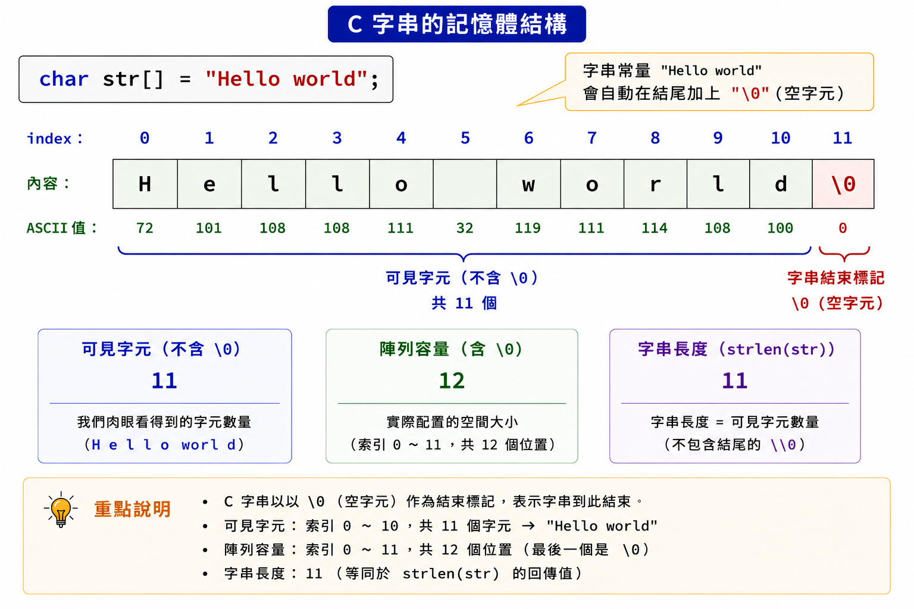
</p>
<!-- /AUTO-IMAGE: C_Lesson_20_img01_string_memory_layout.png -->

### 2. `sizeof()` 與字串長度不同

```c
sizeof(str)
```

在來源範例中得到：

```text
12
```

來源自行撰寫的：

```c
str_len(str)
```

得到：

```text
11
```

---

### 3. 字串長度不包含 `'\0'`

`'\0'` 是結束標記，不是使用者看到的文字內容。

---


<!-- AUTO-IMAGE: C_Lesson_20_img02_sizeof_vs_strlen.png -->
<p align="center">
  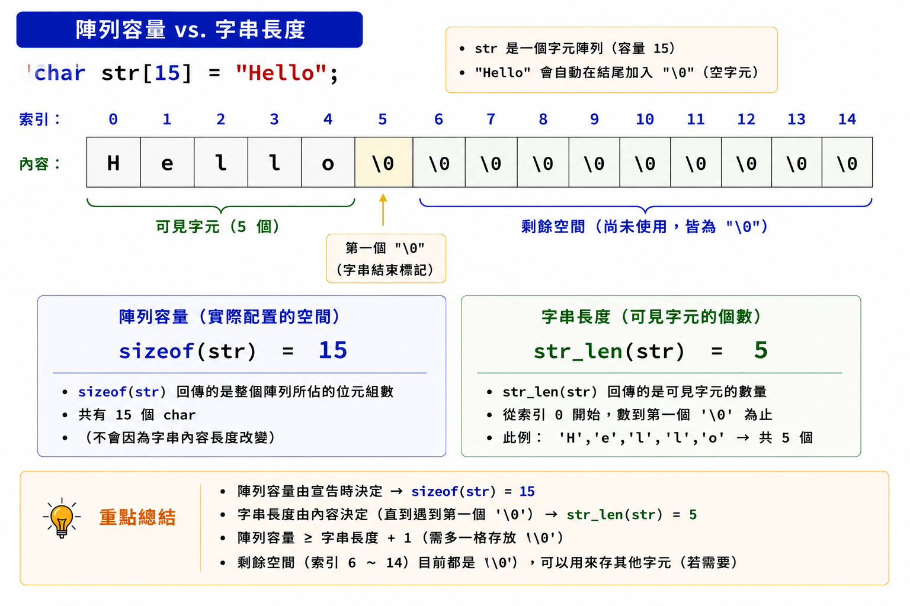
</p>
<!-- /AUTO-IMAGE: C_Lesson_20_img02_sizeof_vs_strlen.png -->

### 4. `'\0'` 與字元 `'0'` 不同

```c
'\0'
```

是數值為零的空字元。

```c
'0'
```

是可見的數字字元。

---

### 5. `'\0'` 與 `'\n'` 不同

| 字元 | 用途 |
| --- | --- |
| `'\0'` | 結束 C 字串 |
| `'\n'` | 表示換行 |

來源的行輸入函式在讀到 `'\n'` 後，將該位置改成 `'\0'`。

---


<!-- AUTO-IMAGE: C_Lesson_20_img03_null_newline_zero.png -->
<p align="center">
  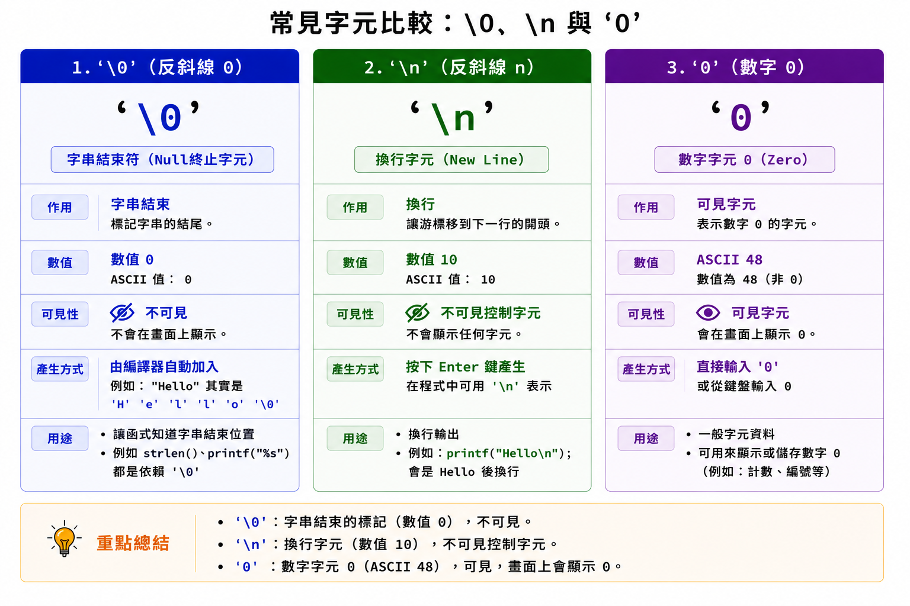
</p>
<!-- /AUTO-IMAGE: C_Lesson_20_img03_null_newline_zero.png -->

### 6. 部分初始化會把剩餘元素設為 `0`

```c
char str[15] = {
    'H', 'e', 'l', 'l', 'o', ' ',
    'w', 'o', 'r', 'l', 'd'
};
```

前十一格是文字，其餘四格會初始化為零。

所以第一個剩餘元素可作為 `'\0'`。

---

### 7. `char str[11] = "Hello world";` 不是正常 C 字串

它可以保存十一個可見字元，但沒有空間保存結尾 `'\0'`。

因此不能安全交給依賴 `'\0'` 的函式，例如：

```c
printf("%s\n", str);
```

或來源的：

```c
str_len(str);
```

---

### 8. `char str[10] = "Hello world";` 容量不足

十一個可見字元本身就放不下，更不用說 `'\0'`。

編譯器必須對不相容的初始化提供診斷。

---

### 9. `%s` 需要有效的 C 字串

```c
printf("%s\n", str);
```

會從 `str[0]` 開始，持續讀取直到遇到 `'\0'`。

若陣列內沒有 `'\0'`，會讀到陣列外部並造成未定義行為。

---

### 10. 來源的 `str_len()` 假設一定能找到 `'\0'`

```c
while (str[i] != '\0') {
    i++;
}
```

如果傳入的字元陣列沒有 `'\0'`，迴圈會越界。

---

### 11. `stdin` 可以理解成程式的輸入資料流

來源用「像檔案一樣」的方式說明：

- 按下 Enter 後，輸入資料進入 `stdin`。
- `scanf()` 從 `stdin` 讀取。
- 沒有可讀資料時，程式可能等待。

這是理解輸入殘留問題的重要模型。

---

### 12. `%c` 不會忽略空白

```c
scanf("%c", &ch);
```

可以讀到：

- 英文字母
- 空格
- Tab
- 換行字元

因此適合逐字元讀取一整行。

---

### 13. 沒有容量限制的來源初版可能溢位

```c
while (1) {
    scanf("%c", &str[i]);

    if (str[i] == '\n') {
        break;
    }

    i++;
}
```

如果輸入一直沒有換行，而且長度超過陣列容量，`i` 會繼續增加並寫到陣列外部。

---

### 14. 容量必須包含 `'\0'`

```c
char str[15];
```

最多安全保存：

```text
14 個文字字元 + 1 個 '\0'
```

---


<!-- AUTO-IMAGE: C_Lesson_20_img05_stdin_flow.png -->
<p align="center">
  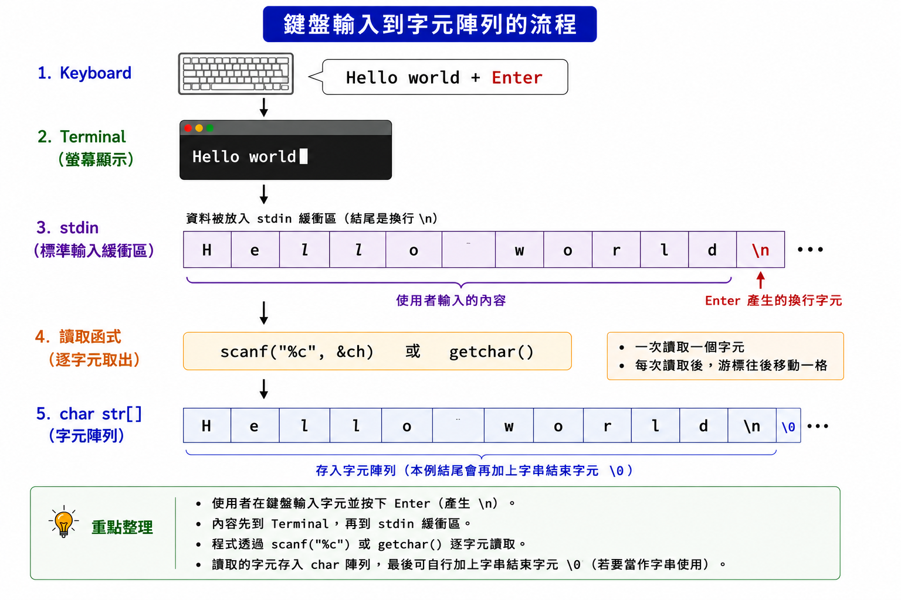
</p>
<!-- /AUTO-IMAGE: C_Lesson_20_img05_stdin_flow.png -->

### 15. 來源把 `14` 當成最大文字長度傳入

```c
str_read(str, 14);
```

對：

```c
char str[15];
```

而言，`14` 是可保存的最大文字字元數。

---

### 16. 只限制寫入長度仍可能留下輸入

輸入超過十四個字元時，函式只能保存前十四個。

同一行剩下的字元與 `'\n'` 仍在 `stdin`。

---

### 17. 下一次讀取可能直接讀到上一行剩餘內容

來源示範將過長的：

```text
Hello, "C" world!
```

拆成兩次輸出：

```text
Hello, "C" wor
ld!
```

使用者沒有再次輸入，第二次呼叫已經從 `stdin` 取得剩餘部分。

---

### 18. 截短後要丟棄同一行剩餘內容

概念流程：

```text
儲存到容量上限
→ 若尚未讀到 '\n'
→ 繼續讀取但不保存
→ 直到 '\n' 或 EOF
```

---


<!-- AUTO-IMAGE: C_Lesson_20_img06_read_line_char_by_char.png -->
<p align="center">
  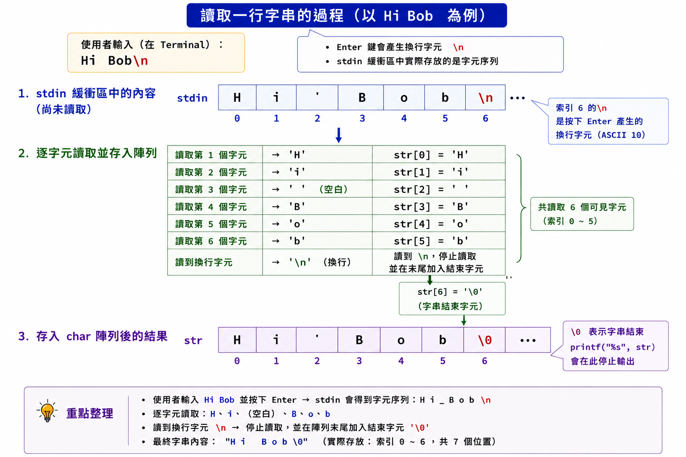
</p>
<!-- /AUTO-IMAGE: C_Lesson_20_img06_read_line_char_by_char.png -->

### 19. 來源用 `str[i] != '\n'` 判斷是否需要清除

來源後段加入：

```c
if (str[i] != '\n') {
    /* 讀到換行為止 */
}
```

但當迴圈因 `i == n` 結束時，`str[i]` 尚未由輸入寫入，直接讀取它並不是理想的狀態判斷。

本講義保留來源推導，再提供使用明確讀取狀態的安全整理版。

---

### 20. `scanf("%d")` 會忽略前導空白

輸入：

```text
     3
```

仍可成功讀入整數 `3`。

這種忽略空白的行為與 `%c` 不同。

---

### 21. `scanf("%d")` 遇到 `abc` 時不會寫入整數

```c
int number;
scanf("%d", &number);
```

如果沒有成功轉換，`number` 不會因此得到一個新的合法整數。

如果它原本尚未初始化，接著輸出它會造成未定義行為。

---


<!-- AUTO-IMAGE: C_Lesson_20_img07_capacity_minus_one.png -->
<p align="center">
  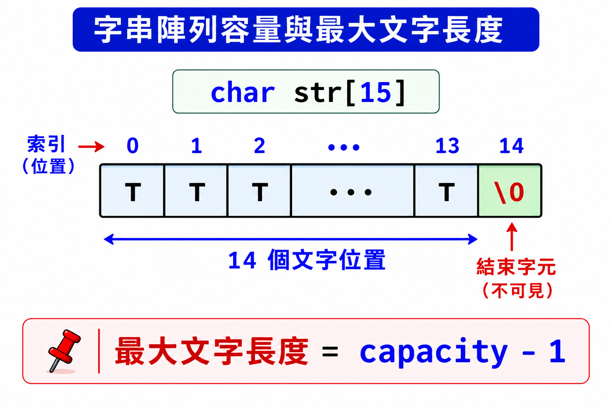
</p>
<!-- /AUTO-IMAGE: C_Lesson_20_img07_capacity_minus_one.png -->

### 22. 必須檢查 `scanf()` 回傳值

```c
if (scanf("%d", &number) == 1) {
    /* 成功 */
}
```

`1` 表示成功完成一個指定寫入。

---

### 23. 讀取失敗後，無效字元仍可能留在 `stdin`

`%d` 看到字母 `a`，判斷無法開始整數轉換後便失敗。

該字元沒有自動消失。

---

### 24. 直接重試會再次看到同一個字元

錯誤模式：

```c
while (scanf("%d", &number) != 1) {
    printf("Error\n");
}
```

若 `a` 一直留在 `stdin`，每一次重試都立即失敗，形成無限錯誤輸出。

---

### 25. 清除失敗輸入時也要考慮 `EOF`

不能只寫：

```c
while (getchar() != '\n') {
}
```

若輸入已結束而沒有換行，會一直得到 `EOF`。

安全停止條件應同時檢查：

```text
'\n' 或 EOF
```

---

## Section V. 核心概念說明

## Section V-A. C 字串是 `char` 陣列

### 1. 最基本的字串初始化

```c
#include <stdio.h>

int main(void) {
    char str[] = "Hello world";

    printf("%s\n", str);

    return 0;
}
```

`str` 的型態是字元陣列。

---

### 2. 查看完整陣列大小

```c
#include <stdio.h>

int main(void) {
    char str[] = "Hello world";

    printf("Array size: %zu\n", sizeof(str));

    return 0;
}
```

輸出：

```text
Array size: 12
```

---

### 3. 為什麼是 `12`？

| 索引 | 內容 |
| ---: | --- |
| 0 | `'H'` |
| 1 | `'e'` |
| 2 | `'l'` |
| 3 | `'l'` |
| 4 | `'o'` |
| 5 | `' '` |
| 6 | `'w'` |
| 7 | `'o'` |
| 8 | `'r'` |
| 9 | `'l'` |
| 10 | `'d'` |
| 11 | `'\0'` |

---

## Section V-B. 自行計算字串長度

### 4. 來源的 `str_len()` 推導

第一步是找到第一個 `'\0'`。

```c
int str_len(char str[]) {
    int i = 0;

    while (str[i] != '\0') {
        i++;
    }

    return i;
}
```

---

### 5. 完整範例

```c
#include <stdio.h>

int str_len(char str[]);

int main(void) {
    char str[] = "Hello world";

    printf("Array size: %zu\n", sizeof(str));
    printf("Text length: %d\n", str_len(str));

    return 0;
}

int str_len(char str[]) {
    int i = 0;

    while (str[i] != '\0') {
        i++;
    }

    return i;
}
```

輸出：

```text
Array size: 12
Text length: 11
```

---

### 6. `i` 的追蹤

```text
i = 0  → 'H'
i = 1  → 'e'
...
i = 10 → 'd'
i = 11 → '\0'，停止
```

回傳：

```text
11
```

---

## Section V-C. 不同初始化方式

### 7. 手動寫出所有元素

```c
#include <stdio.h>

int main(void) {
    char str[12] = {
        'H', 'e', 'l', 'l', 'o', ' ',
        'w', 'o', 'r', 'l', 'd', '\0'
    };

    printf("%s\n", str);

    return 0;
}
```

---

### 8. 使用部分初始化

```c
#include <stdio.h>

int main(void) {
    char str[15] = {
        'H', 'e', 'l', 'l', 'o', ' ',
        'w', 'o', 'r', 'l', 'd'
    };

    printf("Array size: %zu\n", sizeof(str));
    printf("%s\n", str);

    return 0;
}
```

未明確列出的元素自動為 `0`。

---

### 9. 使用字串字面常數

```c
char str[15] = "Hello world";
```

會將字元與結尾 `'\0'` 放入陣列，其餘元素初始化為 `0`。

---

### 10. 省略陣列大小

```c
char str[] = "Hello world";
```

編譯器根據字串字面常數決定大小：

```text
11 個可見字元 + 1 個 '\0' = 12
```

---

## Section V-D. 沒有結束字元的字元陣列

### 11. 剛好只有文字內容的陣列

```c
char str[11] = "Hello world";
```

C 允許這個初始化，但不會加入 `'\0'`。

它是：

```text
具有十一個字元的陣列
```

而不是可安全交給一般字串函式的 C 字串。

---

### 12. 不要對它使用 `%s`

下面的程式具有未定義行為，因此本講義不把它當成可執行範例：

```c
char str[11] = "Hello world";

printf("%s\n", str);  /* 沒有 '\0' */
```

---


<!-- AUTO-IMAGE: C_Lesson_20_img04_valid_vs_unterminated_string.png -->
<p align="center">
  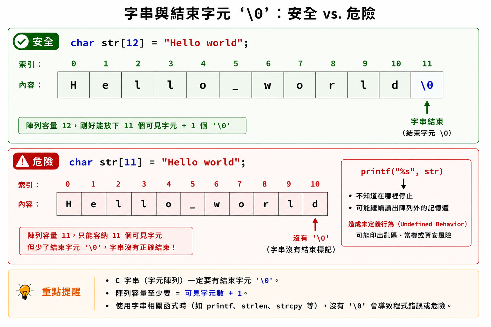
</p>
<!-- /AUTO-IMAGE: C_Lesson_20_img04_valid_vs_unterminated_string.png -->

## Section V-E. 從鍵盤讀入一整行

### 13. 題目

讓使用者輸入一行文字：

```text
Hello world
```

再將同一行重現輸出：

```text
Hello world
```

---

### 14. `stdin` 的來源模型

一般終端操作可以理解為：

```text
鍵盤輸入文字
→ 按下 Enter
→ 文字與換行進入 stdin
→ scanf 從 stdin 讀取
```

如果 `stdin` 沒有可讀的新資料，輸入函式可能等待。

---

### 15. 先讀一個字元

```c
char ch;

scanf("%c", &ch);
```

`%c` 讀取下一個字元，不會自動忽略空白。

---

### 16. 讀到換行為止

```c
while (1) {
    char ch;

    scanf("%c", &ch);

    if (ch == '\n') {
        break;
    }
}
```

這個版本只讀取，還沒有保存到陣列。

---

### 17. 將字元寫入陣列

```c
int i = 0;

while (1) {
    scanf("%c", &str[i]);

    if (str[i] == '\n') {
        break;
    }

    i++;
}
```

---

### 18. 將換行改成字串結尾

```c
str[i] = '\0';
```

此時：

- `str[0]` 到 `str[i - 1]` 是文字內容。
- `str[i]` 是 `'\0'`。
- 原本的 `'\n'` 不保留在字串中。

---

### 19. 來源初版完整程式

```c
#include <stdio.h>

void str_read(char str[]);

int main(void) {
    char str[15];

    str_read(str);
    printf("%s\n", str);

    return 0;
}

void str_read(char str[]) {
    int i = 0;

    while (1) {
        if (scanf("%c", &str[i]) != 1) {
            str[i] = '\0';
            return;
        }

        if (str[i] == '\n') {
            break;
        }

        i++;
    }

    str[i] = '\0';
}
```

這個版本加入了回傳值檢查，但仍沒有容量限制。

---

## Section V-F. 緩衝區溢位

### 20. 危險情況

```c
char str[15];
```

若使用者輸入超過十四個文字字元，無上限迴圈會嘗試寫入：

```c
str[15]
str[16]
...
```

這些位置不屬於陣列。

---

### 21. 為什麼最多是十四個文字字元？

```text
陣列容量：15
文字內容：最多 14
結束字元：1
```

---

### 22. 將最大文字長度傳入

來源修改介面：

```c
void str_read(char str[], int maximum_length);
```

呼叫：

```c
char str[15];

str_read(str, 14);
```

---

### 23. 有上限的來源版本

```c
#include <stdio.h>

void str_read(char str[], int maximum_length);

int main(void) {
    char str[15];

    str_read(str, 14);
    printf("%s\n", str);

    return 0;
}

void str_read(char str[], int maximum_length) {
    int i;

    for (i = 0; i < maximum_length; i++) {
        if (scanf("%c", &str[i]) != 1) {
            break;
        }

        if (str[i] == '\n') {
            break;
        }
    }

    str[i] = '\0';
}
```

這個版本保護了目標陣列，但過長輸入的剩餘部分仍留在 `stdin`。

---

## Section V-G. 過長輸入的剩餘資料

### 24. 截短範例

容量：

```text
15
```

最大文字長度：

```text
14
```

輸入：

```text
Hello, "C" world!
```

保存的前段可能是：

```text
Hello, "C" wor
```

尚未讀取：

```text
ld!\n
```

---

### 25. 為什麼下一次讀取不用等待？

因為 `stdin` 已經存在：

```text
ld!\n
```

下一次 `str_read()` 直接讀取這些字元。

---

### 26. 必須丟棄剩餘行

截短後：

```c
int ch;

do {
    ch = getchar();
} while (ch != '\n' && ch != EOF);
```

這段只消耗資料，不保存到字串。

---


<!-- AUTO-IMAGE: C_Lesson_20_img08_truncated_input_stdin.png -->
<p align="center">
  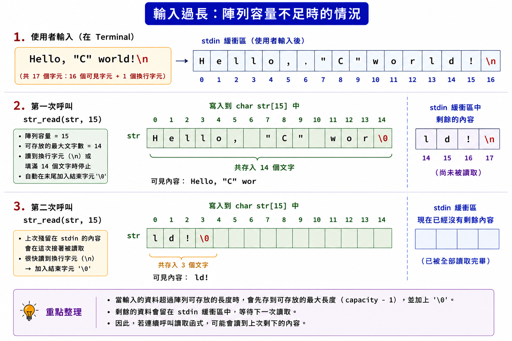
</p>
<!-- /AUTO-IMAGE: C_Lesson_20_img08_truncated_input_stdin.png -->


<!-- AUTO-IMAGE: C_Lesson_20_img09_flush_remaining_line.png -->
<p align="center">
  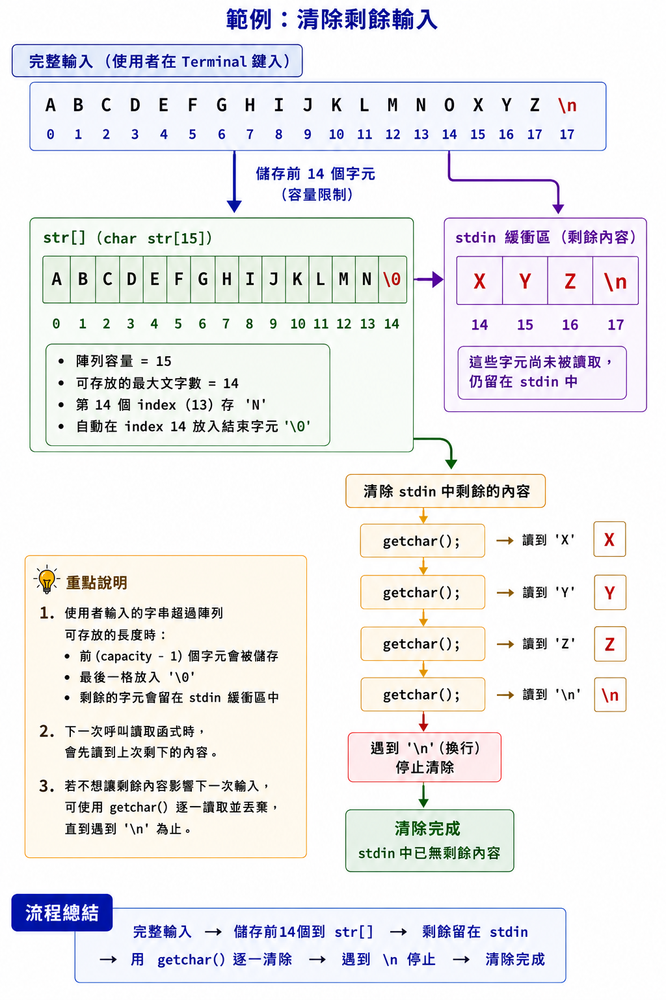
</p>
<!-- /AUTO-IMAGE: C_Lesson_20_img09_flush_remaining_line.png -->

## Section V-H. 安全整理版的行輸入函式

### 27. 使用容量而不是「最大文字長度」

以下是依來源問題整理的安全版本。

介面：

```c
int str_read_line(char str[], int capacity);
```

`capacity` 表示完整陣列容量，包括 `'\0'` 的位置。

---

### 28. 完整安全版本

```c
#include <stdio.h>

int str_read_line(char str[], int capacity);

int main(void) {
    char str[15];

    if (str_read_line(str, 15)) {
        printf("%s\n", str);
    }

    return 0;
}

int str_read_line(char str[], int capacity) {
    int ch;
    int i = 0;

    if (capacity <= 0) {
        return 0;
    }

    while (
        i < capacity - 1 &&
        (ch = getchar()) != '\n' &&
        ch != EOF
    ) {
        str[i] = (char)ch;
        i++;
    }

    str[i] = '\0';

    if (ch != '\n' && ch != EOF) {
        do {
            ch = getchar();
        } while (ch != '\n' && ch != EOF);
    }

    return ch != EOF || i > 0;
}
```

---

### 29. 這個版本修正了什麼？

1. 不會寫到陣列外部。
2. 永遠預留一格給 `'\0'`。
3. 不讀取未初始化的 `str[i]` 判斷狀態。
4. 過長時會清除同一行剩餘內容。
5. 遇到 `EOF` 時可以停止。
6. 下一次呼叫不會讀到上一行被截斷的尾端。

---

### 30. 空行

使用者直接按 Enter：

```text
第一個讀到的字元是 '\n'
```

結果：

```c
str[0] = '\0';
```

字串長度為 `0`。

---

## Section V-I. 使用 `scanf()` 讀入整數

### 31. 基本版本

```c
#include <stdio.h>

int main(void) {
    int number;

    if (scanf("%d", &number) == 1) {
        printf("%d\n", number);
    }

    return 0;
}
```

---

### 32. `%d` 會略過前導空白

輸入：

```text


    3
```

仍可成功讀到：

```text
3
```

---

### 33. 無效輸入

輸入：

```text
abc
```

`%d` 無法從 `a` 開始形成整數。

`scanf()` 回傳：

```text
0
```

---

### 34. 不要輸出未初始化變數

錯誤概念：

```c
int number;

scanf("%d", &number);
printf("%d\n", number);
```

若讀取失敗，`number` 沒有合法的新值。

---

### 35. 顯示錯誤訊息

```c
#include <stdio.h>

int main(void) {
    int number;

    if (scanf("%d", &number) == 1) {
        printf("%d\n", number);
    } else {
        printf("Error: Invalid input\n");
    }

    return 0;
}
```

---

## Section V-J. `scanf()` 失敗後的後遺症

### 36. 看似合理但會卡住的版本

```c
while (scanf("%d", &number) != 1) {
    printf("Error: Invalid input\n");
}
```

輸入：

```text
abc
```

會不斷失敗。

---

### 37. 為什麼？

第一次 `%d` 在 `a` 失敗。

`a` 沒有被取走，所以第二次 `%d` 仍然看到同一個 `a`。

流程：

```text
讀到 a
→ 轉換失敗
→ a 留在 stdin
→ 再次讀到 a
→ 再次失敗
```

---


<!-- AUTO-IMAGE: C_Lesson_20_img10_scanf_failure_loop.png -->
<p align="center">
  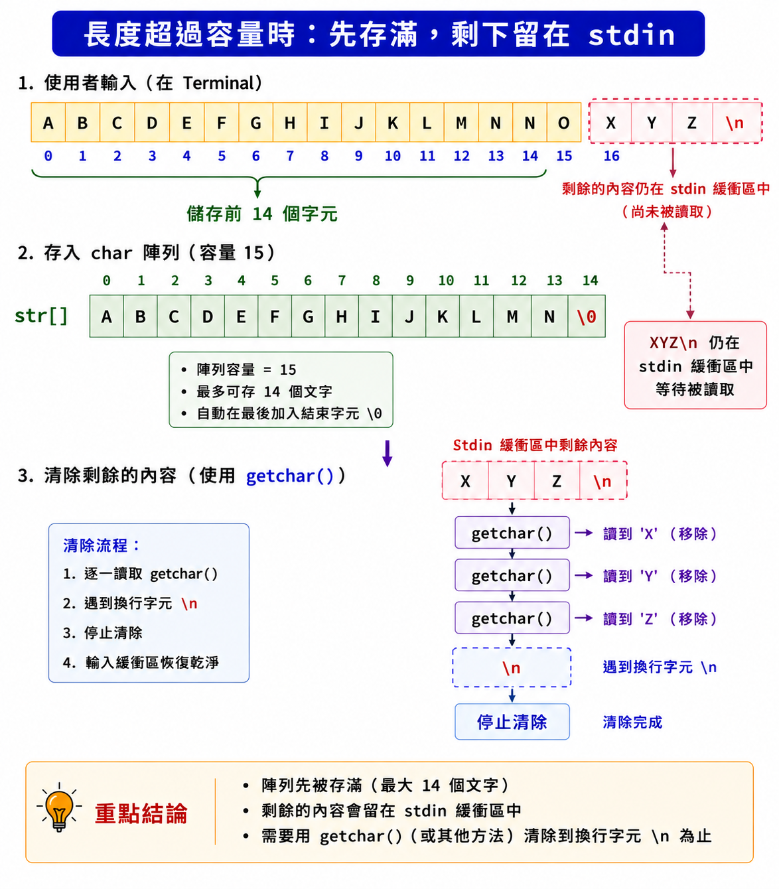
</p>
<!-- /AUTO-IMAGE: C_Lesson_20_img10_scanf_failure_loop.png -->

### 38. 安全丟棄無效行

```c
#include <stdio.h>

int main(void) {
    int number;

    while (1) {
        int result = scanf("%d", &number);

        if (result == 1) {
            break;
        }

        if (result == EOF) {
            return 0;
        }

        printf("Error: Invalid input\n");

        {
            int ch;

            do {
                ch = getchar();
            } while (ch != '\n' && ch != EOF);

            if (ch == EOF) {
                return 0;
            }
        }
    }

    printf("%d\n", number);

    return 0;
}
```

---

### 39. 為什麼要清除到換行？

若輸入：

```text
abc 123
```

只丟棄第一個 `a`，後面仍有：

```text
bc 123
```

最簡單的錯誤恢復方式是將整行視為無效，全部丟棄後再請使用者輸入新的一行。

---

### 40. 多筆轉換的回傳值

```c
int a;
int b;

int result = scanf("%d%d", &a, &b);
```

可能回傳：

| 回傳值 | 意義 |
| ---: | --- |
| 2 | 兩個整數都成功 |
| 1 | 第一個成功，第二個失敗或輸入結束 |
| 0 | 第一個整數轉換就失敗 |
| `EOF` | 在成功指定任何資料前已到輸入結束 |

---


<!-- AUTO-IMAGE: C_Lesson_20_img12_scanf_return_values.png -->
<p align="center">
  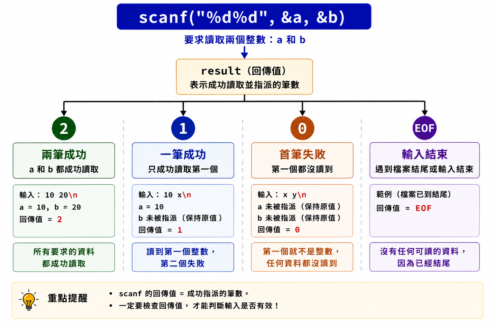
</p>
<!-- /AUTO-IMAGE: C_Lesson_20_img12_scanf_return_values.png -->

## Section V-K. 字串輸入與整數輸入比較

### 41. 逐字元行輸入

停止條件：

```text
讀到 '\n'
達到容量上限
遇到 EOF
```

---

### 42. `%d` 整數輸入

成功條件：

```text
找到符合整數格式的字元序列
```

失敗後要處理：

```text
無法轉換的字元仍留在 stdin
```

---

### 43. 空白處理差異

| 格式 | 前導空白 |
| --- | --- |
| `%d` | 自動略過 |
| `%c` | 不略過 |
| `" %c"` | 格式開頭空白會略過所有前導空白 |

本章來源的行輸入使用 `%c`，因為空格是文字內容的一部分。

---


<!-- AUTO-IMAGE: C_Lesson_20_img11_percent_d_vs_percent_c.png -->
<p align="center">
  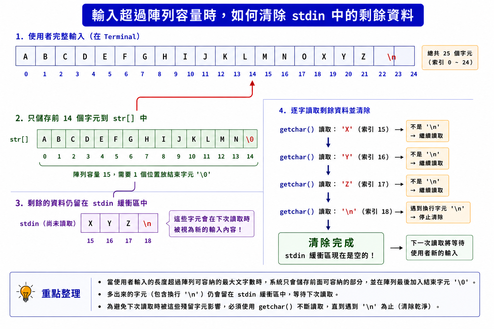
</p>
<!-- /AUTO-IMAGE: C_Lesson_20_img11_percent_d_vs_percent_c.png -->

## Section V-L. 教材補充：使用標準函式庫的 `fgets()`

> 這一小節不是四份來源投影片的主要推導，而是把來源所處理的「容量限制、換行與剩餘輸入」對應到標準函式庫常用介面。

### 44. 基本使用

```c
#include <stdio.h>

int main(void) {
    char str[15];

    if (fgets(str, sizeof(str), stdin) != NULL) {
        printf("%s", str);
    }

    return 0;
}
```

`fgets()` 最多保存：

```text
sizeof(str) - 1
```

個字元，並補上 `'\0'`。

---

### 45. `fgets()` 可能保留換行

若容量足夠且有讀到換行，`'\n'` 會保留在字串中。

可自行尋找並改成 `'\0'`。

---

### 46. `fgets()` 也可能留下過長行的尾端

它避免寫入溢位，但如果一行比陣列可容納範圍更長，剩餘內容仍在 `stdin`。

因此來源教材中「清除同一行剩餘資料」的概念仍然重要。

---

## Section V-M. 容易搞混的重點

### 47. `sizeof(str)` 不是永遠等於文字長度加一

只有當：

- `str` 是完整陣列
- 第一個 `'\0'` 剛好在最後一格

兩者才剛好相差一。

例如：

```c
char str[15] = "Hello";
```

```text
sizeof(str) = 15
字串長度 = 5
```

---

### 48. 多個 `'\0'` 不會增加字串長度

字串長度只看第一個 `'\0'`。

---

### 49. 陣列有足夠空間，不代表目前一定是有效字串

```c
char str[100];
```

如果尚未寫入 `'\0'`，仍不能直接用 `%s`。

---

### 50. 截短不是溢位

安全截短：

```text
只保存容量允許的前段
```

溢位：

```text
仍繼續寫到陣列外部
```

兩者不同。

---

### 51. 清除 `stdin` 不是標準函式名稱

不能假設存在：

```c
fflush(stdin);
```

標準 C 不把 `fflush()` 定義成清除輸入資料的通用方法。

來源採用逐字元讀到換行的概念。

---

### 52. `scanf()` 成功一次，不代表整行全部有效

輸入：

```text
123abc
```

`%d` 可以成功讀到 `123`，但：

```text
abc
```

仍可能留在 `stdin`。

---

### 53. `%d` 後面的換行通常不妨礙下一次 `%d`

因為 `%d` 會略過前導空白。

但換行會影響下一次 `%c` 或逐字元行輸入。

---

## Section VI. 快速概念檢查

### Q1. `"Hello world"` 有多少個可見字元？

<details>
<summary>查看答案</summary>

```text
11
```

</details>

---

### Q2. `char str[] = "Hello world";` 的陣列大小是多少？

<details>
<summary>查看答案</summary>

```text
12
```

包含結尾 `'\0'`。

</details>

---

### Q3. 字串長度是否包含 `'\0'`？

<details>
<summary>查看答案</summary>

不包含。

</details>

---

### Q4. `'\0'` 與 `'0'` 是否相同？

<details>
<summary>查看答案</summary>

不同。`'\0'` 是數值零的空字元；`'0'` 是可見數字字元。

</details>

---

### Q5. `char str[15] = "Hello";` 中 `sizeof(str)` 是多少？

<details>
<summary>查看答案</summary>

```text
15
```

</details>

---

### Q6. 上一題的字串長度是多少？

<details>
<summary>查看答案</summary>

```text
5
```

</details>

---

### Q7. 為什麼 `char str[11] = "Hello world";` 不能安全使用 `%s`？

<details>
<summary>查看答案</summary>

陣列剛好只放十一個文字字元，沒有 `'\0'`。

</details>

---

### Q8. 使用 `%c` 時會自動略過空格嗎？

<details>
<summary>查看答案</summary>

不會。

</details>

---

### Q9. 行輸入函式為什麼讀到 `'\n'` 後要寫入 `'\0'`？

<details>
<summary>查看答案</summary>

要將輸入內容轉成有效 C 字串，並排除換行字元。

</details>

---

### Q10. `char str[15]` 最多安全保存多少個一般文字字元？

<details>
<summary>查看答案</summary>

```text
14
```

最後一格保留給 `'\0'`。

</details>

---

### Q11. 過長輸入被截短後，剩餘內容會自動消失嗎？

<details>
<summary>查看答案</summary>

不會，仍可能留在 `stdin`。

</details>

---

### Q12. `scanf("%d", &number)` 成功時通常回傳多少？

<details>
<summary>查看答案</summary>

```text
1
```

</details>

---

### Q13. 輸入 `abc` 給 `%d` 時，回傳值通常是多少？

<details>
<summary>查看答案</summary>

```text
0
```

</details>

---

### Q14. 讀取失敗後為什麼不能直接輸出未初始化的 `number`？

<details>
<summary>查看答案</summary>

它沒有取得合法值，讀取它會造成未定義行為。

</details>

---

### Q15. 為什麼直接在 `while` 中反覆重試 `%d` 會無限失敗？

<details>
<summary>查看答案</summary>

造成失敗的字元沒有被消耗，下一次仍讀到同一字元。

</details>

---

### Q16. 清除一行時為什麼也要檢查 `EOF`？

<details>
<summary>查看答案</summary>

輸入可能在沒有換行的情況下結束，若只等待 `'\n'` 會無限迴圈。

</details>

---

### Q17. `%d` 與 `%c` 對前導空白的處理是否相同？

<details>
<summary>查看答案</summary>

不同。`%d` 會略過，`%c` 不會。

</details>

---

### Q18. 安全行輸入函式的容量參數是否包含 `'\0'` 那一格？

<details>
<summary>查看答案</summary>

本講義的安全整理版包含，因此最多保存 `capacity - 1` 個文字字元。

</details>

---

## Section VII. 程式閱讀練習

### 題目 1：配置大小與字串長度

```c
char str[20] = "Cat";
```

<details>
<summary>查看答案</summary>

```text
sizeof(str) = 20
字串長度 = 3
```

</details>

---

### 題目 2：第一個 `'\0'`

```c
char str[8] = {
    'A', 'B', '\0', 'C', 'D'
};
```

<details>
<summary>查看答案</summary>

字串內容是：

```text
AB
```

字串長度是：

```text
2
```

</details>

---

### 題目 3：部分初始化

```c
char str[5] = {'H', 'i'};
```

<details>
<summary>查看答案</summary>

剩餘三格為 `0`，所以是有效字串：

```text
Hi
```

</details>

---

### 題目 4：危險字元陣列

```c
char str[3] = {'C', 'a', 't'};
```

<details>
<summary>查看答案</summary>

沒有 `'\0'`，不能安全用 `%s`。

</details>

---

### 題目 5：讀取空行

安全行輸入函式第一個讀到的字元是 `'\n'`。

<details>
<summary>查看答案</summary>

結果為：

```c
str[0] = '\0';
```

字串長度為 `0`。

</details>

---

### 題目 6：容量上限

```c
char str[6];
```

最多可保存多少個文字字元？

<details>
<summary>查看答案</summary>

```text
5
```

</details>

---

### 題目 7：`scanf()` 回傳值

```c
int a;
int b;

int result = scanf("%d%d", &a, &b);
```

只成功讀到第一個整數。

<details>
<summary>查看答案</summary>

```text
result == 1
```

</details>

---

### 題目 8：前導空白

輸入：

```text
   42
```

格式：

```c
scanf("%d", &number);
```

<details>
<summary>查看答案</summary>

成功讀入：

```text
42
```

</details>

---

### 題目 9：剩餘資料

輸入：

```text
123abc
```

使用一次：

```c
scanf("%d", &number);
```

<details>
<summary>查看答案</summary>

成功讀入 `123`，但 `abc` 仍可能留在 `stdin`。

</details>

---

### 題目 10：錯誤恢復

輸入：

```text
abc
```

程式只再次執行 `%d`，沒有丟棄任何字元。

<details>
<summary>查看答案</summary>

下一次仍在 `a` 失敗，可能形成無限迴圈。

</details>

---

## Section VIII. 實作練習 / 實作檢測題

### TODO 1：自行實作字串長度

撰寫：

```c
int str_len(char str[]);
```

不得使用標準字串函式庫。

---

### TODO 2：比較配置大小與文字長度

對以下三個陣列輸出兩種長度：

```c
char a[] = "Cat";
char b[10] = "Cat";
char c[20] = "";
```

---

### TODO 3：逐字元輸出

使用迴圈與 `%c` 輸出字串，遇到 `'\0'` 停止。

不得使用 `%s`。

---

### TODO 4：計算空格數量

輸入或建立一個有效字串，計算其中 `' '` 的數量。

---

### TODO 5：來源初版 `str_read()`

依來源方法使用 `%c` 讀到 `'\n'`，但只用短測試輸入。

並在註解寫出它缺少容量限制。

---

### TODO 6：加入最大文字長度

撰寫：

```c
void str_read_limit(
    char str[],
    int maximum_length
);
```

最多寫入 `maximum_length` 個文字字元。

---

### TODO 7：處理截短剩餘輸入

在 TODO 6 中加入清除同一行尾端的程式。

---

### TODO 8：使用容量介面

改成：

```c
int str_read_line(
    char str[],
    int capacity
);
```

讓函式自行使用 `capacity - 1`。

---

### TODO 9：重複讀取多行

持續讀入並輸出，輸入空行時停止。

測試過長行後，下一行是否仍正常。

---

### TODO 10：安全整數輸入

檢查：

```c
scanf("%d", &number) == 1
```

失敗時顯示錯誤，但不要輸出 `number`。

---

### TODO 11：清除無效整數輸入

失敗時讀到 `'\n'` 或 `EOF`，再重新詢問。

---

### TODO 12：讀取兩個整數

只有當：

```c
scanf("%d%d", &a, &b) == 2
```

才輸出兩者總和。

---

### TODO 13：分析 `123abc`

先使用 `%d` 讀整數，再逐字元輸出 `stdin` 剩餘內容。

說明為什麼會看到 `abc`。

---

### TODO 14：使用 `fgets()` 的補充練習

讀入一行文字，移除尾端 `'\n'`。

若該行過長，丟棄剩餘部分。

---

### TODO 15：混合整數與一行文字

先安全讀入整數，再讀入一整行文字。

清楚處理數字後留下的換行。

---

## Section IX. 做題時可以使用的提示

### 1. 字串題先畫出 `'\0'`

不要只寫可見文字。

---

### 2. 長度問題先回答是哪一種長度

```text
陣列容量？
配置位元組數？
第一個 '\0' 前的字元數？
```

---

### 3. 行輸入前先算容量

```text
可保存文字數量 = capacity - 1
```

---

### 4. 過長輸入要追蹤兩個地方

```text
陣列中保存什麼？
stdin 中還剩什麼？
```

---

### 5. `scanf()` 後先看回傳值

不要先假設目標變數已經有新資料。

---

### 6. 無限失敗時檢查輸入是否有被消耗

如果每次看到同一個無效字元，必須把它或該行移除。

---

### 7. 建議測試資料

字串：

```text
Hello world
空行
14 個字元
15 個字元
很長的一行
包含多個空格
```

整數：

```text
3
     3
abc
123abc
abc 123
輸入結束 EOF
```

---

## Section X. 課後小練習

### 練習 1：反向輸出字串

先找出長度，再從最後一個文字字元反向輸出。

---

### 練習 2：大小寫字元統計

計算大寫、小寫、數字與空白各有多少個。

---

### 練習 3：找出第一個指定字元

輸入一行文字與一個字元，輸出第一次出現的索引。

---

### 練習 4：安全複製字串

將來源字串複製到固定容量目標陣列，確保一定有 `'\0'`。

---

### 練習 5：多行輸入統計

逐行讀入，空行結束，統計總共輸入幾行。

---

### 練習 6：過長行警告

安全截短時回傳特殊狀態，讓 `main()` 顯示：

```text
Input was truncated.
```

---

### 練習 7：整數範圍驗證

安全讀入整數後，再確認它位於 `1–100`。

格式錯誤與範圍錯誤要顯示不同訊息。

---

### 練習 8：完整輸入選單

反覆顯示選單並安全讀取選項；非整數或不合法範圍都不能讓程式卡住。

---

## Section XI. 重點複習

1. C 字串使用 `char` 陣列表示。
2. 有效 C 字串必須以 `'\0'` 結束。
3. 字串字面常數會包含隱藏的 `'\0'`。
4. `"Hello world"` 有十一個可見字元。
5. 保存 `"Hello world"` 的一般字串陣列至少需要十二格。
6. `sizeof()` 可以得到完整陣列配置大小。
7. `sizeof()` 不等於一般意義的文字長度。
8. 字串長度是第一個 `'\0'` 之前的字元數量。
9. 字串長度不包含 `'\0'`。
10. `'\0'` 與 `'0'` 不同。
11. `'\0'` 與 `'\n'` 不同。
12. 部分初始化會將剩餘元素設為零。
13. 只放文字而沒有 `'\0'` 的陣列不是安全 C 字串。
14. `%s` 會讀取到第一個 `'\0'`。
15. 沒有 `'\0'` 時使用 `%s` 會造成未定義行為。
16. 來源的 `str_len()` 逐一尋找 `'\0'`。
17. `str_len()` 也假設字串有效。
18. `stdin` 是程式的標準輸入資料流。
19. 終端輸入通常按下 Enter 後送入 `stdin`。
20. `scanf()` 從 `stdin` 取得資料。
21. 沒有資料時，輸入函式可能等待。
22. `%c` 一次讀取一個字元。
23. `%c` 不會自動略過空白。
24. 逐字元讀到 `'\n'` 可以取得完整一行。
25. 應將換行位置改成 `'\0'`。
26. 無容量限制的輸入函式可能寫出陣列範圍。
27. 字串陣列必須預留一格給 `'\0'`。
28. 容量 `15` 最多保存十四個一般文字字元。
29. 傳入最大長度可以避免目標陣列溢位。
30. 限制寫入不代表整行已經讀完。
31. 過長輸入的尾端仍可能留在 `stdin`。
32. 下一次讀取可能取得上一行的剩餘內容。
33. 截短時應丟棄到 `'\n'` 或 `EOF`。
34. 安全版本應使用明確讀取狀態，而不是讀取未初始化元素判斷。
35. 空行會形成長度為零的字串。
36. `%d` 會略過前導空白。
37. `%d` 遇到不相容字元會轉換失敗。
38. 讀取失敗時，目標整數不會得到合法新值。
39. 未初始化整數不可直接輸出。
40. `scanf()` 回傳成功完成的指定數量。
41. 讀取一個整數成功時回傳 `1`。
42. 讀取失敗時應顯示錯誤，而不是使用變數。
43. 無效字元通常仍留在 `stdin`。
44. 不清除無效輸入便重試，可能無限失敗。
45. 清除輸入時要同時檢查 `'\n'` 與 `EOF`。
46. `123abc` 可以成功讀到 `123`，但留下 `abc`。
47. `%d` 後的空白通常不影響下一次 `%d`。
48. `%d` 後的換行會影響下一次 `%c` 或行輸入。
49. `fgets()` 是補充方法，也需要理解容量、換行與過長行尾端。
50. 下一階段會深入字串與指標的關係。

---

## Section XII. 常見錯誤提醒

### 錯誤 1：忘記預留 `'\0'`

```c
char str[11] = "Hello world";
```

不能安全當成一般字串。

---

### 錯誤 2：把 `sizeof(str)` 當成字串長度

容量可能比實際文字長很多。

---

### 錯誤 3：把 `'\0'` 寫成 `'0'`

兩者不是相同字元。

---

### 錯誤 4：把 `'\n'` 留在字串中卻又額外輸出換行

可能出現多一個空白行。

---

### 錯誤 5：用 `%s` 輸出沒有結束字元的陣列

會繼續讀到陣列外部。

---

### 錯誤 6：`str_len()` 沒有任何容量上限

傳入無效字串時會越界。

---

### 錯誤 7：逐字元輸入沒有檢查陣列容量

會造成緩衝區溢位。

---

### 錯誤 8：容量 `15` 卻允許保存十五個文字字元

還需要一格 `'\0'`。

---

### 錯誤 9：截短後沒有清除同一行尾端

下一次讀取會接續上一行。

---

### 錯誤 10：只讀到 `'\n'`，不處理 `EOF`

輸入結束時可能無限迴圈。

---

### 錯誤 11：使用未初始化的 `str[i]` 判斷是否截短

應使用讀取結果或明確狀態變數。

---

### 錯誤 12：認為增加固定陣列大小可以永久解決所有輸入問題

任何固定資源都有上限。

---

### 錯誤 13：未檢查 `scanf()` 回傳值

程式無法知道轉換是否成功。

---

### 錯誤 14：讀取失敗後仍輸出 `number`

如果未初始化，屬於未定義行為。

---

### 錯誤 15：無效輸入後只顯示錯誤，不消耗輸入

重試時會遇到同一字元。

---

### 錯誤 16：使用 `while (scanf(...) != 1)` 卻沒有錯誤恢復

容易形成無限迴圈。

---

### 錯誤 17：只丟棄一個無效字元

同一行後面仍可能有大量無效內容。

---

### 錯誤 18：使用 `fflush(stdin)` 當成可攜的清除方法

標準 C 沒有將它定義為通用輸入清除操作。

---

### 錯誤 19：認為 `%d` 成功後整行一定已被消耗

後面可能仍有非數字字元。

---

### 錯誤 20：混用 `%d` 與 `%c` 時忘記前一個換行

下一個 `%c` 可能立即讀到 `'\n'`。

---

## Section XIII. Mermaid 流程圖

### 1. C 字串配置

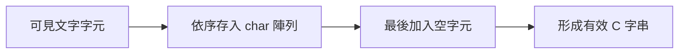
```mermaid
flowchart LR
    A[可見文字字元] --> B[依序存入 char 陣列]
    B --> C[最後加入空字元]
    C --> D[形成有效 C 字串]
```

---

### 2. 計算字串長度

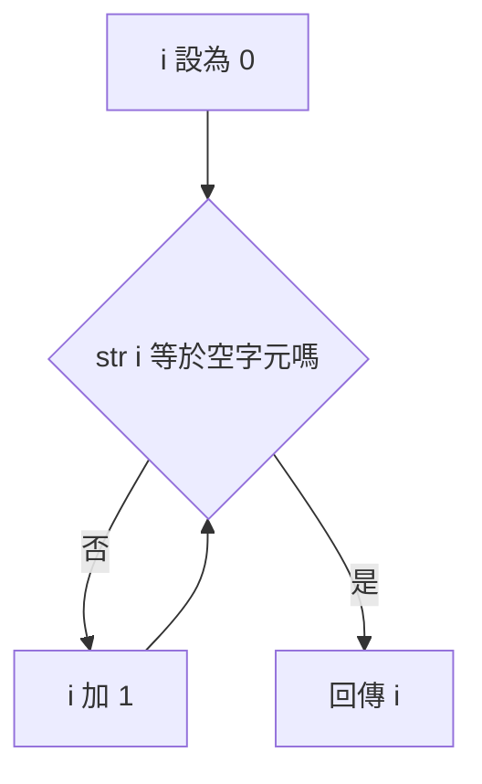
```mermaid
flowchart TD
    A[i 設為 0] --> B{str i 等於空字元嗎}
    B -- 否 --> C[i 加 1]
    C --> B
    B -- 是 --> D[回傳 i]
```

---

### 3. 終端輸入與 stdin


```mermaid
flowchart LR
    A[使用者在鍵盤輸入] --> B[按下 Enter]
    B --> C[文字與換行進入 stdin]
    C --> D[scanf 或 getchar 讀取]
    D --> E[寫入程式變數或陣列]
```

---

### 4. 逐字元讀取一行

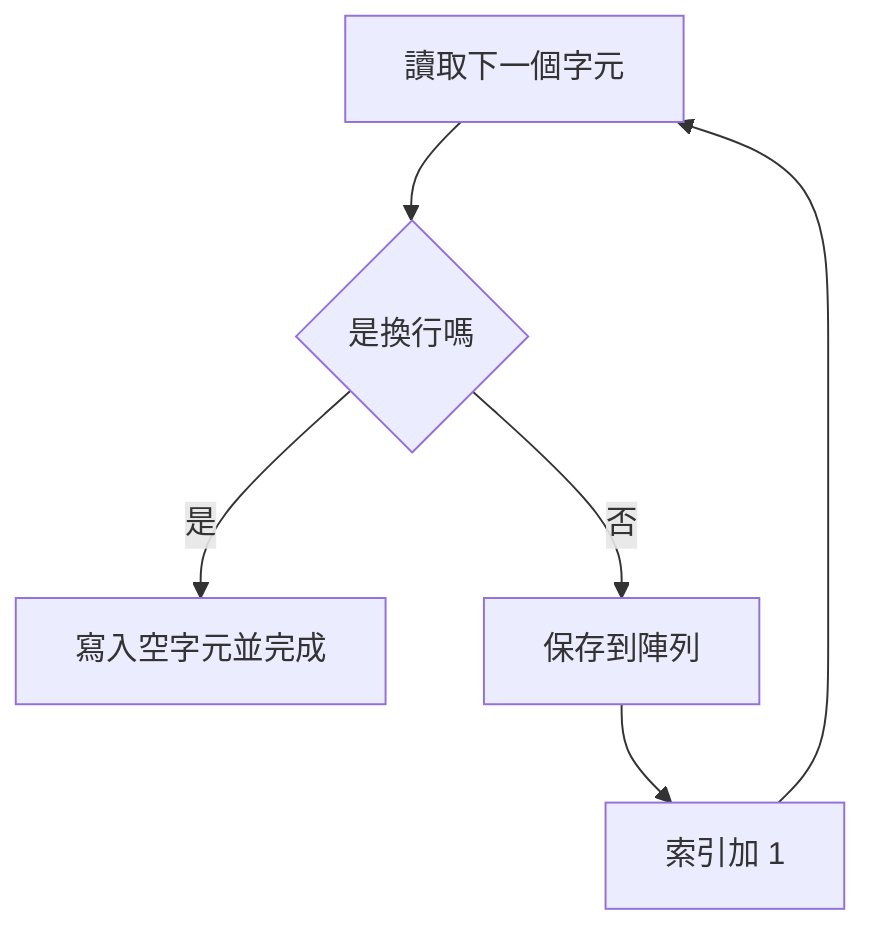
```mermaid
flowchart TD
    A[讀取下一個字元] --> B{是換行嗎}
    B -- 是 --> E[寫入空字元並完成]
    B -- 否 --> C[保存到陣列]
    C --> D[索引加 1]
    D --> A
```

---

### 5. 有容量限制的行輸入

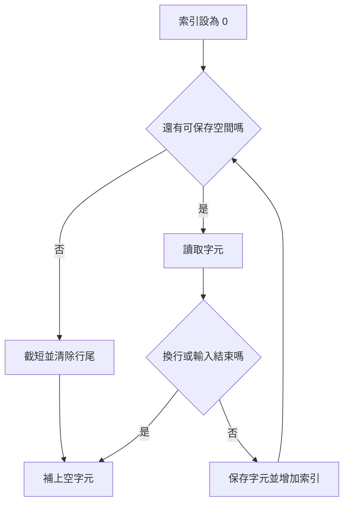
```mermaid
flowchart TD
    A[索引設為 0] --> B{還有可保存空間嗎}
    B -- 否 --> F[截短並清除行尾]
    B -- 是 --> C[讀取字元]
    C --> D{換行或輸入結束嗎}
    D -- 是 --> G[補上空字元]
    D -- 否 --> E[保存字元並增加索引]
    E --> B
    F --> G
```

---

### 6. 過長輸入的剩餘資料

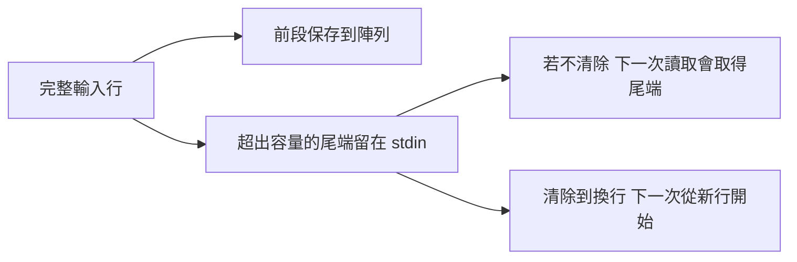
```mermaid
flowchart LR
    A[完整輸入行] --> B[前段保存到陣列]
    A --> C[超出容量的尾端留在 stdin]
    C --> D[若不清除 下一次讀取會取得尾端]
    C --> E[清除到換行 下一次從新行開始]
```

---

### 7. `scanf()` 整數轉換

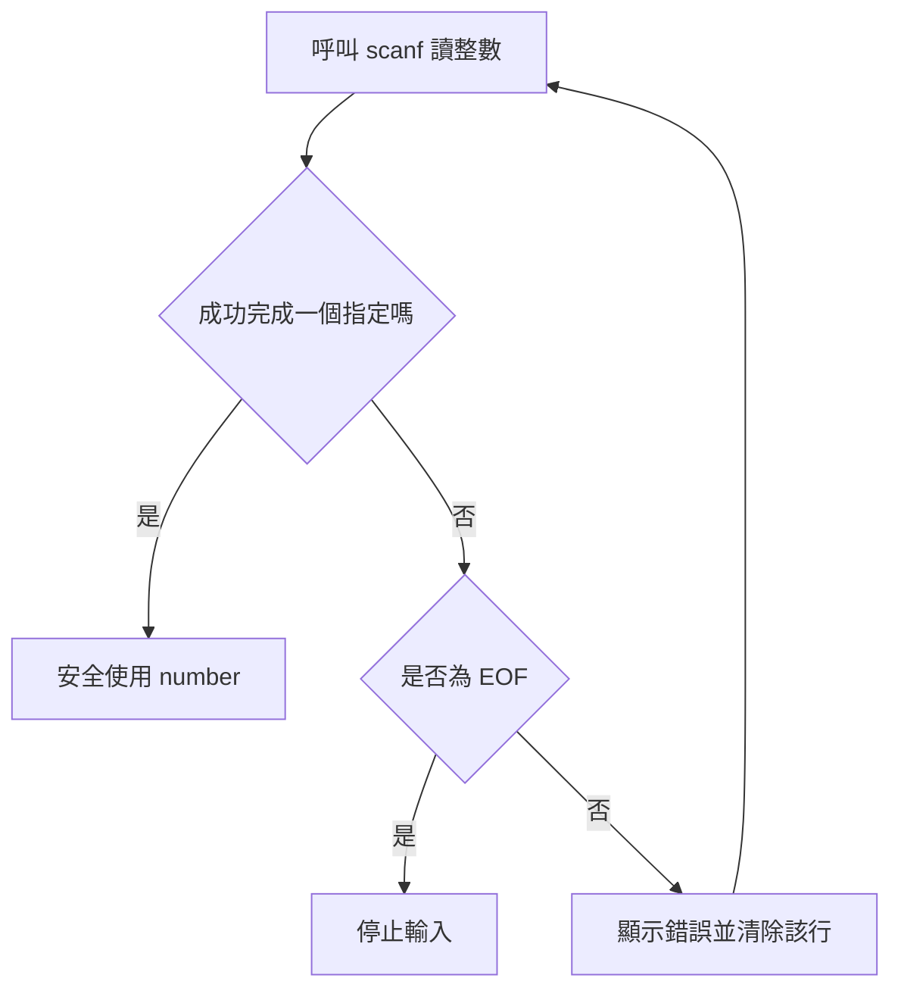
```mermaid
flowchart TD
    A[呼叫 scanf 讀整數] --> B{成功完成一個指定嗎}
    B -- 是 --> C[安全使用 number]
    B -- 否 --> D{是否為 EOF}
    D -- 是 --> E[停止輸入]
    D -- 否 --> F[顯示錯誤並清除該行]
    F --> A
```

---

### 8. 無限失敗的原因

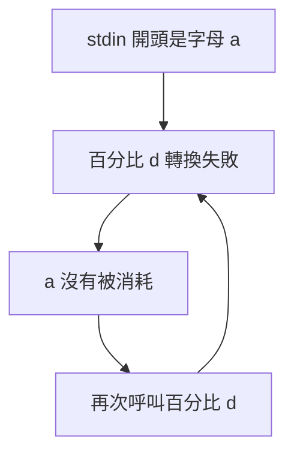
```mermaid
flowchart TD
    A[stdin 開頭是字母 a] --> B[百分比 d 轉換失敗]
    B --> C[a 沒有被消耗]
    C --> D[再次呼叫百分比 d]
    D --> B
```

---

## 本章完成標準

完成本章後，你應該能做到：

1. 說明 C 字串與 `char` 陣列的關係。
2. 說明 `'\0'` 的作用。
3. 分辨 `'\0'`、`'\n'` 與 `'0'`。
4. 計算字串字面常數所需的陣列容量。
5. 分辨陣列配置大小與文字長度。
6. 使用 `sizeof()` 查看完整字元陣列大小。
7. 自行撰寫 `str_len()`。
8. 手動追蹤第一個 `'\0'` 的位置。
9. 使用字元清單與字串字面常數初始化陣列。
10. 解釋部分初始化的零填補。
11. 找出沒有 `'\0'` 的危險字元陣列。
12. 安全使用 `%s` 輸出有效字串。
13. 說明 `stdin` 的基本輸入資料流模型。
14. 說明按下 Enter 後換行如何進入輸入資料。
15. 使用 `%c` 逐字元讀取空白與文字。
16. 讀到 `'\n'` 後建立 `'\0'` 結尾。
17. 完成來源的逐字元 `str_read()`。
18. 找出無容量限制的溢位問題。
19. 計算固定陣列的最大文字長度。
20. 使用長度參數避免寫到陣列外部。
21. 說明安全截短與溢位的差異。
22. 說明過長行的尾端為什麼留在 `stdin`。
23. 丟棄同一行剩餘字元。
24. 同時處理換行與 `EOF`。
25. 使用容量介面完成安全行輸入函式。
26. 正確處理空行。
27. 使用 `%d` 讀入整數。
28. 說明 `%d` 會忽略前導空白。
29. 使用 `scanf()` 回傳值判斷讀取成功。
30. 避免使用未初始化整數。
31. 說明轉換失敗字元會留在 `stdin`。
32. 找出直接重試造成無限失敗的原因。
33. 在失敗後清除該行並重新輸入。
34. 分辨成功筆數、轉換失敗與 `EOF`。
35. 分析 `123abc` 等部分成功輸入。
36. 說明 `%d` 與 `%c` 的空白處理差異。
37. 找出字串容量、字串長度與輸入長度的常見錯誤。
38. 準備進入後續字串與指標章節。
