# Lesson 21：Structures 結構

> 這堂課的重點：使用 `struct` 將姓名、學號、成績等不同型態但屬於同一筆資料的內容組合成一個完整物件，並學會宣告結構型態、建立結構變數、使用 `.` 存取成員、初始化與複製結構、將結構傳入函式及從函式回傳結構。最後會使用結構陣列完成學生資料的搜尋、統計與排序。

> 本章依一般 C17 語言知識獨立編寫，未使用 FEIS 第 22 章投影片。

---

## Section I. 今天要做什麼？

1. 複習普通變數、陣列與函式。
2. 理解為什麼一筆資料可能需要多種不同型態。
3. 觀察只使用平行陣列保存資料時的問題。
4. 認識 `struct` 關鍵字。
5. 宣告一個結構型態。
6. 理解結構標籤，例如 `struct Student`。
7. 認識結構成員 member。
8. 在結構中同時放入整數、浮點數與字元陣列。
9. 注意結構型態宣告結尾需要分號。
10. 使用結構型態建立變數。
11. 分辨「宣告結構型態」與「建立結構變數」。
12. 使用 `.` 成員存取運算子。
13. 對單一成員賦值。
14. 讀取並輸出單一成員。
15. 使用初始化清單建立結構變數。
16. 理解初始化值按照成員宣告順序對應。
17. 使用指定初始化 designated initializer。
18. 使用 `.member = value` 提高可讀性。
19. 理解未明確初始化的剩餘成員會被設為零。
20. 分辨結構變數與結構成員。
21. 理解字元陣列成員仍然是陣列。
22. 找出 `student.name = "Amy";` 為什麼不合法。
23. 在初始化時設定字元陣列成員。
24. 使用安全方法修改字元陣列成員。
25. 使用 `snprintf()` 複製短文字。
26. 將一個結構變數賦值給另一個同型態結構。
27. 理解結構整體賦值會複製所有成員。
28. 比較結構賦值與陣列不能整體賦值的差異。
29. 驗證複製後兩個結構變數彼此獨立。
30. 理解 C 不允許直接使用 `==` 比較兩個結構。
31. 逐成員比較兩個結構。
32. 將結構作為函式參數。
33. 理解結構參數預設以值傳遞。
34. 驗證函式內修改結構參數不會改變呼叫端。
35. 從函式回傳一個結構。
36. 使用「傳入一份結構、回傳修改後結構」更新資料。
37. 將建立結構物件的工作整理成函式。
38. 將輸出結構資料的工作整理成函式。
39. 建立結構陣列。
40. 理解 `students[i]` 是一個完整結構。
41. 使用 `students[i].score` 存取陣列元素的成員。
42. 使用迴圈輸出多筆結構資料。
43. 在結構陣列中搜尋指定學號。
44. 找出最高分的學生。
45. 同時保存最高分與其所屬學生資料。
46. 使用結構整體賦值交換兩筆學生資料。
47. 依成績排序結構陣列。
48. 理解交換結構比同步交換多個平行陣列更安全。
49. 建立巢狀結構 nested structure。
50. 在 `Student` 中加入 `Date`。
51. 使用兩個 `.` 存取巢狀成員。
52. 使用巢狀初始化清單。
53. 使用巢狀指定初始化。
54. 認識 `typedef`。
55. 使用 `typedef` 為結構型態建立較短名稱。
56. 比較 `struct Student` 與 `Student` 的寫法。
57. 理解結構標籤與變數名稱是不同角色。
58. 使用 `sizeof()` 查看結構物件大小。
59. 理解結構大小可能包含填補位元組 padding。
60. 不假設結構大小一定等於所有成員大小直接相加。
61. 認識結構適合表示一筆完整記錄 record。
62. 分辨結構、陣列與函式的責任。
63. 找出遺漏分號、成員名稱錯誤、初始化順序錯誤與字串成員賦值錯誤。
64. 使用概念檢查、程式閱讀與實作題整合本章內容。
65. 為下一章的指標基礎建立「完整物件」與「物件位置」的差異。

---

## Section II. 今天的學習方式

1. 先選一筆熟悉的資料，例如學生：
   ```text
   學號
   姓名
   成績
   ```
2. 為每一項資料決定型態。
3. 將屬於同一位學生的欄位畫在同一個方框內。
4. 將方框命名為：
   ```c
   struct Student
   ```
5. 先宣告型態，再建立變數。
6. 每次看到：
   ```c
   student.score
   ```
   都讀成：
   ```text
   student 這筆資料中的 score 成員
   ```
7. 初始化時，在成員宣告旁標出第幾個初始化值。
8. 使用指定初始化時，檢查成員名稱是否拼寫正確。
9. 結構中有字元陣列時，另外畫出它內部的字元格子與 `'\0'`。
10. 比較：
    ```c
    second = first;
    ```
    對結構與陣列的不同結果。
11. 函式參數練習中，分別畫出：
    - 呼叫端原結構
    - 函式內參數副本
12. 結構陣列中，同時追蹤：
    - 陣列索引
    - 結構成員
13. 排序時直接交換完整結構，不要逐欄位交換。
14. 巢狀結構先從外層成員開始，再進入內層成員。
15. `typedef` 只改變型態名稱的寫法，不會建立新資料。
16. 使用 `sizeof()` 時，只觀察結果，不背誦固定大小。
17. 所有完整且應合法的 C 程式都使用嚴格 C17 選項編譯。

---

## Section III. 今天會學到的內容

| 主題 | 你需要知道的事 |
| --- | --- |
| 結構 `struct` | 將多個可能不同型態的成員組成一個型態 |
| 結構標籤 | `struct Student` 中的 `Student` |
| 成員 member | 結構內的個別欄位 |
| 結構變數 | 使用結構型態建立的物件 |
| `.` 運算子 | 存取結構變數中的成員 |
| 初始化清單 | 按成員宣告順序提供初始值 |
| 指定初始化 | 使用 `.member = value` 指定成員 |
| 零初始化 | 未提供的剩餘成員設為零 |
| 字元陣列成員 | 結構中用來保存字串的陣列 |
| 結構賦值 | 同型態結構之間可使用 `=` 複製所有成員 |
| 結構比較 | C 不支援直接用 `==` 比較完整結構 |
| 值傳遞 | 結構作為普通參數時，函式取得一份副本 |
| 結構回傳 | 函式可以回傳完整結構物件 |
| 結構陣列 | 陣列中的每個元素都是完整結構 |
| 記錄 record | 一筆具有多個欄位的完整資料 |
| 平行陣列 | 使用多個陣列分別保存同一批資料的不同欄位 |
| 巢狀結構 | 結構成員本身也是另一個結構 |
| `typedef` | 為型態建立別名 |
| padding | 編譯器可能在成員間加入的填補空間 |
| `sizeof(struct)` | 完整結構物件所占的位元組數 |
| 整體交換 | 使用暫存結構交換兩筆完整記錄 |

---

## Section IV. 寫題目前的提醒

### 1. 結構是型態，不是單一固定變數

```c
struct Student {
    int id;
    char name[20];
    int score;
};
```

這段宣告建立一種新的結構型態：

```text
struct Student
```

它還沒有建立名為 `student` 的變數。

---

### 2. 結構型態宣告後要加分號

正確：

```c
struct Student {
    int id;
    int score;
};
```

錯誤：

```c
struct Student {
    int id;
    int score;
}   /* 缺少分號 */
```

---

### 3. 成員宣告不能直接使用一般執行述句

結構型態內放的是成員宣告：

```c
struct Student {
    int id;
    int score;
};
```

不能在其中寫：

```c
score = 100;
printf("...");
```

初始值要在建立變數時提供，或在程式執行時賦值。

---

### 4. 建立變數時必須寫完整型態名稱

未使用 `typedef` 前：

```c
struct Student student;
```

不是：

```c
Student student;   /* 尚未建立 typedef 時錯誤 */
```

---

### 5. 使用 `.` 存取成員

```c
student.id = 1001;
student.score = 95;
```

左邊：

```text
student
```

是結構變數。

右邊：

```text
id、score
```

是成員名稱。

---

### 6. 成員名稱必須存在於該結構型態

錯誤：

```c
student.grade = 95;
```

如果結構中沒有 `grade` 成員，便無法編譯。

---

### 7. 初始化清單依成員宣告順序對應

```c
struct Student {
    int id;
    char name[20];
    int score;
};

struct Student student = {
    1001,
    "Amy",
    95
};
```

對應：

```text
id    ← 1001
name  ← "Amy"
score ← 95
```

---

### 8. 改變成員順序可能改變一般初始化的意義

如果型態改成：

```c
struct Student {
    int score;
    int id;
    char name[20];
};
```

原本的初始化清單便不再正確對應。

指定初始化可以降低這種風險。

---

### 9. 指定初始化可改變書寫順序

```c
struct Student student = {
    .score = 95,
    .id = 1001,
    .name = "Amy"
};
```

編譯器依成員名稱放入資料，而不是依書寫順序猜測。

---

### 10. 未指定成員會初始化為零

```c
struct Student student = {
    .id = 1001
};
```

其餘成員：

- `name` 的字元全部為 `0`
- `score` 為 `0`

---

### 11. 字元陣列成員不能在建立後使用 `=` 指定字串

錯誤：

```c
struct Student student;

student.name = "Amy";
```

`name` 是陣列，陣列不能整體賦值。

---

### 12. 字元陣列成員可以在結構初始化時設定

```c
struct Student student = {
    1001,
    "Amy",
    95
};
```

這屬於初始化，不是執行期的陣列賦值。

---

### 13. 修改字元陣列成員時要確保容量與 `'\0'`

可以使用：

```c
snprintf(
    student.name,
    sizeof(student.name),
    "%s",
    "Amy"
);
```

這個寫法會依目標容量限制輸出。

---

### 14. 結構可以整體賦值

```c
struct Student first = {
    1001, "Amy", 95
};

struct Student second;

second = first;
```

所有成員都會被複製，包括陣列成員的每個元素。

---

### 15. 結構賦值後兩個變數彼此獨立

```c
second.score = 60;
```

不會改變：

```c
first.score
```

---

### 16. 只有相同或相容結構型態才能直接賦值

即使兩個不同標籤的結構擁有相同成員，它們仍是不同型態。

```c
struct A {
    int value;
};

struct B {
    int value;
};
```

不能直接假設：

```c
a = b;
```

合法。

---

### 17. C 不支援完整結構的 `==`

錯誤：

```c
if (first == second) {
}
```

必須自行決定哪些成員代表相等，並逐成員比較。

---

### 18. 字串成員比較不能使用 `==`

即使逐成員比較：

```c
first.name == second.name
```

也不是比較文字內容。

字串內容比較可使用：

```c
strcmp(first.name, second.name)
```

需要：

```c
#include <string.h>
```

---

### 19. 結構傳入函式時預設會複製整個物件

```c
void lower_score(struct Student student) {
    student.score = 0;
}
```

函式修改的是參數副本，不是呼叫端原物件。

---

### 20. 函式可以回傳結構

```c
struct Student add_bonus(
    struct Student student,
    int bonus
) {
    student.score += bonus;
    return student;
}
```

呼叫端可以接回新結構：

```c
student = add_bonus(student, 5);
```

---

### 21. 結構陣列的每個元素都是完整結構

```c
struct Student students[3];
```

合法元素：

```text
students[0]
students[1]
students[2]
```

每個元素都有自己的：

```text
id、name、score
```

---

### 22. 存取結構陣列成員需要兩個階段

```c
students[i].score
```

先選擇：

```c
students[i]
```

再選擇：

```text
score
```

---

### 23. 結構陣列排序時應交換完整結構

```c
struct Student temporary = students[j];
students[j] = students[j + 1];
students[j + 1] = temporary;
```

這會讓學號、姓名與成績保持同一筆資料。

---

### 24. 使用平行陣列排序容易漏掉同步交換

例如：

```c
int ids[3];
char names[3][20];
int scores[3];
```

交換成績時，如果忘記同步交換姓名或學號，資料關係會被破壞。

結構陣列可避免這類錯誤。

---

### 25. 巢狀結構使用多個 `.`

```c
student.birthday.year
```

讀成：

```text
student 的 birthday 成員中的 year 成員
```

---

### 26. `typedef` 不會建立變數

```c
typedef struct Student Student;
```

只建立型態別名：

```text
Student
```

之後仍要：

```c
Student student;
```

才會建立變數。

---

### 27. 結構大小可能大於成員大小總和

```c
struct Example {
    char code;
    int value;
};
```

編譯器可能在 `code` 與 `value` 之間加入 padding。

因此不要假設：

```text
sizeof(struct Example)
==
sizeof(char) + sizeof(int)
```

---

### 28. 成員排列可能影響結構大小

這屬於記憶體配置與對齊問題。

本章只要求：

- 使用 `sizeof()` 查詢
- 不依賴手算結果
- 不自行把結構當成緊密排列的位元組資料

---

## Section V. 核心概念說明

## Section V-A. 為什麼需要結構？

### 1. 一筆學生資料

一位學生可能具有：

```text
學號：1001
姓名：Amy
成績：95
```

三項資料型態不同：

```c
int id;
char name[20];
int score;
```

它們在概念上屬於同一位學生。

---

### 2. 只使用獨立變數

```c
int student1_id;
char student1_name[20];
int student1_score;

int student2_id;
char student2_name[20];
int student2_score;
```

學生數量增加後，變數名稱大量重複。

---

### 3. 使用平行陣列

```c
int ids[30];
char names[30][20];
int scores[30];
```

這比大量獨立變數好，但同一位學生的資料分散在三個陣列中。

必須一直記住：

```text
ids[i]
names[i]
scores[i]
```

三者才是同一筆記錄。

---

### 4. 使用結構

```c
struct Student {
    int id;
    char name[20];
    int score;
};
```

一筆資料可以寫成：

```c
struct Student student;
```

同一位學生的相關內容集中在一個物件中。

---


<p align="center">
  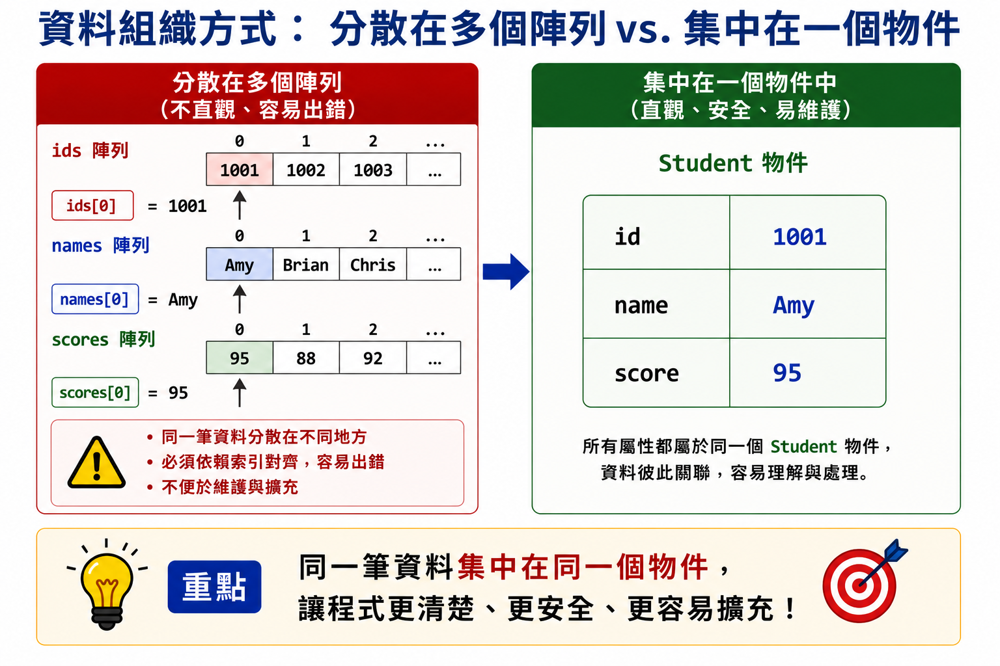
</p>


## Section V-B. 宣告結構型態與變數

### 5. 結構型態宣告

```c
struct Student {
    int id;
    char name[20];
    int score;
};
```

這建立：

```text
struct Student
```

型態。

---

### 6. 建立結構變數

```c
struct Student first;
struct Student second;
```

`first` 與 `second` 都具有：

```text
id、name、score
```

成員。

---


<p align="center">
  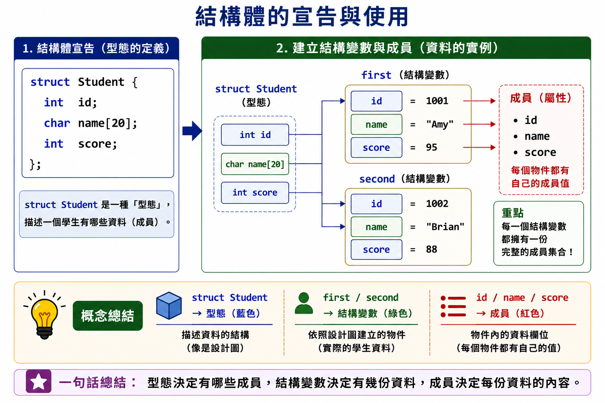
</p>


### 7. 宣告型態時同時建立變數

C 也允許：

```c
struct Student {
    int id;
    char name[20];
    int score;
} first, second;
```

但教學與大型程式中，分開宣告通常較容易閱讀。

---


<p align="center">
  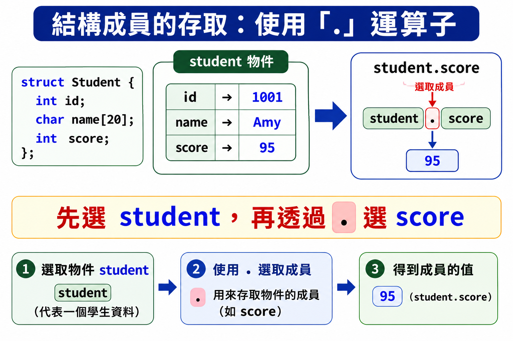
</p>


### 8. 完整成員賦值與輸出

```c
#include <stdio.h>

struct Student {
    int id;
    char name[20];
    int score;
};

int main(void) {
    struct Student student = {0};

    student.id = 1001;
    student.score = 95;

    snprintf(
        student.name,
        sizeof(student.name),
        "%s",
        "Amy"
    );

    printf("ID: %d\n", student.id);
    printf("Name: %s\n", student.name);
    printf("Score: %d\n", student.score);

    return 0;
}
```

---

## Section V-C. 結構初始化

### 9. 按順序初始化

```c
#include <stdio.h>

struct Student {
    int id;
    char name[20];
    int score;
};

int main(void) {
    struct Student student = {
        1001,
        "Amy",
        95
    };

    printf(
        "%d %s %d\n",
        student.id,
        student.name,
        student.score
    );

    return 0;
}
```

---

### 10. 指定初始化

```c
#include <stdio.h>

struct Student {
    int id;
    char name[20];
    int score;
};

int main(void) {
    struct Student student = {
        .score = 95,
        .name = "Amy",
        .id = 1001
    };

    printf(
        "%d %s %d\n",
        student.id,
        student.name,
        student.score
    );

    return 0;
}
```

指定初始化可讓讀者直接看出每個值屬於哪個成員。

---


<p align="center">
  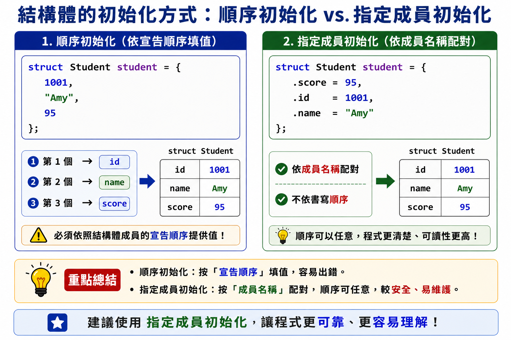
</p>


### 11. 部分指定初始化

```c
#include <stdio.h>

struct Student {
    int id;
    char name[20];
    int score;
};

int main(void) {
    struct Student student = {
        .id = 1001
    };

    printf("ID: %d\n", student.id);
    printf("Name: \"%s\"\n", student.name);
    printf("Score: %d\n", student.score);

    return 0;
}
```

輸出中的姓名為空字串，成績為 `0`。

---

## Section V-D. 字元陣列成員

### 12. 初始化時放入字串

```c
struct Student student = {
    1001,
    "Amy",
    95
};
```

字串會在建立結構變數時初始化 `name` 陣列。

---

### 13. 建立後修改姓名

```c
#include <stdio.h>

struct Student {
    int id;
    char name[20];
    int score;
};

int main(void) {
    struct Student student = {
        1001,
        "Amy",
        95
    };

    snprintf(
        student.name,
        sizeof(student.name),
        "%s",
        "Bob"
    );

    printf("%s\n", student.name);

    return 0;
}
```

---


<p align="center">
  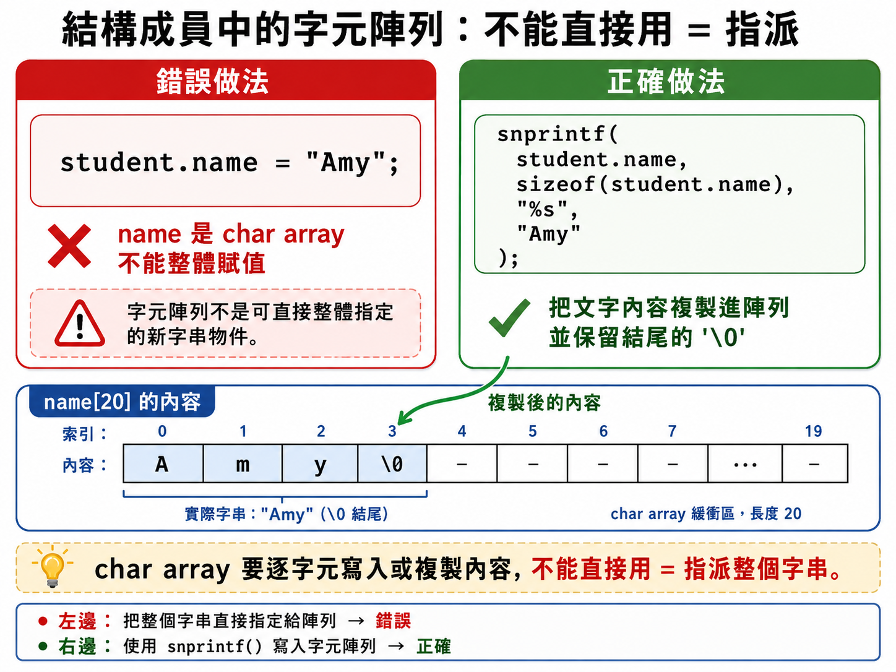
</p>


### 14. 為什麼使用 `sizeof(student.name)`？

```c
sizeof(student.name)
```

在此作用域中得到完整字元陣列容量。

`snprintf()` 可依容量限制寫入，並在容量大於零時建立結束字元。

---

## Section V-E. 結構整體複製

### 15. 結構可以使用 `=`

```c
#include <stdio.h>

struct Student {
    int id;
    char name[20];
    int score;
};

int main(void) {
    struct Student first = {
        1001,
        "Amy",
        95
    };
    struct Student second;

    second = first;
    second.id = 2001;
    second.score = 60;

    printf(
        "First: %d %s %d\n",
        first.id,
        first.name,
        first.score
    );
    printf(
        "Second: %d %s %d\n",
        second.id,
        second.name,
        second.score
    );

    return 0;
}
```

---

### 16. 結構複製會包含陣列成員

雖然：

```c
second.name = first.name;
```

不合法，但：

```c
second = first;
```

合法，而且會複製 `name` 陣列中的每個字元。

---


<p align="center">
  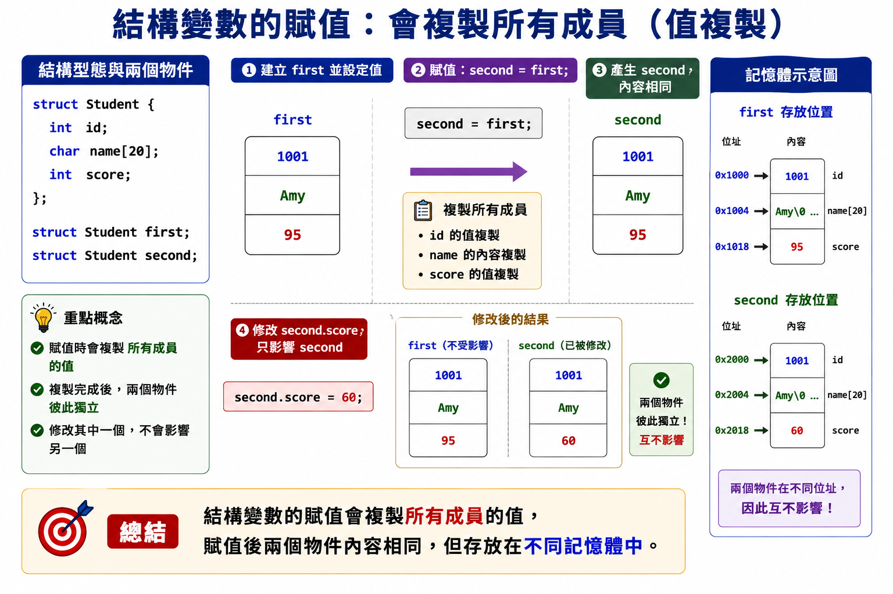
</p>


### 17. 與陣列章節比較

陣列：

```c
target = source;   /* 不合法 */
```

結構：

```c
second = first;    /* 合法 */
```

因為結構物件支援整體賦值。

---

## Section V-F. 比較兩個結構

### 18. 不能直接使用 `==`

錯誤：

```c
if (first == second) {
}
```

---

### 19. 自行定義相等條件

```c
#include <stdio.h>
#include <string.h>

struct Student {
    int id;
    char name[20];
    int score;
};

int students_equal(
    struct Student first,
    struct Student second
) {
    return
        first.id == second.id &&
        strcmp(first.name, second.name) == 0 &&
        first.score == second.score;
}

int main(void) {
    struct Student first = {
        1001, "Amy", 95
    };
    struct Student second = first;

    printf(
        "%d\n",
        students_equal(first, second)
    );

    return 0;
}
```

輸出：

```text
1
```

---

### 20. 相等規則由題目決定

有些系統只需要學號相同便視為同一學生：

```c
first.id == second.id
```

有些題目要求所有成員都相同。

程式必須先明確定義「相等」的意思。

---

## Section V-G. 結構作為函式參數

### 21. 結構以值傳遞

```c
#include <stdio.h>

struct Student {
    int id;
    char name[20];
    int score;
};

void set_score_zero(struct Student student) {
    student.score = 0;

    printf(
        "Inside: %d\n",
        student.score
    );
}

int main(void) {
    struct Student student = {
        1001, "Amy", 95
    };

    set_score_zero(student);

    printf(
        "Outside: %d\n",
        student.score
    );

    return 0;
}
```

輸出：

```text
Inside: 0
Outside: 95
```

---

### 22. 函式取得的是完整結構副本

這與陣列參數不同。

結構參數中的普通成員與陣列成員都屬於參數副本的一部分。

---


<p align="center">
  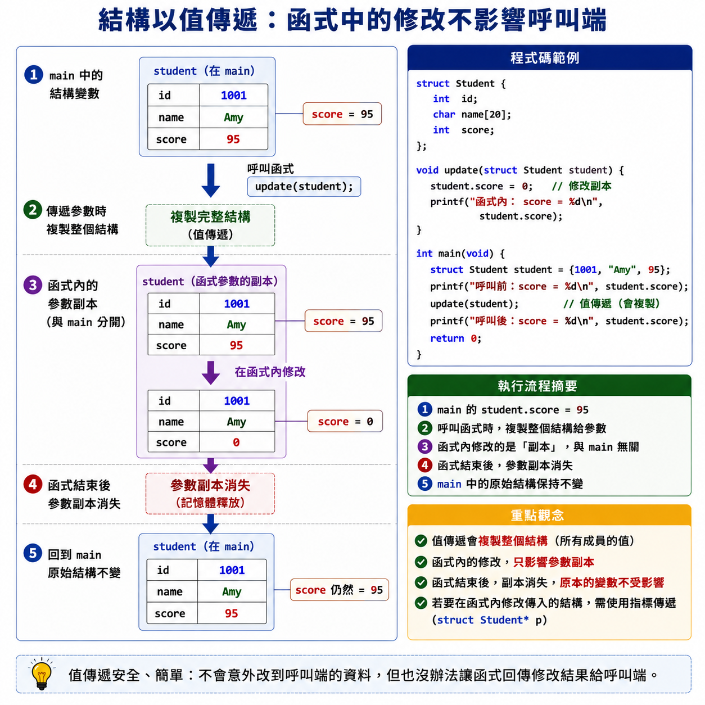
</p>


## Section V-H. 從函式回傳結構

### 23. 回傳修改後的副本

```c
#include <stdio.h>

struct Student {
    int id;
    char name[20];
    int score;
};

struct Student add_bonus(
    struct Student student,
    int bonus
) {
    student.score += bonus;

    if (student.score > 100) {
        student.score = 100;
    }

    return student;
}

int main(void) {
    struct Student student = {
        1001, "Amy", 95
    };

    student = add_bonus(student, 10);

    printf("%d\n", student.score);

    return 0;
}
```

輸出：

```text
100
```

---

### 24. 建立結構的函式

```c
#include <stdio.h>

struct Point {
    int x;
    int y;
};

struct Point make_point(int x, int y) {
    struct Point point = {
        .x = x,
        .y = y
    };

    return point;
}

int main(void) {
    struct Point point = make_point(3, 5);

    printf(
        "(%d, %d)\n",
        point.x,
        point.y
    );

    return 0;
}
```

---

### 25. 結構回傳與陣列回傳不同

前面學過：

- 函式不能直接回傳陣列型態。
- 函式可以直接回傳結構型態。

即使結構內含有陣列成員，整個結構仍可作為回傳值。

---

## Section V-I. 將輸出整理成函式

### 26. 輸出一筆學生資料

```c
#include <stdio.h>

struct Student {
    int id;
    char name[20];
    int score;
};

void print_student(struct Student student) {
    printf("ID: %d\n", student.id);
    printf("Name: %s\n", student.name);
    printf("Score: %d\n", student.score);
}

int main(void) {
    struct Student student = {
        1001, "Amy", 95
    };

    print_student(student);

    return 0;
}
```

這個函式只讀取參數副本，不修改呼叫端資料。

---

## Section V-J. 結構陣列

### 27. 建立三筆學生資料

```c
#include <stdio.h>

struct Student {
    int id;
    char name[20];
    int score;
};

int main(void) {
    int i;
    struct Student students[3] = {
        {1001, "Amy", 95},
        {1002, "Bob", 82},
        {1003, "Cathy", 91}
    };

    for (i = 0; i < 3; i++) {
        printf(
            "%d %s %d\n",
            students[i].id,
            students[i].name,
            students[i].score
        );
    }

    return 0;
}
```

---

### 28. 索引與成員的關係

```c
students[1]
```

代表第二個完整學生結構。

```c
students[1].name
```

代表第二位學生的姓名。

---


<p align="center">
  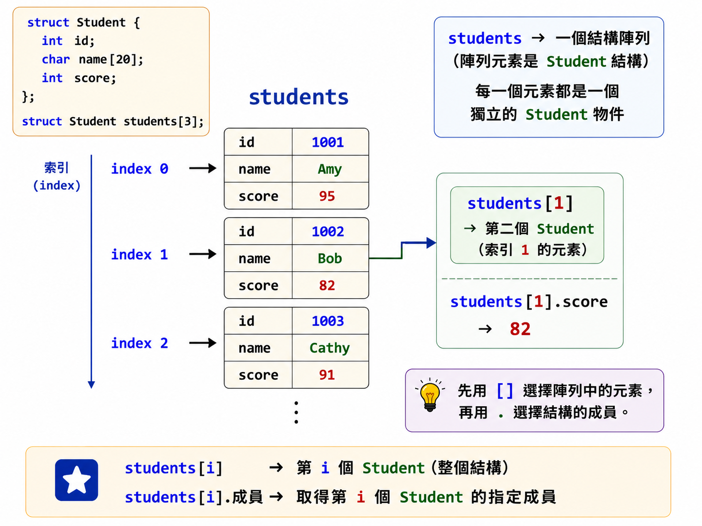
</p>


## Section V-K. 搜尋結構陣列

### 29. 依學號搜尋

```c
#include <stdio.h>

struct Student {
    int id;
    char name[20];
    int score;
};

int find_student_index(
    struct Student students[],
    int length,
    int target_id
) {
    int i;

    for (i = 0; i < length; i++) {
        if (students[i].id == target_id) {
            return i;
        }
    }

    return -1;
}

int main(void) {
    struct Student students[3] = {
        {1001, "Amy", 95},
        {1002, "Bob", 82},
        {1003, "Cathy", 91}
    };
    int index =
        find_student_index(students, 3, 1002);

    if (index != -1) {
        printf(
            "%s\n",
            students[index].name
        );
    } else {
        printf("Not found\n");
    }

    return 0;
}
```

---

### 30. 為什麼回傳索引？

索引可以讓呼叫端取得整筆資料：

```c
students[index]
```

也可以取得任意成員：

```c
students[index].score
```

---

## Section V-L. 找出最高分學生

### 31. 回傳完整結構

```c
#include <stdio.h>

struct Student {
    int id;
    char name[20];
    int score;
};

struct Student highest_student(
    struct Student students[],
    int length
) {
    int i;
    struct Student highest = students[0];

    for (i = 1; i < length; i++) {
        if (students[i].score > highest.score) {
            highest = students[i];
        }
    }

    return highest;
}

int main(void) {
    struct Student students[3] = {
        {1001, "Amy", 95},
        {1002, "Bob", 82},
        {1003, "Cathy", 91}
    };
    struct Student highest =
        highest_student(students, 3);

    printf(
        "%s %d\n",
        highest.name,
        highest.score
    );

    return 0;
}
```

---

### 32. 前提

來源陣列至少要有一個元素：

```text
length >= 1
```

因為函式使用：

```c
students[0]
```

初始化答案。

---

## Section V-M. 排序結構陣列

### 33. 依成績由高到低排序

```c
#include <stdio.h>

struct Student {
    int id;
    char name[20];
    int score;
};

void sort_by_score_descending(
    struct Student students[],
    int length
) {
    int i;
    int j;

    for (i = 0; i < length - 1; i++) {
        for (j = 0; j < length - i - 1; j++) {
            if (
                students[j].score <
                students[j + 1].score
            ) {
                struct Student temporary =
                    students[j];

                students[j] = students[j + 1];
                students[j + 1] = temporary;
            }
        }
    }
}

int main(void) {
    int i;
    struct Student students[4] = {
        {1001, "Amy", 95},
        {1002, "Bob", 82},
        {1003, "Cathy", 91},
        {1004, "David", 88}
    };

    sort_by_score_descending(students, 4);

    for (i = 0; i < 4; i++) {
        printf(
            "%d %s %d\n",
            students[i].id,
            students[i].name,
            students[i].score
        );
    }

    return 0;
}
```

---

### 34. 為什麼交換完整結構？

如果只交換：

```c
students[j].score
```

姓名與學號便不再和成績對應。

交換完整結構可保持每筆資料完整。

---


<p align="center">
  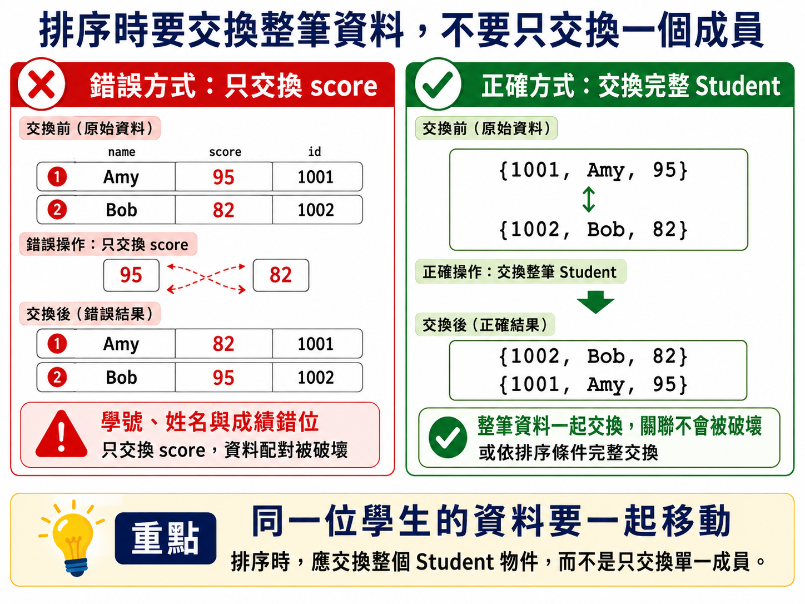
</p>


### 35. 平手規則

上面的版本只在左邊分數較低時交換：

```c
<
```

分數相同時保留原本順序。

也可以另外定義平手時依學號或姓名排序。

---

## Section V-N. 巢狀結構

### 36. 日期結構

```c
struct Date {
    int year;
    int month;
    int day;
};
```

---

### 37. 在學生結構中使用日期

```c
struct Student {
    int id;
    char name[20];
    int score;
    struct Date birthday;
};
```

`birthday` 是一個完整的 `struct Date` 成員。

---

### 38. 完整巢狀結構範例

```c
#include <stdio.h>

struct Date {
    int year;
    int month;
    int day;
};

struct Student {
    int id;
    char name[20];
    int score;
    struct Date birthday;
};

int main(void) {
    struct Student student = {
        .id = 1001,
        .name = "Amy",
        .score = 95,
        .birthday = {
            .year = 2010,
            .month = 7,
            .day = 15
        }
    };

    printf(
        "%04d-%02d-%02d\n",
        student.birthday.year,
        student.birthday.month,
        student.birthday.day
    );

    return 0;
}
```

---

### 39. 多層成員存取

```c
student.birthday.year
```

執行順序：

1. 取得 `student`
2. 取得它的 `birthday`
3. 取得 `birthday` 的 `year`

---


<p align="center">
  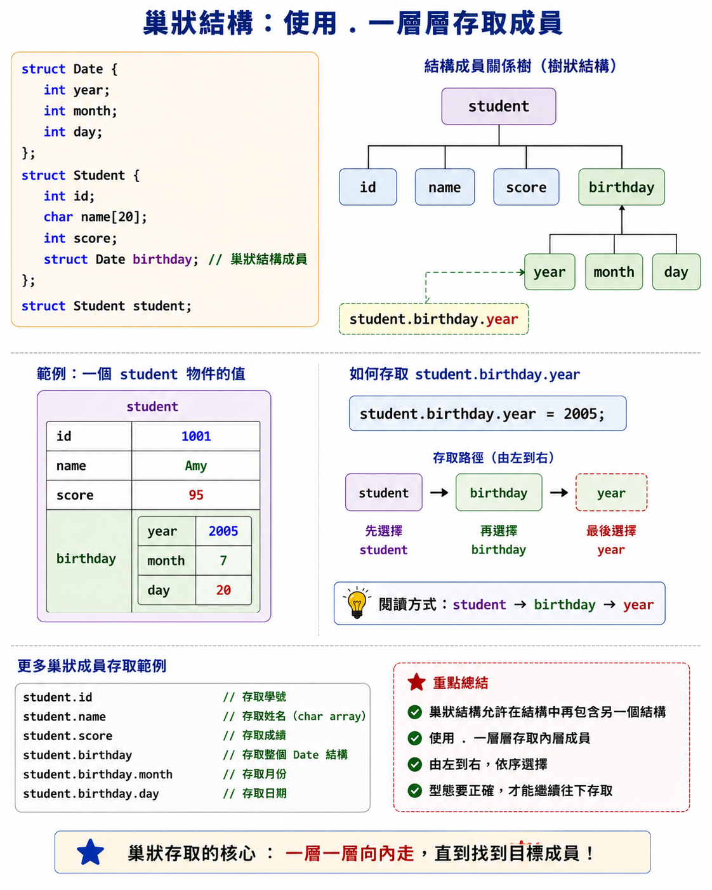
</p>


## Section V-O. 使用 `typedef`

### 40. 分開建立標籤與別名

```c
struct Student {
    int id;
    char name[20];
    int score;
};

typedef struct Student Student;
```

之後可以寫：

```c
Student student;
```

---

### 41. 宣告時直接建立別名

```c
typedef struct {
    int id;
    char name[20];
    int score;
} Student;
```

這個版本沒有結構標籤，只建立 `Student` 型態別名。

---

### 42. 完整 `typedef` 範例

```c
#include <stdio.h>

typedef struct {
    int x;
    int y;
} Point;

int main(void) {
    Point first = {3, 5};
    Point second = {
        .x = 10,
        .y = 20
    };

    printf(
        "(%d, %d)\n",
        first.x,
        first.y
    );
    printf(
        "(%d, %d)\n",
        second.x,
        second.y
    );

    return 0;
}
```

---

### 43. `typedef` 不會改變物件行為

以下兩種變數具有相同結構能力：

```c
struct Student first;
Student second;
```

前提是已經建立：

```c
typedef struct Student Student;
```

---

## Section V-P. 結構大小與 padding

### 44. 使用 `sizeof()` 查看大小

```c
#include <stdio.h>

struct Example {
    char code;
    int value;
};

int main(void) {
    printf(
        "char: %zu\n",
        sizeof(char)
    );
    printf(
        "int: %zu\n",
        sizeof(int)
    );
    printf(
        "struct Example: %zu\n",
        sizeof(struct Example)
    );

    return 0;
}
```

---

### 45. 為什麼可能比成員總和大？

編譯器可能為了記憶體對齊，在成員之間或結構末端加入 padding。

因此實際大小由：

- 成員型態
- 成員順序
- 編譯器
- 平台 ABI

共同決定。

---

### 46. 不要直接將結構當成外部檔案格式

若要把結構寫入檔案或透過網路傳送，不能只假設其記憶體配置在所有環境都相同。

這是後續檔案與低階資料處理會再遇到的問題。

---

## Section V-Q. 容易搞混的重點

### 47. `struct Student` 是型態，`student` 是變數

```c
struct Student student;
```

角色不同：

```text
struct Student → 型態
student        → 變數名稱
```

---

### 48. 成員名稱只在結構內表示欄位

不同結構可以都有：

```c
int id;
```

不會因此變成同一個普通全域變數。

---

### 49. 結構中的陣列成員仍遵守陣列規則

不能寫：

```c
student.name = other_name;
```

但可以透過結構整體賦值複製：

```c
second = first;
```

---

### 50. 結構參數與陣列參數行為不同

結構參數：

```text
完整物件副本
```

陣列參數：

```text
第一個元素的位置資訊
```

因此兩者在函式內修改時有不同結果。

---

### 51. 結構回傳不代表回傳原物件本身

函式回傳一個結構值。

呼叫端可以將它存入新變數或賦值回原變數。

---

### 52. `typedef` 名稱不是變數

```c
Student
```

若它是 `typedef` 名稱，代表型態，不保存資料。

---

### 53. 巢狀結構不是二維陣列

```c
student.birthday.year
```

是逐層選擇成員。

```c
grid[row][column]
```

是逐層索引陣列。

語法與用途不同。

---

## Section VI. 快速概念檢查

### Q1. `struct` 的主要用途是什麼？

<details>
<summary>查看答案</summary>

將多個可能不同型態、但屬於同一筆資料的成員組合成一個完整型態。

</details>

---

### Q2. 結構型態宣告結尾需要什麼？

<details>
<summary>查看答案</summary>

分號：

```c
};
```

</details>

---

### Q3. 未使用 `typedef` 時，如何建立學生結構變數？

<details>
<summary>查看答案</summary>

```c
struct Student student;
```

</details>

---

### Q4. 如何存取 `student` 的 `score` 成員？

<details>
<summary>查看答案</summary>

```c
student.score
```

</details>

---

### Q5. 指定初始化的寫法是什麼？

<details>
<summary>查看答案</summary>

```c
struct Student student = {
    .id = 1001,
    .score = 95
};
```

</details>

---

### Q6. `student.name = "Amy";` 為什麼不合法？

<details>
<summary>查看答案</summary>

`name` 是字元陣列，而陣列不能在建立後使用整體賦值。

</details>

---

### Q7. 結構可以使用整體賦值嗎？

<details>
<summary>查看答案</summary>

可以，只要兩邊是相同或相容的結構型態：

```c
second = first;
```

</details>

---

### Q8. 結構整體賦值會複製陣列成員嗎？

<details>
<summary>查看答案</summary>

會。結構中的所有成員都會被複製。

</details>

---

### Q9. 可以使用 `first == second` 比較兩個結構嗎？

<details>
<summary>查看答案</summary>

不可以。要依題目定義逐成員比較。

</details>

---

### Q10. 結構作為普通函式參數時，函式取得什麼？

<details>
<summary>查看答案</summary>

一份完整結構值的副本。

</details>

---

### Q11. 函式可以直接回傳結構嗎？

<details>
<summary>查看答案</summary>

可以。

</details>

---

### Q12. `students[2].score` 表示什麼？

<details>
<summary>查看答案</summary>

結構陣列中第三位學生的 `score` 成員。

</details>

---

### Q13. 排序學生資料時為什麼要交換完整結構？

<details>
<summary>查看答案</summary>

要讓學號、姓名與成績保持屬於同一筆資料。

</details>

---

### Q14. 如何存取生日年份？

已知：

```c
student.birthday
```

是日期結構。

<details>
<summary>查看答案</summary>

```c
student.birthday.year
```

</details>

---

### Q15. `typedef` 的用途是什麼？

<details>
<summary>查看答案</summary>

為型態建立另一個名稱，讓宣告更簡短。

</details>

---

### Q16. 結構大小一定等於所有成員大小總和嗎？

<details>
<summary>查看答案</summary>

不一定。編譯器可能加入 padding。

</details>

---

## Section VII. 程式閱讀練習

### 題目 1：成員值

```c
struct Point {
    int x;
    int y;
};

struct Point point = {3, 7};
```

`point.y` 是多少？

<details>
<summary>查看答案</summary>

```text
7
```

</details>

---

### 題目 2：指定初始化

```c
struct Point point = {
    .y = 9
};
```

<details>
<summary>查看答案</summary>

```text
point.x == 0
point.y == 9
```

</details>

---

### 題目 3：結構複製

```c
struct Point first = {1, 2};
struct Point second = first;

second.x = 100;
```

<details>
<summary>查看答案</summary>

```text
first.x == 1
second.x == 100
```

</details>

---

### 題目 4：值傳遞

```c
void change(struct Point point) {
    point.x = 99;
}
```

呼叫端：

```c
struct Point point = {1, 2};
change(point);
```

<details>
<summary>查看答案</summary>

呼叫端的：

```text
point.x
```

仍為 `1`。

</details>

---

### 題目 5：回傳結構

```c
struct Point move_right(
    struct Point point
) {
    point.x++;
    return point;
}
```

呼叫：

```c
point = move_right(point);
```

<details>
<summary>查看答案</summary>

`point.x` 增加 `1`。

</details>

---

### 題目 6：結構陣列

```c
struct Point points[3] = {
    {1, 2},
    {3, 4},
    {5, 6}
};
```

`points[1].x` 是多少？

<details>
<summary>查看答案</summary>

```text
3
```

</details>

---

### 題目 7：巢狀結構

```c
student.birthday.month = 8;
```

<details>
<summary>查看答案</summary>

將 `student` 的生日月份成員設為 `8`。

</details>

---

### 題目 8：排序交換

```c
struct Student temporary = students[0];
students[0] = students[1];
students[1] = temporary;
```

<details>
<summary>查看答案</summary>

第一筆與第二筆完整學生資料交換，包括所有成員。

</details>

---

### 題目 9：`typedef`

```c
typedef struct {
    int value;
} Number;

Number number = {5};
```

<details>
<summary>查看答案</summary>

`Number` 是型態別名，`number.value` 為 `5`。

</details>

---

### 題目 10：錯誤比較

```c
if (first == second) {
}
```

其中兩者都是結構。

<details>
<summary>查看答案</summary>

C 不支援完整結構的 `==` 比較，必須逐成員比較。

</details>

---

## Section VIII. 實作練習 / 實作檢測題

### TODO 1：建立書籍結構

宣告：

```c
struct Book {
    int id;
    char title[50];
    double price;
};
```

建立一個變數並輸出所有成員。

---

### TODO 2：指定初始化

使用指定初始化建立一本書，故意改變成員書寫順序。

---

### TODO 3：修改字串成員

使用 `snprintf()` 修改書名，確認不超過陣列容量。

---

### TODO 4：結構複製

複製一本書到另一個結構變數，修改副本價格，證明原本價格不變。

---

### TODO 5：比較兩個座標

撰寫：

```c
int points_equal(
    struct Point first,
    struct Point second
);
```

當 `x` 與 `y` 都相同時回傳 `1`。

---

### TODO 6：移動座標

撰寫：

```c
struct Point move(
    struct Point point,
    int dx,
    int dy
);
```

回傳移動後的新座標。

---

### TODO 7：建立學生函式

撰寫：

```c
struct Student make_student(
    int id,
    const char name[],
    int score
);
```

需要安全複製姓名。

這一題中的 `const char name[]` 會用到前面字串與陣列參數概念。

---

### TODO 8：輸出學生函式

撰寫：

```c
void print_student(
    struct Student student
);
```

---

### TODO 9：學生結構陣列

建立五筆學生資料，使用迴圈輸出。

---

### TODO 10：依學號搜尋

回傳找到的索引；找不到回傳 `-1`。

---

### TODO 11：平均成績

撰寫：

```c
double average_score(
    struct Student students[],
    int length
);
```

---

### TODO 12：最高分學生

回傳完整的 `struct Student`。

前提為 `length >= 1`。

---

### TODO 13：依成績排序

使用泡沫排序將學生由高分排到低分。

交換完整結構。

---

### TODO 14：巢狀地址結構

建立：

```c
struct Address {
    char city[30];
    char street[50];
};

struct Person {
    char name[30];
    struct Address address;
};
```

輸出完整地址。

---

### TODO 15：使用 `typedef`

將 TODO 14 改成：

```c
typedef struct {
    ...
} Address;
```

與：

```c
typedef struct {
    ...
} Person;
```

---

## Section IX. 做題時可以使用的提示

### 1. 先列出一筆資料有哪些欄位

```text
欄位名稱
欄位型態
欄位意義
```

再宣告結構。

---

### 2. 初始化錯誤時檢查成員順序

或改用指定初始化：

```c
.member = value
```

---

### 3. 字串成員修改時檢查容量

```c
sizeof(object.member)
```

通常可得到該陣列成員的完整容量。

---

### 4. 函式修改無效時檢查是否只是值傳遞副本

若函式接收：

```c
struct Student student
```

它修改的是副本。

可以：

- 回傳修改後結構
- 或在學會指標後傳入物件位址

---

### 5. 結構陣列排序錯亂時檢查是否只交換一個成員

應交換：

```c
students[j]
```

整個結構。

---

### 6. 巢狀成員由外到內閱讀

```c
student.birthday.year
```

先讀 `student`，再讀 `birthday`，最後讀 `year`。

---

### 7. 建議測試資料

```text
空字串姓名
姓名接近容量上限
分數 0
分數 100
相同分數
找不到的學號
只有一筆資料
```

---

## Section X. 課後小練習

### 練習 1：商品資料

建立商品結構：

```text
編號
名稱
單價
庫存
```

計算單項商品庫存總值。

---

### 練習 2：矩形

建立：

```c
struct Rectangle {
    double width;
    double height;
};
```

撰寫面積與周長函式。

---

### 練習 3：成績等第

在學生結構中加入：

```c
char grade;
```

依分數計算 `A–F`。

---

### 練習 4：日期比較

建立 `struct Date`，撰寫函式判斷哪個日期較早。

---

### 練習 5：最高價商品

使用商品結構陣列找出單價最高的商品。

---

### 練習 6：依名稱搜尋

使用 `strcmp()` 在結構陣列中搜尋指定姓名。

---

### 練習 7：多條件排序

學生先依成績由高到低排序；分數相同時依學號由小到大。

---

### 練習 8：結構大小觀察

建立數個成員順序不同的結構，使用 `sizeof()` 比較結果。

只觀察，不假設所有平台相同。

---

## Section XI. 重點複習

1. 結構可以組合不同型態的相關資料。
2. `struct` 用來宣告結構型態。
3. 結構內的欄位稱為成員。
4. 結構型態宣告結尾需要分號。
5. `struct Student` 是型態名稱的一部分。
6. 建立變數時可寫 `struct Student student;`。
7. 使用 `.` 存取結構變數成員。
8. 成員名稱必須存在於該型態。
9. 一般初始化依成員宣告順序對應。
10. 指定初始化使用 `.member = value`。
11. 未指定的剩餘成員會初始化為零。
12. 字元陣列可以作為結構成員。
13. 字元陣列成員不能在建立後使用整體賦值。
14. 可在結構初始化時設定字元陣列成員。
15. 可使用具容量限制的方法修改字串成員。
16. 同型態結構可以使用 `=` 整體複製。
17. 結構整體複製包含陣列成員。
18. 複製後兩個結構變數彼此獨立。
19. C 不支援使用 `==` 比較完整結構。
20. 結構相等規則必須由程式逐成員定義。
21. 字串成員內容比較可使用 `strcmp()`。
22. 結構作為普通函式參數時以值傳遞。
23. 函式內修改參數副本不會改變呼叫端。
24. 函式可以回傳完整結構。
25. 可以傳入結構並回傳修改後副本。
26. 結構陣列的每個元素都是完整記錄。
27. `students[i].score` 同時使用索引與成員存取。
28. 結構陣列可以使用迴圈搜尋與統計。
29. 找最高分時可以保存完整學生結構。
30. 排序時應交換完整結構。
31. 結構可避免平行陣列不同步。
32. 結構成員可以是另一個結構。
33. 巢狀成員可使用多個 `.` 存取。
34. `typedef` 可以為結構型態建立較短名稱。
35. `typedef` 不會建立資料物件。
36. 結構大小可能包含 padding。
37. 應使用 `sizeof()` 查詢實際大小。
38. 不應假設不同平台的結構記憶體配置相同。
39. 下一章將開始學習指標與物件位址。

---

## Section XII. 常見錯誤提醒

### 錯誤 1：結構型態宣告後漏掉分號

```c
struct Student {
    int id;
}
```

---

### 錯誤 2：未使用 `struct` 或 `typedef`

```c
Student student;
```

如果尚未建立 `Student` 別名，會編譯失敗。

---

### 錯誤 3：使用不存在的成員

```c
student.grade
```

但型態中只有 `score`。

---

### 錯誤 4：一般初始化順序與成員順序不一致

可能將學號放入成績、成績放入學號。

---

### 錯誤 5：字串成員使用整體賦值

```c
student.name = "Amy";
```

---

### 錯誤 6：複製字串成員時忽略容量

可能造成緩衝區溢位或缺少 `'\0'`。

---

### 錯誤 7：以為結構不能整體賦值

結構與陣列不同，結構可以：

```c
second = first;
```

---

### 錯誤 8：使用 `==` 比較完整結構

C 不支援。

---

### 錯誤 9：使用 `==` 比較字串成員內容

應使用 `strcmp()`。

---

### 錯誤 10：函式內修改結構參數，卻期待原物件改變

普通結構參數是副本。

---

### 錯誤 11：回傳新結構後沒有接住結果

```c
add_bonus(student, 5);
```

若函式以值回傳，應：

```c
student = add_bonus(student, 5);
```

---

### 錯誤 12：結構陣列存取漏掉索引

```c
students.score
```

`students` 是陣列，應先選擇元素：

```c
students[i].score
```

---

### 錯誤 13：排序時只交換成績

會破壞姓名、學號與成績的對應。

---

### 錯誤 14：巢狀結構少寫一層成員

```c
student.year
```

如果 `year` 位於 `birthday` 中，應寫：

```c
student.birthday.year
```

---

### 錯誤 15：認為 `typedef` 會配置記憶體

它只建立型態名稱。

---

### 錯誤 16：手算結構大小並假設所有平台相同

可能忽略 padding 與對齊規則。

---

## Section XIII. Mermaid 流程圖

### 1. 從多個欄位建立結構

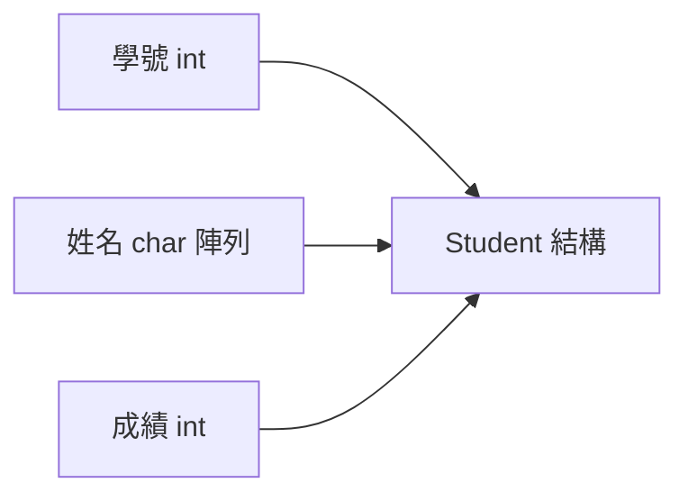
```mermaid
flowchart LR
    A[學號 int] --> D[Student 結構]
    B[姓名 char 陣列] --> D
    C[成績 int] --> D
```

---

### 2. 結構型態與變數

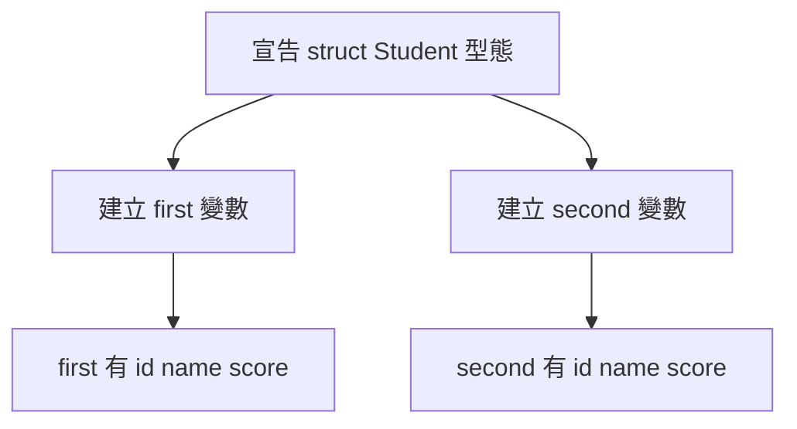
```mermaid
flowchart TD
    A[宣告 struct Student 型態] --> B[建立 first 變數]
    A --> C[建立 second 變數]
    B --> D[first 有 id name score]
    C --> E[second 有 id name score]
```

---

### 3. 成員存取

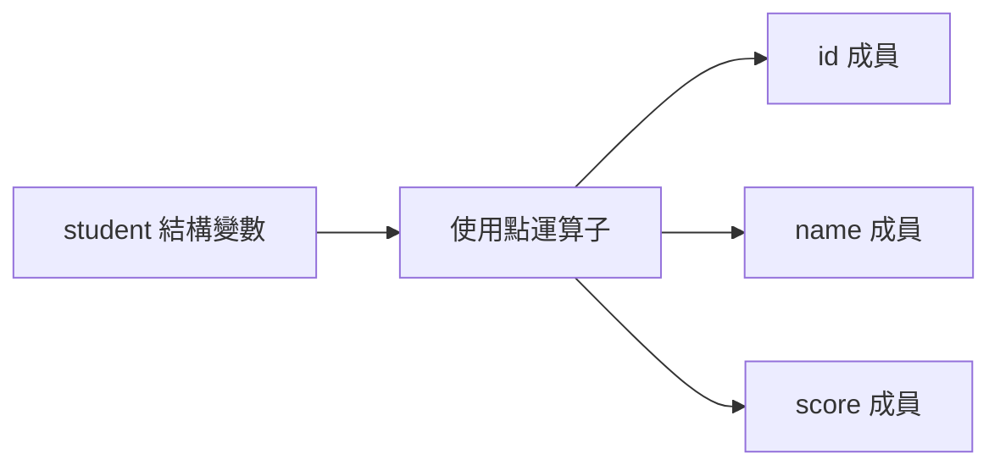
```mermaid
flowchart LR
    A[student 結構變數] --> B[使用點運算子]
    B --> C[id 成員]
    B --> D[name 成員]
    B --> E[score 成員]
```

---

### 4. 結構複製

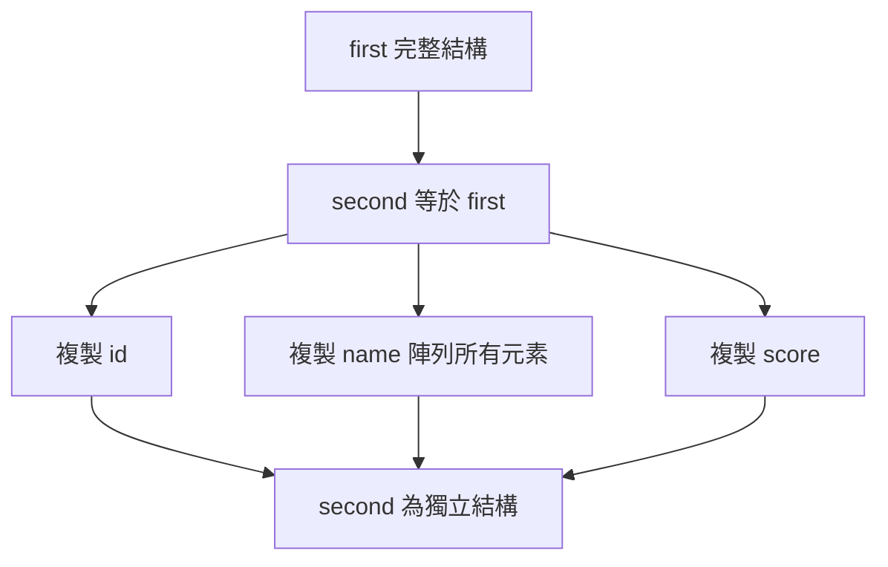
```mermaid
flowchart TD
    A[first 完整結構] --> B[second 等於 first]
    B --> C[複製 id]
    B --> D[複製 name 陣列所有元素]
    B --> E[複製 score]
    C --> F[second 為獨立結構]
    D --> F
    E --> F
```

---

### 5. 結構值傳遞

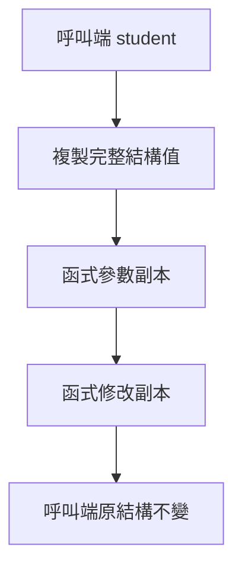
```mermaid
flowchart TD
    A[呼叫端 student] --> B[複製完整結構值]
    B --> C[函式參數副本]
    C --> D[函式修改副本]
    D --> E[呼叫端原結構不變]
```

---

### 6. 回傳修改後結構

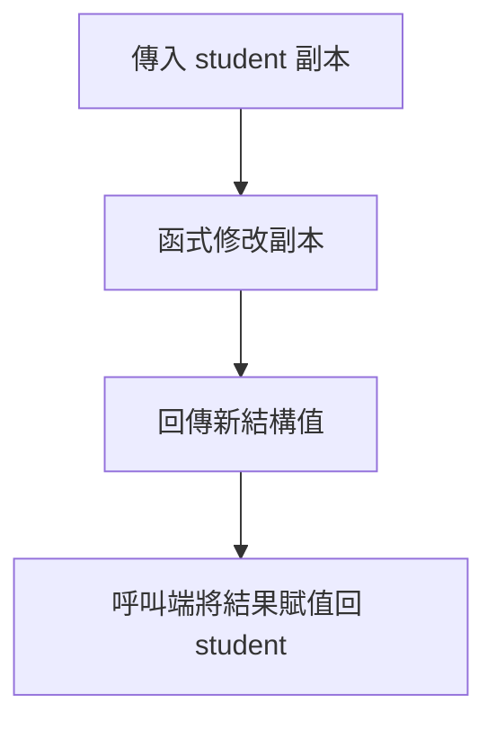
```mermaid
flowchart TD
    A[傳入 student 副本] --> B[函式修改副本]
    B --> C[回傳新結構值]
    C --> D[呼叫端將結果賦值回 student]
```

---

### 7. 結構陣列搜尋

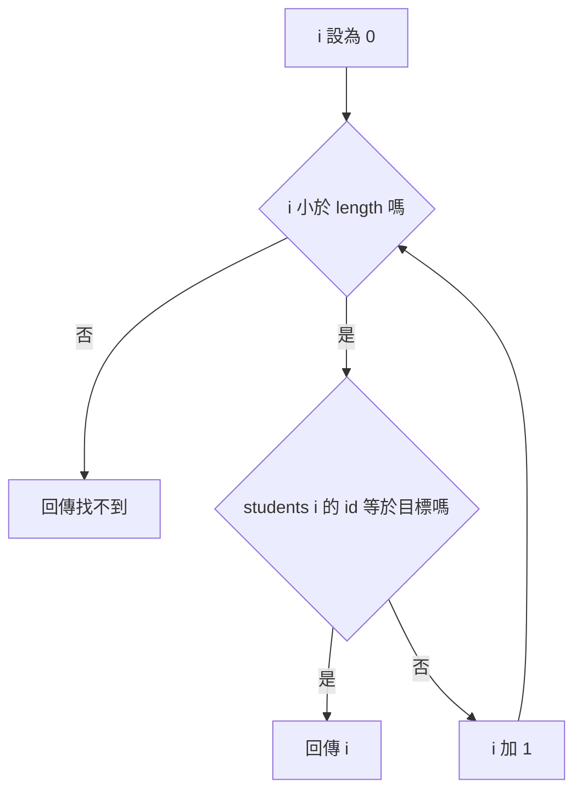
```mermaid
flowchart TD
    A[i 設為 0] --> B{i 小於 length 嗎}
    B -- 否 --> F[回傳找不到]
    B -- 是 --> C{students i 的 id 等於目標嗎}
    C -- 是 --> D[回傳 i]
    C -- 否 --> E[i 加 1]
    E --> B
```

---

### 8. 結構陣列排序

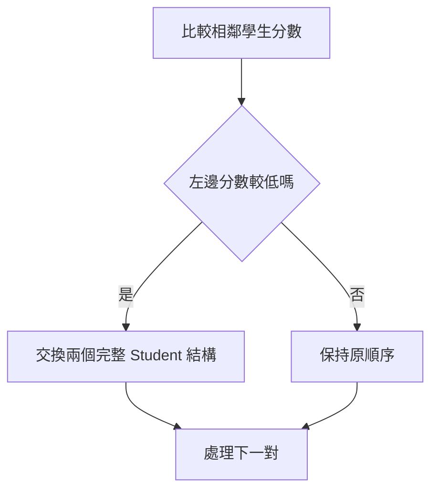
```mermaid
flowchart TD
    A[比較相鄰學生分數] --> B{左邊分數較低嗎}
    B -- 是 --> C[交換兩個完整 Student 結構]
    B -- 否 --> D[保持原順序]
    C --> E[處理下一對]
    D --> E
```

---

### 9. 巢狀結構

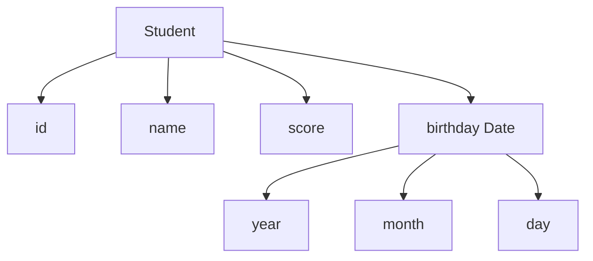
```mermaid
flowchart TD
    A[Student] --> B[id]
    A --> C[name]
    A --> D[score]
    A --> E[birthday Date]
    E --> F[year]
    E --> G[month]
    E --> H[day]
```

---

## 本章完成標準

完成本章後，你應該能做到：

1. 說明結構適合表示一筆具有多個欄位的資料。
2. 使用 `struct` 宣告結構型態。
3. 正確加入型態宣告結尾分號。
4. 使用完整結構型態建立變數。
5. 分辨結構標籤、成員與變數名稱。
6. 使用 `.` 讀取與修改成員。
7. 使用一般初始化清單建立結構。
8. 使用指定初始化建立結構。
9. 說明未指定成員的零初始化。
10. 在結構中使用字元陣列成員。
11. 找出字元陣列成員整體賦值錯誤。
12. 使用安全且有容量限制的方法修改字串成員。
13. 使用 `=` 複製同型態結構。
14. 說明結構複製包含陣列成員。
15. 驗證複製後物件彼此獨立。
16. 說明完整結構不能使用 `==` 比較。
17. 自行定義逐成員相等條件。
18. 使用 `strcmp()` 比較字串成員。
19. 將結構作為函式參數。
20. 說明普通結構參數為值傳遞副本。
21. 從函式回傳完整結構。
22. 使用回傳值更新呼叫端結構。
23. 撰寫建立結構的函式。
24. 撰寫輸出結構的函式。
25. 建立並走訪結構陣列。
26. 使用 `array[index].member` 存取資料。
27. 在結構陣列中依學號搜尋。
28. 找出最高分的完整學生資料。
29. 依成績排序結構陣列。
30. 使用完整結構交換保持資料一致。
31. 建立巢狀結構。
32. 使用多層 `.` 存取巢狀成員。
33. 使用巢狀指定初始化。
34. 使用 `typedef` 建立結構型態別名。
35. 分辨型態別名與物件變數。
36. 使用 `sizeof()` 觀察結構大小。
37. 說明 padding 可能影響結構大小。
38. 避免假設所有平台具有相同記憶體配置。
39. 準備進入下一章的指標基礎。
