# Lesson 22：Pointer Basics 指標基礎

> 這堂課的重點：理解普通變數保存「資料值」，指標變數則保存「記憶體位址」。我們會從沒有指標時無法處理的問題開始，學習指標型別 `type *`、取址運算子 `&` 與間接運算子 `*`，並利用記憶體圖理解指標如何找到、讀取及修改另一個變數。

---

## Section I. 今天要做什麼？

1. 複習普通變數與函式的值傳遞。
2. 回顧在被呼叫函式中修改普通引數值的限制。
3. 回顧陣列不能直接使用 `=` 複製。
4. 回顧字串所在的字元陣列不能直接使用 `=` 複製。
5. 回顧固定大小陣列不能在執行期間直接改變長度。
6. 理解這些問題與記憶體位址之間的關係。
7. 認識指標是 C 語言的重要特性。
8. 理解指標是一種保存記憶體位址的資料型別。
9. 認識指標型別的一般寫法 `type *`。
10. 宣告 `int *` 指標變數。
11. 比較普通整數變數與整數指標變數。
12. 理解普通變數保存 `int` 值。
13. 理解 `int *` 變數保存 `int` 物件的位址。
14. 觀察普通變數本身也佔有記憶體空間。
15. 觀察指標變數本身也有自己的記憶體空間。
16. 分辨「指標保存的位址」與「指標本身所在的位址」。
17. 認識取址運算子 `&`。
18. 使用 `&count` 取得 `count` 的起始位址。
19. 理解 `&count` 的型別為 `int *`。
20. 將 `&count` 儲存到 `int *` 變數。
21. 在宣告時初始化指標。
22. 分開宣告後再讓指標指向變數。
23. 比較 `count`、`&count` 與 `countAddr`。
24. 理解 `&count` 與 `countAddr` 可以保存相同位址值。
25. 分辨 `int` 與 `int *` 的型別。
26. 找出將 `int` 指派給 `int *` 的型別錯誤。
27. 找出將 `int *` 指派給 `int` 的型別錯誤。
28. 理解不同指標型別不應任意互相指派。
29. 比較 `int *` 與 `double *`。
30. 認識間接運算子 `*`。
31. 使用 `*countAddr` 取得指標所指位置的 `int`。
32. 理解 `*countAddr` 的型別為 `int`。
33. 將 `*countAddr` 的結果複製到普通整數。
34. 比較 `count` 與 `*countAddr`。
35. 使用 `*countAddr` 修改 `count`。
36. 理解透過指標修改與直接修改原變數的結果相同。
37. 理解指標可以改指向另一個同型態變數。
38. 使用一個指標先指向 `countA`，再改指向 `countB`。
39. 理解改變指標保存的位址不會複製資料值。
40. 理解多個指標可以保存相同位址。
41. 認識 `*` 在宣告與運算式中的不同角色。
42. 讀懂 `int *countAddr;`。
43. 讀懂 `*countAddr = 10;`。
44. 認識 `&` 與 `*` 的對應關係。
45. 理解 `*&count` 可以回到 `count`。
46. 理解 `&*countAddr` 可以回到 `countAddr`。
47. 在適當前提下化簡相鄰的 `*&`。
48. 在適當前提下化簡相鄰的 `&*`。
49. 理解化簡不代表可以對無效指標任意間接存取。
50. 區分讀取指標所指物件與改變指標本身。
51. 使用 `%p` 觀察位址。
52. 使用 `(void *)` 配合 `%p` 輸出物件位址。
53. 理解實際位址每次執行可能不同。
54. 不把投影片中的示意位址當成固定結果。
55. 認識未初始化指標的危險。
56. 避免對尚未指向有效物件的指標使用 `*`。
57. 使用概念檢查與記憶體追蹤圖判斷運算式型別。
58. 找出常見的指標宣告、型別、取址及間接存取錯誤。
59. 為下一章的指標與函式呼叫建立基礎。

---

## Section II. 今天的學習方式

1. 每個普通變數畫成一個記憶體方格。
2. 方格內寫入變數保存的資料值。
3. 方格外標記變數名稱。
4. 方格下方標記一個示意記憶體位址。
5. 指標變數也畫成自己的記憶體方格。
6. 指標方格內保存的是另一個方格的位址。
7. 使用箭頭表示：
   ```text
   指標變數 → 被指向的變數
   ```
8. 每遇到一個運算式，都同時寫出：
   - 運算式
   - 資料型別
   - 值的意義
9. 對 `count`、`&count`、`countAddr`、`*countAddr` 建立對照表。
10. 先判斷型別，再判斷賦值是否合理。
11. 將 `&` 讀成「取得……的位址」。
12. 將運算式中的 `*` 讀成「取得該位址所指的物件」。
13. 修改指標時，分辨是在改：
    - 指標保存的位址
    - 指標所指物件的值
14. 追蹤指標改指向另一個變數前後的箭頭。
15. `*&` 與 `&*` 題目先由內向外閱讀。
16. 本章先處理指向一般變數的基礎用法。
17. 指標參數、交換函式、指標算術與動態記憶體留待後續章節。
18. 所有完整且應合法的 C 程式都使用嚴格 C17 選項編譯。

---

## Section III. 今天會學到的內容

| 主題 | 你需要知道的事 |
| --- | --- |
| 普通變數 | 保存某種資料型別的值 |
| 記憶體位址 | 物件在記憶體中的位置資訊 |
| 指標 pointer | 保存記憶體位址的資料型別 |
| 指標變數 | 內容是位址值的變數 |
| `int *` | 可以保存 `int` 物件位址的指標型別 |
| `double *` | 可以保存 `double` 物件位址的指標型別 |
| 取址運算子 `&` | 取得物件的記憶體起始位址 |
| 間接運算子 `*` | 取得某位址所指向的物件 |
| 指向 point to | 指標中保存某物件的位址 |
| 間接存取 | 透過位址讀取或修改物件 |
| `count` | `int` 物件本身的值 |
| `&count` | `count` 的位址，型別為 `int *` |
| `countAddr` | 指標變數中保存的位址值 |
| `*countAddr` | 該位址所指向的 `int` 物件 |
| 指標重新指向 | 將另一個同型態物件位址放入指標 |
| 指標本身的位址 | 使用 `&countAddr` 取得 |
| `%p` | 輸出位址的格式指定 |
| `(void *)` | 配合 `%p` 輸出物件位址時使用的轉型 |
| `*&x` | 先取址再間接存取，回到原物件 |
| `&*p` | 先間接取得物件再取址，回到原指標值 |
| 未初始化指標 | 尚未保存可安全使用之有效物件位址的指標 |
| 型別相容 | 指標型別與其所指物件型別應正確對應 |

---

## Section IV. 為什麼需要指標？

### 1. 被呼叫函式中的普通參數是副本

```c
#include <stdio.h>

void add_one(int number) {
    number++;
    printf("Inside: %d\n", number);
}

int main(void) {
    int number = 3;

    add_one(number);
    printf("Outside: %d\n", number);

    return 0;
}
```

輸出：

```text
Inside: 4
Outside: 3
```

在函式內修改參數，不會修改呼叫端原本的整數。

投影片將「在被呼叫函式中修改引數值」列為沒有指標時尚未處理的問題之一。指標與函式的正式寫法會在下一章介紹。

---

### 2. 陣列不能直接整體複製

```c
int source[5] = {1, 2, 3, 4, 5};
int target[5];

/* target = source;  編譯失敗 */
```

必須逐元素複製。

---

### 3. 字串所在的字元陣列不能直接整體複製

```c
char source[6] = "Hello";
char target[6];

/* target = source;  編譯失敗 */
```

---

### 4. 固定陣列不能在執行期間直接改變長度

```c
int values[5];
```

不能在稍後直接把同一個陣列物件變成：

```c
int values[10];
```

投影片以這些限制引出「指標型別」：指標能讓程式保存並操作記憶體位址，後續可以用來解決更多資料存取問題。

---

## Section V. 指標變數宣告

### 5. 普通整數變數

```c
int count;
```

可以讀成：

```text
count 是一個 int 變數
```

它的記憶體空間用來保存一個 `int` 值。

---

### 6. 整數指標變數

```c
int *countAddr;
```

可以讀成：

```text
countAddr 是一個指向 int 的指標
```

或：

```text
countAddr 是一個 int * 變數
```

它的記憶體空間用來保存某個 `int` 物件的位址。

---

### 7. 指標宣告的一般形式

```c
資料型別 *變數名稱;
```

例如：

```c
int *intPointer;
double *doublePointer;
char *charPointer;
```

---

### 8. 普通變數與指標變數都需要記憶體

假設只是示意：

```text
count 的位址      = 2293620
countAddr 的位址  = 2293624
```

若：

```c
int count = 9;
int *countAddr = &count;
```

則：

```text
count 方格中保存      9
countAddr 方格中保存  2293620
```

指標保存的是 `count` 的位址，不是 `countAddr` 自己的位址。

---


<p align="center">
  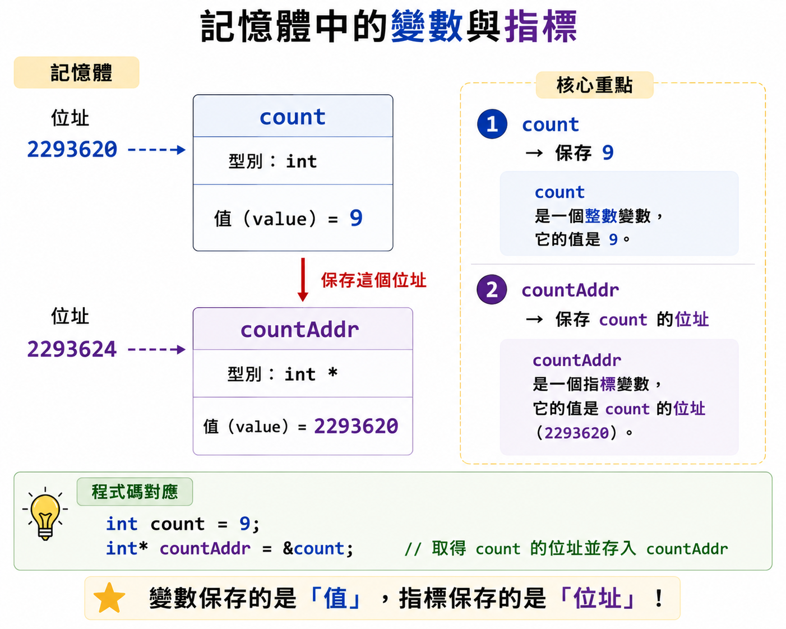
</p>


### 9. 指標本身也有位址

```c
&countAddr
```

表示：

```text
countAddr 這個指標變數本身的位址
```

它與：

```c
countAddr
```

意義不同。

| 運算式 | 意義 |
| --- | --- |
| `countAddr` | 指標中保存的位址 |
| `&countAddr` | 指標變數本身所在的位址 |

`&countAddr` 的型別比本章主要內容多一層指標，後續章節才會深入。

---


<p align="center">
  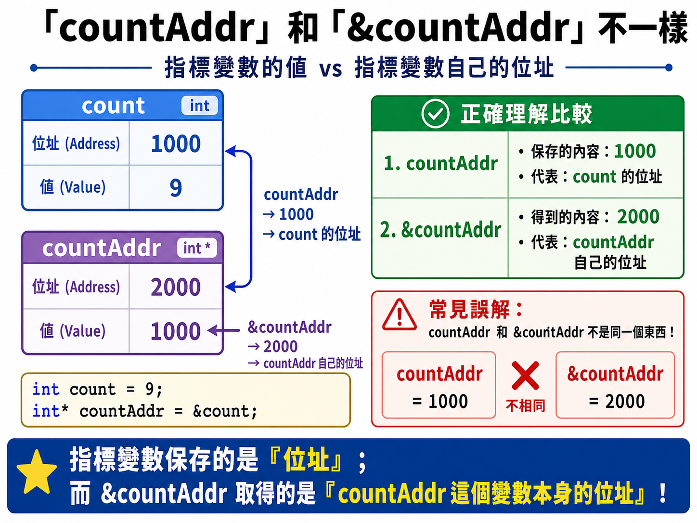
</p>


## Section VI. 取址運算子 `&`

### 10. 取得普通變數位址

```c
int count = 9;

&count;
```

`&count` 表示：

```text
count 的記憶體起始位址
```

---

### 11. `&count` 的型別

若：

```c
count
```

的型別是：

```text
int
```

則：

```c
&count
```

的型別是：

```text
int *
```

因此可以存入：

```c
int *countAddr;
```

---


<p align="center">
  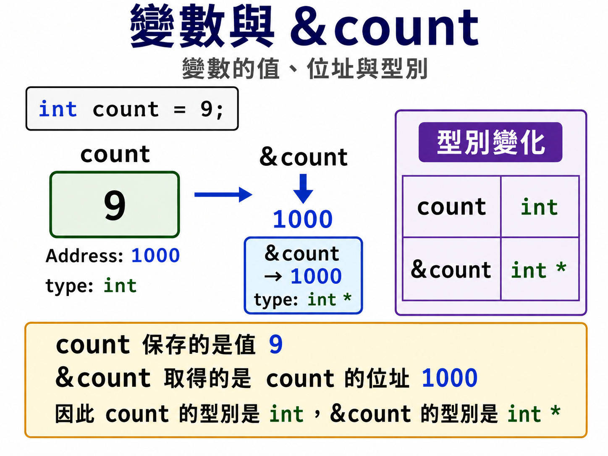
</p>


### 12. 宣告時直接初始化

```c
int count = 9;
int *countAddr = &count;
```

此時可以說：

```text
countAddr 指向 count
```

---

### 13. 先宣告再指派

```c
int count = 9;
int *countAddr;

countAddr = &count;
```

結果與宣告時初始化相同。

---

### 14. 完整位址觀察程式

```c
#include <stdio.h>

int main(void) {
    int count = 9;
    int *countAddr = &count;

    printf("count = %d\n", count);
    printf("&count = %p\n", (void *)&count);
    printf("countAddr = %p\n", (void *)countAddr);
    printf("&countAddr = %p\n", (void *)&countAddr);

    return 0;
}
```

應觀察：

```text
&count 與 countAddr 顯示相同位址
&countAddr 通常是另一個位址
```

實際數字由每次執行環境決定。

---


<p align="center">
  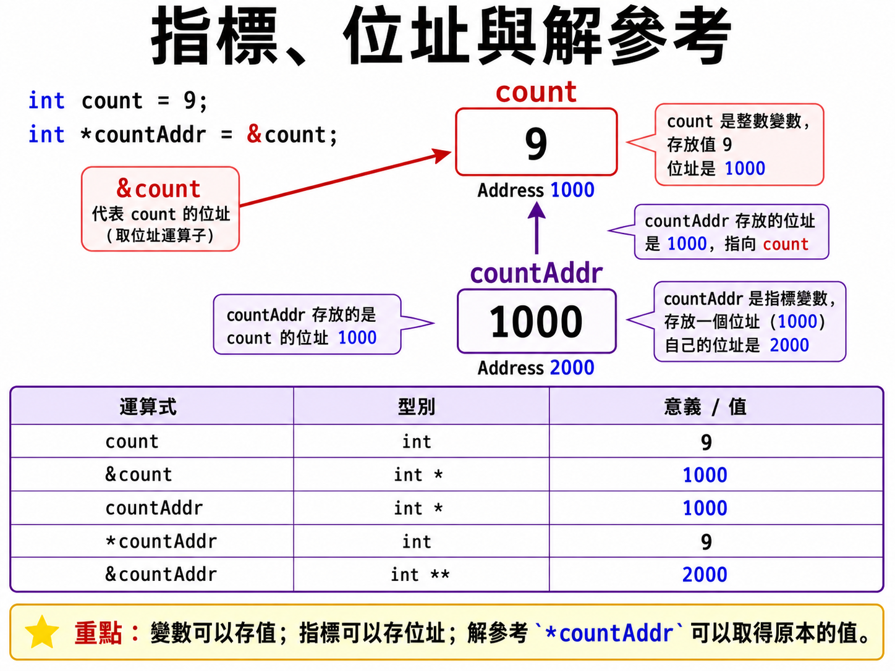
</p>


### 15. 投影片中的位址是示意

投影片使用例如：

```text
2293620
2293624
```

說明兩個變數各自佔有記憶體位置。

這些數字不是程式每次都會得到的固定結果。

---

## Section VII. 指標型別與賦值

### 16. 正確的普通值賦值

```c
int count = 9;
int value;

value = count;
```

型別：

```text
int = int
```

---

### 17. 正確的位址賦值

```c
int count = 9;
int *countAddr;

countAddr = &count;
```

型別：

```text
int * = int *
```

---

### 18. 錯誤：將整數值放入指標

```c
int count = 9;
int *countAddr;

/* countAddr = count; */
```

左邊需要：

```text
int *
```

右邊卻是：

```text
int
```

---

### 19. 錯誤：將位址放入普通整數

```c
int count = 9;
int value;

/* value = &count; */
```

左邊是：

```text
int
```

右邊是：

```text
int *
```

---

### 20. 指標型別應和目標物件型別對應

```c
int count = 9;
double amount = 3.5;

int *countAddr = &count;
double *amountAddr = &amount;
```

不要把 `double` 物件位址任意存入 `int *`。

不同資料型別可能具有不同大小、表示法與對齊需求。

---

### 21. 型別對照表

| 運算式 | 型別 |
| --- | --- |
| `count` | `int` |
| `&count` | `int *` |
| `countAddr` | `int *` |
| `*countAddr` | `int` |
| `&countAddr` | `int **` |

本章主要操作到 `int` 與 `int *`；`int **` 只作為觀察。

---


<p align="center">
  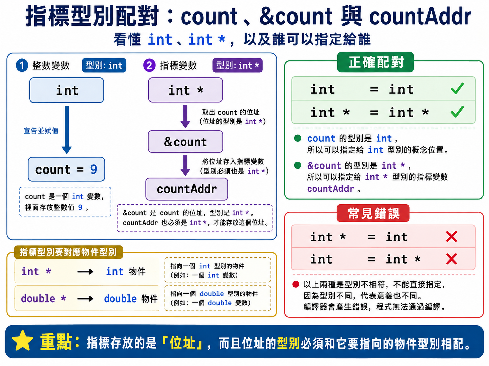
</p>


## Section VIII. 間接運算子 `*`

### 22. 從位址取得物件

```c
int count = 9;
int *countAddr = &count;

*countAddr;
```

運算式中的：

```c
*countAddr
```

表示：

```text
取得 countAddr 所保存位址所指向的 int 物件
```

---

### 23. `*countAddr` 的值

因為 `countAddr` 指向 `count`，所以：

```text
count       的值是 9
*countAddr  的值也是 9
```

---


<p align="center">
  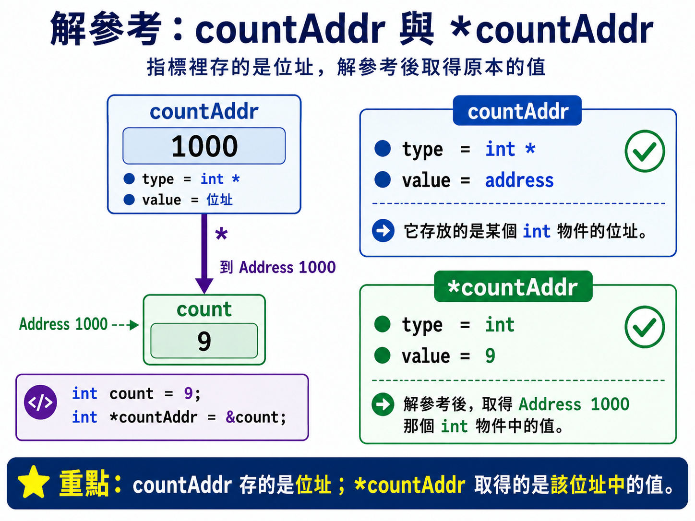
</p>


### 24. 將間接存取結果存入普通變數

```c
#include <stdio.h>

int main(void) {
    int count = 9;
    int *countAddr = &count;
    int result = *countAddr;

    printf("count = %d\n", count);
    printf("*countAddr = %d\n", *countAddr);
    printf("result = %d\n", result);

    return 0;
}
```

---

### 25. 指標運算式對照

| 運算式 | 型別 | 值的意義 |
| --- | --- | --- |
| `count` | `int` | `count` 保存的整數 |
| `&count` | `int *` | `count` 的位址 |
| `countAddr` | `int *` | 指標中保存的位址 |
| `*countAddr` | `int` | 該位址所指 `int` 的值 |

---

## Section IX. 透過指標修改變數

### 26. 直接修改

```c
int count = 9;

count = 10;
```

---

### 27. 透過指標修改

```c
int count = 9;
int *countAddr = &count;

*countAddr = 10;
```

因為 `countAddr` 指向 `count`，所以最後：

```text
count == 10
```

---


<p align="center">
  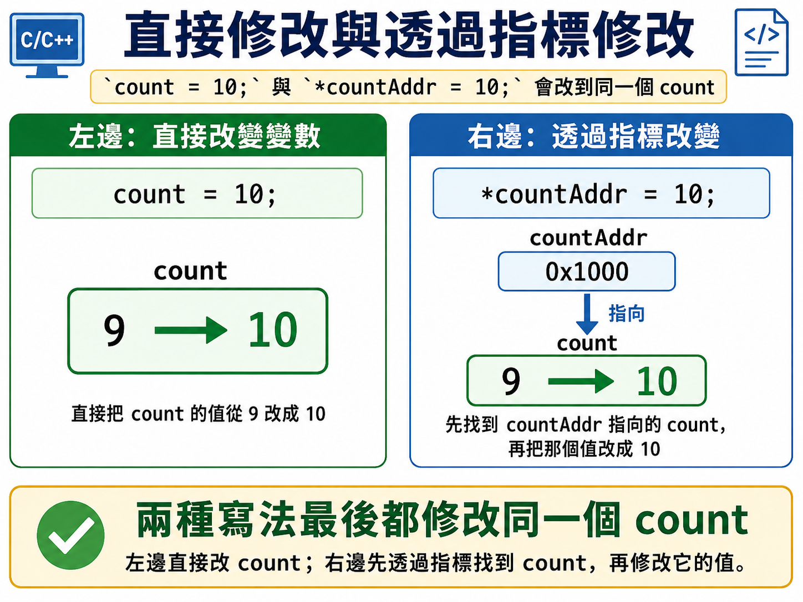
</p>


### 28. 完整修改範例

```c
#include <stdio.h>

int main(void) {
    int count = 9;
    int *countAddr = &count;

    printf("Before: %d\n", count);

    *countAddr = 10;

    printf("After count: %d\n", count);
    printf("After *countAddr: %d\n", *countAddr);

    return 0;
}
```

---

### 29. 指標的特殊能力

普通複製：

```c
int count = 9;
int result = count;
```

此後：

```c
result = 10;
```

不會改變 `count`。

但指標保存的是 `count` 的位址：

```c
int *countAddr = &count;
```

因此：

```c
*countAddr = 10;
```

會找到並修改原本的 `count`。

---

### 30. 複製值與保存位址的差異

```c
#include <stdio.h>

int main(void) {
    int count = 9;
    int copiedValue = count;
    int *countAddr = &count;

    copiedValue = 20;
    printf("copiedValue = %d\n", copiedValue);
    printf("After copiedValue change: %d\n", count);

    *countAddr = 30;
    printf("After pointer change: %d\n", count);

    return 0;
}
```

輸出：

```text
After copiedValue change: 9
After pointer change: 30
```

---


<p align="center">
  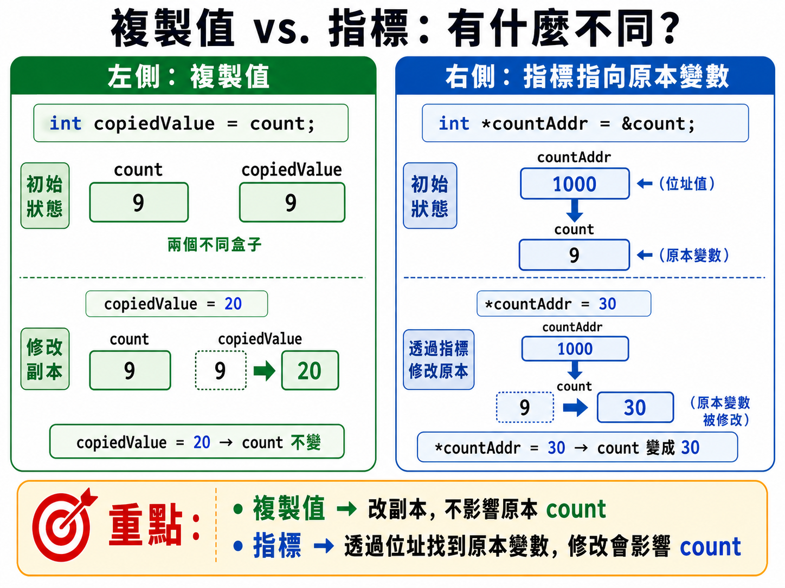
</p>


## Section X. 指標可以改指向其他變數

### 31. 兩個普通變數

```c
int countA = 9;
int countB = 10;
```

---

### 32. 先指向 `countA`

```c
int *countAddr = &countA;
```

此時：

```c
*countAddr = 0;
```

修改的是：

```text
countA
```

---

### 33. 再改指向 `countB`

```c
countAddr = &countB;
```

現在：

```c
*countAddr = 0;
```

修改的是：

```text
countB
```

---


<p align="center">
  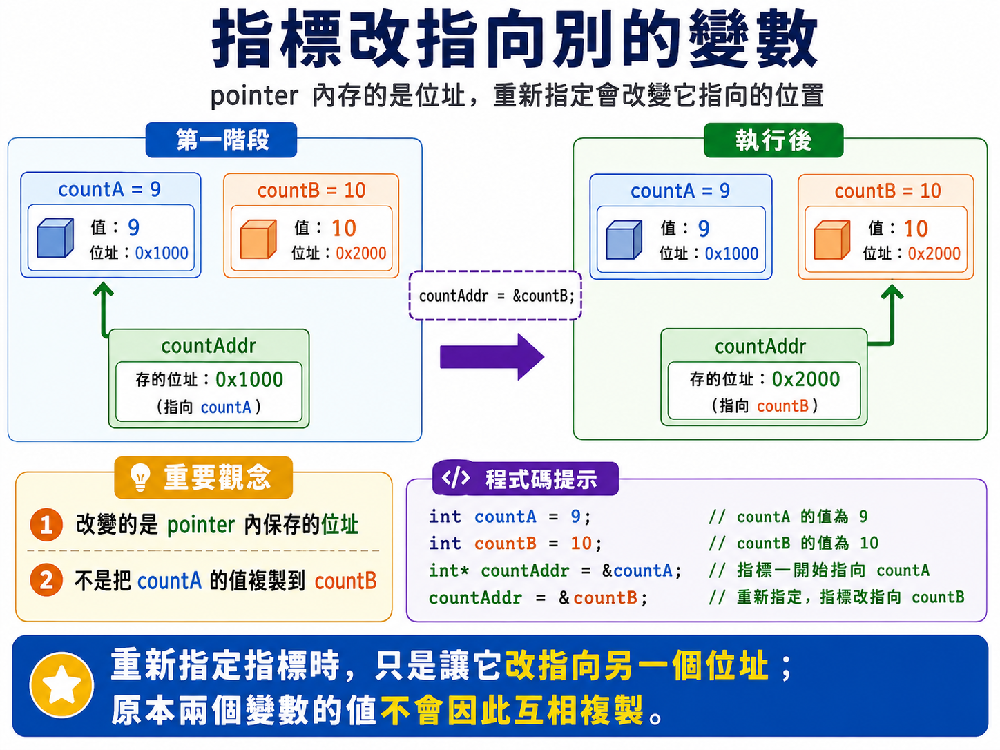
</p>


### 34. 完整重新指向範例

```c
#include <stdio.h>

int main(void) {
    int countA = 9;
    int countB = 10;
    int *countAddr = &countA;

    *countAddr = 0;

    countAddr = &countB;
    *countAddr = 20;

    printf("countA = %d\n", countA);
    printf("countB = %d\n", countB);

    return 0;
}
```

輸出：

```text
countA = 0
countB = 20
```

---

### 35. 改指向時沒有複製兩個整數

```c
countAddr = &countB;
```

只把新的位址放進 `countAddr`。

`countA` 與 `countB` 原本的資料仍在各自位置中。

---

### 36. 多個指標可指向同一物件

```c
#include <stdio.h>

int main(void) {
    int count = 9;
    int *first = &count;
    int *second = &count;

    *first = 15;

    printf("count = %d\n", count);
    printf("*second = %d\n", *second);

    return 0;
}
```

兩個指標保存相同位址，所以都能找到同一個 `count`。

---


<p align="center">
  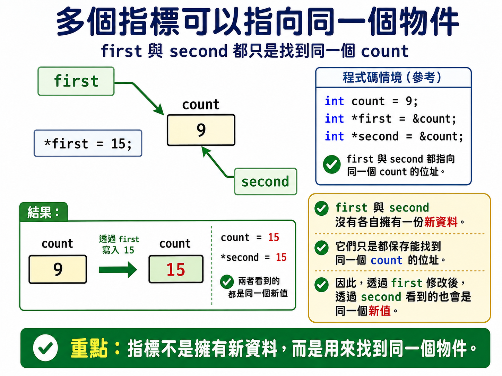
</p>


## Section XI. `*` 的兩種角色

### 37. 宣告中的 `*`

```c
int *countAddr;
```

這裡表示：

```text
countAddr 的型別是 int *
```

---

### 38. 運算式中的 `*`

```c
*countAddr
```

這裡表示：

```text
取得 countAddr 所指向的 int 物件
```

---

### 39. 同一個符號，依位置判斷角色

```c
int *countAddr = &count;
```

宣告部分的 `*`：

```text
說明 countAddr 是指標
```

```c
*countAddr = 10;
```

運算式部分的 `*`：

```text
存取並修改被指向的 int
```

---


<p align="center">
  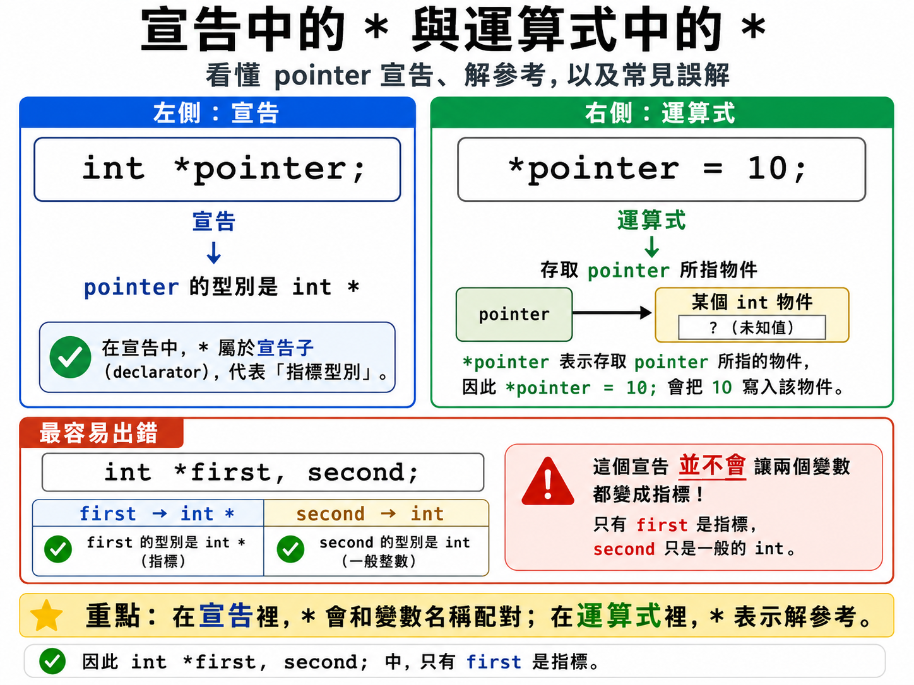
</p>


### 40. 多個變數宣告的閱讀陷阱

```c
int *first, second;
```

實際上：

```text
first  是 int *
second 是 int
```

兩個都要是指標時：

```c
int *first;
int *second;
```

或：

```c
int *first, *second;
```

初學階段建議分開宣告。

---

## Section XII. `&` 與 `*` 的關係

### 41. 先取址，再間接取得物件

```c
int count = 9;
int result = *&count;
```

由內向外：

1. `&count` 取得 `count` 的位址。
2. `*` 再取得該位址所指的物件。

所以：

```c
*&count
```

表示原本的：

```c
count
```

---

### 42. `*&count` 化簡

```c
#include <stdio.h>

int main(void) {
    int count = 9;
    int result = *&count;

    printf("%d\n", result);

    return 0;
}
```

結果：

```text
9
```

---

### 43. 先間接取得物件，再取回位址

```c
int count = 9;
int *countAddr = &count;

&*countAddr;
```

由內向外：

1. `*countAddr` 表示 `count` 物件。
2. `&` 再取得該物件位址。

所以結果與：

```c
countAddr
```

保存的位址相同。

---

### 44. `&*countAddr` 化簡

```c
#include <stdio.h>

int main(void) {
    int count = 9;
    int *countAddr = &count;

    printf(
        "countAddr = %p\n",
        (void *)countAddr
    );
    printf(
        "&*countAddr = %p\n",
        (void *)&*countAddr
    );

    return 0;
}
```

兩行應顯示相同位址。

---


<p align="center">
  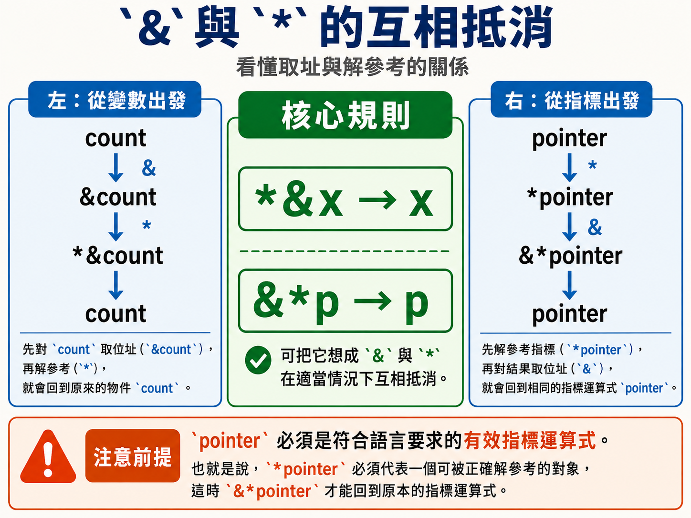
</p>


### 45. 相鄰的 `*&`

在運算式有效時：

```text
*&物件
```

可以理解成：

```text
物件
```

例如：

```c
*&count = 10;
```

等同：

```c
count = 10;
```

---

### 46. 相鄰的 `&*`

在指標運算式有效時：

```text
&*指標
```

可以理解成原本的指標值。

例如：

```c
int *sameAddr = &*countAddr;
```

得到與 `countAddr` 相同的位址。

---

### 47. 較長運算式由內向外化簡

```c
*&*countAddr
```

可以先看：

```c
*&
```

它們作用在：

```c
*countAddr
```

這個物件上，因此整體可理解成：

```c
*countAddr
```

---

### 48. 化簡範例

```c
#include <stdio.h>

int main(void) {
    int count = 9;
    int *countAddr = &count;

    *&*countAddr = 20;

    printf("%d\n", count);

    return 0;
}
```

結果：

```text
20
```

化簡後可看成：

```c
*countAddr = 20;
```

---

### 49. 化簡不代表無效指標可以安全使用

本章所有間接存取都建立在：

```text
指標確實指向仍然存在、型別正確的物件
```

這個前提上。

不能因為看到 `&*`，就忽略指標本身是否有效。

---

## Section XIII. 未初始化指標

### 50. 危險宣告

```c
int *countAddr;
```

此時 `countAddr` 尚未被設定為某個有效 `int` 物件的位址。

不能直接：

```c
/* *countAddr = 10; */
```

---

### 51. 先讓它指向有效變數

```c
int count = 9;
int *countAddr = &count;

*countAddr = 10;
```

---

### 52. 錯誤觀念

```c
int *countAddr;
```

不會自動建立一個新的 `int` 讓它指向。

它只建立一個可保存 `int` 位址的指標變數。

---

### 53. 教材補充：空指標

> 這一小節是安全性補充；四份來源投影片主要集中在有效物件位址、取址與間接運算。

可以明確表示「目前沒有指向物件」：

```c
#include <stddef.h>

int *countAddr = NULL;
```

但：

```c
*countAddr
```

仍然不合法，因為 `NULL` 不指向可存取的 `int` 物件。

使用前可先檢查：

```c
if (countAddr != NULL) {
    printf("%d\n", *countAddr);
}
```

---

## Section XIV. 快速概念檢查

### Q1. 指標變數保存的是什麼？

<details>
<summary>查看答案</summary>

記憶體位址。

</details>

---

### Q2. `int *countAddr;` 表示什麼？

<details>
<summary>查看答案</summary>

`countAddr` 是一個可以保存 `int` 物件位址的指標變數。

</details>

---

### Q3. 若 `count` 的型別是 `int`，`&count` 的型別是什麼？

<details>
<summary>查看答案</summary>

```text
int *
```

</details>

---

### Q4. `countAddr = &count;` 之後，可以如何描述？

<details>
<summary>查看答案</summary>

```text
countAddr 指向 count
```

</details>

---

### Q5. `countAddr` 與 `&countAddr` 相同嗎？

<details>
<summary>查看答案</summary>

不同。

- `countAddr` 是指標保存的目標位址。
- `&countAddr` 是指標變數本身的位址。

</details>

---

### Q6. `*countAddr` 的型別是什麼？

已知 `countAddr` 是 `int *`。

<details>
<summary>查看答案</summary>

```text
int
```

</details>

---

### Q7. `*countAddr = 10;` 修改什麼？

<details>
<summary>查看答案</summary>

修改 `countAddr` 所指向的 `int` 物件。

</details>

---

### Q8. `countAddr = &other;` 修改什麼？

<details>
<summary>查看答案</summary>

修改指標變數中保存的位址，使它改指向 `other`。

</details>

---

### Q9. `int *first, second;` 中誰是指標？

<details>
<summary>查看答案</summary>

只有 `first` 是 `int *`；`second` 是普通 `int`。

</details>

---

### Q10. `*&count` 可以理解成什麼？

<details>
<summary>查看答案</summary>

```c
count
```

先取得 `count` 位址，再取得該位址所指物件。

</details>

---

### Q11. `&*countAddr` 可以理解成什麼？

<details>
<summary>查看答案</summary>

原本的 `countAddr` 位址值，前提是指標運算式有效。

</details>

---

### Q12. `%p` 用來輸出什麼？

<details>
<summary>查看答案</summary>

位址值。

</details>

---

### Q13. 為什麼輸出物件位址時常寫 `(void *)`？

<details>
<summary>查看答案</summary>

`printf()` 的 `%p` 對應 `void *`，因此將物件指標轉成 `void *` 後輸出。

</details>

---

### Q14. 未初始化指標可以直接使用 `*` 嗎？

<details>
<summary>查看答案</summary>

不可以。它尚未保存可安全存取之有效物件位址。

</details>

---

### Q15. 指標宣告會自動建立被指向的物件嗎？

<details>
<summary>查看答案</summary>

不會。它只建立保存位址的指標變數。

</details>

---

## Section XV. 程式閱讀練習

### 題目 1：基本間接存取

```c
int number = 5;
int *pointer = &number;

printf("%d\n", *pointer);
```

<details>
<summary>查看答案</summary>

```text
5
```

</details>

---

### 題目 2：透過指標修改

```c
int number = 5;
int *pointer = &number;

*pointer = 12;
```

<details>
<summary>查看答案</summary>

```text
number == 12
```

</details>

---

### 題目 3：改指向

```c
int first = 3;
int second = 8;
int *pointer = &first;

pointer = &second;
*pointer = 20;
```

<details>
<summary>查看答案</summary>

```text
first == 3
second == 20
```

</details>

---

### 題目 4：複製值

```c
int number = 5;
int copied = number;

copied = 100;
```

<details>
<summary>查看答案</summary>

```text
number == 5
copied == 100
```

</details>

---

### 題目 5：多個指標

```c
int number = 5;
int *first = &number;
int *second = &number;

*first = 30;
```

<details>
<summary>查看答案</summary>

```text
number == 30
*second == 30
```

</details>

---

### 題目 6：宣告判讀

```c
double *a, b;
```

<details>
<summary>查看答案</summary>

```text
a 是 double *
b 是 double
```

</details>

---

### 題目 7：型別判斷

```c
int number = 5;
int *pointer = &number;
```

`&pointer` 的型別是什麼？

<details>
<summary>查看答案</summary>

```text
int **
```

</details>

---

### 題目 8：`*&`

```c
int number = 5;

*&number = 40;
```

<details>
<summary>查看答案</summary>

等同：

```c
number = 40;
```

</details>

---

### 題目 9：`&*`

```c
int number = 5;
int *pointer = &number;
int *second = &*pointer;
```

<details>
<summary>查看答案</summary>

`second` 與 `pointer` 保存相同位址，兩者都指向 `number`。

</details>

---

### 題目 10：區分兩種修改

```c
pointer = &secondNumber;
```

與：

```c
*pointer = secondNumber;
```

<details>
<summary>查看答案</summary>

- 第一行改變指標指向的位置。
- 第二行修改指標目前所指物件的值。

</details>

---

## Section XVI. 實作練習 / 實作檢測題

### TODO 1：輸出值與位址

建立一個 `int`，輸出：

```text
變數值
變數位址
```

位址使用 `%p` 與 `(void *)`。

---

### TODO 2：建立指標

建立：

```c
int number = 10;
int *pointer = &number;
```

輸出 `number` 與 `*pointer`。

---

### TODO 3：比較位址

輸出：

```c
&number
pointer
```

確認兩者顯示相同位址。

---

### TODO 4：指標自己的位址

輸出：

```c
&pointer
```

確認它通常不同於 `pointer` 保存的位址。

---

### TODO 5：透過指標增加數值

將：

```c
*pointer
```

增加 `1`，再輸出原變數。

---

### TODO 6：值副本與指標

同時建立普通副本與指標。

分別修改副本與指標所指物件，觀察原變數。

---

### TODO 7：改指向兩個變數

讓同一個指標：

1. 指向第一個變數並修改。
2. 改指向第二個變數並修改。

---

### TODO 8：兩個指標指向同一變數

用第一個指標修改，再用第二個指標讀取。

---

### TODO 9：型別表格

對以下運算式寫出型別：

```c
number
&number
pointer
*pointer
&pointer
```

---

### TODO 10：化簡 `*&`

寫出三個不同型態變數，分別測試：

```c
*&variable
```

---

### TODO 11：化簡 `&*`

對有效指標比較：

```c
pointer
&*pointer
```

兩個位址是否相同。

---

### TODO 12：較長運算式

執行：

```c
*&*pointer = 99;
```

再將它手動化簡成較容易閱讀的版本。

---

### TODO 13：宣告陷阱

分別宣告：

```c
int *first, second;
int *third, *fourth;
```

寫出四個變數的型別。

---

### TODO 14：找出型別錯誤

分析但不要保留錯誤程式：

```c
int number = 5;
int *pointer;

pointer = number;
number = &number;
```

說明每一行左右型別。

---

### TODO 15：安全初始化

將指標先初始化為 `NULL`，檢查後再讓它指向一個有效整數並讀取。

---

## Section XVII. 做題時可以使用的提示

### 1. 先問變數保存的是值還是位址

```text
int     → 整數值
int *   → int 物件位址
```

---

### 2. 遇到 `&` 時，型別增加一層指標

```text
int    → int *
int *  → int **
```

---

### 3. 遇到有效的 `*` 時，型別減少一層指標

```text
int *   → int
int **  → int *
```

---

### 4. 賦值前比較左右型別

例如：

```c
pointer = &number;
```

```text
左：int *
右：int *
```

---

### 5. 看見 `*pointer = ...` 時，先畫箭頭

它修改的不是指標方格，而是箭頭指向的物件。

---

### 6. 看見 `pointer = ...` 時，修改的是指標方格內的位址

箭頭可能因此改指向另一個物件。

---

### 7. 位址數字不要硬背

只需要理解：

```text
哪兩個運算式表示同一位置
```

---

### 8. 建議測試資料

```text
正數
0
負數
兩個不同變數
兩個指標指向同一變數
指標重新指向
```

---

## Section XVIII. 課後小練習

### 練習 1：攝氏與華氏

建立攝氏變數與指標，透過指標修改攝氏值，再計算華氏溫度。

---

### 練習 2：商品價格

建立商品價格與指標，透過指標套用折扣。

---

### 練習 3：追蹤三個變數

讓同一個指標依序指向三個變數，每次將所指值乘以 `2`。

---

### 練習 4：最大值位置

建立兩個整數，讓指標指向數值較大的那一個，再透過指標增加 `10`。

---

### 練習 5：最小值位置

與上一題相反，讓指標指向較小值。

---

### 練習 6：比較普通副本與位址

將一個值同時複製到普通變數，並讓指標指向原變數，整理兩者的差異表。

---

### 練習 7：運算式型別樹

對：

```c
*&*pointer
```

由內向外標記每一步型別。

---

### 練習 8：記憶體圖

自行畫出：

```c
int a = 3;
int b = 8;
int *p = &a;

p = &b;
*p = 10;
```

每一步的方格、位址與箭頭。

---

## Section XIX. 重點複習

1. 普通變數保存指定型別的資料值。
2. 每個變數都佔有記憶體位置。
3. 指標是保存記憶體位址的資料型別。
4. `int *` 保存 `int` 物件的位址。
5. 指標變數本身也是一個變數。
6. 指標變數本身也有自己的位址。
7. `countAddr` 與 `&countAddr` 意義不同。
8. 取址運算子 `&` 取得物件起始位址。
9. 若 `count` 是 `int`，`&count` 是 `int *`。
10. `int *countAddr = &count;` 表示指標指向 `count`。
11. `&count` 與 `countAddr` 可表示相同目標位址。
12. `&countAddr` 是指標變數自己的位址。
13. `int` 與 `int *` 是不同型別。
14. `int *` 與 `double *` 也是不同型別。
15. 不應把普通整數直接放入指標。
16. 不應把物件位址直接放入普通整數。
17. 間接運算子 `*` 取得指標所指向的物件。
18. 若 `countAddr` 是 `int *`，`*countAddr` 是 `int`。
19. `count` 與 `*countAddr` 可指同一個實際物件值。
20. 將 `*countAddr` 複製到普通變數只會複製值。
21. 對 `*countAddr` 賦值會修改原物件。
22. 指標可以改指向另一個同型態變數。
23. 修改指標本身與修改被指向物件是不同操作。
24. 多個指標可以保存同一個物件位址。
25. 宣告中的 `*` 表示指標型別。
26. 運算式中的 `*` 表示間接存取。
27. `int *first, second;` 只有 `first` 是指標。
28. `*&count` 可以理解成 `count`。
29. `&*countAddr` 可以理解成 `countAddr` 的位址值。
30. 較長運算式應由內向外閱讀。
31. `%p` 用來輸出位址。
32. 輸出物件指標時可轉為 `(void *)`。
33. 投影片中的位址數字只是示意。
34. 未初始化指標不能被間接存取。
35. 指標宣告不會自動建立被指向物件。
36. 下一章會將位址傳入函式，修改呼叫端變數。

---

## Section XX. 常見錯誤提醒

### 錯誤 1：把指標看成普通整數

```c
int *pointer;
pointer = 10;
```

---

### 錯誤 2：忘記使用 `&`

```c
int number = 10;
int *pointer;

/* pointer = number; */
```

應讓指標取得位址：

```c
pointer = &number;
```

---

### 錯誤 3：把位址存入普通整數

```c
int value;

/* value = &number; */
```

---

### 錯誤 4：指標型別與物件型別不對應

讓 `int *` 指向 `double` 物件不是本章允許的正常用法。

---

### 錯誤 5：混淆 `pointer` 與 `*pointer`

```text
pointer   → 位址
*pointer  → 該位址所指物件
```

---

### 錯誤 6：混淆 `pointer` 與 `&pointer`

```text
pointer   → 目標位址
&pointer  → 指標變數本身的位址
```

---

### 錯誤 7：修改了普通副本，卻期待原物件改變

```c
int copied = number;
copied = 20;
```

不會修改 `number`。

---

### 錯誤 8：想改指向，卻寫成修改物件

```c
*pointer = other;
```

這是把 `other` 的值放入目前所指物件。

改指向應寫：

```c
pointer = &other;
```

---

### 錯誤 9：想修改物件，卻只改了指標

```c
pointer = &other;
```

只改箭頭方向，不會自動改變兩個整數的值。

---

### 錯誤 10：多變數宣告判讀錯誤

```c
int *a, b;
```

`b` 不是指標。

---

### 錯誤 11：對未初始化指標使用 `*`

```c
int *pointer;

/* *pointer = 10; */
```

---

### 錯誤 12：以為 `NULL` 可以被間接存取

```c
int *pointer = NULL;

/* printf("%d", *pointer); */
```

---

### 錯誤 13：使用 `%d` 輸出位址

位址應使用 `%p`。

---

### 錯誤 14：把示意位址當成固定答案

實際位址可能因執行、系統與編譯器而變動。

---

### 錯誤 15：看到 `&*` 就忽略指標有效性

化簡規則仍建立在運算式符合語言要求的前提上。

---

### 錯誤 16：由外向內錯讀複合運算式

```c
*&*pointer
```

應先處理最內層的 `*pointer`。

---

## Section XXI. Mermaid 流程圖

### 1. 普通變數與指標


```mermaid
flowchart LR
    A[count 變數] -->|保存| B[int 值 9]
    C[countAddr 指標] -->|保存| D[count 的位址]
    D -->|指向| A
```

---

### 2. 取址運算


```mermaid
flowchart LR
    A[count 物件] --> B[使用取址運算子]
    B --> C[得到 count 的位址]
    C --> D[型別為 int 指標]
```

---

### 3. 間接運算

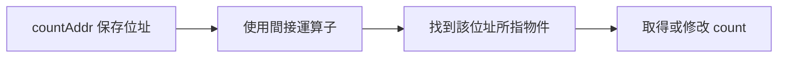
```mermaid
flowchart LR
    A[countAddr 保存位址] --> B[使用間接運算子]
    B --> C[找到該位址所指物件]
    C --> D[取得或修改 count]
```

---

### 4. 指標重新指向

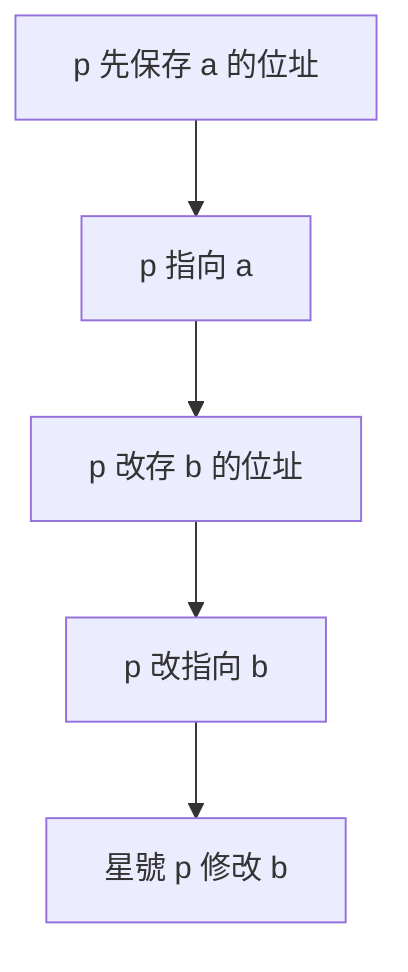
```mermaid
flowchart TD
    A[p 先保存 a 的位址] --> B[p 指向 a]
    B --> C[p 改存 b 的位址]
    C --> D[p 改指向 b]
    D --> E[星號 p 修改 b]
```

---

### 5. 值複製與位址存取

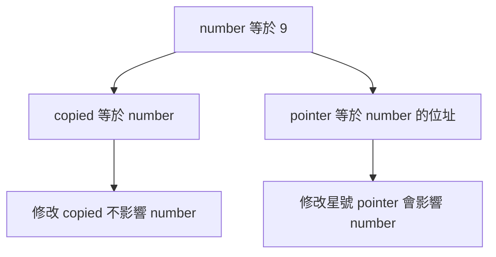
```mermaid
flowchart TD
    A[number 等於 9] --> B[copied 等於 number]
    A --> C[pointer 等於 number 的位址]
    B --> D[修改 copied 不影響 number]
    C --> E[修改星號 pointer 會影響 number]
```

---

### 6. `*&`

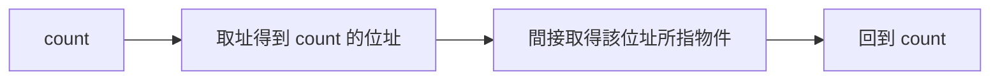
```mermaid
flowchart LR
    A[count] --> B[取址得到 count 的位址]
    B --> C[間接取得該位址所指物件]
    C --> D[回到 count]
```

---

### 7. `&*`

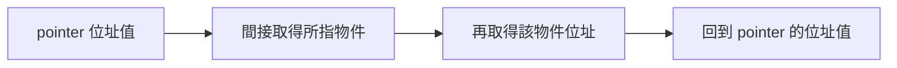
```mermaid
flowchart LR
    A[pointer 位址值] --> B[間接取得所指物件]
    B --> C[再取得該物件位址]
    C --> D[回到 pointer 的位址值]
```

---

### 8. 指標安全檢查

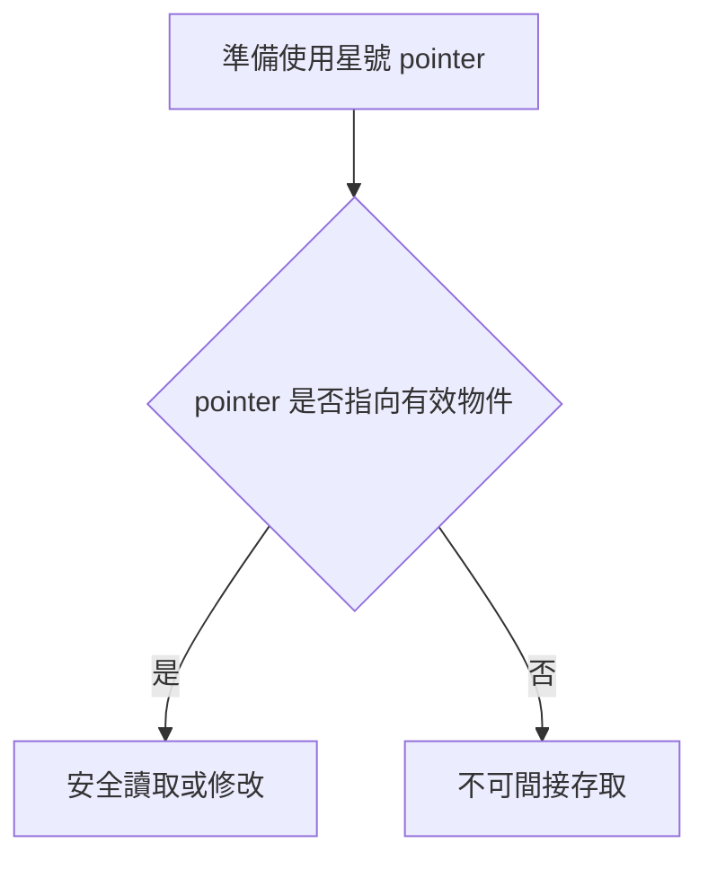
```mermaid
flowchart TD
    A[準備使用星號 pointer] --> B{pointer 是否指向有效物件}
    B -- 是 --> C[安全讀取或修改]
    B -- 否 --> D[不可間接存取]
```

---

## 本章完成標準

完成本章後，你應該能做到：

1. 說明沒有指標時仍存在的資料處理限制。
2. 說明指標是一種保存記憶體位址的型別。
3. 宣告 `int *`、`double *` 與 `char *`。
4. 分辨普通變數與指標變數保存的內容。
5. 說明指標變數本身也佔有記憶體。
6. 分辨指標保存的位址與指標本身的位址。
7. 使用 `&` 取得普通變數位址。
8. 判斷 `&variable` 的指標型別。
9. 讓指標在宣告時指向有效變數。
10. 先宣告指標，再使用位址賦值。
11. 說明 `&count` 與 `countAddr` 的關係。
12. 使用 `%p` 與 `(void *)` 輸出位址。
13. 說明投影片位址只是示意。
14. 比較 `int`、`int *` 與 `int **`。
15. 找出普通值與指標值的賦值型別錯誤。
16. 說明指標型別應與目標物件型別對應。
17. 使用 `*` 讀取指標所指物件。
18. 判斷 `*pointer` 的型別。
19. 將間接存取結果複製到普通變數。
20. 使用 `*pointer` 修改原物件。
21. 比較值副本與位址存取的不同效果。
22. 讓同一個指標改指向另一個變數。
23. 讓多個指標指向同一個變數。
24. 分辨宣告中的 `*` 與運算式中的 `*`。
25. 正確判讀多變數指標宣告。
26. 由內向外分析 `*&` 與 `&*`。
27. 將 `*&count` 化簡成 `count`。
28. 將 `&*pointer` 理解成原指標位址值。
29. 化簡較長的取址與間接運算式。
30. 避免間接存取未初始化指標。
31. 說明指標宣告不會自動建立目標物件。
32. 為下一章的指標與函式做好準備。
