# Lesson 23：Pointers, Arrays, and Strings 指標與陣列字串

> 這堂課的重點：把上一章的指標基礎應用到函式、陣列與字串。首先將變數位址傳入函式，讓函式能修改呼叫端變數；接著理解指標加減整數、陣列隱性轉型、`a[b] == *(a + b)`、指標走訪陣列，以及函式參數中的陣列其實以指標處理。最後比較字元陣列與字串字面常數、說明 `const` 的唯讀限制，並使用 `strcpy()` 或自行撰寫函式完成真正的字串複製。

---

## Section I. 今天要做什麼？

1. 複習函式呼叫時的值傳遞。
2. 理解普通引數會複製一份到函式參數。
3. 理解函式內修改參數副本不會改變呼叫端變數。
4. 將變數位址作為引數傳入函式。
5. 宣告指標參數。
6. 使用間接運算子修改呼叫端變數。
7. 比較「傳值」與「傳位址」的結果。
8. 撰寫可以交換兩個整數的 `swap()`。
9. 找出只傳入兩個整數值時為什麼交換失敗。
10. 將 `&a` 與 `&b` 傳入交換函式。
11. 使用 `*a` 與 `*b` 存取呼叫端變數。
12. 使用交換函式完成兩個整數的排序。
13. 找出 `sort()` 只接收值時為什麼仍無法改變呼叫端。
14. 將 `sort()` 的參數改成指標。
15. 在 `sort()` 中比較 `*a` 與 `*b`。
16. 將指標直接傳給另一個指標參數函式。
17. 判斷函式應該傳變數值還是位址。
18. 理解來源提出的基本原則：可以傳值時，優先傳值。
19. 理解傳值建立副本，較不容易被函式修改。
20. 理解傳值可直接傳入一般常數。
21. 理解需要改變呼叫端變數時應傳位址。
22. 理解陣列與字串無法直接整體複製時通常使用位址。
23. 理解大型複合資料複製成本較高時可能使用位址。
24. 認識指標對整數的加減運算。
25. 理解 `pointer + 1` 不是固定增加一個位元組。
26. 理解指標加一會移動到下一個同型態陣列元素。
27. 推導 `&v[0] + 1 == &v[1]`。
28. 推導 `&v[0] + 2 == &v[2]`。
29. 使用指標減一向前移動一個元素。
30. 理解兩個指標不能相加。
31. 理解同一陣列中的兩個指標可以相減。
32. 理解指標相減得到相隔的元素數量。
33. 認識陣列型別與指標型別不同。
34. 比較 `int v[5]` 與 `int *p` 的配置。
35. 理解陣列名稱在多數運算式中會隱性轉型為第一個元素位址。
36. 理解 `p = v;` 等同於讓 `p` 指向 `v[0]`。
37. 理解 `v` 在這種情況下等同於 `&v[0]`。
38. 使用 `*(p + i)` 讀取陣列元素。
39. 使用指標逐一輸出陣列。
40. 使用 `p++` 移動到下一個元素。
41. 使用「最後一個元素之後的位置」作為迴圈終點。
42. 理解 `v + length` 可以表示陣列尾端之後的位置。
43. 理解尾端之後的位置可以比較，但不能解參照。
44. 使用指標迴圈將陣列歸零。
45. 認識下標運算子的定義。
46. 理解 `a[b]` 等價於 `*(a + b)`。
47. 推導 `v[i] == *(v + i)`。
48. 推導 `p[i] == *(p + i)`。
49. 理解 `0[v]` 在語法上也等價於 `v[0]`。
50. 理解可使用下標的運算式不一定是陣列變數。
51. 將陣列傳入函式。
52. 比較函式參數中的 `int v[3]`、`int v[]` 與 `int *v`。
53. 理解三種寫法在函式參數中都以指標處理。
54. 理解呼叫 `maxv(a)` 時實際提供第一個元素位址。
55. 使用 `v[i]` 或 `*(v + i)` 在函式內存取呼叫端陣列。
56. 理解函式仍然需要另外取得陣列長度。
57. 使用同一個 `maxv()` 處理不同長度陣列。
58. 整理指標與陣列的關係。
59. 理解指標保存陣列元素位址時可以進行有限的指標算術。
60. 理解陣列可隱性轉型為第一個元素位址。
61. 認識指標與遞增運算子的結合。
62. 使用 `p[i] = 0` 將陣列歸零。
63. 改成 `*p = 0; p++;`。
64. 化簡成 `*p++ = 0;`。
65. 理解 `*p++` 等價於 `*(p++)`。
66. 理解後置 `++` 的優先順序高於前方的 `*`。
67. 認識字串是以 `'\0'` 結束的字元陣列。
68. 理解字元陣列傳入函式時也會轉成指標。
69. 理解字串字面常數在運算式中可轉成指向第一個字元的指標。
70. 比較 `char text[] = "test";` 與指向字串字面常數的指標。
71. 理解字元陣列內容通常可修改。
72. 理解修改字串字面常數屬於未定義行為。
73. 理解字元陣列不能改成指向另一個字串。
74. 理解指標可以改指向另一個字串字面常數。
75. 認識 `const` 修飾字。
76. 將被 `const` 修飾的物件視為透過該名稱唯讀。
77. 理解 `const int` 初始化後不能再次賦值。
78. 理解 `const` 也可以修飾陣列元素型別。
79. 使用 `const char *` 指向不應被修改的字串。
80. 理解不能透過 `const char *` 修改字元。
81. 理解 `const char *` 指標本身仍可改指向其他字串。
82. 理解 `Type *` 可以轉成 `const Type *`。
83. 理解反向移除 `const` 不是安全的隱性轉型。
84. 將只讀字串參數宣告為 `const char *`。
85. 認識 `printf()` 的格式字串參數使用 `const char *`。
86. 理解陣列名稱與指標賦值不等於複製字串。
87. 分辨淺複製概念與逐字元深複製。
88. 使用迴圈逐字元複製字串。
89. 記得連同最後的 `'\0'` 一起複製。
90. 認識標準函式庫 `strcpy()`。
91. 理解 `strcpy(destination, source)` 的參數型別。
92. 理解來源可唯讀，目的地必須可寫。
93. 理解目的地必須已經擁有足夠容量。
94. 找出未初始化目的地指標的危險。
95. 找出 `const` 目的地不能交給 `strcpy()`。
96. 使用概念檢查、程式追蹤與實作題整合本章。
97. 為下一章的動態記憶體建立指標、容量與生命週期基礎。

---

## Section II. 今天的學習方式

1. 函式呼叫題先畫兩組變數：
   - 呼叫端變數
   - 被呼叫函式參數
2. 傳值時畫出「複製值」的箭頭。
3. 傳位址時畫出「複製位址」的箭頭。
4. 每一次看到 `*pointer`，都追蹤它指向哪一個呼叫端物件。
5. `swap()` 題先使用值參數觀察失敗，再改成指標參數。
6. `sort()` 題分辨：
   - 比較的是指標值
   - 還是指標所指的整數值
7. 決定傳值或傳位址時，先問：
   - 函式需要修改呼叫端嗎？
   - 資料能否直接複製？
   - 複製成本是否合理？
8. 指標算術題一律配合陣列記憶體圖。
9. 不將指標加一理解成一般整數位址加一個位元組。
10. 對 `pointer + n` 寫出它對應的陣列元素。
11. 指標相減時，先確認兩個指標來自同一個陣列。
12. 陣列與指標題同時寫出：
    - 完整陣列物件
    - 第一個元素位址
13. 使用 `v + length` 時，只把它當成終點位置，不讀取該位置。
14. 下標題將：
    ```c
    a[b]
    ```
    改寫成：
    ```c
    *(a + b)
    ```
15. 函式陣列參數題將所有寫法先改讀成指標參數。
16. `*p++` 題先根據優先順序加括號：
    ```c
    *(p++)
    ```
17. 字串題要分別畫出：
    - 可修改的字元陣列
    - 指標變數
    - 字串字面常數所在的字元序列
18. `const` 題先確認限制的是：
    - 指標所指物件
    - 還是指標本身
19. 本章來源主要涵蓋 `const Type *`；其他 `const` 指標形式不作為主要內容。
20. 字串複製題始終檢查目的地容量與 `'\0'`。
21. 來源投影片中的程式逐步推導會保留，但完整範例使用現代 C17 可通過嚴格編譯的寫法。
22. 所有完整且應合法的 C 程式都以嚴格 C17 選項檢查。

---

## Section III. 今天會學到的內容

| 主題 | 你需要知道的事 |
| --- | --- |
| 傳值 | 將引數值複製到函式參數 |
| 傳位址 | 將物件位址值複製到指標參數 |
| 指標參數 | 函式中用來接收位址的參數 |
| 輸入參數 | 函式只需要讀取的資料 |
| 輸出／輸入輸出參數 | 函式會透過位址修改呼叫端資料 |
| `swap()` | 透過兩個指標交換兩個呼叫端整數 |
| `sort()` | 比較並在需要時交換兩個呼叫端整數 |
| 指標加整數 | 向後移動指定數量的同型態陣列元素 |
| 指標減整數 | 向前移動指定數量的同型態陣列元素 |
| 指標相減 | 計算同一陣列中兩位置相隔的元素數量 |
| 一個尾端位置 | 陣列最後一個元素之後的位置 |
| 陣列轉型 | 陣列名稱在多數運算式中轉成第一個元素指標 |
| `v + i` | 第 `i` 個元素的位址 |
| `*(v + i)` | 第 `i` 個元素 |
| 下標運算 | `a[b]` 等價於 `*(a + b)` |
| 指標走訪 | 讓指標依序指向每個陣列元素 |
| 陣列參數 | 在函式參數中調整成指標型別 |
| `int v[]` | 函式參數中等價於 `int *v` |
| `*p++` | 等價於 `*(p++)`，先使用目前位置再移動指標 |
| 字元陣列 | 真正配置可修改字元元素的陣列 |
| 字串字面常數 | 程式中的字串字面資料，不可被修改 |
| `const` | 限制透過該型別或名稱進行修改 |
| `const char *` | 指向不能透過該指標修改之字元的指標 |
| 增加 `const` | `Type *` 可轉成 `const Type *` |
| 移除 `const` | 不能安全地隱性轉成可修改指標 |
| 字串複製 | 將來源各字元複製到另一塊獨立儲存空間 |
| `strcpy()` | 標準函式庫的字串複製函式 |
| 目的地容量 | 必須至少容納來源文字與 `'\0'` |

---

# Part A：指標與函式

## Section IV. 函式呼叫時複製值

### 1. 普通參數不會改變呼叫端

```c
#include <stdio.h>

void add_one(int number);

int main(void) {
    int number = 3;

    add_one(number);
    printf("%d\n", number);

    return 0;
}

void add_one(int number) {
    number = number + 1;
}
```

輸出：

```text
3
```

呼叫：

```c
add_one(number);
```

會將 `number` 的整數值複製到函式參數。

函式只知道參數副本的值，不知道呼叫端原變數位於哪裡。

---

### 2. 函式內的參數是另一個物件

概念：

```text
main 的 number
    │ 複製值
    ▼
add_one 的 number
```

兩個變數名稱雖然可以相同，但代表不同物件。

---

## Section V. 函式呼叫時複製位址

### 3. 將變數位址傳入函式

```c
#include <stdio.h>

void add_one(int *number);

int main(void) {
    int number = 3;

    add_one(&number);
    printf("%d\n", number);

    return 0;
}

void add_one(int *number) {
    *number = *number + 1;
}
```

輸出：

```text
4
```

---

### 4. 參數保存的是位址副本

呼叫：

```c
add_one(&number);
```

會將：

```c
&number
```

這個位址值複製到指標參數。

函式使用：

```c
*number
```

找到呼叫端原本的整數。

---

### 5. 傳值與傳位址比較

| 寫法 | 函式取得 | 函式內修改的對象 |
| --- | --- | --- |
| `add_one(number)` | 整數值副本 | 函式參數副本 |
| `add_one(&number)` | 位址值副本 | 位址所指的呼叫端整數 |

更精確地說，C 的引數仍然全部是**以值傳遞**：

- 普通參數複製資料值。
- 指標參數複製位址值。

---


<p align="center">
  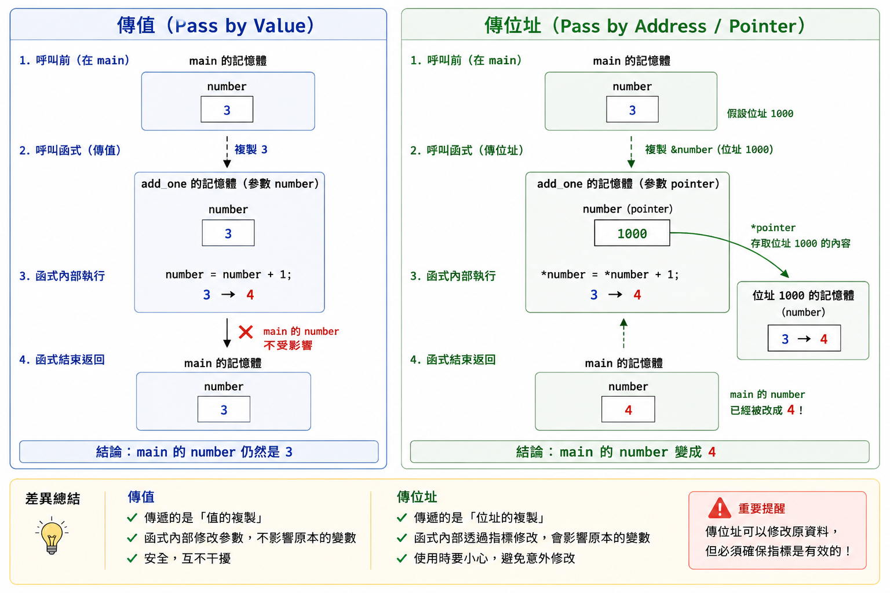
</p>


## Section VI. 使用函式交換兩個整數

### 6. 交換的基本步驟

```c
int temporary = a;
a = b;
b = temporary;
```

暫存變數保存第一個值，避免它被覆蓋後遺失。

---

### 7. 錯誤方向：只把整數值交給 `swap()`

```c
void swap(int a, int b) {
    int temporary = a;
    a = b;
    b = temporary;
}
```

即使函式內的 `a`、`b` 成功交換，呼叫端仍然不變。

---

### 8. 正確交換函式

```c
#include <stdio.h>

void swap(int *a, int *b);

int main(void) {
    int a = 3;
    int b = 5;

    swap(&a, &b);

    printf("a = %d\n", a);
    printf("b = %d\n", b);

    return 0;
}

void swap(int *a, int *b) {
    int temporary = *a;

    *a = *b;
    *b = temporary;
}
```

輸出：

```text
a = 5
b = 3
```

---


<p align="center">
  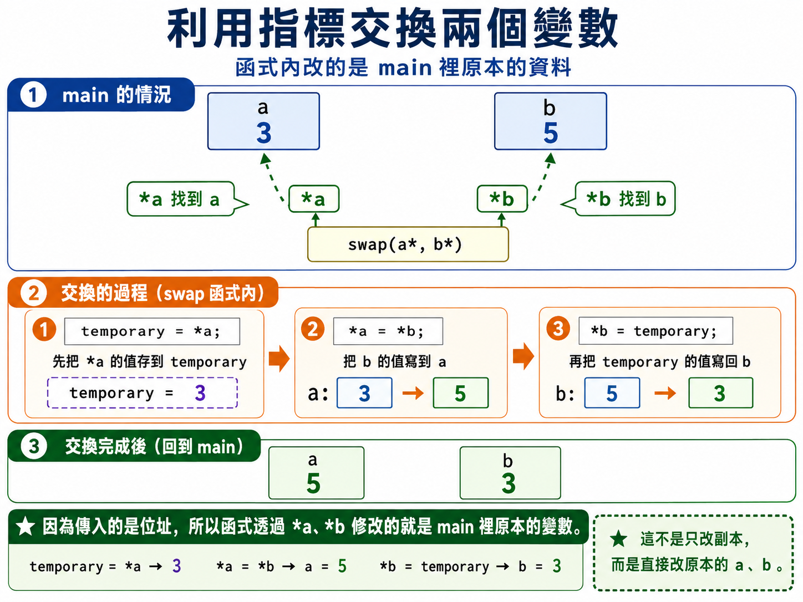
</p>


### 9. 交換函式中的型別

| 運算式 | 型別 | 意義 |
| --- | --- | --- |
| `a` | `int *` | 第一個整數的位址 |
| `b` | `int *` | 第二個整數的位址 |
| `*a` | `int` | 第一個整數物件 |
| `*b` | `int` | 第二個整數物件 |

---

## Section VII. 使用函式排序兩個整數

### 10. 直接排序

```c
if (a > b) {
    int temporary = a;
    a = b;
    b = temporary;
}
```

---

### 11. 使用交換函式

```c
if (a > b) {
    swap(&a, &b);
}
```

---

### 12. `sort()` 也必須接收位址

錯誤概念：

```c
void sort(int a, int b) {
    if (a > b) {
        swap(&a, &b);
    }
}
```

這只會排序 `sort()` 內的兩個參數副本。

---

### 13. 正確排序函式

```c
#include <stdio.h>

void swap(int *a, int *b);
void sort_two(int *a, int *b);

int main(void) {
    int a = 5;
    int b = 3;

    sort_two(&a, &b);

    printf("a = %d\n", a);
    printf("b = %d\n", b);

    return 0;
}

void sort_two(int *a, int *b) {
    if (*a > *b) {
        swap(a, b);
    }
}

void swap(int *a, int *b) {
    int temporary = *a;

    *a = *b;
    *b = temporary;
}
```

輸出：

```text
a = 3
b = 5
```

---

### 14. 為什麼呼叫 `swap(a, b)` 不再加 `&`？

在 `sort_two()` 中：

```c
a
b
```

本來就已經是 `int *`。

`swap()` 也需要 `int *`，因此直接傳入：

```c
swap(a, b);
```

如果寫：

```c
swap(&a, &b);
```

型別會變成 `int **`，不是本題需要的型別。

---


<p align="center">
  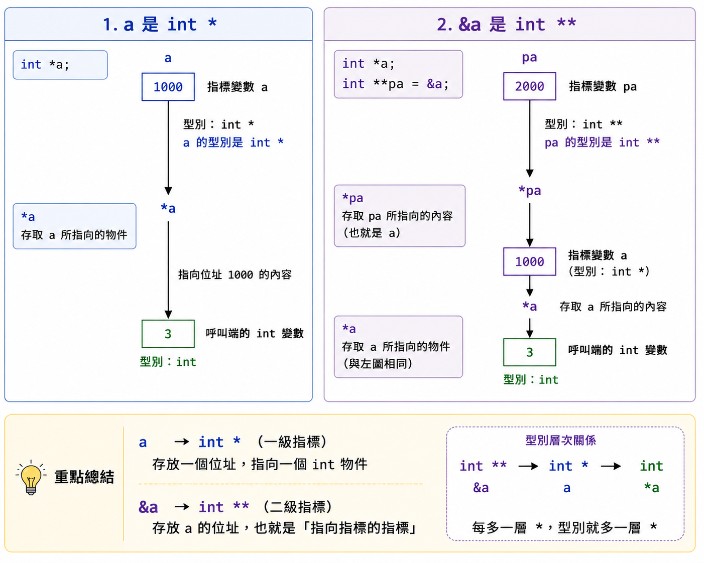
</p>


## Section VIII. 該傳變數值還是位址？

### 15. 來源提出的基本原則

> 可以傳值時，優先傳值。

來源列出的理由：

- 複製一份資料較不怕被函式修改。
- 可以維持函式間較乾淨的關係。
- 使用較方便，可以直接傳入一般常數。

---

### 16. 求兩數最大值適合傳值

```c
#include <stdio.h>

int max_two(int a, int b);

int main(void) {
    int a = 3;
    int b = 5;

    printf("%d\n", max_two(a, b));
    printf("%d\n", max_two(3, 5));

    return 0;
}

int max_two(int a, int b) {
    if (a > b) {
        return a;
    }

    return b;
}
```

這個函式只需要讀取兩個值，不需要修改呼叫端。

---

### 17. 指標版本較不方便

若函式介面是：

```c
int max_two_pointer(
    const int *a,
    const int *b
);
```

呼叫變數時需要：

```c
max_two_pointer(&a, &b);
```

而不能直接寫：

```c
max_two_pointer(&3, &5);
```

因為一般整數常數不是可取址的物件。

---

### 18. 來源列出的例外規則

應傳位址的典型情況：

1. 作為引數的變數在呼叫函式後必須改變。
   - 例如數值交換。
2. 資料無法直接整體複製。
   - 例如陣列與字串。
3. 複製成本太高。
   - 例如較複雜或較大的結構。

---

### 19. 教材補充：只讀指標參數

若資料很大但函式只需要讀取，可以結合位址與 `const`：

```c
int sum_values(
    const int values[],
    int length
);
```

這表示函式透過位址讀取資料，但不應修改陣列元素。

---

# Part B：指標與陣列

## Section IX. 指標對整數的加減運算

### 20. 陣列元素有連續位置

```c
int values[5];
```

可以畫成：

```text
values[0] values[1] values[2] values[3] values[4]
```

每一個元素都有各自的 `int *` 位址：

```text
&values[0]
&values[1]
&values[2]
&values[3]
&values[4]
```

---

### 21. 指標加一移動到下一個元素

```c
&values[0] + 1
```

等於：

```c
&values[1]
```

它不是固定加一個位元組，而是向後移動一個 `int` 元素。

---

### 22. 指標加二

```c
&values[0] + 2
```

等於：

```c
&values[2]
```

---


<p align="center">
  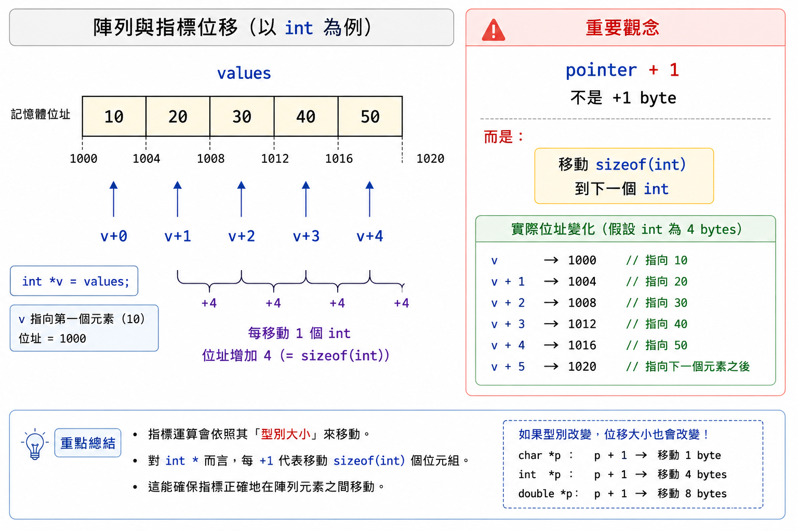
</p>


### 23. 從其他元素開始移動

```c
&values[1] + 1
```

等於：

```c
&values[2]
```

```c
&values[1] - 1
```

等於：

```c
&values[0]
```

---

### 24. 指標算術必須保持在同一陣列範圍

合法概念包括：

- 指向陣列元素。
- 指向陣列最後一個元素之後的位置。

不能任意移動到與該陣列無關的記憶體位置後再使用。

---

### 25. 指標不能相加

錯誤：

```c
&values[0] + &values[1]
```

兩個位址相加沒有陣列位置上的明確意義。

---

### 26. 同一陣列中的指標可以相減

```c
&values[2] - &values[1]
```

結果：

```text
1
```

表示相隔一個陣列元素。

```c
&values[3] - &values[0]
```

結果：

```text
3
```

---


<p align="center">
  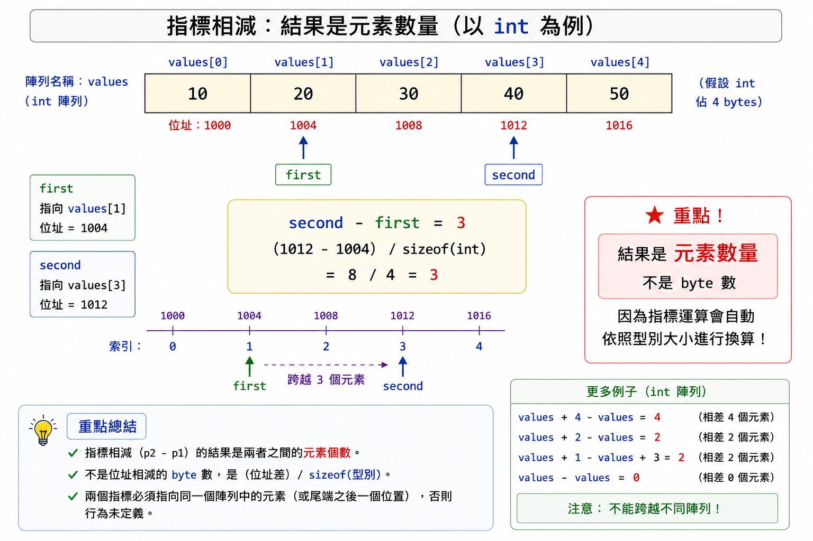
</p>


### 27. 指標算術示範

```c
#include <stddef.h>
#include <stdio.h>

int main(void) {
    int values[5] = {10, 20, 30, 40, 50};
    int *first = &values[1];
    int *second = &values[4];
    ptrdiff_t distance = second - first;

    printf("%d\n", *(first + 2));
    printf("%td\n", distance);

    return 0;
}
```

輸出：

```text
40
3
```

> `ptrdiff_t` 與 `%td` 是教材補充，用來正確表示指標相減的結果型別。

---

## Section X. 指標與陣列的不同

### 28. 陣列會配置所有元素

```c
int values[5];
```

配置可容納五個 `int` 的完整陣列物件。

---

### 29. 指標只配置一個位址變數

```c
int *pointer;
```

只建立一個保存 `int` 位址的指標變數。

它不會自動建立五個或任何數量的 `int` 元素。

---

### 30. 讓指標指向陣列第一個元素

```c
int values[5];
int *pointer = &values[0];
```

---

### 31. 陣列名稱的隱性轉型

在多數運算式中：

```c
values
```

會隱性轉型成：

```c
&values[0]
```

因此可以寫：

```c
int *pointer = values;
```

---


<p align="center">
  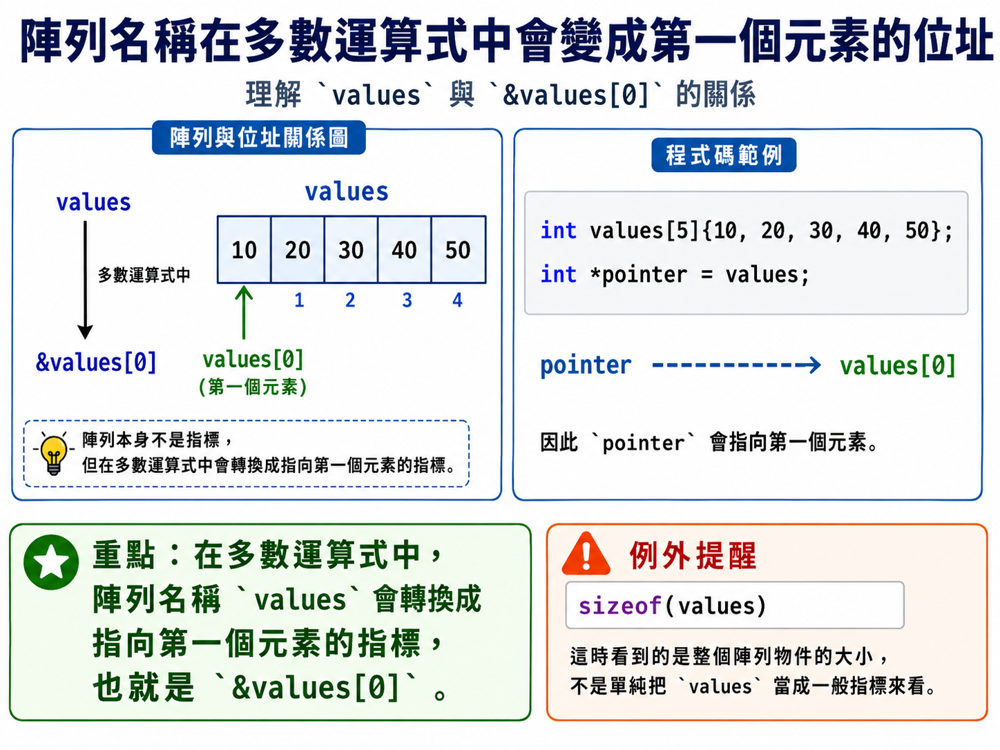
</p>


### 32. 陣列與指標仍不是同一種物件

```c
int values[5];
int *pointer = values;
```

- `values` 是完整陣列。
- `pointer` 是一個可改變的指標變數。

例如：

```c
pointer = &values[2];
```

合法。

但：

```c
values = &values[2];
```

不合法，陣列名稱不能被重新賦值成另一個位址。

---


<p align="center">
  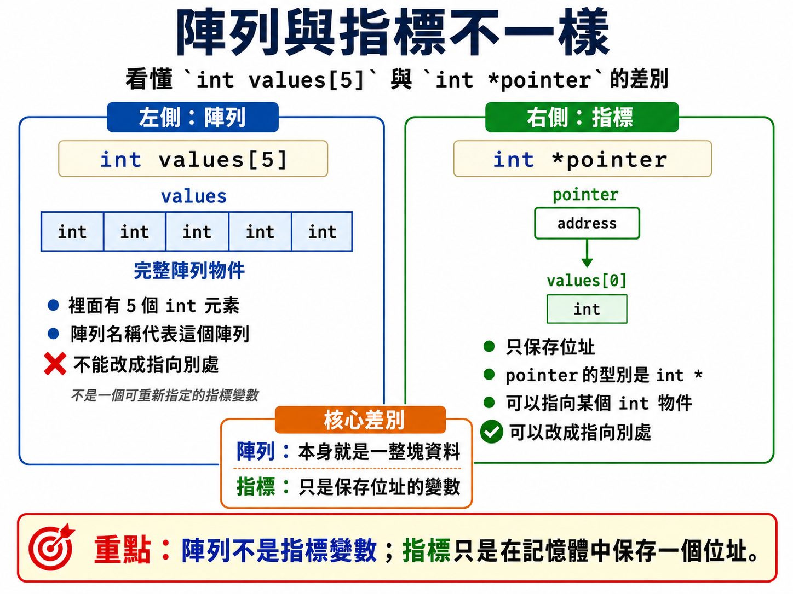
</p>


### 33. 教材補充：不是所有情況都會轉型

陣列名稱在多數運算式中轉成第一個元素指標，但例如：

```c
sizeof(values)
```

仍取得完整陣列大小。

這解釋了為什麼：

```c
sizeof(values)
```

與：

```c
sizeof(pointer)
```

通常不同。

---

## Section XI. 透過指標存取陣列元素

### 34. 第一個元素

```c
int values[5] = {1, 2, 3, 4, 5};
int *pointer = values;

*pointer
```

等於：

```c
values[0]
```

---

### 35. 其他元素

```c
*(pointer + 1)
```

等於：

```c
values[1]
```

```c
*(pointer + 2)
```

等於：

```c
values[2]
```

---

### 36. 完整示範

```c
#include <stdio.h>

int main(void) {
    int values[5] = {1, 2, 3, 4, 5};
    int *pointer = values;
    int i;

    for (i = 0; i < 5; i++) {
        printf("%d\n", *(pointer + i));
    }

    return 0;
}
```

---

## Section XII. 使用指標循序走訪陣列

### 37. 每次直接讓指標增加

```c
#include <stdio.h>

int main(void) {
    int values[5] = {1, 2, 3, 4, 5};
    int *pointer;

    for (
        pointer = values;
        pointer != values + 5;
        pointer++
    ) {
        printf("%d\n", *pointer);
    }

    return 0;
}
```

---

### 38. `values + 5` 的作用

```c
values + 5
```

表示：

```text
最後一個元素之後的位置
```

它可以作為迴圈終點比較。

不能寫：

```c
*(values + 5)
```

因為該位置不是合法元素。

---


<p align="center">
  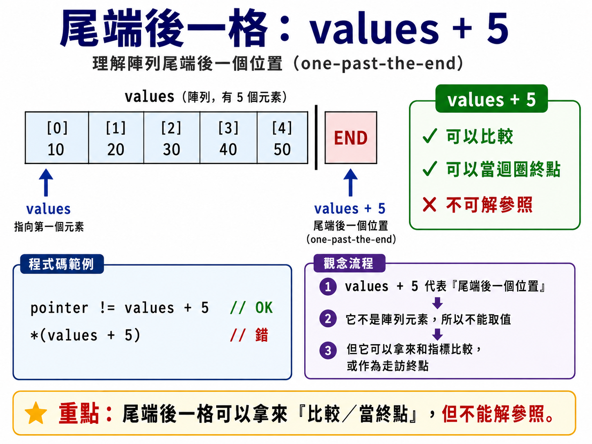
</p>


### 39. 使用 `while`

```c
int *pointer = values;

while (pointer != values + 5) {
    printf("%d\n", *pointer);
    pointer++;
}
```

---

## Section XIII. 指標與下標運算子

### 40. 下標運算子的定義

來源整理：

```c
a[b]
```

等價於：

```c
*(a + b)
```

---


<p align="center">
  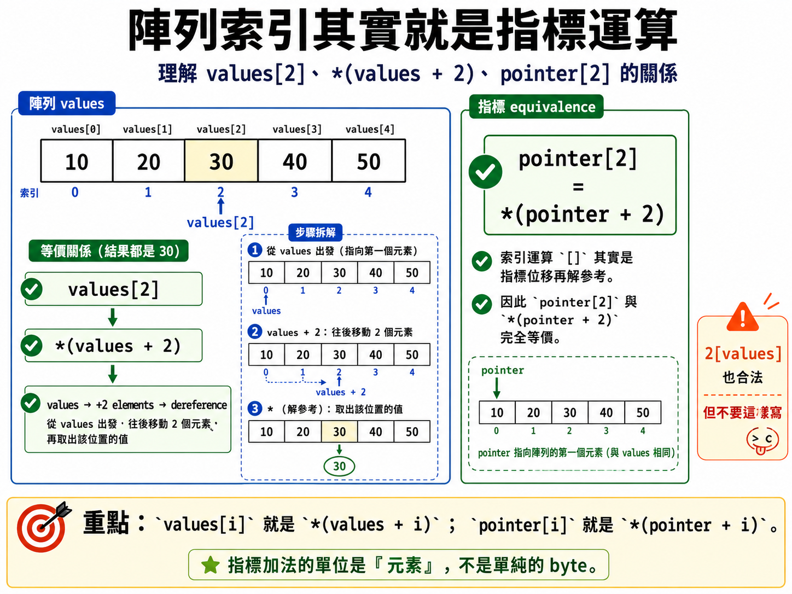
</p>


### 41. 指標也可使用下標

```c
int values[5] = {10, 20, 30, 40, 50};
int *pointer = values;

pointer[2]
```

等價於：

```c
*(pointer + 2)
```

也等價於：

```c
values[2]
```

---

### 42. 陣列名稱的下標

```c
values[2]
```

等價於：

```c
*(values + 2)
```

---

### 43. 交換順序仍然成立

因為加法可交換：

```c
a + b == b + a
```

所以語法上：

```c
0[values]
```

等價於：

```c
values[0]
```

這種寫法雖然合法，但可讀性很差，不應作為一般程式風格。

---

### 44. 完整等價示範

```c
#include <stdio.h>

int main(void) {
    int values[5] = {10, 20, 30, 40, 50};
    int *pointer = values;

    printf("%d\n", values[2]);
    printf("%d\n", *(values + 2));
    printf("%d\n", pointer[2]);
    printf("%d\n", *(pointer + 2));
    printf("%d\n", 2[values]);

    return 0;
}
```

五行都輸出：

```text
30
```

---

## Section XIV. 在函式間傳遞陣列

### 45. 固定三個元素的最大值函式

來源先寫成：

```c
int maxv(int values[3]);
```

呼叫：

```c
int values[3] = {3, 9, 7};

maxv(values);
```

---

### 46. 參數中的陣列寫法會調整成指標

在函式參數中：

```c
int maxv(int values[3]);
```

```c
int maxv(int values[]);
```

```c
int maxv(int *values);
```

三者的參數都以 `int *` 處理。

參數中的 `[3]` 不會讓函式取得一份三元素陣列副本。

---

### 47. 呼叫時傳入第一個元素位址

```c
maxv(values);
```

在這個運算式中，`values` 轉成：

```c
&values[0]
```

因此也可以概念上寫成：

```c
maxv(&values[0]);
```

---

### 48. 函式中可用兩種寫法

```c
values[i]
```

或：

```c
*(values + i)
```

兩者等價。

---

### 49. 同一函式處理不同長度

```c
#include <stdio.h>

int maxv(const int *values, int length);

int main(void) {
    int first[3] = {3, 9, 7};
    int second[5] = {3, 9, 1, 2, 7};

    printf("%d\n", maxv(first, 3));
    printf("%d\n", maxv(second, 5));

    return 0;
}

int maxv(const int *values, int length) {
    int i;
    int maximum = values[0];

    for (i = 1; i < length; i++) {
        if (values[i] > maximum) {
            maximum = values[i];
        }
    }

    return maximum;
}
```

前提：

```text
length >= 1
```

---

### 50. 為什麼仍要傳 `length`？

第一個元素位址只告訴函式：

```text
陣列從哪裡開始
```

不會告訴函式：

```text
後面有多少個合法元素
```

---

## Section XV. 指標與陣列關係整理

來源最後整理出三個重點：

1. 指標保存某陣列元素位址時，可以使用加減整數移動到同一陣列中的其他元素。
2. `a[b]` 等價於 `*(a + b)`。
3. 陣列在多數運算式中可以隱性轉型成第一個元素的位址。

---

## Section XVI. 指標與遞增運算子

### 51. 使用下標將陣列歸零

```c
int values[5];
int i;

for (i = 0; i < 5; i++) {
    values[i] = 0;
}
```

---

### 52. 使用指標下標

```c
int *pointer = values;

for (i = 0; i < 5; i++) {
    pointer[i] = 0;
}
```

---

### 53. 使用指標移動

```c
int *pointer;

for (
    pointer = values;
    pointer != values + 5;
    pointer++
) {
    *pointer = 0;
}
```

---

### 54. 使用 `while`

```c
int *pointer = values;

while (pointer != values + 5) {
    *pointer = 0;
    pointer++;
}
```

---

### 55. 合併成 `*pointer++`

來源最後化簡：

```c
*pointer++ = 0;
```

由運算子優先順序判讀：

```c
*(pointer++) = 0;
```

步驟：

1. 使用目前 `pointer` 指向的元素。
2. 將該元素設為 `0`。
3. 指標再移到下一個元素。

---

### 56. 完整歸零程式

```c
#include <stdio.h>

int main(void) {
    int values[5] = {1, 2, 3, 4, 5};
    int *pointer = values;
    int i;

    while (pointer != values + 5) {
        *pointer++ = 0;
    }

    for (i = 0; i < 5; i++) {
        printf("%d ", values[i]);
    }

    printf("\n");

    return 0;
}
```

輸出：

```text
0 0 0 0 0
```

---

### 57. 教材補充：三種容易混淆的寫法

來源主要推導：

```c
*pointer++
```

以下為優先順序補充：

| 寫法 | 加括號後 | 效果 |
| --- | --- | --- |
| `*pointer++` | `*(pointer++)` | 使用目前元素，再移動指標 |
| `(*pointer)++` | `(*pointer)++` | 增加目前元素的值，指標不動 |
| `*++pointer` | `*(++pointer)` | 先移動指標，再存取新元素 |

---


<p align="center">
  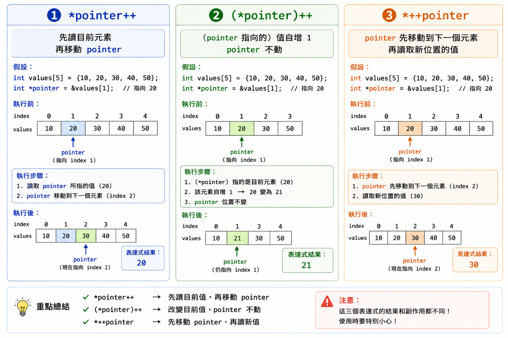
</p>


# Part C：指標與字串

## Section XVII. 字串與字元陣列

### 58. 字串是字元序列

```c
char text[] = {
    't', 'e', 's', 't', '\0'
};
```

也可以使用字串字面常數初始化：

```c
char text[] = "test";
```

編譯器會加入最後的：

```c
'\0'
```

---

### 59. 字元陣列傳入函式

```c
void print_text(const char *text);
```

呼叫：

```c
char text[] = "test";

print_text(text);
```

`text` 在呼叫運算式中轉成第一個字元的位址。

---

### 60. 安全輸出字串

來源使用 `printf(strA)` 來展示陣列轉成指標。

完整程式更建議寫：

```c
printf("%s", strA);
```

因為把一般文字直接當成格式字串，若內容含有 `%`，會產生格式字串問題。

---

## Section XVIII. 字元陣列與字串指標

### 61. 可修改的字元陣列

```c
#include <stdio.h>

int main(void) {
    char text[] = "test";

    text[0] = 'T';

    printf("%s\n", text);

    return 0;
}
```

輸出：

```text
Test
```

字串字面常數的內容在初始化時被複製到 `text` 陣列中。

---

### 62. 指向字串字面常數

來源示範：

```c
char *text = "test";
```

在 C 中可以形成指向字串字面常數第一個字元的指標，但不能透過它修改內容：

```c
text[0] = 'T';
```

屬於未定義行為。

較清楚且安全的宣告是：

```c
const char *text = "test";
```

---

### 63. 字元陣列與指標的差異

```c
char array[] = "test";
const char *pointer = "test";
```

| 特性 | `array` | `pointer` |
| --- | --- | --- |
| 配置 | 自己擁有五個字元元素 | 只保存位址 |
| 修改字元 | 可以 | 不可透過此指標修改 |
| 改指向其他字串 | 不可以 | 可以 |
| `sizeof` | 完整陣列大小 | 指標大小 |

---


<p align="center">
  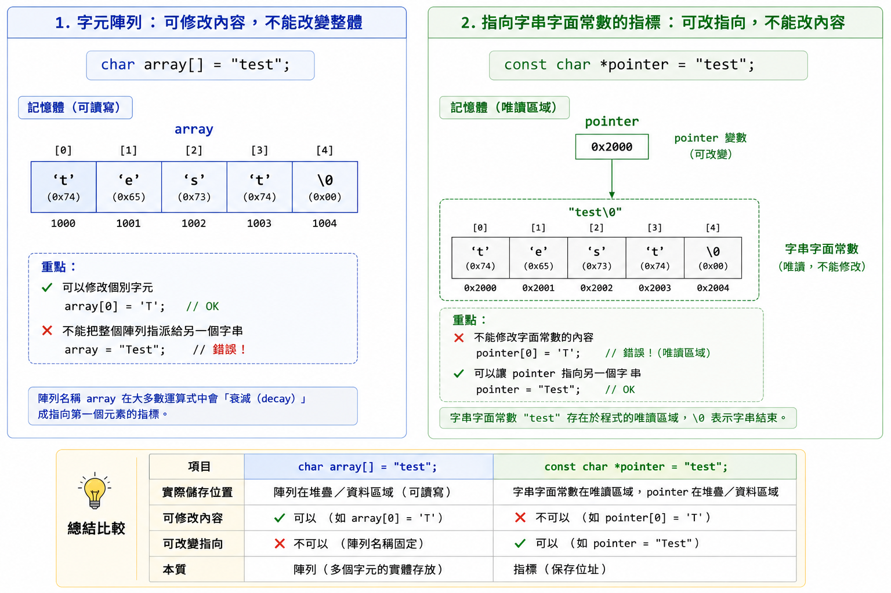
</p>


## Section XIX. 字串字面常數的特殊性

### 64. 修改陣列內容合法

```c
char array[] = "test";

array[0] = 'T';
```

---

### 65. 修改字串字面常數未定義

```c
char *pointer = "test";

/* pointer[0] = 'T';  未定義行為 */
```

即使某些編譯器接受宣告，也不能修改字串字面常數。

---

### 66. 陣列不能重新賦值

```c
char array[] = "test";

/* array = "Test";  編譯失敗 */
```

陣列名稱不是可重新指向的指標變數。

---

### 67. 指標可以重新指向

```c
const char *pointer = "test";

pointer = "Test";
```

這只是將另一個字串字面常數的位址放入指標。

它不是將 `"Test"` 的字元複製到原本位置。

---

### 68. 完整指標改指向範例

```c
#include <stdio.h>

int main(void) {
    const char *text = "test";

    printf("%s\n", text);

    text = "Test";

    printf("%s\n", text);

    return 0;
}
```

---

## Section XX. `const` 修飾字

### 69. 一般整數與 `const int`

```c
int a = 3;
const int b = 5;

a = 4;
/* b = 6;  編譯失敗 */
```

來源將 `const` 描述為：

```text
初始化以外不能再被賦值
```

可以把它視為透過該名稱唯讀的屬性。

---

### 70. `const` 陣列元素

```c
const int values[3] = {5, 6, 7};

/* values[0] = 6;  編譯失敗 */
```

每個元素都具有 `const int` 型別。

---

### 71. 完整 `const` 範例

```c
#include <stdio.h>

int main(void) {
    int a = 3;
    const int b = 5;
    const int values[3] = {5, 6, 7};

    a = 4;

    printf("%d\n", a);
    printf("%d\n", b);
    printf("%d\n", values[0]);

    return 0;
}
```

---

## Section XXI. 字串字面常數與 `const char *`

### 72. 建議宣告

```c
const char *text = "test";
```

意思：

```text
text 是一個指標，指向不能透過 text 修改的 char
```

---

### 73. 不能修改所指字元

```c
const char *text = "test";

/* text[0] = 'T';  編譯失敗 */
```

---

### 74. 指標本身仍可改指向

```c
const char *text = "test";

text = "Test";
```

`const` 修飾的是被指向的 `char`，不是 `text` 這個指標變數。

---

### 75. `printf()` 的格式字串

來源展示的函式介面：

```c
int printf(
    const char *format,
    ...
);
```

格式字串只需要讀取，不應由 `printf()` 修改，因此使用：

```c
const char *
```

---

## Section XXII. 指標與 `const` 的轉型方向

### 76. 可修改指標可轉成唯讀指標

```c
char array[] = "test";
char *writable = array;
const char *readonly = writable;
```

合法。

`readonly` 可以讀取同一批字元，但不能透過它修改。

---

### 77. 陣列也可轉成 `const char *`

```c
const char *readonly = array;
```

陣列先轉成 `char *`，再增加 `const` 限制。

---

### 78. 不能安全地隱性移除 `const`

```c
const char *readonly = "test";

/* char *writable = readonly; */
```

嚴格 C 編譯器必須對這種不相容指派提供診斷，因為它可能讓程式嘗試修改唯讀資料。

來源投影片將這一行留為問號；本講義採用嚴格 C17 規則說明。

---

### 79. 完整增加 `const` 範例

```c
#include <stdio.h>

int main(void) {
    char text[] = "test";
    char *writable = text;
    const char *readonly = writable;

    writable[0] = 'T';

    printf("%s\n", readonly);

    return 0;
}
```

輸出：

```text
Test
```

---

### 80. 只讀函式參數

```c
int text_length(const char *text);
```

這個介面向呼叫者表達：

```text
函式會讀取字串，但不透過 text 修改內容
```

---

# Part D：字串複製

## Section XXIII. 指標賦值不是字串複製

### 81. 陣列不能直接賦值

```c
char source[5] = "test";
char destination[5];

/* destination = source; */
```

編譯失敗。

---

### 82. 指標賦值只是共享同一位置

```c
char source[5] = "test";
char *destination;

destination = source;
```

現在：

```text
destination 與 source 都表示同一批字元
```

這不是建立另一份獨立字串內容。

來源稱此概念為：

```text
淺複製 shallow copy／同一份
```

---

### 83. 真正複製要逐字元進行

```c
char source[5] = "test";
char destination[5];
int i;

for (i = 0; i < 5; i++) {
    destination[i] = source[i];
}
```

這會連同 `'\0'` 複製五個元素。

---


<p align="center">
  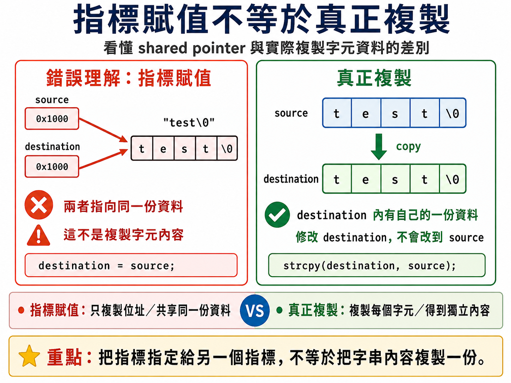
</p>


## Section XXIV. 自行使用指標複製字串

### 84. 基本函式

```c
void string_copy(
    char *destination,
    const char *source
) {
    while (*source != '\0') {
        *destination = *source;
        destination++;
        source++;
    }

    *destination = '\0';
}
```

---

### 85. 為什麼來源是 `const char *`？

函式只需要讀取來源，不應修改來源文字。

---

### 86. 為什麼目的地是 `char *`？

函式必須將字元寫入目的地，因此目的地不能是唯讀字元指標。

---

### 87. 最後一定要補 `'\0'`

迴圈在來源的 `'\0'` 前停止。

因此結束後要：

```c
*destination = '\0';
```

否則目的地不是完整 C 字串。

---

### 88. 完整自行複製範例

```c
#include <stdio.h>

void string_copy(
    char *destination,
    const char *source
);

int main(void) {
    const char source[] = "test";
    char destination[5];

    string_copy(destination, source);

    printf("%s\n", destination);

    return 0;
}

void string_copy(
    char *destination,
    const char *source
) {
    while (*source != '\0') {
        *destination = *source;
        destination++;
        source++;
    }

    *destination = '\0';
}
```

---

### 89. 更精簡的寫法

```c
while ((*destination++ = *source++) != '\0') {
}
```

這會連 `'\0'` 一起複製。

但運算子較密集，初學階段應先熟悉清楚版本。

---

## Section XXV. 使用標準函式 `strcpy()`

### 90. 函式介面

```c
char *strcpy(
    char *destination,
    const char *source
);
```

需要：

```c
#include <string.h>
```

---

### 91. 基本使用

```c
#include <stdio.h>
#include <string.h>

int main(void) {
    const char source[] = "test";
    char destination[5];

    strcpy(destination, source);

    printf("%s\n", destination);

    return 0;
}
```

---

### 92. `strcpy()` 的兩個參數

| 參數 | 型別 | 需要 |
| --- | --- | --- |
| `destination` | `char *` | 指向可寫且容量足夠的字元空間 |
| `source` | `const char *` | 指向有效且以 `'\0'` 結束的字串 |

---

### 93. 目的地必須有足夠容量

來源：

```text
"test"
```

需要：

```text
't' 'e' 's' 't' '\0'
```

共五格。

因此：

```c
char destination[5];
```

剛好足夠。

若容量不足，`strcpy()` 會寫到陣列外部。

---

### 94. 未初始化指標不能當作目的地

錯誤：

```c
char *destination;

strcpy(destination, source);
```

`destination` 尚未指向任何已配置、可寫且足夠大的空間。

---

### 95. `const` 陣列不能作為目的地

錯誤：

```c
const char destination[5] = {0};

/* strcpy(destination, source); */
```

`strcpy()` 需要：

```c
char *
```

不能寫入 `const char` 元素。

---

### 96. `const char *` 也不能作為目的地

錯誤：

```c
const char *destination;

/* strcpy(destination, source); */
```

即使它稍後指向某處，`const char *` 介面也不允許透過該指標寫入字元。

---

### 97. `strcpy()` 不知道目的地容量

它只依來源的 `'\0'` 決定何時停止。

呼叫者必須自行保證：

```text
目的地容量 >= 來源長度 + 1
```

---

## Section XXVI. 教材安全補充

> 以下內容用來補足來源範例在現代 C 程式中容易遇到的安全問題。

### 98. 不要將一般輸入直接當成 `printf()` 格式字串

不建議：

```c
printf(text);
```

建議：

```c
printf("%s", text);
```

---

### 99. 不要修改字串字面常數

即使宣告成：

```c
char *text = "test";
```

也不能安全修改。

優先使用：

```c
const char *text = "test";
```

---

### 100. `strcpy()` 沒有容量參數

只有在呼叫端能確定目的地容量時使用。

若來源長度不可信，應先驗證長度或使用具有明確容量設計的自訂函式。

---

### 101. 有容量限制的自訂版本

```c
#include <stddef.h>

int string_copy_sized(
    char *destination,
    size_t capacity,
    const char *source
) {
    size_t i = 0;

    if (
        destination == NULL ||
        source == NULL ||
        capacity == 0
    ) {
        return 0;
    }

    while (
        source[i] != '\0' &&
        i + 1 < capacity
    ) {
        destination[i] = source[i];
        i++;
    }

    destination[i] = '\0';

    return source[i] == '\0';
}
```

回傳：

- `1`：完整複製。
- `0`：參數無效或來源被截短。

這是教材補充，不是來源投影片的主要實作。

---

## Section XXVII. 容易搞混的重點

### 102. 傳位址仍然是傳值

C 沒有把參數變成同一個指標變數。

它複製的是位址值。

---

### 103. `sort_two()` 中比較的是 `*a` 與 `*b`

```c
a > b
```

比較的是兩個位址，不能用來判斷整數大小。

應寫：

```c
*a > *b
```

---

### 104. 指標加一與整數加一的單位不同

```c
number + 1
```

整數值增加一。

```c
pointer + 1
```

移動到下一個所指型態元素。

---

### 105. 指標相減不是位元組數

同一陣列中：

```c
second - first
```

得到相隔的元素數量。

---

### 106. 陣列名稱與指標變數不相同

陣列名稱不能被重新賦值；指標變數可以。

---

### 107. 尾端位置不是元素

```c
values + length
```

可用來比較，但不能解參照。

---

### 108. `pointer[i]` 不代表 `pointer` 是陣列

下標是由指標加法與間接存取定義的。

---

### 109. 函式參數中的 `[3]` 不會保存陣列長度

```c
void function(int values[3]);
```

仍然是指標參數。

---

### 110. `*pointer++` 修改的是指標，不是元素值

它等價於：

```c
*(pointer++)
```

若要增加元素值：

```c
(*pointer)++;
```

---

### 111. 字元陣列初始化與指標指向字面常數不同

```c
char array[] = "test";
```

會建立可修改副本。

```c
const char *pointer = "test";
```

只保存字串字面常數的位址。

---

### 112. 指標改指向不是複製字串

```c
pointer = "Test";
```

只改變位址。

---

### 113. `const char *` 的指標本身仍可改變

`const` 限制的是透過該指標修改字元，不是指標變數本身。

---

### 114. 增加 `const` 與移除 `const` 的方向不同

```c
char * → const char *
```

安全且允許。

```c
const char * → char *
```

可能讓程式修改唯讀資料，不是安全的隱性轉型。

---

### 115. 字串複製需要目的地儲存空間

僅宣告：

```c
char *destination;
```

不會自動配置字元陣列。

---

## Section XXVIII. 快速概念檢查

### Q1. 為什麼 `swap(a, b)` 不能交換呼叫端變數？

<details>
<summary>查看答案</summary>

函式只取得 `a`、`b` 的整數值副本。

</details>

---

### Q2. 正確呼叫交換函式的寫法是什麼？

<details>
<summary>查看答案</summary>

```c
swap(&a, &b);
```

</details>

---

### Q3. 在 `swap(int *a, int *b)` 中，`*a` 是什麼？

<details>
<summary>查看答案</summary>

第一個指標所指向的呼叫端 `int` 物件。

</details>

---

### Q4. `sort_two()` 已經取得兩個 `int *`，呼叫 `swap()` 時要再加 `&` 嗎？

<details>
<summary>查看答案</summary>

不用，直接：

```c
swap(a, b);
```

</details>

---

### Q5. 只需要讀取兩個整數並回傳最大值時，適合傳值還是位址？

<details>
<summary>查看答案</summary>

傳值較簡單，也符合來源的基本原則。

</details>

---

### Q6. `&values[0] + 2` 等於什麼？

<details>
<summary>查看答案</summary>

```c
&values[2]
```

</details>

---

### Q7. `&values[3] - &values[0]` 是多少？

<details>
<summary>查看答案</summary>

```text
3
```

表示相隔三個元素。

</details>

---

### Q8. 可以將兩個陣列元素指標相加嗎？

<details>
<summary>查看答案</summary>

不可以，指標加指標沒有此處定義的陣列意義。

</details>

---

### Q9. `int *pointer = values;` 中 `values` 轉成什麼？

<details>
<summary>查看答案</summary>

第一個元素的位址：

```c
&values[0]
```

</details>

---

### Q10. `*(values + 3)` 等價於什麼？

<details>
<summary>查看答案</summary>

```c
values[3]
```

</details>

---

### Q11. `2[values]` 是否合法？

<details>
<summary>查看答案</summary>

合法，等價於：

```c
values[2]
```

但不建議這樣寫。

</details>

---

### Q12. `values + 5` 對長度五的陣列表示什麼？

<details>
<summary>查看答案</summary>

最後一個元素之後的位置，可作為比較終點，但不能解參照。

</details>

---

### Q13. 函式參數中的 `int values[5]` 會取得五個元素副本嗎？

<details>
<summary>查看答案</summary>

不會，它會調整成指標參數。

</details>

---

### Q14. `*pointer++` 加括號後是什麼？

<details>
<summary>查看答案</summary>

```c
*(pointer++)
```

</details>

---

### Q15. `char array[] = "test";` 的內容可以修改嗎？

<details>
<summary>查看答案</summary>

可以，因為它是自己的字元陣列。

</details>

---

### Q16. 可以修改 `const char *text = "test";` 所指字元嗎？

<details>
<summary>查看答案</summary>

不可以透過 `text` 修改。

</details>

---

### Q17. `text = "Test";` 對 `const char *text` 合法嗎？

<details>
<summary>查看答案</summary>

合法，指標本身可以改指向另一個字串字面常數。

</details>

---

### Q18. `char *` 可以指派給 `const char *` 嗎？

<details>
<summary>查看答案</summary>

可以，這是增加唯讀限制。

</details>

---

### Q19. 指標賦值能建立一份獨立字串嗎？

<details>
<summary>查看答案</summary>

不能，只會讓兩個指標或名稱存取同一批字元。

</details>

---

### Q20. `strcpy()` 的目的地需要什麼條件？

<details>
<summary>查看答案</summary>

指向可寫、已配置且容量足夠的字元空間。

</details>

---

## Section XXIX. 程式閱讀練習

### 題目 1：位址參數

```c
void set_zero(int *number) {
    *number = 0;
}

int value = 10;
set_zero(&value);
```

<details>
<summary>查看答案</summary>

```text
value == 0
```

</details>

---

### 題目 2：交換

```c
int a = 2;
int b = 8;

swap(&a, &b);
```

<details>
<summary>查看答案</summary>

```text
a == 8
b == 2
```

</details>

---

### 題目 3：指標加法

```c
int values[4] = {10, 20, 30, 40};
int *pointer = values + 1;

printf("%d\n", *(pointer + 2));
```

<details>
<summary>查看答案</summary>

`pointer` 指向 `values[1]`，再向後兩格到 `values[3]`：

```text
40
```

</details>

---

### 題目 4：指標相減

```c
int *first = &values[1];
int *second = &values[4];
```

<details>
<summary>查看答案</summary>

```c
second - first
```

結果是：

```text
3
```

</details>

---

### 題目 5：下標等價

```c
int *pointer = values;

pointer[2] = 99;
```

<details>
<summary>查看答案</summary>

等價於：

```c
*(pointer + 2) = 99;
```

因此 `values[2]` 變成 `99`。

</details>

---

### 題目 6：參數形式

```c
void process(int values[10]);
```

<details>
<summary>查看答案</summary>

在函式參數中等價於指標參數，不會自動知道長度是十。

</details>

---

### 題目 7：後置遞增

```c
int values[3] = {5, 6, 7};
int *pointer = values;

int result = *pointer++;
```

<details>
<summary>查看答案</summary>

```text
result == 5
pointer 指向 values[1]
```

</details>

---

### 題目 8：增加元素值

```c
int values[3] = {5, 6, 7};
int *pointer = values;

(*pointer)++;
```

<details>
<summary>查看答案</summary>

```text
values[0] == 6
pointer 仍指向 values[0]
```

</details>

---

### 題目 9：字元陣列

```c
char text[] = "cat";

text[0] = 'C';
```

<details>
<summary>查看答案</summary>

字串變成：

```text
Cat
```

</details>

---

### 題目 10：字串指標

```c
const char *text = "cat";

text = "dog";
```

<details>
<summary>查看答案</summary>

`text` 改指向 `"dog"`，沒有修改 `"cat"` 的內容。

</details>

---

### 題目 11：增加 `const`

```c
char text[] = "cat";
char *first = text;
const char *second = first;
```

<details>
<summary>查看答案</summary>

合法。`second` 可以讀取文字，但不能透過它修改字元。

</details>

---

### 題目 12：字串複製

```c
char source[] = "cat";
char destination[4];

string_copy(destination, source);
```

<details>
<summary>查看答案</summary>

目的地得到獨立內容：

```text
'c' 'a' 't' '\0'
```

</details>

---

## Section XXX. 實作練習 / 實作檢測題

### TODO 1：`set_zero()`

撰寫：

```c
void set_zero(int *number);
```

測試呼叫前後的值。

---

### TODO 2：`add_amount()`

撰寫：

```c
void add_amount(
    int *number,
    int amount
);
```

透過指標修改呼叫端。

---

### TODO 3：交換兩個整數

完成來源的 `swap()`，測試：

```text
兩個不同值
兩個相同值
負數
```

---

### TODO 4：排序兩個整數

完成 `sort_two()`，保證呼叫後：

```text
a <= b
```

---

### TODO 5：選擇傳值或位址

為以下函式設計介面並解釋理由：

```text
求平方
交換
求最大值
將值限制到 0–100
```

---

### TODO 6：指標算術表格

建立長度六的陣列，列出：

```c
values + i
```

與：

```c
&values[i]
```

是否相同。

---

### TODO 7：使用指標輸出陣列

不得使用下標，只能使用：

```c
*pointer
pointer++
```

---

### TODO 8：反向走訪

讓指標從最後一個元素開始，使用 `pointer--` 反向輸出。

注意不要移動到第一個元素之前。

---

### TODO 9：下標與指標四種寫法

對同一元素分別使用：

```c
values[i]
*(values + i)
pointer[i]
*(pointer + i)
```

---

### TODO 10：任意長度最大值

使用：

```c
int maxv(
    const int *values,
    int length
);
```

---

### TODO 11：使用 `*pointer++` 歸零

不得使用陣列下標。

---

### TODO 12：比較三種遞增寫法

分別追蹤：

```c
*pointer++
(*pointer)++
*++pointer
```

---

### TODO 13：字元陣列與字串指標

建立：

```c
char array[] = "test";
const char *pointer = "test";
```

測試哪些操作合法：

```text
修改字元
改指向
使用 sizeof
```

---

### TODO 14：自行複製字串

完成：

```c
void string_copy(
    char *destination,
    const char *source
);
```

---

### TODO 15：有容量的字串複製

完成教材補充的：

```c
int string_copy_sized(
    char *destination,
    size_t capacity,
    const char *source
);
```

測試完整複製與截短。

---

## Section XXXI. 做題時可以使用的提示

### 1. 函式沒有修改呼叫端時，先檢查是否只傳值

需要修改時，傳入位址並在函式中使用 `*`。

---

### 2. 指標參數之間再呼叫函式時，不一定要加 `&`

先比較目前運算式與目標參數型別。

---

### 3. 指標算術一定要畫陣列

```text
pointer + 1
```

應對應下一個元素，而不是猜測位址數字。

---

### 4. 使用尾端位置時只比較，不解參照

```c
pointer != values + length
```

合法。

```c
*(values + length)
```

不合法。

---

### 5. 看見下標就改寫

```c
a[b]
→
*(a + b)
```

---

### 6. 函式參數中的陣列大小不要當成可查詢長度

仍然要另外傳入 `length`。

---

### 7. 看見 `*p++` 先加括號

```c
*(p++)
```

---

### 8. 字串題先確認資料存在哪裡

```text
字元陣列副本？
字串字面常數？
尚未初始化的指標？
```

---

### 9. `const char *` 由右向左讀

```text
指向 const char 的指標
```

限制的是透過該指標修改字元。

---

### 10. 字串複製前先算容量

```text
strlen(source) + 1
```

必須小於或等於目的地容量。

---

## Section XXXII. 課後小練習

### 練習 1：限制範圍

撰寫指標函式，將呼叫端整數限制到 `0–100`。

---

### 練習 2：找較大值的位置

回傳指向較大整數的指標：

```c
int *larger_address(
    int *a,
    int *b
);
```

---

### 練習 3：陣列總和

使用指標起點與尾端位置計算總和。

---

### 練習 4：反向陣列

使用兩個指標：

```text
一個從前往後
一個從後往前
```

配合 `swap()` 反轉陣列。

---

### 練習 5：計算偶數數量

使用指標走訪，不使用下標。

---

### 練習 6：自行實作字串長度

```c
size_t string_length(
    const char *text
);
```

使用指標移動到 `'\0'`。

---

### 練習 7：字串轉大寫

來源必須是可修改字元陣列，透過指標逐字元修改。

不要對字串字面常數執行。

---

### 練習 8：比較兩個字串

自行撰寫：

```c
int strings_equal(
    const char *first,
    const char *second
);
```

---

## Section XXXIII. 重點複習

1. C 函式引數全部以值傳遞。
2. 普通參數複製資料值。
3. 指標參數複製位址值。
4. 透過指標參數可以修改呼叫端物件。
5. `swap()` 必須取得兩個整數位址。
6. `swap(&a, &b)` 將呼叫端位址傳入。
7. `*a` 與 `*b` 是實際要交換的整數。
8. `sort_two()` 也必須取得位址才能改變呼叫端。
9. 指標參數傳給另一個相同指標參數時不需再取址。
10. 可以傳值時，來源建議優先傳值。
11. 傳值較不容易讓函式修改原資料。
12. 傳值可以直接傳入一般常數。
13. 必須修改呼叫端時傳位址。
14. 無法直接整體複製的陣列與字串通常傳位址。
15. 複製成本很高的資料也可能傳位址。
16. 指標加一移動到下一個同型態陣列元素。
17. 指標減一移動到前一個元素。
18. 指標加法只能與整數組合。
19. 兩個指標不能相加。
20. 同一陣列中的兩指標可以相減。
21. 指標相減得到相隔的元素數量。
22. 陣列與指標是不同型別與不同物件。
23. 陣列配置所有元素，指標只保存位址。
24. 陣列名稱在多數運算式中轉成第一個元素指標。
25. `pointer = values` 使指標指向 `values[0]`。
26. 陣列名稱不能重新賦值，指標可以改指向。
27. `*(pointer + i)` 可存取第 `i` 個元素。
28. 指標可依序走訪陣列。
29. `values + length` 是尾端之後的位置。
30. 尾端之後的位置可比較但不可解參照。
31. `a[b]` 等價於 `*(a + b)`。
32. 陣列與指標都可搭配下標。
33. `0[values]` 合法但不應作為一般風格。
34. 函式參數中的陣列寫法調整成指標。
35. `int values[]` 與 `int *values` 在參數中等價。
36. 函式仍需另外取得陣列長度。
37. `*pointer++` 等價於 `*(pointer++)`。
38. 它先使用目前元素，再移動指標。
39. 字串是以 `'\0'` 結束的字元陣列。
40. 字元陣列可在初始化時取得字串字面內容的副本。
41. 字元陣列內容通常可以修改。
42. 指向字串字面常數時不應修改內容。
43. 修改字串字面常數是未定義行為。
44. 陣列不能改指向，指標可以。
45. `const` 可限制物件不能透過該名稱修改。
46. `const char *` 不能透過該指標修改字元。
47. `const char *` 指標本身仍可改指向。
48. `char *` 可以轉成 `const char *`。
49. 不能安全地隱性移除 `const`。
50. 只讀字串參數應使用 `const char *`。
51. 指標賦值不是字串內容複製。
52. 真正字串複製需要另一塊可寫空間。
53. 字串複製必須包含 `'\0'`。
54. `strcpy()` 的來源參數為 `const char *`。
55. `strcpy()` 的目的地參數為 `char *`。
56. 目的地必須容量足夠。
57. 未初始化指標不能作為 `strcpy()` 目的地。
58. `const` 目的地不能被 `strcpy()` 寫入。
59. 下一章會使用動態配置取得可變大小的儲存空間。

---

## Section XXXIV. 常見錯誤提醒

### 錯誤 1：交換函式只接收普通整數

只會交換參數副本。

---

### 錯誤 2：呼叫指標參數時忘記取址

```c
swap(a, b);
```

在 `main()` 中的 `a`、`b` 是普通整數時應傳：

```c
swap(&a, &b);
```

---

### 錯誤 3：在指標參數函式中比較位址

```c
if (a > b)
```

應比較：

```c
if (*a > *b)
```

---

### 錯誤 4：指標已經是位址卻再次取址

```c
swap(&a, &b);
```

若 `a`、`b` 已經是 `int *`，這會得到 `int **`。

---

### 錯誤 5：所有資料都不必要地傳位址

只讀取小型值時，傳值更簡單。

---

### 錯誤 6：把 `pointer + 1` 當成增加一個位元組

它移動一個所指型態元素。

---

### 錯誤 7：將兩個指標相加

沒有本章所需的合法意義。

---

### 錯誤 8：對不同陣列的指標做減法

指標相減必須建立在同一陣列範圍中。

---

### 錯誤 9：把陣列當成可重新賦值的指標變數

```c
values = values + 1;
```

不合法。

---

### 錯誤 10：解參照尾端之後的位置

```c
*(values + length)
```

越界。

---

### 錯誤 11：以為參數中的 `[10]` 會傳入十個元素副本

實際仍是指標參數。

---

### 錯誤 12：函式只取得指標卻沒有取得長度

無法知道合法範圍。

---

### 錯誤 13：將 `*pointer++` 誤讀成增加元素值

它增加的是指標。

---

### 錯誤 14：修改字串字面常數

```c
char *text = "test";
text[0] = 'T';
```

未定義行為。

---

### 錯誤 15：將字元陣列與指標視為完全相同

它們在配置、賦值與 `sizeof` 上不同。

---

### 錯誤 16：以為指標改指向就是複製字串

只改變位址，沒有建立獨立內容。

---

### 錯誤 17：透過 `const char *` 修改字元

會造成編譯診斷。

---

### 錯誤 18：將 `const char *` 指派給 `char *`

會移除保護，嚴格 C 編譯器必須診斷。

---

### 錯誤 19：自行複製時忘記 `'\0'`

目的地不會形成完整字串。

---

### 錯誤 20：`strcpy()` 目的地容量不足

會寫出陣列範圍。

---

### 錯誤 21：只宣告目的地指標，沒有配置字元空間

```c
char *destination;
```

不能直接交給 `strcpy()`。

---

### 錯誤 22：將 `const` 陣列作為 `strcpy()` 目的地

目的地必須可寫。

---

## Section XXXV. Mermaid 流程圖

### 1. 傳值與傳位址

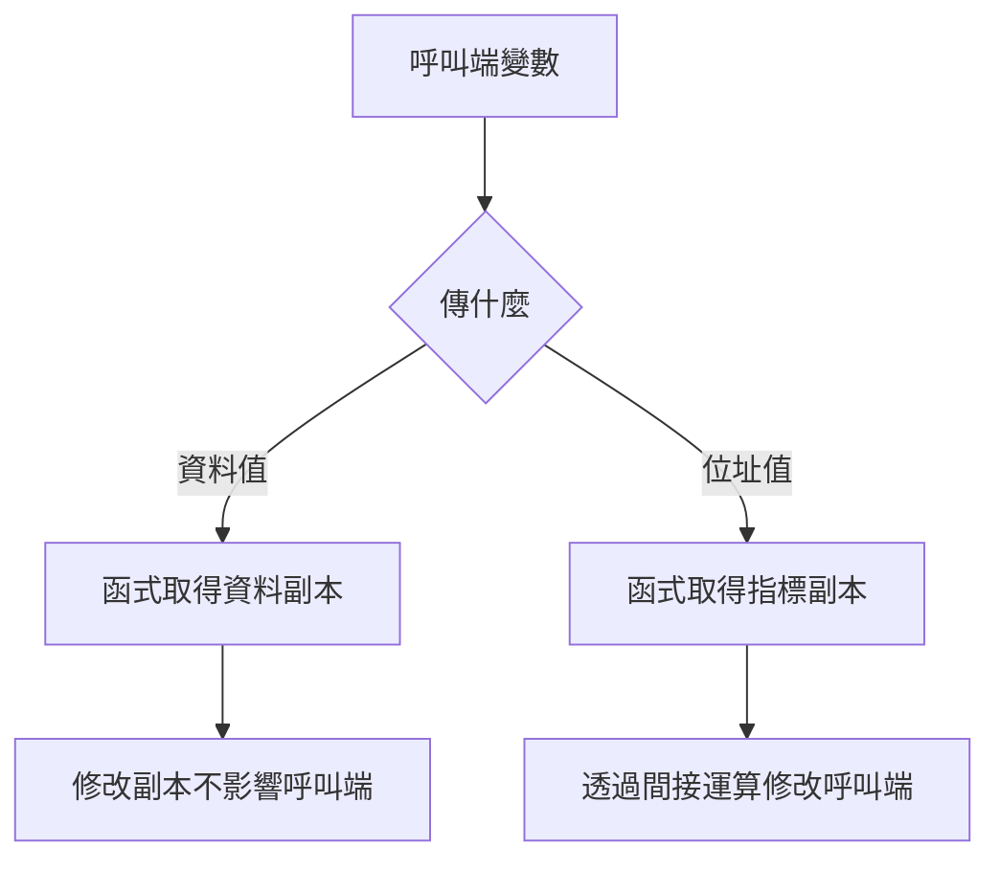
```mermaid
flowchart TD
    A[呼叫端變數] --> B{傳什麼}
    B -- 資料值 --> C[函式取得資料副本]
    C --> D[修改副本不影響呼叫端]
    B -- 位址值 --> E[函式取得指標副本]
    E --> F[透過間接運算修改呼叫端]
```

---

### 2. `swap()` 流程

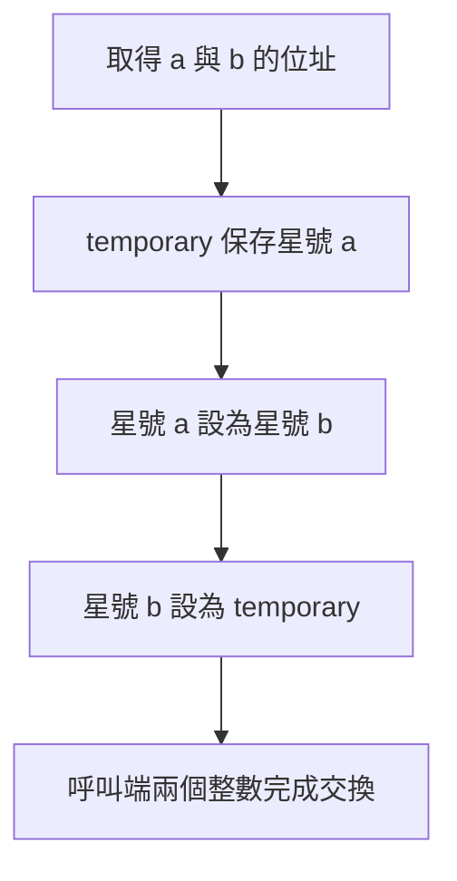
```mermaid
flowchart TD
    A[取得 a 與 b 的位址] --> B[temporary 保存星號 a]
    B --> C[星號 a 設為星號 b]
    C --> D[星號 b 設為 temporary]
    D --> E[呼叫端兩個整數完成交換]
```

---

### 3. 選擇傳值或位址

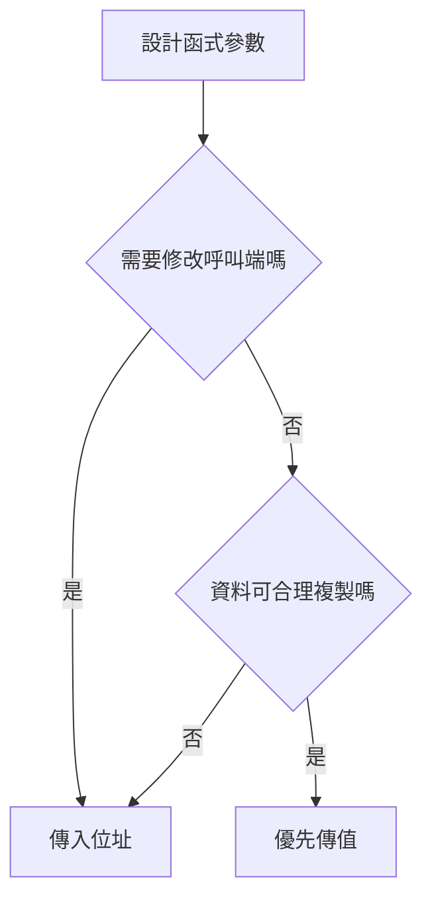
```mermaid
flowchart TD
    A[設計函式參數] --> B{需要修改呼叫端嗎}
    B -- 是 --> E[傳入位址]
    B -- 否 --> C{資料可合理複製嗎}
    C -- 是 --> D[優先傳值]
    C -- 否 --> E
```

---

### 4. 指標走訪陣列

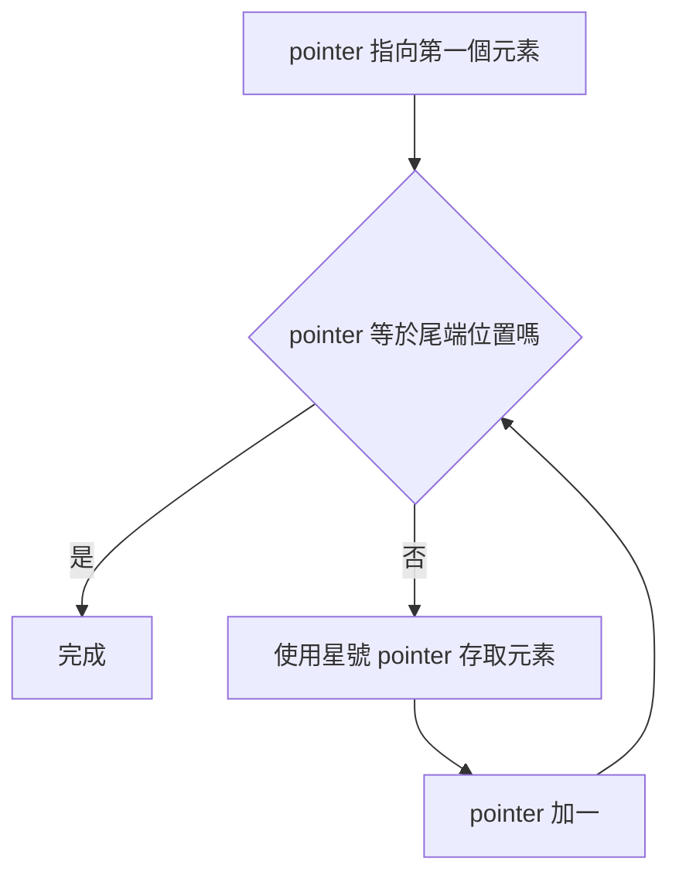
```mermaid
flowchart TD
    A[pointer 指向第一個元素] --> B{pointer 等於尾端位置嗎}
    B -- 是 --> E[完成]
    B -- 否 --> C[使用星號 pointer 存取元素]
    C --> D[pointer 加一]
    D --> B
```

---

### 5. 下標運算

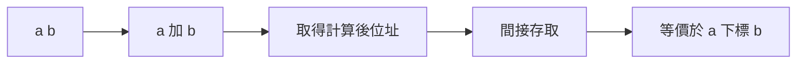
```mermaid
flowchart LR
    A[a b] --> B[a 加 b]
    B --> C[取得計算後位址]
    C --> D[間接存取]
    D --> E[等價於 a 下標 b]
```

---

### 6. 陣列傳入函式

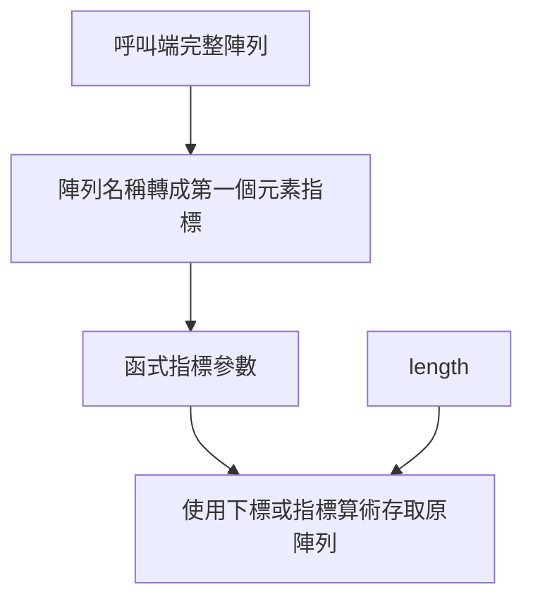
```mermaid
flowchart TD
    A[呼叫端完整陣列] --> B[陣列名稱轉成第一個元素指標]
    B --> C[函式指標參數]
    C --> D[使用下標或指標算術存取原陣列]
    E[length] --> D
```

---

### 7. `*pointer++`

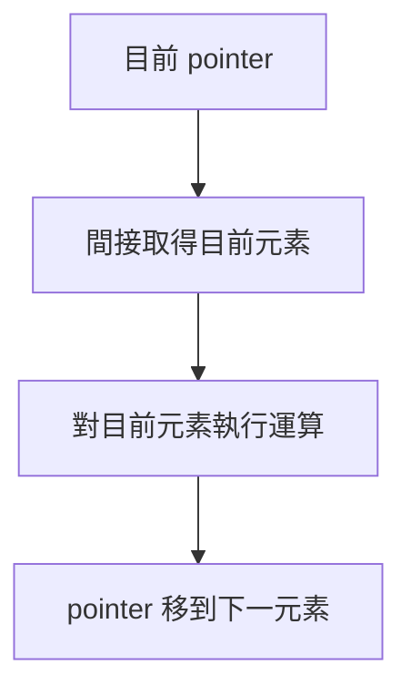
```mermaid
flowchart TD
    A[目前 pointer] --> B[間接取得目前元素]
    B --> C[對目前元素執行運算]
    C --> D[pointer 移到下一元素]
```

---

### 8. 字元陣列與字串指標

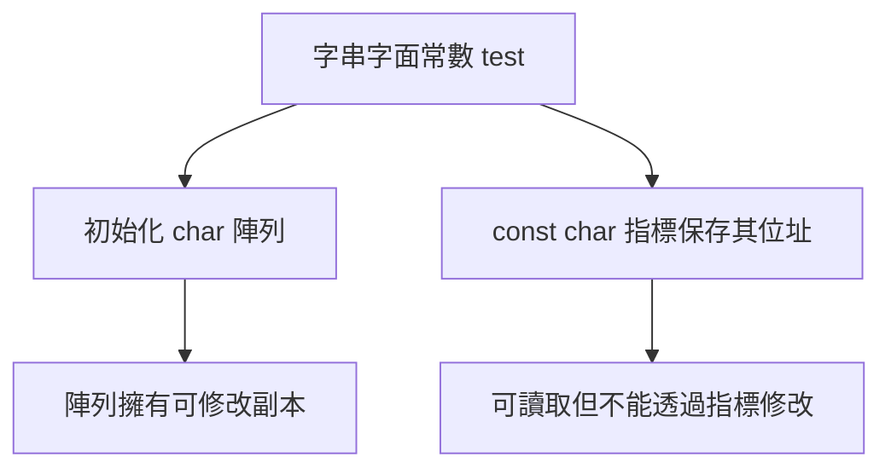
```mermaid
flowchart TD
    A[字串字面常數 test] --> B[初始化 char 陣列]
    B --> C[陣列擁有可修改副本]
    A --> D[const char 指標保存其位址]
    D --> E[可讀取但不能透過指標修改]
```

---

### 9. 字串複製

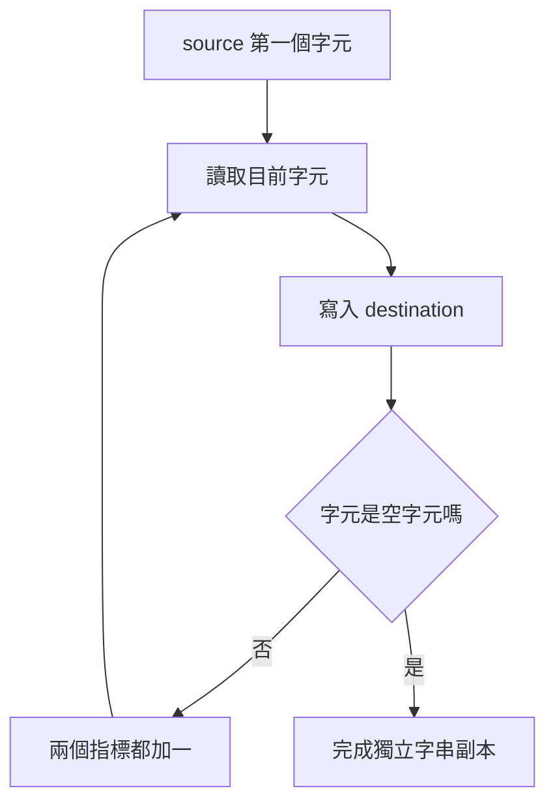
```mermaid
flowchart TD
    A[source 第一個字元] --> B[讀取目前字元]
    B --> C[寫入 destination]
    C --> D{字元是空字元嗎}
    D -- 否 --> E[兩個指標都加一]
    E --> B
    D -- 是 --> F[完成獨立字串副本]
```

---

## 本章完成標準

完成本章後，你應該能做到：

1. 說明普通值參數為什麼不能修改呼叫端變數。
2. 將變數位址傳入指標參數。
3. 使用間接運算修改呼叫端整數。
4. 正確撰寫與呼叫 `swap()`。
5. 說明錯誤交換函式只修改參數副本。
6. 使用 `swap()` 完成兩個整數排序。
7. 在指標參數函式中比較所指值而不是位址。
8. 正確將一個指標參數傳給另一個指標參數。
9. 根據來源原則判斷傳值或位址。
10. 說明需要傳位址的三種典型情況。
11. 解釋指標加減整數的元素單位。
12. 使用指標加法取得同一陣列其他元素位址。
13. 使用同一陣列指標相減計算元素距離。
14. 找出指標相加的錯誤。
15. 分辨完整陣列物件與指標變數。
16. 說明陣列名稱的第一個元素指標轉型。
17. 使用 `*(pointer + i)` 存取陣列。
18. 使用指標循序走訪陣列。
19. 正確使用一個尾端位置作為迴圈終點。
20. 避免解參照尾端之後的位置。
21. 將下標改寫成指標加法與間接存取。
22. 說明指標也能使用下標。
23. 解釋 `0[values]` 為何合法但不建議。
24. 說明函式參數中的陣列寫法會調整成指標。
25. 使用長度參數控制函式走訪範圍。
26. 使用同一函式處理不同大小陣列。
27. 使用 `*pointer++` 依序修改陣列。
28. 正確區分 `*pointer++`、`(*pointer)++` 與 `*++pointer`。
29. 說明字串與字元陣列的關係。
30. 分辨字元陣列與指向字串字面常數的指標。
31. 安全修改字元陣列內容。
32. 避免修改字串字面常數。
33. 說明陣列不能改指向，而指標可以。
34. 使用 `const` 建立唯讀物件或唯讀存取介面。
35. 正確使用 `const char *`。
36. 說明 `const char *` 指標仍可改指向。
37. 將 `char *` 安全轉成 `const char *`。
38. 避免隱性移除 `const`。
39. 分辨指標賦值與字串內容複製。
40. 自行使用指標逐字元複製字串。
41. 正確複製最後的 `'\0'`。
42. 使用 `strcpy()` 複製字串。
43. 為 `strcpy()` 提供可寫且容量足夠的目的地。
44. 避免使用未初始化指標作為目的地。
45. 避免將 `const` 目的地交給字串複製函式。
46. 準備進入下一章的動態記憶體。
