# Lesson 24：Dynamic Memory Allocation 動態記憶體

> 這堂課的重點：從「輸入多少個整數事先不知道」的問題開始，理解固定大小陣列為什麼無法在執行期間直接變大。接著利用指標改指向不同陣列，觀察自動變數的生命週期及懸空指標問題，最後學習使用 `malloc()` 動態配置、使用 `free()` 釋放，以及使用 `realloc()` 重新配置記憶體。

> 本章依照 `30-01` 到 `30-08` 的投影片順序編排。投影片中的逐步程式主要用來揭示問題；完整可執行範例另加入配置失敗檢查、正確釋放與安全的 `realloc()` 接收方式。

---

## Section I. 今天要做什麼？

1. 完成「輸入任意個整數後一起印出」的題目。
2. 使用 `0` 作為輸入結束記號。
3. 將每次輸入的整數保留下來。
4. 在輸入完成後依原順序輸出。
5. 先使用固定大小陣列解題。
6. 使用 `length` 記錄目前已保存的元素數量。
7. 分辨陣列容量與有效資料數量。
8. 找出未指定陣列長度時的編譯問題。
9. 找出固定容量為 `10` 時的輸入限制。
10. 分析輸入少於容量時的結果。
11. 分析輸入超過容量時的陣列越界。
12. 使用 `length < capacity` 防止固定陣列越界。
13. 理解固定陣列無法一邊輸入一邊改變宣告大小。
14. 理解陣列大小在建立物件時已決定。
15. 理解陣列元素必須連續配置。
16. 說明為什麼不能直接在陣列尾端「多加一格」。
17. 建立較大的新陣列。
18. 將舊資料複製到新陣列。
19. 嘗試以新陣列取代舊陣列。
20. 找出陣列不能放在賦值運算子左方的問題。
21. 認識可變長度陣列 VLA。
22. 使用執行期間的整數指定區域陣列大小。
23. 理解 VLA 仍是自動變數。
24. 理解 VLA 的生命週期受所在區塊限制。
25. 使用指標取代不能重新賦值的陣列名稱。
26. 讓同一個指標先後指向不同陣列。
27. 理解指標變數可以改變所保存的位址。
28. 理解指標改指向並不等於延長陣列生命週期。
29. 分辨指標本身與被指向陣列。
30. 認識變數的生命週期 lifetime。
31. 理解每個變數都需要專屬記憶體空間。
32. 使用 `sizeof` 了解物件所需空間。
33. 理解記憶體空間有限，需要適時歸還。
34. 認識自動變數 automatic variable。
35. 理解進入變數所在區塊後，自動物件開始存在。
36. 理解離開該區塊後，自動物件生命週期結束。
37. 分辨生命週期與可視範圍 scope。
38. 理解名稱不可見與物件已不存在不是完全相同概念。
39. 分析迴圈區塊中的 `larger` 陣列。
40. 理解每次迴圈建立新的自動陣列。
41. 理解迴圈結尾會結束該陣列生命週期。
42. 找出 `numbers = larger;` 後留下的懸空指標。
43. 理解透過懸空指標存取已結束生命週期的物件是未定義行為。
44. 理解僅將位址保存在指標中，不會讓自動物件繼續存在。
45. 認識動態配置記憶體。
46. 認識 `<stdlib.h>` 中的 `malloc()`。
47. 讀懂 `void *malloc(size_t size);`。
48. 理解 `size` 表示要配置的位元組數。
49. 使用 `sizeof` 計算所需位元組數。
50. 使用 `malloc()` 配置可保存多個 `int` 的空間。
51. 理解 `malloc()` 回傳配置空間的起始位址。
52. 理解 C 中 `void *` 可轉成其他物件指標型別。
53. 認識 `malloc()` 配置的內容尚未初始化。
54. 檢查 `malloc()` 是否回傳 `NULL`。
55. 使用下標存取動態配置的整數陣列。
56. 理解動態配置空間不會在離開一般區塊時自動釋放。
57. 找出每次配置新空間卻不歸還舊空間的問題。
58. 認識記憶體洩漏 memory leak。
59. 認識 `<stdlib.h>` 中的 `free()`。
60. 讀懂 `void free(void *ptr);`。
61. 理解 `free()` 的引數必須來自動態配置函式。
62. 在完成舊資料複製後釋放舊空間。
63. 理解不能在複製完成前釋放舊空間。
64. 理解釋放後不能再讀寫該空間。
65. 理解釋放後原指標值會成為懸空位址。
66. 將不再使用的指標設為 `NULL`。
67. 理解 `free(NULL)` 是安全的無操作。
68. 找出第一次迴圈中未初始化指標交給 `free()` 的問題。
69. 將初始指標設為 `NULL`。
70. 避免重複釋放同一配置。
71. 避免釋放不是動態配置所得的位址。
72. 使用 `malloc()`、複製、`free()` 完成手動擴充。
73. 找出每次擴充都要手動複製與釋放的重複工作。
74. 認識 `<stdlib.h>` 中的 `realloc()`。
75. 讀懂 `void *realloc(void *ptr, size_t size);`。
76. 理解 `ptr` 是原動態配置空間的起始位址。
77. 理解 `size` 是重新配置後的總位元組數。
78. 理解 `realloc()` 會保留可保留的舊內容。
79. 理解 `realloc()` 可能原地擴充。
80. 理解 `realloc()` 也可能搬到另一個位置。
81. 使用 `realloc()` 的回傳值更新指標。
82. 理解成功後舊指標值不能再被使用。
83. 理解配置失敗時 `realloc()` 回傳 `NULL`。
84. 理解配置失敗時原配置仍然存在。
85. 避免直接以原指標接收 `realloc()` 而遺失舊配置。
86. 使用暫存指標安全接收 `realloc()`。
87. 理解 `realloc(NULL, size)` 可作為首次配置。
88. 避免把 `realloc(ptr, 0)` 當成一般釋放介面。
89. 完成可輸入任意數量整數的安全程式。
90. 分辨目前元素數量 `size` 與可容納元素數量 `capacity`。
91. 認識每次只增加一格的效率問題。
92. 使用容量倍增策略降低重新配置次數。
93. 找出配置失敗、記憶體洩漏、重複釋放、釋放後使用及懸空指標。
94. 使用概念檢查、程式閱讀與實作題整合本章內容。

---

## Section II. 今天的學習方式

1. 先畫固定大小陣列：
   ```text
   [ ][ ][ ][ ][ ]
   ```
2. 在陣列旁同時記錄：
   - `length`：目前有幾筆資料
   - `capacity`：最多可容納幾筆資料
3. 每次輸入後標記資料應放入哪一格。
4. 輸入數量達到容量時，先停止並分析原因。
5. 不把「陣列變大」理解為直接在舊陣列後方加格子。
6. 使用三個步驟理解手動擴充：
   ```text
   建立較大空間
   → 複製舊資料
   → 改用新空間
   ```
7. 再加入第四個必要步驟：
   ```text
   → 歸還舊空間
   ```
8. 每次遇到區域變數，都標出它所在的大括號。
9. 畫出自動變數：
   - 何時配置
   - 何時釋放
10. 指標箭頭仍指向某位置時，要確認該位置中的物件是否仍然存在。
11. 將「位址仍在指標裡」與「該位址仍可合法存取」分開判斷。
12. 使用 `malloc()` 時先計算元素數量，再乘上單一元素大小。
13. 不把 `int` 大小寫死成 `4`。
14. 每次配置後立即檢查是否為 `NULL`。
15. `malloc()` 得到的空間先視為未知內容，寫入後才能讀取。
16. 每一個成功配置都要找到對應的：
    ```c
    free(pointer);
    ```
17. 在紙上畫出記憶體所有權：
    ```text
    哪個指標目前負責釋放哪一塊空間？
    ```
18. 使用 `realloc()` 時畫出兩種可能：
    - 原地擴充
    - 搬到新位置
19. `realloc()` 失敗時，箭頭仍應保留指向舊配置。
20. 完整程式最後使用工具與嚴格編譯選項檢查。

---

## Section III. 今天會學到的內容

| 主題 | 你需要知道的事 |
| --- | --- |
| 固定大小陣列 | 容量在陣列建立時決定 |
| 有效元素數量 | 目前實際保存的資料筆數 |
| 容量 capacity | 已配置空間最多可保存的元素數量 |
| 陣列越界 | 使用超出合法範圍的索引 |
| 可變長度陣列 VLA | 長度由執行期間數值決定的自動陣列 |
| 生命週期 lifetime | 物件在程式執行中存在的期間 |
| 可視範圍 scope | 程式中可使用名稱的區域 |
| 自動變數 | 進入區塊建立、離開區塊結束生命週期的物件 |
| 懸空指標 dangling pointer | 指向已不存在或已釋放物件的指標 |
| 動態配置 | 在執行期間要求指定大小的記憶體空間 |
| `malloc()` | 配置指定數量位元組 |
| `size_t` | 表示大小的非負整數型別 |
| `void *` | 可轉成其他物件指標型別的通用物件指標 |
| `NULL` | 不指向有效物件的空指標值 |
| `free()` | 歸還動態配置的記憶體 |
| 記憶體洩漏 | 配置仍存在，但程式失去可用來釋放它的位址 |
| 釋放後使用 | 在 `free()` 後繼續讀寫原空間 |
| 重複釋放 | 對同一配置呼叫兩次 `free()` |
| `realloc()` | 改變既有動態配置的大小 |
| 暫存指標 | 安全接收可能失敗的 `realloc()` 回傳值 |
| 容量倍增 | 空間不足時一次擴大較多，降低配置次數 |
| 所有權 | 哪一段程式負責最終釋放動態空間 |

---

# Part A：固定大小陣列的限制

## Section IV. 輸入任意個整數後一起印出

### 1. 題目

讓使用者輸入任意個整數，輸入：

```text
0
```

時結束，再將先前所有整數一起印出。

例如：

```text
1
7
9
2
3
5
0
```

輸出：

```text
Numbers: 1 7 9 2 3 5
```

---

### 2. 先完成輸入迴圈

```c
while (1) {
    int input;

    if (scanf("%d", &input) != 1) {
        break;
    }

    if (input == 0) {
        break;
    }
}
```

這時每次輸入都只存在區域變數 `input` 中，下一次迴圈便會被新值取代，因此還沒有保存所有資料。

---

### 3. 需要陣列與長度

概念：

```c
int numbers[10];
int length = 0;
```

- `numbers` 保存輸入資料。
- `length` 保存目前已經輸入幾個整數。

新增：

```c
numbers[length] = input;
length++;
```

---

### 4. 固定大小版本

```c
#include <stdio.h>

int main(void) {
    int numbers[10];
    int length = 0;

    while (length < 10) {
        int input;

        if (scanf("%d", &input) != 1) {
            break;
        }

        if (input == 0) {
            break;
        }

        numbers[length] = input;
        length++;
    }

    printf("Numbers: ");

    for (int i = 0; i < length; i++) {
        printf("%d ", numbers[i]);
    }

    printf("\n");

    return 0;
}
```

---

### 5. 容量與長度

在上面的程式中：

```text
capacity = 10
length   = 目前已保存的數量
```

若只輸入六筆：

```text
length == 6
```

剩餘四格仍未作為有效資料使用。

---


<p align="center">
  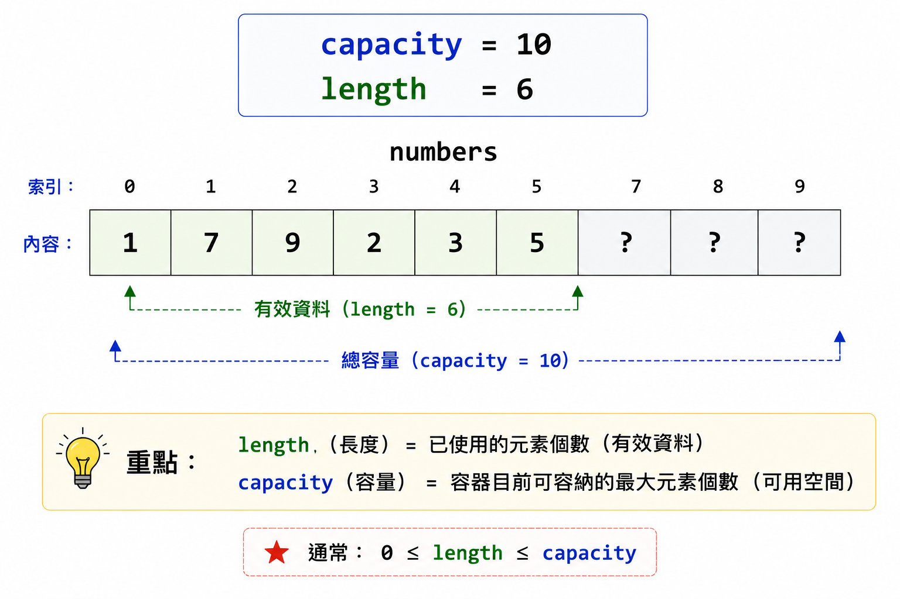
</p>


### 6. 為什麼迴圈要加入 `length < 10`？

若只寫：

```c
while (1)
```

使用者輸入第十一個非零整數時，程式會嘗試寫入：

```c
numbers[10]
```

合法索引只有：

```text
0–9
```

超出範圍屬於未定義行為。

---

### 7. 固定容量版本仍不符合「任意個」

它最多只能保存十個整數。

若把容量改成一千，仍然只是把限制改成一千，並沒有真正解決數量未知的問題。

---

# Part B：為什麼陣列不能直接變大？

## Section V. 陣列建立後大小固定

### 8. 陣列大小在建立時決定

```c
int numbers[3] = {1, 2, 3};
```

這個陣列物件有三個元素。

不能在稍後直接變成四個元素。

---

### 9. 陣列元素需要連續配置

概念：

```text
numbers:
[1][2][3]
```

程式不能假設最後一格後面的記憶體一定沒有被其他物件使用。

因此不能直接宣告：

```text
請在原陣列後面再增加一格
```

---


<p align="center">
  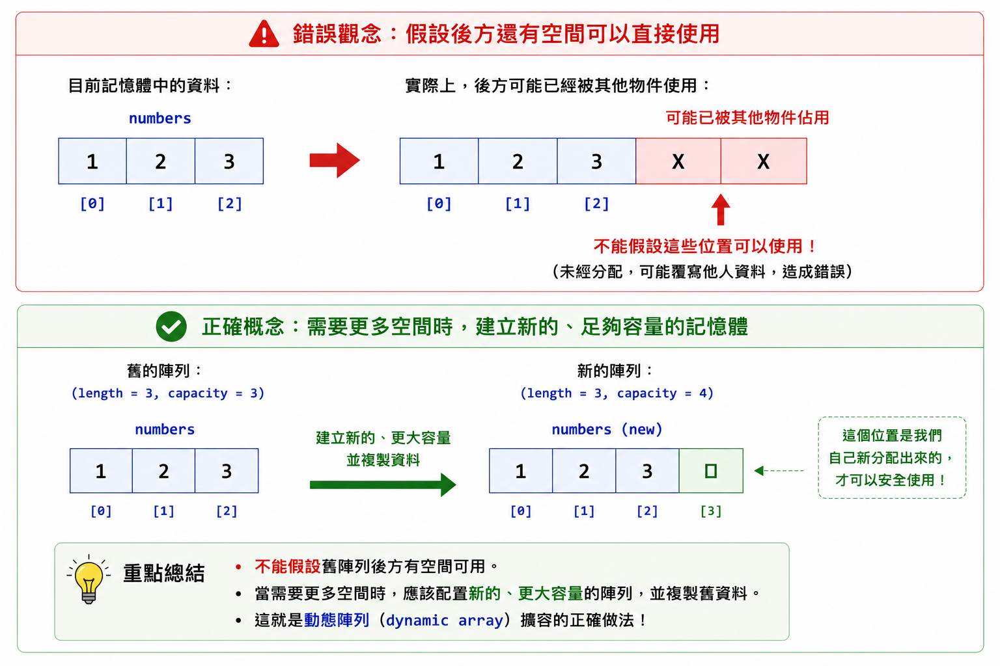
</p>


### 10. 一般擴充方法

來源投影片整理成三步：

1. 產生一個較大的新陣列。
2. 將舊資料複製到新陣列。
3. 用新陣列取代舊陣列。

概念圖：

```text
舊陣列：[1][2][3]

新陣列：[1][2][3][ ]
```

---

### 11. 陣列不能整體賦值

錯誤概念：

```c
int numbers[3] = {1, 2, 3};
int larger[4];

numbers = larger;
```

陣列名稱不能放在整體賦值的左方。

---

## Section VI. 來源嘗試：可變長度陣列

### 12. 可變長度陣列

C99 支援以執行期間整數建立區域陣列：

```c
int larger[length + 1];
```

這稱為：

```text
Variable Length Array
可變長度陣列
```

它不允許長度為零。

---

### 13. VLA 仍不是原陣列變大

```c
int larger[length + 1];
```

建立的是一個新的陣列物件，而不是改變舊陣列。

仍需要將舊元素逐一複製：

```c
for (int i = 0; i < length; i++) {
    larger[i] = numbers[i];
}
```

---

### 14. VLA 的可攜性提醒

VLA 在 C99 中加入，C11 之後可由實作選擇是否支援。

因此即使語法能在某些 C17 編譯器使用，也不應把它當成所有環境都必定支援的動態陣列方案。

---

# Part C：同一個指標指向不同陣列

## Section VII. 指標可以改變所指位置

### 15. 以指標保存陣列第一個元素位址

```c
int first[1] = {1};
int *numbers = first;
```

此時：

```text
numbers → first[0]
```

---

### 16. 讓指標改指向另一個陣列

```c
int second[2] = {2, 3};

numbers = second;
```

現在：

```text
numbers → second[0]
```

同一個指標變數可以先後保存不同陣列的起始位址。

---

### 17. 完整合法示範

```c
#include <stdio.h>

int main(void) {
    int first[1] = {1};
    int second[2] = {2, 3};
    int *numbers = first;
    int length = 1;

    for (int i = 0; i < length; i++) {
        printf("%d ", numbers[i]);
    }

    printf("\n");

    numbers = second;
    length = 2;

    for (int i = 0; i < length; i++) {
        printf("%d ", numbers[i]);
    }

    printf("\n");

    return 0;
}
```

輸出：

```text
1
2 3
```

---

### 18. 指標可重新賦值，陣列名稱不行

合法：

```c
numbers = second;
```

不合法：

```c
first = second;
```

指標是保存位址的普通變數；陣列名稱不是可重新指向的指標變數。

---


<p align="center">
  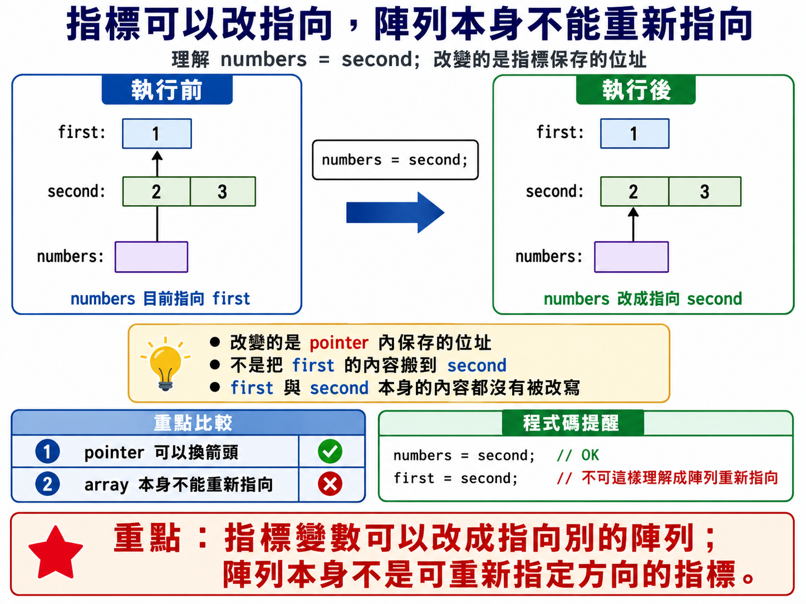
</p>


### 19. 指標改指向不等於保存原陣列

當：

```c
numbers = second;
```

之後，`numbers` 不再保存 `first` 的位址。

如果沒有其他方式保存第一個動態配置位址，可能造成記憶體洩漏。

若 `first` 是自動陣列，它仍按照自己的生命週期存在或消失，不受 `numbers` 決定。

---

# Part D：變數的生命週期

## Section VIII. 每個變數需要專屬記憶體

### 20. 物件需要記憶體空間

例如：

```c
int number;
```

需要可保存一個 `int` 的空間。

```c
int values[10];
```

需要可保存十個 `int` 的連續空間。

可以使用：

```c
sizeof(number)
sizeof(values)
```

查詢所需位元組數。

---

### 21. 專屬空間的意思

當物件的生命週期仍在持續時，該空間不能被另一個同時存在的物件任意佔用。

記憶體有限，因此物件生命週期結束後，空間需要能被後續物件重新使用。

---

## Section IX. 自動變數的生命週期

### 22. 一般區域變數通常是自動變數

```c
{
    int number;

    /* number 在這個區塊中存在 */
}
```

來源投影片的簡化模型：

- 執行進入變數所在區塊時，配置記憶體。
- 執行離開該區塊時，釋放記憶體。

---

### 23. 可視範圍與生命週期

在區塊外：

```text
不能再使用 number 這個名稱
```

同時，該自動物件的生命週期也已結束。

要分辨：

- scope：名稱可在哪些程式碼中使用。
- lifetime：物件在執行期間是否仍然存在。

---

### 24. VLA 位於迴圈區塊中

來源問題程式的核心：

```c
while (1) {
    int larger[length + 1];

    /* 複製資料 */

    numbers = larger;
}
```

`larger` 是迴圈區塊中的自動陣列。

---

### 25. 到達右大括號時發生什麼？

```c
}
```

表示離開本次迴圈區塊。

`larger` 的生命週期結束，其儲存空間可以被後續程式重新利用。

---

### 26. 指標仍保存舊位址

即使：

```c
numbers = larger;
```

將 `larger` 的起始位址保存到 `numbers`，也不會改變 `larger` 的生命週期。

離開區塊後：

```text
numbers 中仍有一個位址值
但該位址不再指向仍存在的 larger 物件
```

這稱為：

```text
懸空指標
dangling pointer
```

---


<p align="center">
  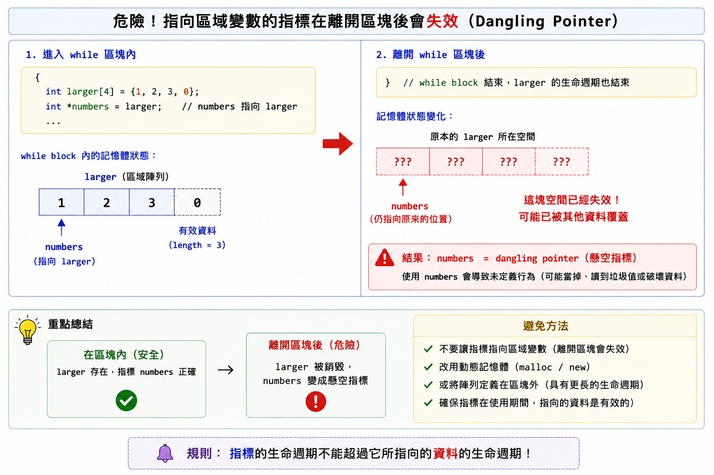
</p>


### 27. 透過懸空指標存取

例如後續使用：

```c
numbers[i]
```

會存取生命週期已結束的空間，屬於未定義行為。

可能表現為：

- 看似仍有舊資料
- 資料突然改變
- 程式崩潰
- 不同最佳化設定出現不同結果

不能依賴任何結果。

---

### 28. 重要結論

> 指標只保存位址，不能控制被指向物件的生命週期。

這正是需要動態配置記憶體的主要原因之一：讓配置空間的生命週期由程式明確控制，而不是隨區塊結束自動消失。

---

# Part E：使用 `malloc()` 動態配置

## Section X. `malloc()` 基本介面

### 29. 標準函式宣告

需要：

```c
#include <stdlib.h>
```

介面：

```c
void *malloc(size_t size);
```

---

### 30. `size` 的意思

`size` 表示：

```text
要配置多少位元組
```

型別為：

```text
size_t
```

它是用來表示物件大小的非負整數型別。

---

### 31. 使用 `sizeof` 計算空間

配置一個 `int`：

```c
malloc(sizeof(int));
```

配置十個 `int`：

```c
malloc(sizeof(int) * 10);
```

更容易隨指標型別維護的寫法：

```c
malloc(sizeof(numbers[0]) * 10);
```

或：

```c
malloc(sizeof(*numbers) * 10);
```

---


<p align="center">
  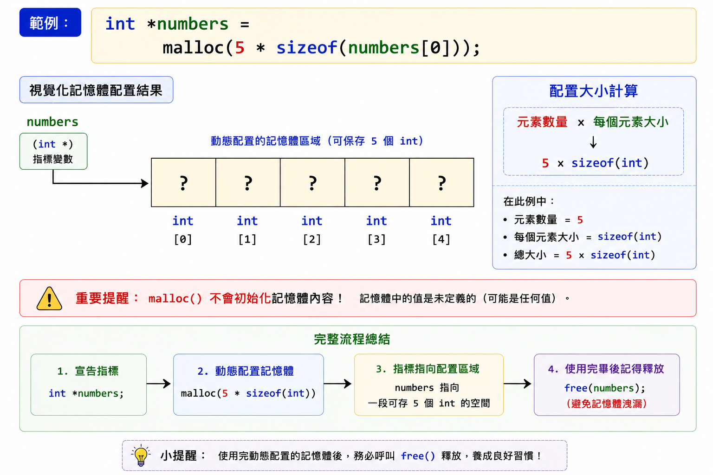
</p>


### 32. 不要寫死 `int` 大小

不建議：

```c
malloc(10 * 4);
```

C 不保證所有環境的 `int` 都是四位元組。

---

### 33. `malloc()` 的回傳值

成功：

```text
回傳新配置空間的起始位址
```

失敗：

```text
回傳 NULL
```

在 C 中，`void *` 可轉成其他物件指標，因此不需要為 `malloc()` 回傳值加強制轉型。

---

## Section XI. 基本動態陣列

### 34. 配置五個整數

```c
#include <stdio.h>
#include <stdlib.h>

int main(void) {
    int *numbers =
        malloc(5 * sizeof(numbers[0]));

    if (numbers == NULL) {
        fprintf(stderr, "Memory allocation failed.\n");
        return 1;
    }

    for (int i = 0; i < 5; i++) {
        numbers[i] = (i + 1) * 10;
    }

    for (int i = 0; i < 5; i++) {
        printf("%d ", numbers[i]);
    }

    printf("\n");

    free(numbers);

    return 0;
}
```

---

### 35. 動態空間也可以使用下標

只要 `numbers` 指向至少五個連續 `int`：

```c
numbers[0]
numbers[1]
...
numbers[4]
```

都能像陣列元素一樣存取。

但 `numbers` 本身仍是指標，不是陣列物件。

---

### 36. `malloc()` 不會初始化內容

剛配置後：

```c
int *numbers =
    malloc(5 * sizeof(numbers[0]));
```

元素值是不確定的。

必須先寫入：

```c
numbers[i] = value;
```

才能安全讀取。

若需要零初始化，可以使用後續可能學到的 `calloc()`；本章來源主要使用 `malloc()`。

---

## Section XII. 來源方式：每次建立大一格的新空間

### 37. 動態配置替代 VLA

來源將：

```c
int larger[length + 1];
```

改成：

```c
int *larger =
    malloc((length + 1) * sizeof(larger[0]));
```

`larger` 指向動態配置空間。

---

### 38. 動態配置不會在迴圈右大括號自動消失

指標變數 `larger` 本身仍是自動變數，但它所指向的動態空間不會因為離開區塊而自動釋放。

因此將位址保存到：

```c
numbers = larger;
```

後，下一次迴圈仍可以透過 `numbers` 使用該配置。

---

### 39. 仍然需要配置失敗檢查

來源的逐步程式直接使用 `larger`。

安全版本必須先檢查：

```c
if (larger == NULL) {
    /* 原 numbers 仍有效 */
}
```

在配置失敗前，不要覆蓋原指標，也不要嘗試複製到 `NULL`。

---

# Part F：使用 `free()` 歸還記憶體

## Section XIII. 為什麼需要 `free()`？

### 40. 動態配置不會自動釋放

若每次輸入都：

1. 配置大一格的新空間。
2. 複製資料。
3. 讓 `numbers` 指向新空間。

但從未釋放舊空間，舊配置會一直存在。

---

### 41. 記憶體洩漏

概念：

```text
舊配置仍然被系統視為已借出
但程式已失去它的位址
```

程式無法再使用或釋放它。

這稱為：

```text
Memory leak
記憶體洩漏
```

持續發生時，程式所占記憶體會不斷增加。

---

## Section XIV. `free()` 基本介面

### 42. 標準函式宣告

```c
void free(void *ptr);
```

位於：

```c
#include <stdlib.h>
```

---

### 43. `ptr` 必須是什麼？

`ptr` 應為：

- `NULL`；或
- 由 `malloc()`、`realloc()` 等配置函式成功回傳，且尚未釋放的位址。

不能傳入：

- 一般自動變數位址
- 陣列內部任意元素位址
- 已經釋放過的位址
- 未初始化指標

---

### 44. 何時釋放舊配置？

順序必須是：

1. 配置新空間。
2. 確認配置成功。
3. 將舊資料複製到新空間。
4. `free(numbers);`
5. `numbers = larger;`

不能在複製前釋放，否則舊資料已不能再讀取。

---


<p align="center">
  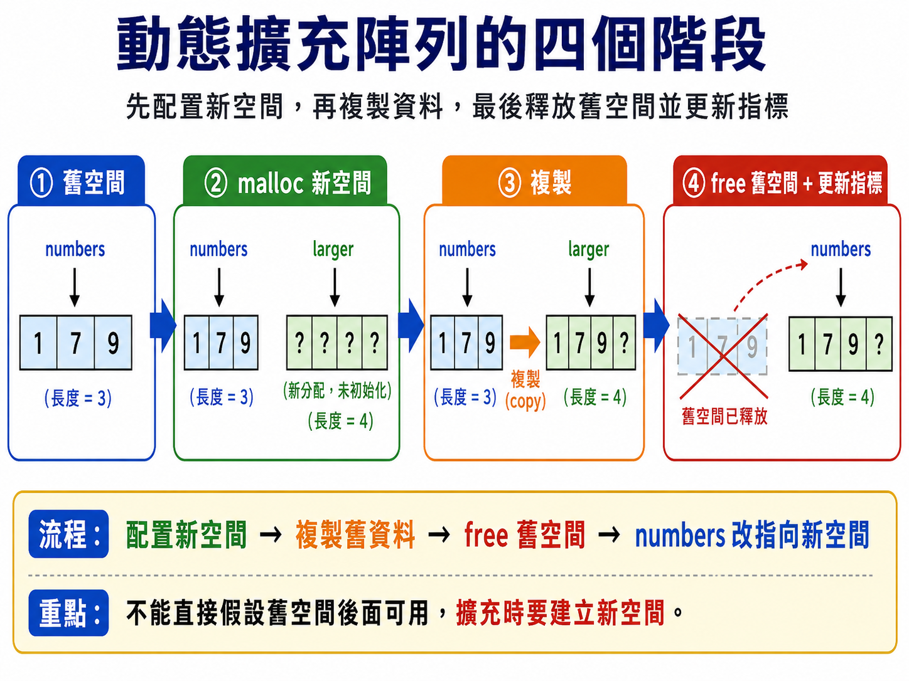
</p>


### 45. 手動擴充函式

```c
#include <stddef.h>
#include <stdlib.h>

int *grow_by_one(
    int *numbers,
    size_t length
) {
    int *larger =
        malloc((length + 1) * sizeof(larger[0]));

    if (larger == NULL) {
        return NULL;
    }

    for (size_t i = 0; i < length; i++) {
        larger[i] = numbers[i];
    }

    free(numbers);

    return larger;
}
```

呼叫者必須知道：

- 回傳非 `NULL`：新配置已接管資料，舊配置已釋放。
- 回傳 `NULL`：函式沒有釋放舊 `numbers`，呼叫者仍負責舊配置。

由於只回傳一個指標，實務上更常直接使用 `realloc()` 或設計更清楚的介面。

---

### 46. `free(NULL)` 是安全的

```c
int *numbers = NULL;

free(numbers);
```

不會做任何事。

來源投影片使用：

```c
int *numbers = 0;
```

在指標語境中，整數常數 `0` 是空指標常數；使用 `NULL` 更清楚。

---

### 47. 為什麼初始值不能未設定？

危險：

```c
int *numbers;

free(numbers);
```

`numbers` 的值不確定，並不一定是合法配置位址或 `NULL`。

來源在第一次迴圈就可能執行 `free(numbers)`，因此需要先初始化：

```c
int *numbers = NULL;
```

---

## Section XV. 釋放後的指標

### 48. `free()` 不會自動修改指標變數

```c
free(numbers);
```

之後，`numbers` 中可能仍保存原本的數字位址。

但該空間已不再屬於程式。

---

### 49. 釋放後使用

錯誤：

```c
free(numbers);

printf("%d\n", numbers[0]);
```

屬於未定義行為。

---

### 50. 重複釋放

錯誤：

```c
free(numbers);
free(numbers);
```

若中間沒有重新配置並更新指標，第二次釋放屬於未定義行為。

---

### 51. 設為 `NULL`

```c
free(numbers);
numbers = NULL;
```

好處：

- 避免誤以為它仍指向有效配置。
- 再次 `free(numbers)` 不會出錯，因為 `free(NULL)` 安全。
- 可以使用 `numbers == NULL` 表示目前沒有配置。

但這不能修正其他仍保存舊位址的指標。

---


<p align="center">
  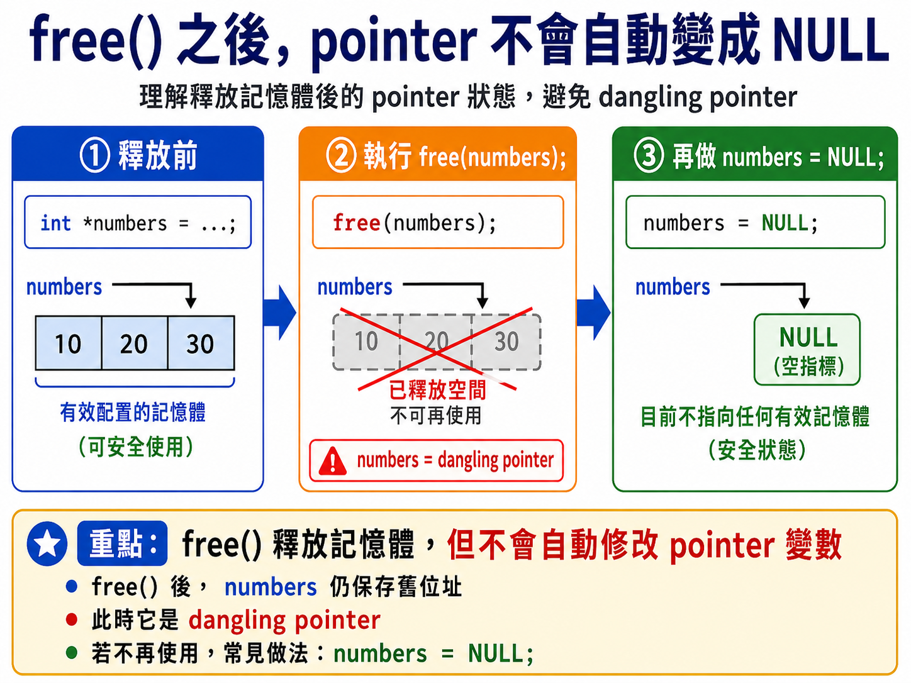
</p>


## Section XVI. 使用 `malloc()`、複製與 `free()` 的完整版本

```c
#include <stdio.h>
#include <stdlib.h>

int main(void) {
    int *numbers = NULL;
    size_t length = 0;

    while (1) {
        int input;

        if (scanf("%d", &input) != 1) {
            break;
        }

        if (input == 0) {
            break;
        }

        int *larger =
            malloc((length + 1) * sizeof(larger[0]));

        if (larger == NULL) {
            fprintf(stderr, "Memory allocation failed.\n");
            free(numbers);
            return 1;
        }

        for (size_t i = 0; i < length; i++) {
            larger[i] = numbers[i];
        }

        free(numbers);
        numbers = larger;

        numbers[length] = input;
        length++;
    }

    printf("Numbers: ");

    for (size_t i = 0; i < length; i++) {
        printf("%d ", numbers[i]);
    }

    printf("\n");

    free(numbers);

    return 0;
}
```

這個版本正確管理記憶體，但每次新增元素都要配置、複製與釋放一次，效率不佳。

---

# Part G：使用 `realloc()` 重新配置

## Section XVII. `realloc()` 基本介面

### 52. 標準函式宣告

```c
void *realloc(void *ptr, size_t size);
```

需要：

```c
#include <stdlib.h>
```

---

### 53. `ptr` 的意思

`ptr` 是要重新配置之動態記憶體空間的起始位址。

通常原本來自：

```c
malloc()
realloc()
calloc()
```

不能把一般自動陣列交給 `realloc()`。

---

### 54. `size` 的意思

`size` 是重新配置完成後需要的**總位元組數**，不是要增加的位元組數。

例如原本三個 `int`，要變成四個：

```c
realloc(
    numbers,
    4 * sizeof(numbers[0])
);
```

---

### 55. `realloc()` 保留什麼內容？

成功時，舊資料中可容納於新大小的前段內容會被保留。

擴大：

```text
[1][2][3]
→
[1][2][3][?]
```

新增部分的內容未初始化。

縮小：

```text
[1][2][3][4]
→
[1][2]
```

超出新大小的後段資料不再存在。

---

### 56. 可能原地擴充，也可能搬家

`realloc()` 可能：

- 在原位置擴大；
- 或配置另一塊空間、複製內容，再釋放原空間。

因此成功後必須使用它的回傳位址。

不能假設新位址與舊位址相同。

---


<p align="center">
  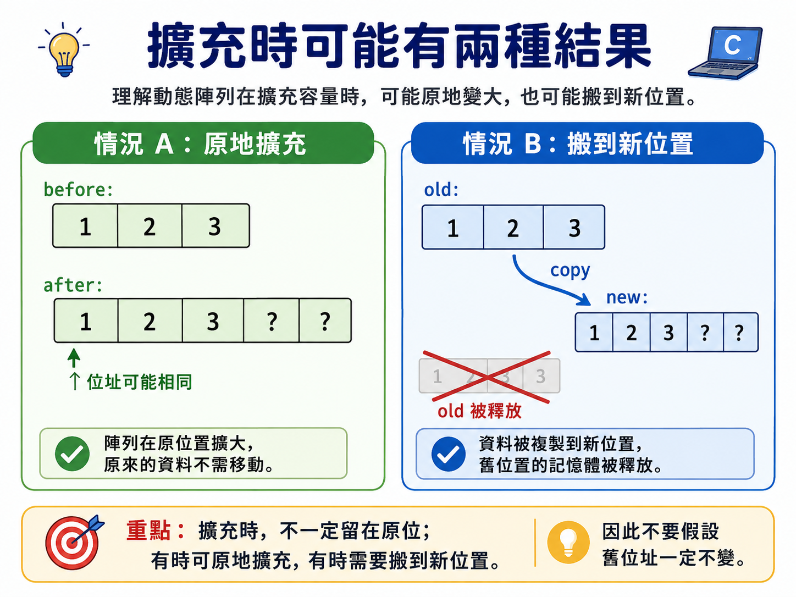
</p>


### 57. 成功後的舊指標

只要 `realloc()` 成功，原來傳入的指標值便不能再被當成有效配置使用，即使新位址數字看起來相同。

應只保留並使用回傳值。

---

## Section XVIII. 來源的簡化版本

來源將四個步驟：

```text
malloc
複製
free
改指向
```

改成：

```c
numbers = realloc(
    numbers,
    (length + 1) * sizeof(numbers[0])
);
```

這大幅簡化程式，但直接賦值存在配置失敗風險。

---

## Section XIX. 配置失敗與暫存指標

### 58. `realloc()` 失敗時

當 `size > 0` 且重新配置失敗：

```text
回傳 NULL
原本的配置仍然存在且內容不變
```

---

### 59. 危險的直接賦值

```c
numbers = realloc(numbers, new_size);
```

若失敗：

```text
numbers 變成 NULL
原配置仍存在
但程式失去原配置位址
```

造成記憶體洩漏。

---

### 60. 安全接收方式

```c
int *temporary =
    realloc(numbers, new_size);

if (temporary == NULL) {
    /* numbers 仍指向舊配置 */
} else {
    numbers = temporary;
}
```

---


<p align="center">
  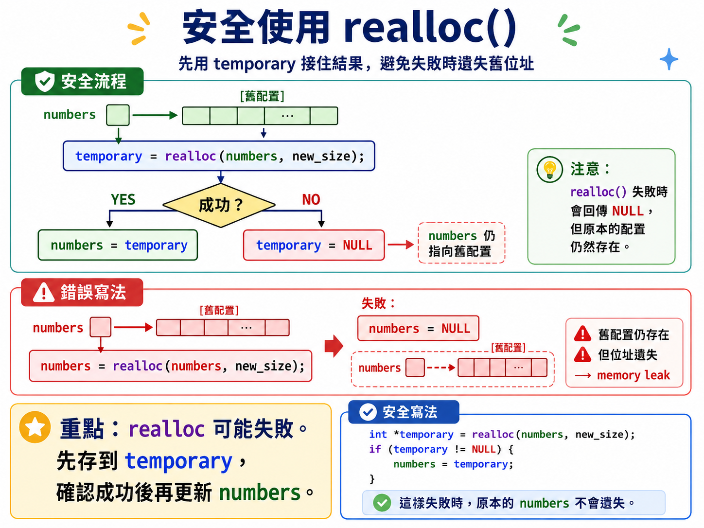
</p>


### 61. `realloc(NULL, size)`

```c
int *numbers = NULL;

int *temporary =
    realloc(numbers, 5 * sizeof(numbers[0]));
```

效果等同於配置新空間，可用於第一次配置。

---

### 62. 避免使用 `realloc(ptr, 0)`

不同標準版本與實作對零大小重新配置的細節容易造成混淆。

需要釋放時，直接使用：

```c
free(ptr);
ptr = NULL;
```

更清楚。

---

## Section XX. 使用 `realloc()` 的完整版本

```c
#include <stdio.h>
#include <stdlib.h>

int main(void) {
    int *numbers = NULL;
    size_t length = 0;

    while (1) {
        int input;

        if (scanf("%d", &input) != 1) {
            break;
        }

        if (input == 0) {
            break;
        }

        int *temporary =
            realloc(
                numbers,
                (length + 1) * sizeof(numbers[0])
            );

        if (temporary == NULL) {
            fprintf(stderr, "Memory allocation failed.\n");
            free(numbers);
            return 1;
        }

        numbers = temporary;
        numbers[length] = input;
        length++;
    }

    printf("Numbers: ");

    for (size_t i = 0; i < length; i++) {
        printf("%d ", numbers[i]);
    }

    printf("\n");

    free(numbers);

    return 0;
}
```

這個版本與來源概念一致，但安全保留舊指標直到 `realloc()` 成功。

---

# Part H：容量與效率

## Section XXI. 每次只擴大一格的問題

### 63. 配置次數很多

輸入 `n` 個整數時，每次都擴大一格：

```text
1 格
2 格
3 格
...
n 格
```

可能觸發 `n` 次重新配置。

---

### 64. 可能重複搬移大量資料

若每次都需要搬家，複製量大約是：

```text
1 + 2 + 3 + ... + (n - 1)
```

資料量大時效率較差。

來源 `realloc()` 投影片指出，重新配置可能不必搬家，因此通常比手動每次配置與複製更有效率；但仍不能保證每次都原地完成。

---

## Section XXII. 分辨 `size` 與 `capacity`

```c
size_t size = 0;
size_t capacity = 0;
int *numbers = NULL;
```

- `size`：目前實際保存幾個元素。
- `capacity`：目前已配置空間可容納幾個元素。

只有在：

```c
size == capacity
```

時才需要擴充。

---

## Section XXIII. 容量倍增策略

### 65. 常見策略

第一次配置：

```text
capacity = 4
```

空間用完時：

```text
capacity *= 2
```

容量變化：

```text
0 → 4 → 8 → 16 → 32 ...
```

---


<p align="center">
  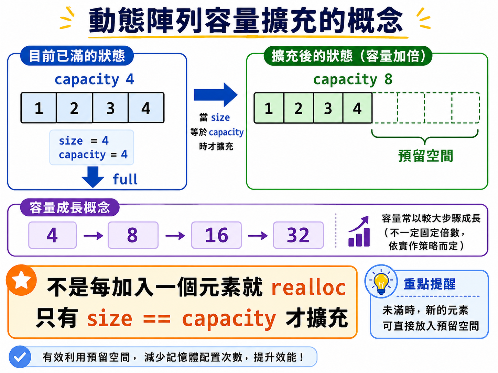
</p>


### 66. 優點

多數新增操作只需要：

```c
numbers[size] = input;
size++;
```

不需要每次都重新配置。

---

### 67. 安全容量倍增完整程式

```c
#include <stdint.h>
#include <stdio.h>
#include <stdlib.h>

int main(void) {
    int *numbers = NULL;
    size_t size = 0;
    size_t capacity = 0;

    while (1) {
        int input;

        if (scanf("%d", &input) != 1) {
            break;
        }

        if (input == 0) {
            break;
        }

        if (size == capacity) {
            size_t new_capacity =
                capacity == 0 ? 4 : capacity * 2;

            if (
                new_capacity < capacity ||
                new_capacity >
                    SIZE_MAX / sizeof(numbers[0])
            ) {
                fprintf(stderr, "Requested size is too large.\n");
                free(numbers);
                return 1;
            }

            int *temporary =
                realloc(
                    numbers,
                    new_capacity * sizeof(numbers[0])
                );

            if (temporary == NULL) {
                fprintf(stderr, "Memory allocation failed.\n");
                free(numbers);
                return 1;
            }

            numbers = temporary;
            capacity = new_capacity;
        }

        numbers[size] = input;
        size++;
    }

    printf("Numbers: ");

    for (size_t i = 0; i < size; i++) {
        printf("%d ", numbers[i]);
    }

    printf("\n");
    printf("Size: %zu\n", size);
    printf("Capacity: %zu\n", capacity);

    free(numbers);

    return 0;
}
```

---

### 68. 為什麼可能有未使用空間？

若目前：

```text
size     = 6
capacity = 8
```

最後兩格尚未保存有效資料。

這是以少量額外空間換取較少重新配置次數。

---

# Part I：常見記憶體問題

## Section XXIV. 記憶體洩漏

### 69. 遺失唯一指標

```c
int *numbers =
    malloc(10 * sizeof(numbers[0]));

numbers =
    malloc(20 * sizeof(numbers[0]));
```

第二次賦值前沒有 `free()`，第一塊配置的位址遺失。

---

### 70. 修正

```c
free(numbers);

numbers =
    malloc(20 * sizeof(numbers[0]));
```

但若目的是保留舊內容並調整大小，優先考慮安全使用 `realloc()`。

---

## Section XXV. 釋放後使用

```c
free(numbers);

numbers[0] = 10;
```

錯誤。

`free()` 後配置不再屬於程式。

---

## Section XXVI. 重複釋放

```c
free(numbers);
free(numbers);
```

錯誤。

可在第一次後：

```c
numbers = NULL;
```

---

## Section XXVII. 釋放錯誤位址

```c
int values[10];

free(values);
```

錯誤。`values` 是自動陣列，不是動態配置所得。

---

### 71. 不能釋放配置中間位置

```c
int *numbers =
    malloc(10 * sizeof(numbers[0]));

free(numbers + 1);
```

錯誤。

必須將動態配置函式回傳的起始位址交給 `free()`。

---

## Section XXVIII. 配置後未檢查

```c
int *numbers =
    malloc(10 * sizeof(numbers[0]));

numbers[0] = 1;
```

如果配置失敗，`numbers == NULL`，間接存取會出錯。

---

## Section XXIX. 配置後讀取未初始化內容

```c
int *numbers =
    malloc(10 * sizeof(numbers[0]));

printf("%d\n", numbers[0]);
```

錯誤。

`malloc()` 不會將元素自動設為零。

---

## Section XXX. 尺寸乘法溢位

```c
malloc(count * sizeof(numbers[0]));
```

如果 `count` 非常大，乘法可能溢位，實際配置比預期小。

教材安全補充可先檢查：

```c
if (count > SIZE_MAX / sizeof(numbers[0])) {
    /* 太大 */
}
```

---

## Section XXXI. 快速概念檢查

### Q1. 固定陣列 `int numbers[10]` 最多有多少個合法元素？

<details>
<summary>查看答案</summary>

十個，合法索引為 `0–9`。

</details>

---

### Q2. `length` 與陣列容量相同嗎？

<details>
<summary>查看答案</summary>

不一定。

- `length` 是目前有效資料數量。
- 容量是最多可保存的元素數量。

</details>

---

### Q3. 為什麼不能直接讓原陣列增加一格？

<details>
<summary>查看答案</summary>

陣列建立後大小固定，而且元素需要連續配置；原陣列後方空間不一定可用。

</details>

---

### Q4. 擴充資料空間的基本三步是什麼？

<details>
<summary>查看答案</summary>

1. 建立較大的新空間。
2. 複製舊資料。
3. 改用新空間。

若舊空間是動態配置，還要適時釋放舊空間。

</details>

---

### Q5. 指標改指向 VLA 後，能讓 VLA 離開區塊仍存在嗎？

<details>
<summary>查看答案</summary>

不能。指標只保存位址，不會延長自動物件生命週期。

</details>

---

### Q6. 什麼是懸空指標？

<details>
<summary>查看答案</summary>

保存某個已結束生命週期或已釋放物件位址的指標。

</details>

---

### Q7. `malloc()` 的引數單位是什麼？

<details>
<summary>查看答案</summary>

位元組。

</details>

---

### Q8. 配置十個 `int` 應如何計算大小？

<details>
<summary>查看答案</summary>

```c
10 * sizeof(numbers[0])
```

</details>

---

### Q9. `malloc()` 失敗時回傳什麼？

<details>
<summary>查看答案</summary>

```c
NULL
```

</details>

---

### Q10. `malloc()` 配置的內容會自動為零嗎？

<details>
<summary>查看答案</summary>

不會，內容尚未初始化。

</details>

---

### Q11. 動態配置會在離開一般區塊時自動釋放嗎？

<details>
<summary>查看答案</summary>

不會，必須使用 `free()` 或由 `realloc()` 成功接管與替換。

</details>

---

### Q12. 什麼是記憶體洩漏？

<details>
<summary>查看答案</summary>

動態配置仍未被釋放，但程式已失去可用來存取及釋放它的位址。

</details>

---

### Q13. `free(NULL)` 合法嗎？

<details>
<summary>查看答案</summary>

合法，不會做任何事。

</details>

---

### Q14. `free()` 後可以繼續使用原指標存取資料嗎？

<details>
<summary>查看答案</summary>

不可以，屬於釋放後使用。

</details>

---

### Q15. `realloc()` 的 `size` 是增加量還是新總大小？

<details>
<summary>查看答案</summary>

重新配置後的總位元組數。

</details>

---

### Q16. `realloc()` 成功後位址一定不變嗎？

<details>
<summary>查看答案</summary>

不一定，可能原地完成，也可能搬到新位置。

</details>

---

### Q17. `realloc()` 失敗時原配置會被釋放嗎？

<details>
<summary>查看答案</summary>

當要求大小非零時，失敗會回傳 `NULL`，原配置仍然存在且不變。

</details>

---

### Q18. 為什麼不應直接寫 `numbers = realloc(numbers, size);`？

<details>
<summary>查看答案</summary>

若失敗，`numbers` 會變成 `NULL`，原配置位址遺失，造成記憶體洩漏。

</details>

---

### Q19. `size == capacity` 表示什麼？

<details>
<summary>查看答案</summary>

目前已沒有空格可加入新元素，需要先擴充。

</details>

---

### Q20. 容量倍增的主要目的為何？

<details>
<summary>查看答案</summary>

減少重新配置與搬移資料的次數。

</details>

---

## Section XXXII. 程式閱讀練習

### 題目 1：固定容量

```c
int numbers[4];
int length = 3;
```

還能安全加入幾個元素？

<details>
<summary>查看答案</summary>

一個，加入位置是：

```c
numbers[3]
```

</details>

---

### 題目 2：VLA 生命週期

```c
int *pointer;

{
    int values[3] = {1, 2, 3};
    pointer = values;
}
```

區塊結束後可以使用 `pointer[0]` 嗎？

<details>
<summary>查看答案</summary>

不可以。`values` 的生命週期已結束，`pointer` 成為懸空指標。

</details>

---

### 題目 3：配置大小

```c
double *values =
    malloc(8 * sizeof(values[0]));
```

配置空間可保存多少個 `double`？

<details>
<summary>查看答案</summary>

八個。

</details>

---

### 題目 4：未初始化內容

```c
int *values =
    malloc(3 * sizeof(values[0]));
```

可以立即安全輸出 `values[0]` 嗎？

<details>
<summary>查看答案</summary>

不可以，尚未寫入有效值。

</details>

---

### 題目 5：空指標釋放

```c
int *values = NULL;

free(values);
```

<details>
<summary>查看答案</summary>

合法，沒有任何效果。

</details>

---

### 題目 6：釋放時機

```c
int *larger = malloc(...);

free(numbers);

for (...) {
    larger[i] = numbers[i];
}
```

<details>
<summary>查看答案</summary>

錯誤。舊資料在複製前已釋放，不能再讀取 `numbers[i]`。

</details>

---

### 題目 7：安全重新配置

```c
int *temporary =
    realloc(numbers, new_size);
```

若 `temporary == NULL`，哪個指標仍可用來釋放舊空間？

<details>
<summary>查看答案</summary>

```c
numbers
```

它仍指向原配置。

</details>

---

### 題目 8：成功重新配置

```c
if (temporary != NULL) {
    numbers = temporary;
}
```

成功後應使用哪個指標？

<details>
<summary>查看答案</summary>

更新後的：

```c
numbers
```

不要再使用重新配置前保存的舊位址副本。

</details>

---

### 題目 9：容量與大小

```text
size = 5
capacity = 8
```

還能不重新配置地加入幾個元素？

<details>
<summary>查看答案</summary>

三個。

</details>

---

### 題目 10：記憶體洩漏

```c
int *pointer = malloc(10 * sizeof(*pointer));

pointer = NULL;
```

<details>
<summary>查看答案</summary>

原配置仍存在，但位址遺失，造成記憶體洩漏。

</details>

---

## Section XXXIII. 實作練習 / 實作檢測題

### TODO 1：固定容量輸入

使用容量 `5` 的固定陣列讀入整數，輸入 `0` 或容量用完時停止。

---

### TODO 2：容量警告

若使用者輸入已達固定容量，顯示：

```text
The array is full.
```

---

### TODO 3：畫出擴充流程

對：

```text
[1][7][9]
```

畫出建立四格新空間、複製及改指向的步驟。

---

### TODO 4：生命週期判斷

分析五個不同區塊中的自動變數，標出配置與生命週期結束位置。

---

### TODO 5：找出懸空指標

撰寫一個不執行危險存取的示範，在註解中說明指標在哪一行開始懸空。

---

### TODO 6：基本 `malloc()`

動態配置十個 `int`，填入 `1–10` 後輸出並釋放。

---

### TODO 7：檢查配置失敗

將 TODO 6 加入 `NULL` 檢查與錯誤結束碼。

---

### TODO 8：手動增加一格

使用：

```text
malloc → 複製 → free → 更新指標
```

將三元素動態陣列擴大成四元素。

---

### TODO 9：避免記憶體洩漏

給定多個錯誤程式，找出配置位址在哪裡遺失。

---

### TODO 10：安全 `free()`

釋放後設為 `NULL`，並在程式中避免再讀取元素。

---

### TODO 11：基本 `realloc()`

將三個整數的配置擴大成六個，確認前三個值仍保留。

---

### TODO 12：安全暫存指標

所有 `realloc()` 都必須先存入 `temporary`，成功後才更新原指標。

---

### TODO 13：任意數量整數

完成本章使用 `realloc()` 的完整輸入程式。

---

### TODO 14：容量倍增

將 TODO 13 改成：

```text
0 → 4 → 8 → 16 ...
```

的容量策略。

---

### TODO 15：動態學生陣列

使用上一章的 `Student` 結構，建立可擴充的動態學生陣列。

需要管理：

```text
Student *students
size
capacity
```

---

## Section XXXIV. 做題時可以使用的提示

### 1. 先找出所有配置點

```c
malloc(...)
realloc(...)
```

每一個成功配置都要能追蹤到最終釋放。

---

### 2. 建立所有權表

| 指標 | 指向哪一塊配置 | 誰負責 `free()` |
| --- | --- | --- |
| `numbers` | 目前動態陣列 | `main()` |
| `temporary` | 只有 `realloc()` 成功後短暫保存 | 成功後交給 `numbers` |

---

### 3. 擴充前先保存舊位址

不要在確認新配置成功前覆蓋唯一的舊位址。

---

### 4. 配置位元組數公式

```c
element_count * sizeof(pointer[0])
```

---

### 5. 釋放前問三件事

1. 這個位址是否來自動態配置函式？
2. 是否仍是該配置的起始位址？
3. 是否尚未釋放？

---

### 6. 釋放後立即更新程式狀態

```c
free(pointer);
pointer = NULL;
capacity = 0;
size = 0;
```

是否清除 `size`、`capacity` 取決於資料結構是否整體重設。

---

### 7. `realloc()` 後不要使用舊的其他指標

若還有指標指向原配置內部元素，成功重新配置後它們都可能失效。

---

### 8. 建議測試資料

```text
立即輸入 0
只輸入一個數
剛好填滿第一次容量
超過第一次容量
需要多次擴充
輸入格式錯誤
```

---

## Section XXXV. 課後小練習

### 練習 1：動態平均值

輸入任意個非零整數，最後輸出所有資料與平均值。

---

### 練習 2：動態最大值

完成輸入後找出最大值與其索引。

---

### 練習 3：刪除最後一筆

每輸入 `-1` 時刪除目前最後一筆；輸入 `0` 結束。

---

### 練習 4：縮小配置

輸入結束後，若 `capacity > size`，使用安全的 `realloc()` 嘗試縮小到剛好 `size` 個元素。

若縮小失敗，保留原配置仍可正常輸出。

---

### 練習 5：動態字串

逐字元讀入一行未知長度文字，使用容量倍增建立字串，最後補上 `'\0'`。

---

### 練習 6：動態結構陣列

輸入任意筆商品資料，最後依價格排序。

---

### 練習 7：清理函式

撰寫：

```c
void destroy_int_array(
    int **numbers,
    size_t *size,
    size_t *capacity
);
```

釋放後將三項狀態重設。

這會使用雙重指標，是後續進階指標練習。

---

### 練習 8：記憶體錯誤分類

將下列問題分類：

```text
memory leak
use after free
double free
dangling pointer
out-of-bounds access
uninitialized read
```

---

## Section XXXVI. 重點複習

1. 固定陣列容量在建立時決定。
2. `length` 表示目前有效元素數量。
3. 固定容量不等於真正可以輸入任意數量。
4. 寫入超過陣列容量會造成未定義行為。
5. 陣列建立後不能直接增加元素數量。
6. 陣列元素必須連續配置。
7. 擴充通常需要建立較大的新空間。
8. 舊資料必須複製到新空間。
9. 陣列名稱不能被重新賦值。
10. 指標變數可以改指向不同陣列。
11. 指標改指向不會延長自動陣列生命週期。
12. VLA 是執行期間決定長度的自動陣列。
13. VLA 離開區塊後生命週期結束。
14. 指向已結束生命週期物件的指標是懸空指標。
15. 透過懸空指標存取是未定義行為。
16. 動態配置讓程式自行控制記憶體歸還時機。
17. `malloc()` 位於 `<stdlib.h>`。
18. `malloc()` 的引數是位元組數。
19. 使用 `sizeof` 計算配置大小。
20. 不應將 `int` 大小寫死。
21. `malloc()` 成功時回傳起始位址。
22. `malloc()` 失敗時回傳 `NULL`。
23. 配置後必須先檢查是否成功。
24. `malloc()` 不會初始化元素內容。
25. 動態空間可透過下標存取。
26. 動態配置不會在一般區塊結尾自動釋放。
27. 不再需要的動態配置要使用 `free()`。
28. 遺失未釋放配置位址會造成記憶體洩漏。
29. `free()` 的引數必須是 `NULL` 或尚未釋放的配置起始位址。
30. `free(NULL)` 安全。
31. 未初始化指標不能交給 `free()`。
32. 舊資料複製完成後才能釋放舊配置。
33. 釋放後不能再存取內容。
34. 對同一配置重複釋放是未定義行為。
35. 釋放後可將指標設為 `NULL`。
36. `realloc()` 改變動態配置總大小。
37. `realloc()` 會保留可保留的舊內容。
38. 擴大的新區域內容未初始化。
39. `realloc()` 可能原地完成，也可能搬家。
40. 成功後必須使用回傳的新位址。
41. 失敗時回傳 `NULL`，原配置仍存在。
42. 不應直接覆蓋唯一的原指標。
43. 應使用暫存指標接收 `realloc()`。
44. `realloc(NULL, size)` 可完成首次配置。
45. 需要釋放時優先明確使用 `free()`。
46. `size` 是目前資料數量。
47. `capacity` 是目前可容納數量。
48. 只有 `size == capacity` 時才需要擴充。
49. 容量倍增可減少重新配置次數。
50. 程式結束前要釋放仍持有的所有動態配置。

---

## Section XXXVII. 常見錯誤提醒

### 錯誤 1：未限制固定陣列寫入數量

```c
numbers[length] = input;
length++;
```

但沒有檢查 `length < capacity`。

---

### 錯誤 2：以為宣告後可以改變陣列大小

陣列物件大小已固定。

---

### 錯誤 3：使用長度為零的陣列

標準 C 陣列不能宣告為零長度。

---

### 錯誤 4：把 VLA 當成跨區塊存在的動態空間

VLA 仍是自動物件。

---

### 錯誤 5：將 VLA 位址保存到外部指標後繼續使用

區塊結束後形成懸空指標。

---

### 錯誤 6：以為指標能控制被指向物件生命週期

指標只保存位址。

---

### 錯誤 7：`malloc()` 大小使用元素數量而非位元組數

錯誤：

```c
malloc(10);
```

若目標是十個 `int`，應乘上元素大小。

---

### 錯誤 8：強制假設 `sizeof(int) == 4`

不可攜。

---

### 錯誤 9：未檢查 `malloc()` 回傳值

可能間接存取 `NULL`。

---

### 錯誤 10：立即讀取 `malloc()` 內容

內容尚未初始化。

---

### 錯誤 11：配置新空間後遺失舊指標

造成記憶體洩漏。

---

### 錯誤 12：在複製舊資料前先 `free()`

造成釋放後讀取。

---

### 錯誤 13：將未初始化指標交給 `free()`

未定義行為。

---

### 錯誤 14：釋放自動陣列

```c
int values[10];

free(values);
```

錯誤。

---

### 錯誤 15：釋放配置中間位置

```c
free(numbers + 1);
```

錯誤。

---

### 錯誤 16：`free()` 後繼續讀寫

屬於 use after free。

---

### 錯誤 17：重複 `free()`

屬於 double free。

---

### 錯誤 18：認為 `free()` 會自動把指標設為 `NULL`

它不會修改呼叫端指標變數。

---

### 錯誤 19：將 `realloc()` 第二個引數當成增加量

它是新總位元組數。

---

### 錯誤 20：假設 `realloc()` 位址必定不變

它可能搬家。

---

### 錯誤 21：直接覆蓋原指標

```c
numbers = realloc(numbers, new_size);
```

失敗時會遺失原配置位址。

---

### 錯誤 22：重新配置成功後繼續使用舊的元素指標

配置搬家後，指向舊配置內部的指標會失效。

---

### 錯誤 23：每次新增一筆都重新配置一格

可以運作，但資料量大時效率較差。

---

### 錯誤 24：混淆 `size` 與 `capacity`

迴圈輸出應走訪 `size`，不是尚未使用的整個 `capacity`。

---

## Section XXXVIII. Mermaid 流程圖

### 1. 固定陣列輸入

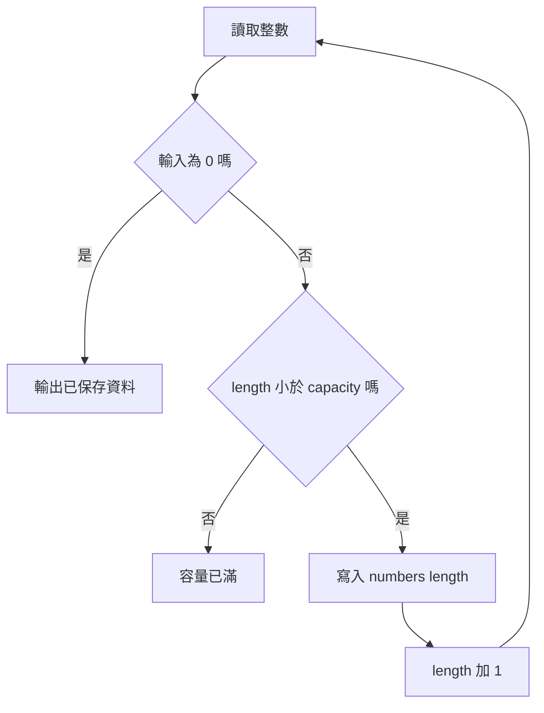
```mermaid
flowchart TD
    A[讀取整數] --> B{輸入為 0 嗎}
    B -- 是 --> F[輸出已保存資料]
    B -- 否 --> C{length 小於 capacity 嗎}
    C -- 否 --> G[容量已滿]
    C -- 是 --> D[寫入 numbers length]
    D --> E[length 加 1]
    E --> A
```

---

### 2. 手動擴充陣列

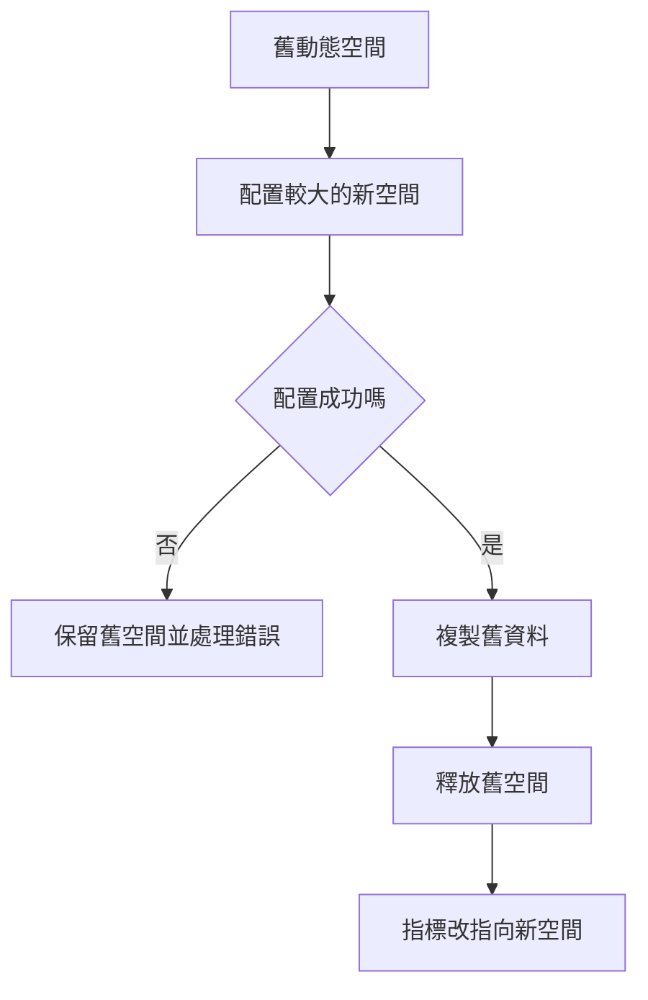
```mermaid
flowchart TD
    A[舊動態空間] --> B[配置較大的新空間]
    B --> C{配置成功嗎}
    C -- 否 --> F[保留舊空間並處理錯誤]
    C -- 是 --> D[複製舊資料]
    D --> E[釋放舊空間]
    E --> G[指標改指向新空間]
```

---

### 3. 自動變數生命週期

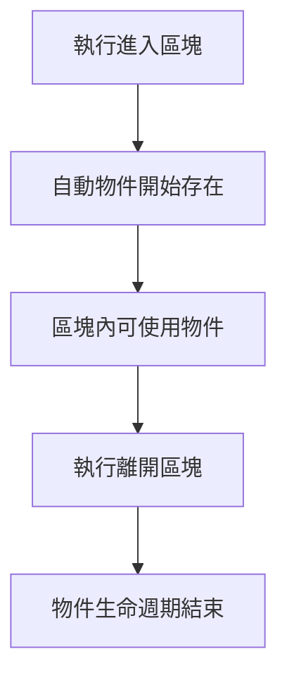
```mermaid
flowchart TD
    A[執行進入區塊] --> B[自動物件開始存在]
    B --> C[區塊內可使用物件]
    C --> D[執行離開區塊]
    D --> E[物件生命週期結束]
```

---

### 4. 懸空指標形成

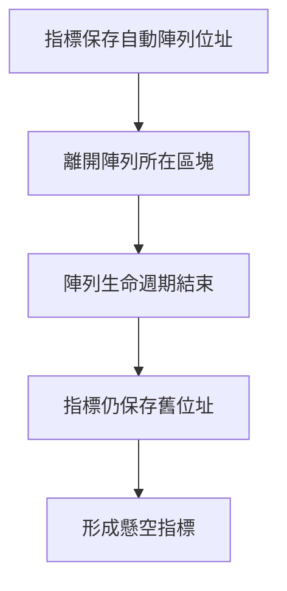
```mermaid
flowchart TD
    A[指標保存自動陣列位址] --> B[離開陣列所在區塊]
    B --> C[陣列生命週期結束]
    C --> D[指標仍保存舊位址]
    D --> E[形成懸空指標]
```

---

### 5. `malloc()` 使用流程

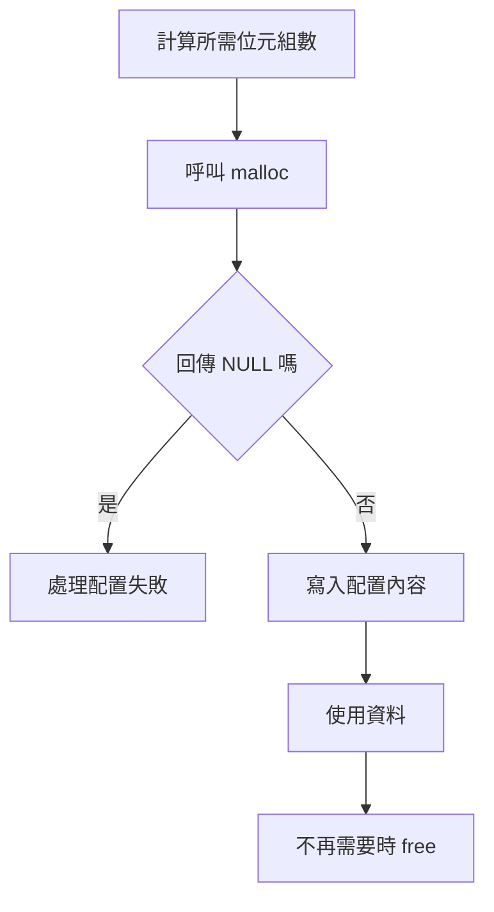
```mermaid
flowchart TD
    A[計算所需位元組數] --> B[呼叫 malloc]
    B --> C{回傳 NULL 嗎}
    C -- 是 --> D[處理配置失敗]
    C -- 否 --> E[寫入配置內容]
    E --> F[使用資料]
    F --> G[不再需要時 free]
```

---

### 6. 記憶體洩漏

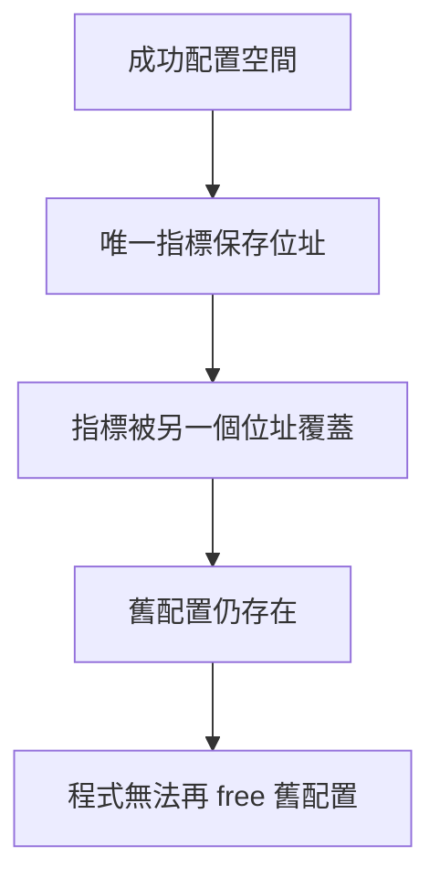
```mermaid
flowchart TD
    A[成功配置空間] --> B[唯一指標保存位址]
    B --> C[指標被另一個位址覆蓋]
    C --> D[舊配置仍存在]
    D --> E[程式無法再 free 舊配置]
```

---

### 7. 安全 `realloc()`

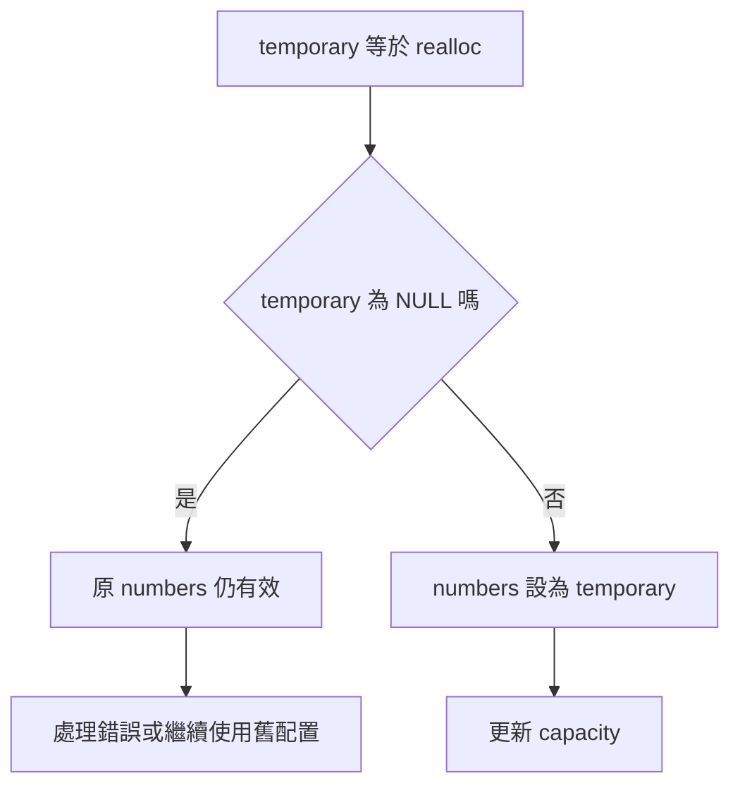
```mermaid
flowchart TD
    A[temporary 等於 realloc] --> B{temporary 為 NULL 嗎}
    B -- 是 --> C[原 numbers 仍有效]
    C --> D[處理錯誤或繼續使用舊配置]
    B -- 否 --> E[numbers 設為 temporary]
    E --> F[更新 capacity]
```

---

### 8. 容量倍增

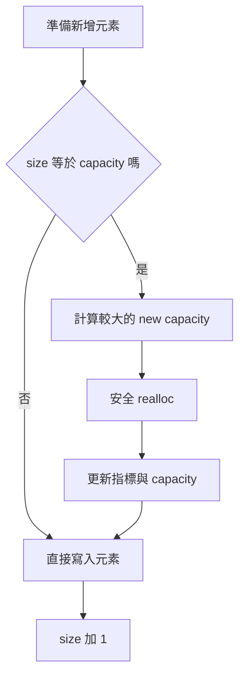
```mermaid
flowchart TD
    A[準備新增元素] --> B{size 等於 capacity 嗎}
    B -- 否 --> F[直接寫入元素]
    B -- 是 --> C[計算較大的 new capacity]
    C --> D[安全 realloc]
    D --> E[更新指標與 capacity]
    E --> F
    F --> G[size 加 1]
```

---

## 本章完成標準

完成本章後，你應該能做到：

1. 使用固定陣列完成有限容量的輸入題。
2. 分辨目前資料數量與固定容量。
3. 避免固定陣列越界。
4. 說明固定陣列不能直接變大。
5. 說明建立較大空間及複製資料的基本方法。
6. 分辨陣列名稱與可重新賦值的指標。
7. 讓同一個指標先後指向不同陣列。
8. 說明 VLA 是自動陣列。
9. 說明自動變數的生命週期。
10. 分辨生命週期與可視範圍。
11. 找出離開區塊後形成的懸空指標。
12. 說明保存位址不會延長物件生命週期。
13. 使用 `malloc()` 動態配置記憶體。
14. 使用 `sizeof` 正確計算位元組數。
15. 避免寫死資料型別大小。
16. 檢查 `malloc()` 是否回傳 `NULL`。
17. 先初始化動態空間內容再讀取。
18. 使用下標讀寫動態整數陣列。
19. 說明動態配置不會自動隨區塊釋放。
20. 找出記憶體洩漏。
21. 使用 `free()` 歸還動態配置。
22. 判斷可以交給 `free()` 的合法位址。
23. 正確安排複製與釋放順序。
24. 使用 `free(NULL)` 的特性安全處理首次配置。
25. 避免未初始化指標、重複釋放及釋放後使用。
26. 釋放後將不再使用的指標設為 `NULL`。
27. 使用 `malloc()`、複製與 `free()` 手動擴充。
28. 使用 `realloc()` 改變配置大小。
29. 說明 `realloc()` 可能原地完成或搬家。
30. 說明 `realloc()` 保存舊內容的範圍。
31. 使用回傳值更新配置指標。
32. 說明 `realloc()` 失敗時原配置仍存在。
33. 使用暫存指標安全接收 `realloc()`。
34. 使用 `realloc(NULL, size)` 完成首次配置。
35. 完成任意數量整數的動態輸入程式。
36. 分辨 `size` 與 `capacity`。
37. 使用容量倍增策略減少重新配置次數。
38. 找出記憶體洩漏、懸空指標、釋放後使用與重複釋放。
39. 在程式所有離開路徑上正確釋放配置。
