# Lesson 02：Pointer Arrays and Pointers to Arrays 指標陣列與陣列指標

> 這堂課的重點：分辨「指標組成的陣列」與「指向完整陣列的指標」，並把這兩種型態應用到函式參數及二維資料。你會學會判讀 `int *p[3]` 與 `int (*p)[3]`、理解陣列長度如何成為型態的一部分，以及為什麼真正的二維陣列不能直接當成 `int **`。

> 本章依照 `28-01` 到 `28-06` 的投影片編排。多個字串、字串指標及緊密字串儲存不放在本章，會留給後續章節。

---

## Section I. 今天要做什麼？

1. 複習一般整數陣列與一般整數指標。
2. 認識指標陣列 pointer array。
3. 宣告 `int *pointers[3]`。
4. 從變數名稱向外判讀複雜宣告。
5. 理解 `pointers` 是陣列，而每個元素是 `int *`。
6. 使用指標陣列指向同一陣列中的不同元素。
7. 透過 `*pointers[i]` 修改原本的整數。
8. 讓指標陣列以不同順序指向陣列元素。
9. 使用指標陣列指向彼此獨立的普通變數。
10. 使用指標陣列表示多個一維陣列。
11. 使用 `rows[i][j]` 存取某一列中的元素。
12. 理解每一列可以具有不同長度。
13. 為不等長列另外保存長度。
14. 找出第二個下標越界造成的未定義行為。
15. 認識陣列指標 pointer to array。
16. 取得完整陣列的位址 `&values`。
17. 判斷 `&values` 的型態。
18. 宣告 `int (*array_pointer)[3]`。
19. 理解 `array_pointer` 是指標，指向 `int[3]`。
20. 使用 `(*array_pointer)[i]` 存取陣列元素。
21. 比較 `int *p[3]` 與 `int (*p)[3]`。
22. 理解括號為什麼會改變整個宣告的意思。
23. 使用陣列指標傳遞固定長度的一維陣列。
24. 使用 `sizeof(*p)` 取得完整固定陣列大小。
25. 理解陣列長度是陣列指標型態的一部分。
26. 比較 `int (*)[3]` 與 `int (*)[5]`。
27. 找出固定長度介面不能共用於其他長度的限制。
28. 使用 `const int *values` 搭配 `length` 傳遞任意長度陣列。
29. 理解函式參數中的 `int values[3]` 會調整成 `int *values`。
30. 理解函式內的指標無法自動知道呼叫端陣列長度。
31. 複習二維陣列是「陣列的陣列」。
32. 理解 `int grid[3][3]` 的每一列都是 `int[3]`。
33. 判斷二維陣列名稱在運算式中的型態。
34. 使用固定欄數的陣列指標傳遞二維陣列。
35. 理解二維陣列參數可以省略第一維。
36. 理解二維陣列參數必須知道欄數。
37. 使用 `grid[i][j]` 在函式內存取元素。
38. 將列數另外傳入函式。
39. 比較 `grid`、`&grid[0]` 與 `&grid`。
40. 理解位址數字相同不代表型態相同。
41. 理解 `int **` 期待的是兩層指標結構。
42. 說明真正二維陣列為什麼不是 `int **`。
43. 建立列指標陣列 `int *rows[]`。
44. 將列指標陣列傳入接受 `int **` 類型的函式。
45. 使用列指標重新排列列順序。
46. 比較真正二維陣列與列指標陣列的記憶體配置。
47. 比較固定欄數、列指標與扁平化三種介面。
48. 使用 `row * width + column` 將二維索引轉成一維索引。
49. 使用 `*(data + row * width + column)` 存取元素。
50. 找出欄數錯誤、錯誤強制轉型與列長資訊遺失等常見問題。
51. 使用概念檢查、程式閱讀與實作題整合本章。

---

## Section II. 今天的學習方式

1. 由變數名稱開始，按照括號與運算子優先順序向外閱讀宣告。
2. 對以下兩個宣告分別畫圖：
   ```c
   int *p[3];
   int (*p)[3];
   ```
3. 指標陣列要畫出多個獨立指標格。
4. 陣列指標只畫一個指標格，箭頭指向完整陣列。
5. 使用 `pointers[i][j]` 時分兩步閱讀：
   ```text
   pointers[i] → 第 i 個指標
   pointers[i][j] → 該指標所指資料中的第 j 個元素
   ```
6. 使用 `(*p)[i]` 時先解參照指標，取得完整陣列，再取下標。
7. 每次傳入函式前，列出引數運算式的型態。
8. 不只比較位址數字，也要比較指標所指型態。
9. 二維陣列題先寫出一列的型態與大小。
10. 看見 `int **` 時，確認記憶體中是否真的存在「指標的陣列」。
11. 扁平化存取時先計算：
    ```text
    row * width + column
    ```
12. 每次使用第二個下標前，確認該列實際長度。
13. 所有完整且應合法的程式都使用嚴格 C17 選項編譯。
14. 錯誤範例只用來分析，不會作為可執行程式。

---

## Section III. 核心宣告對照

<p align="center">
  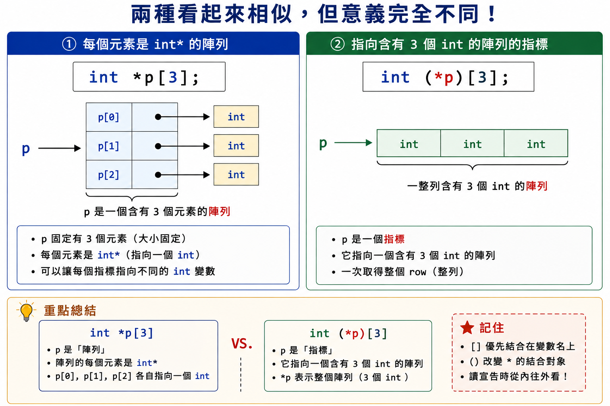
</p>

| 宣告 | 從名稱向外閱讀 | 實際意義 |
| --- | --- | --- |
| `int values[3]` | `values` 是三元素陣列 | 每個元素是 `int` |
| `int *pointer` | `pointer` 是指標 | 指向 `int` |
| `int *pointers[3]` | `pointers` 是三元素陣列 | 每個元素是 `int *` |
| `int (*array_pointer)[3]` | `array_pointer` 是指標 | 指向 `int[3]` |
| `int **pointer` | `pointer` 是指標 | 指向 `int *` |
| `int grid[2][3]` | `grid` 是二元素陣列 | 每個元素是 `int[3]` |
| `int (*row_pointer)[3]` | `row_pointer` 是指標 | 指向一列 `int[3]` |

---
# Part A：指標陣列

## Section IV. 一般陣列與指標陣列

### 1. 一般整數陣列

```c
int values[3];
```

配置：

```text
values[0] values[1] values[2]
   int       int       int
```

每個元素保存一個整數。

---

### 2. 指標陣列

```c
int *pointers[3];
```

配置：

```text
pointers[0] pointers[1] pointers[2]
    int *       int *       int *
```

每個元素保存某個 `int` 物件的位址。

---

### 3. 為什麼它是陣列？

下標運算比前面的 `*` 更靠近變數名稱：

```c
int *pointers[3];
```

由 `pointers` 向外讀：

```text
pointers
→ 是具有三個元素的陣列
→ 每個元素是 int *
```

---

## Section V. 指標陣列指向同一陣列的元素

<p align="center">
  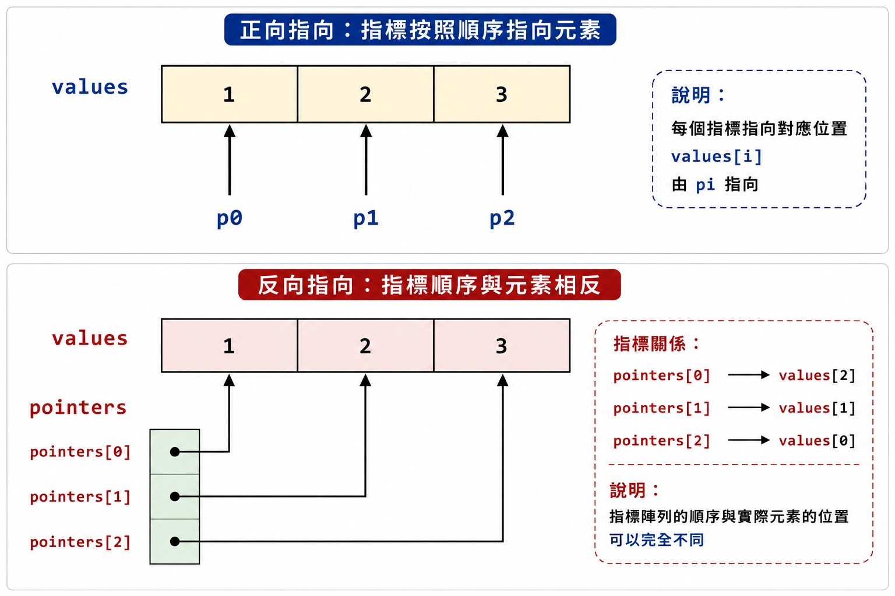
</p>

### 4. 按照原順序初始化

```c
#include <stdio.h>

int main(void) {
    int values[3] = {1, 2, 3};
    int *pointers[3] = {
        &values[0],
        &values[1],
        &values[2]
    };

    for (int i = 0; i < 3; i++) {
        *pointers[i] = 0;
    }

    *pointers[2] = 5;

    for (int i = 0; i < 3; i++) {
        printf("%d ", values[i]);
    }

    printf("\n");

    return 0;
}
```

輸出：

```text
0 0 5
```

---

### 5. `*pointers[i]` 的閱讀方式

```c
*pointers[i]
```

因為下標優先於前置 `*`，等同：

```c
*(pointers[i])
```

1. `pointers[i]` 取得第 `i` 個 `int *`。
2. `*` 取得該指標所指的整數。

---

### 6. 指標順序可以不同

```c
int *pointers[3] = {
    &values[2],
    &values[1],
    &values[0]
};
```

現在：

```text
pointers[0] → values[2]
pointers[1] → values[1]
pointers[2] → values[0]
```

因此：

```c
*pointers[2] = 5;
```

修改的是：

```c
values[0]
```

指標陣列的順序不必與原陣列元素順序相同。

---

## Section VI. 指標陣列指向獨立變數

```c
#include <stdio.h>

int main(void) {
    int a = 1;
    int b = 2;
    int c = 3;

    int *pointers[3] = {
        &a,
        &b,
        &c
    };

    for (int i = 0; i < 3; i++) {
        *pointers[i] = 0;
    }

    *pointers[2] = 5;

    printf("%d %d %d\n", a, b, c);

    return 0;
}
```

輸出：

```text
0 0 5
```

指標陣列中的目標不必來自同一個陣列，只要型態與生命週期合法即可。

---

## Section VII. 指標陣列指向多個陣列

### 7. 每個元素指向一列

```c
int first[2] = {1, 2};
int second[2] = {3, 4};
int third[2] = {5, 6};

int *rows[3] = {
    first,
    second,
    third
};
```

每個一維陣列名稱會轉成第一個元素的位址：

```text
rows[0] → &first[0]
rows[1] → &second[0]
rows[2] → &third[0]
```

---

### 8. 使用兩個下標

<p align="center">
  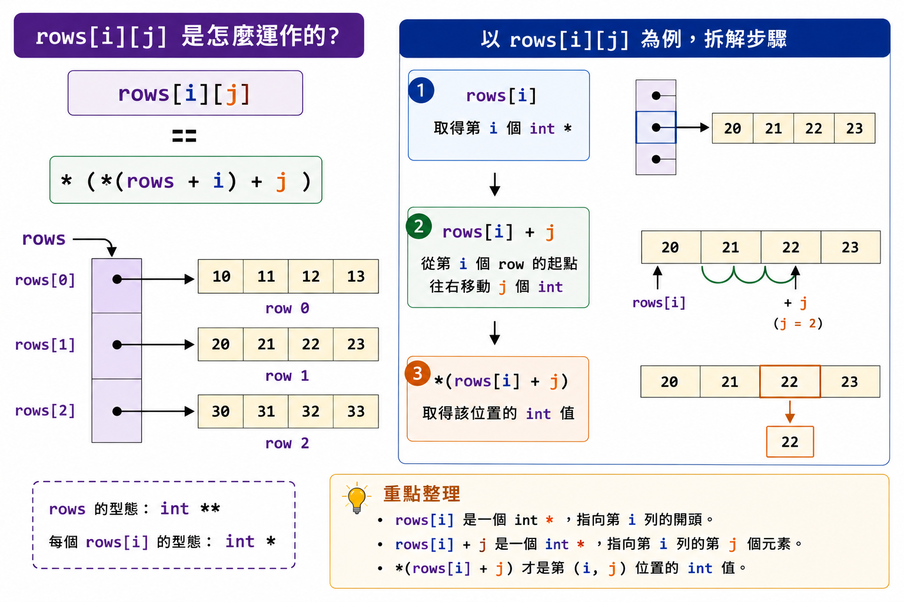
</p>

```c
rows[i][j]
```

等同：

```c
*(rows[i] + j)
```

第一個下標選擇哪一個列指標，第二個下標選擇該列中的元素。

---

### 9. 完整存取範例

```c
#include <stdio.h>

int main(void) {
    int first[2] = {1, 2};
    int second[2] = {3, 4};
    int third[2] = {5, 6};

    int *rows[3] = {
        first,
        second,
        third
    };

    for (int i = 0; i < 3; i++) {
        for (int j = 0; j < 2; j++) {
            rows[i][j] = 0;
        }
    }

    rows[2][0] = 7;

    for (int i = 0; i < 3; i++) {
        for (int j = 0; j < 2; j++) {
            printf("%d ", rows[i][j]);
        }
        printf("\n");
    }

    return 0;
}
```

---

## Section VIII. 每一列可以有不同長度

<p align="center">
  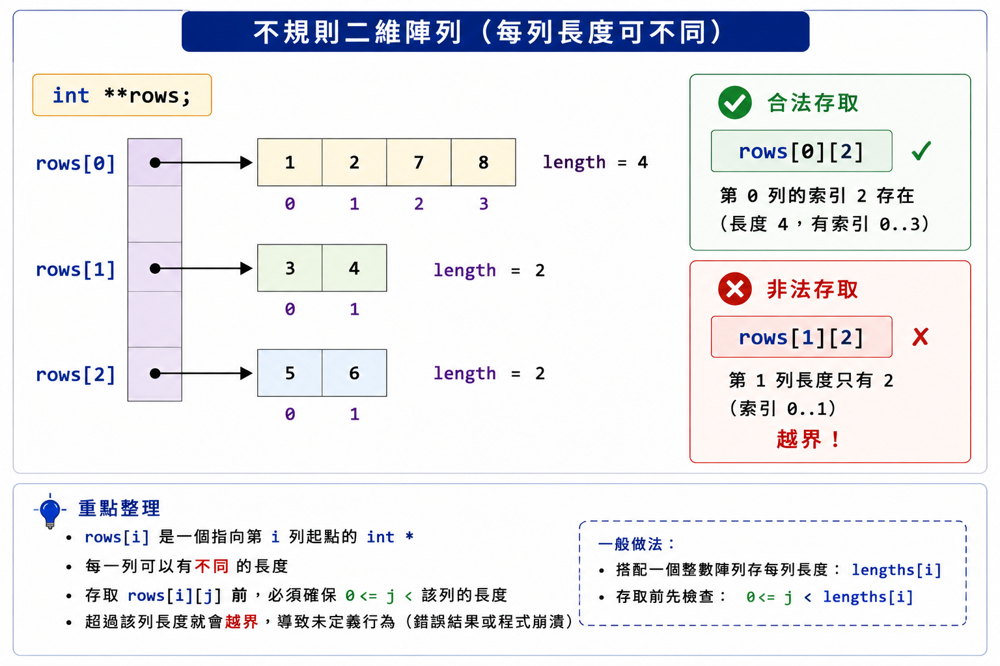
</p>

```c
int first[4] = {1, 2, 7, 8};
int second[2] = {3, 4};
int third[2] = {5, 6};

int *rows[3] = {
    first,
    second,
    third
};
```

合法：

```c
rows[0][2] = 9;
```

因為 `rows[0]` 指向長度四的 `first`。

錯誤：

```c
rows[1][2] = 10;
```

`second` 只有兩個元素，合法索引為 `0` 與 `1`。

> 指標陣列只保存起始位址，不會自動保存每一列的長度。若列長不同，程式必須另外保存每列長度。

---

# Part B：陣列指標

## Section IX. 完整陣列也有位址

<p align="center">
  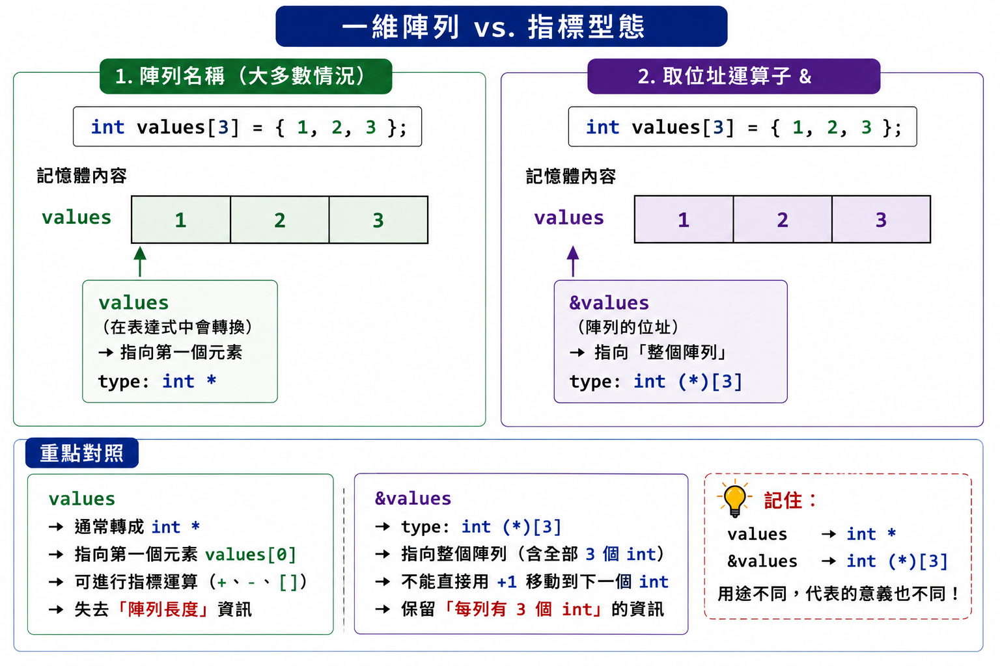
</p>

### 10. 一個三元素陣列

```c
int values[3] = {1, 2, 3};
```

`values` 的型態是：

```text
int[3]
```

---

### 11. `&values` 的型態

```c
&values
```

取得完整陣列物件的位址。

型態是：

```text
int (*)[3]
```

讀成：

```text
指向 int[3] 的指標
```

---

### 12. 宣告陣列指標

```c
int (*array_pointer)[3] = &values;
```

由變數名稱向外讀：

```text
array_pointer
→ 是指標
→ 指向具有三個 int 元素的陣列
```

括號不能省略。

---

### 13. 與指標陣列比較

```c
int *a[3];
int (*b)[3];
```

| 宣告 | 變數本身 | 指向／包含 |
| --- | --- | --- |
| `int *a[3]` | 陣列 | 三個 `int *` |
| `int (*b)[3]` | 指標 | 一個 `int[3]` |

---

## Section X. 使用陣列指標存取元素

```c
#include <stdio.h>

int main(void) {
    int values[3] = {1, 2, 3};
    int (*array_pointer)[3] = &values;

    for (int i = 0; i < 3; i++) {
        (*array_pointer)[i] = 0;
    }

    (*array_pointer)[2] = 5;

    for (int i = 0; i < 3; i++) {
        printf("%d ", values[i]);
    }

    printf("\n");

    return 0;
}
```

輸出：

```text
0 0 5
```

---

### 14. 為什麼需要括號？

<p align="center">
  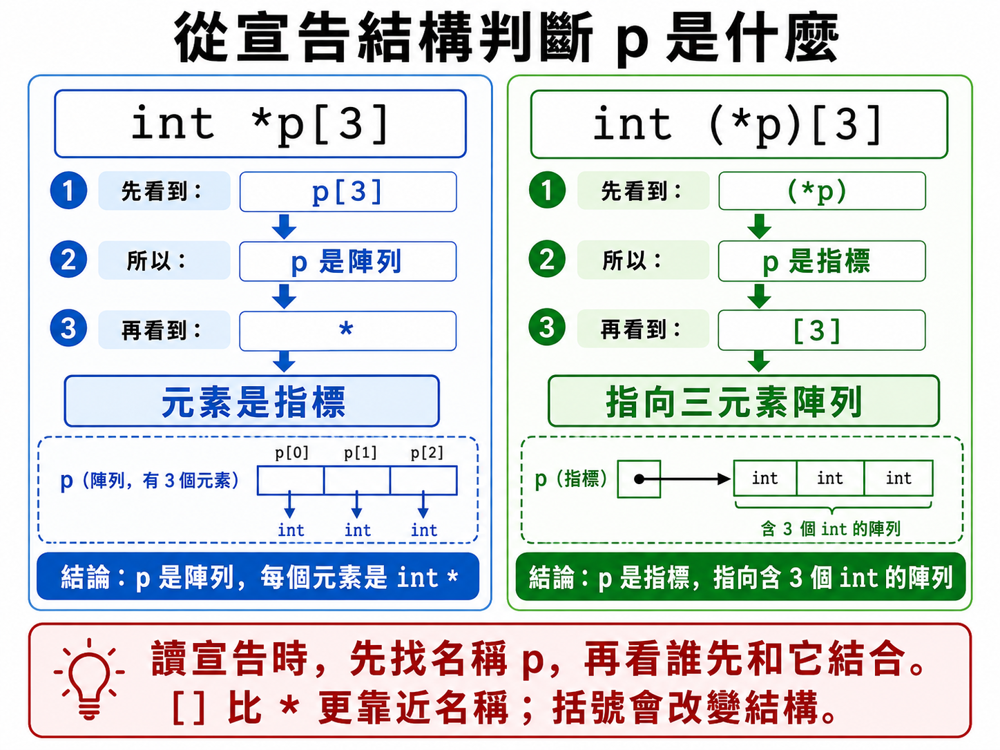
</p>

```c
(*array_pointer)[i]
```

1. `*array_pointer` 取得完整 `int[3]` 陣列。
2. `[i]` 取得其中第 `i` 個整數。

若寫：

```c
*array_pointer[i]
```

會先執行：

```c
array_pointer[i]
```

意義完全不同。

---

# Part C：在函式間傳遞一維陣列

## Section XI. 使用陣列指標傳遞固定長度陣列

### 15. 固定三元素版本

```c
#include <stdio.h>

void print_three(const int (*values)[3]) {
    size_t length =
        sizeof(*values) / sizeof((*values)[0]);

    for (size_t i = 0; i < length; i++) {
        printf("%d ", (*values)[i]);
    }

    printf("\n");
}

int main(void) {
    int values[3] = {1, 2, 3};

    print_three(&values);

    return 0;
}
```

---

### 16. 為什麼函式內可以使用 `sizeof`？

參數：

```c
const int (*values)[3]
```

所指物件型態仍然是完整的：

```text
const int[3]
```

因此：

```c
sizeof(*values)
```

得到完整三元素陣列的大小。

---

### 17. 固定長度成為型態的一部分

<p align="center">
  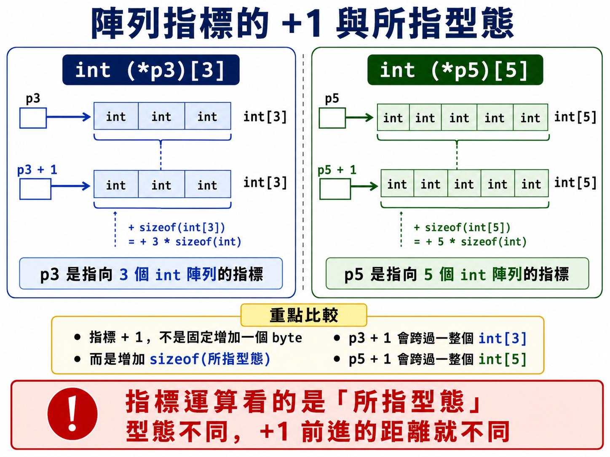
</p>

指向三元素陣列：

```c
int (*)[3]
```

指向五元素陣列：

```c
int (*)[5]
```

兩者是不同型態。

因此固定三元素版本不能直接共用於五元素陣列。

---

## Section XII. 使用一般元素指標與長度

```c
#include <stdio.h>

void print_values(
    const int *values,
    size_t length
) {
    for (size_t i = 0; i < length; i++) {
        printf("%d ", values[i]);
    }

    printf("\n");
}

int main(void) {
    int first[3] = {1, 2, 3};
    int second[5] = {1, 2, 3, 4, 5};

    print_values(first, 3);
    print_values(second, 5);

    return 0;
}
```

同一個函式可處理不同長度陣列。

代價是呼叫者必須另外提供正確長度。

---

### 18. 為什麼不能只在函式內使用 `sizeof(values)`？

參數：

```c
const int *values
```

是指標。

```c
sizeof(values)
```

得到指標本身大小，不是呼叫端陣列大小。

---

### 19. 指向未知長度陣列的問題

概念宣告：

```c
int (*values)[];
```

這是指向不完整陣列型態的指標。

因為元素數量未知，不能使用：

```c
sizeof(*values)
```

計算完整陣列大小。

因此實務上仍要：

- 固定長度寫入型態；或
- 使用元素指標並另外傳入長度。

---

# Part D：在函式間傳遞真正的二維陣列

## Section XIII. 二維陣列是陣列的陣列

<p align="center">
  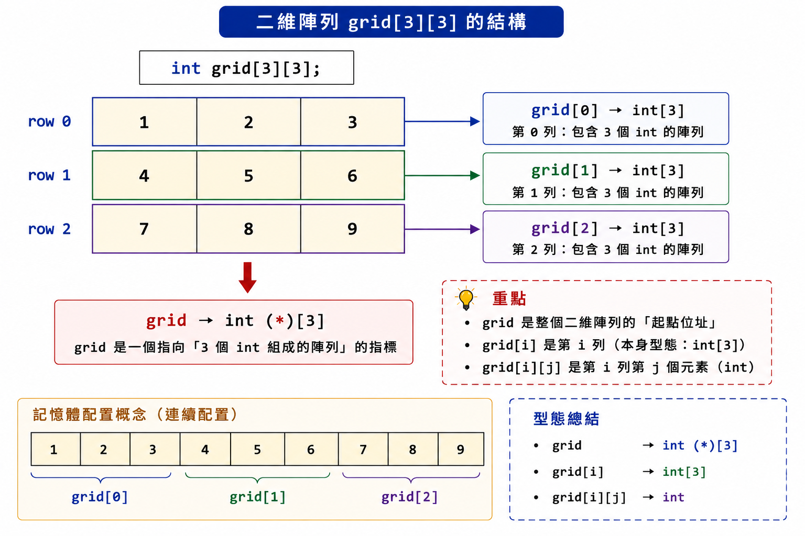
</p>

```c
int grid[3][3] = {
    {1, 2, 3},
    {4, 5, 6},
    {7, 8, 9}
};
```

型態：

```text
int[3][3]
```

第一層的每個元素：

```text
grid[0]
grid[1]
grid[2]
```

型態都是：

```text
int[3]
```

---

### 20. 二維陣列名稱的轉型

在多數運算式中：

```c
grid
```

轉成第一列的位址：

```c
&grid[0]
```

型態：

```text
int (*)[3]
```

不是：

```text
int **
```

---

## Section XIV. 固定欄數的二維陣列參數

```c
#include <stdio.h>

void print_grid(
    const int grid[][3],
    size_t height
) {
    for (size_t i = 0; i < height; i++) {
        for (size_t j = 0; j < 3; j++) {
            printf("%d ", grid[i][j]);
        }
        printf("\n");
    }
}

int main(void) {
    int grid[2][3] = {
        {1, 2, 3},
        {4, 5, 6}
    };

    print_grid(grid, 2);

    return 0;
}
```

在函式參數中：

```c
const int grid[][3]
```

會調整成：

```c
const int (*grid)[3]
```

---

### 21. 為什麼可以省略第一維？

函式接收的是指向第一列的指標。

列數可由另外的 `height` 參數提供。

---

### 22. 為什麼必須知道欄數？

若每列有三個 `int`：

```c
grid + 1
```

必須向後跳過一整列，也就是三個 `int`。

編譯器需要知道每列型態是：

```text
int[3]
```

才能正確計算下一列位置。

---

## Section XV. 三種相關位址

<p align="center">
  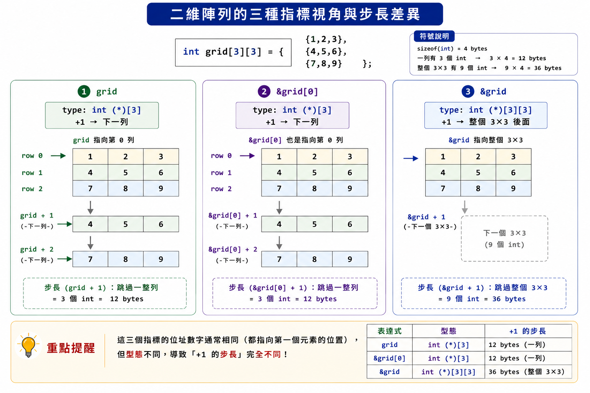
</p>

已知：

```c
int grid[3][3];
```

| 運算式 | 型態 | 意義 |
| --- | --- | --- |
| `grid` | `int (*)[3]` | 第一列位址 |
| `&grid[0]` | `int (*)[3]` | 第一列位址 |
| `&grid` | `int (*)[3][3]` | 完整 3×3 陣列位址 |

位址數字可能相同，但型態不同，指標加一時移動距離也不同。

---

### 23. 指向完整二維陣列

```c
#include <stdio.h>

void print_complete(
    const int (*grid)[3][3]
) {
    for (size_t i = 0; i < 3; i++) {
        for (size_t j = 0; j < 3; j++) {
            printf("%d ", (*grid)[i][j]);
        }
        printf("\n");
    }
}

int main(void) {
    int grid[3][3] = {
        {1, 2, 3},
        {4, 5, 6},
        {7, 8, 9}
    };

    print_complete(&grid);

    return 0;
}
```

這個介面將兩個維度都固定在型態中，因此不適合處理其他高度或寬度。

---

# Part E：為什麼真正二維陣列不是 `int **`

<p align="center">
  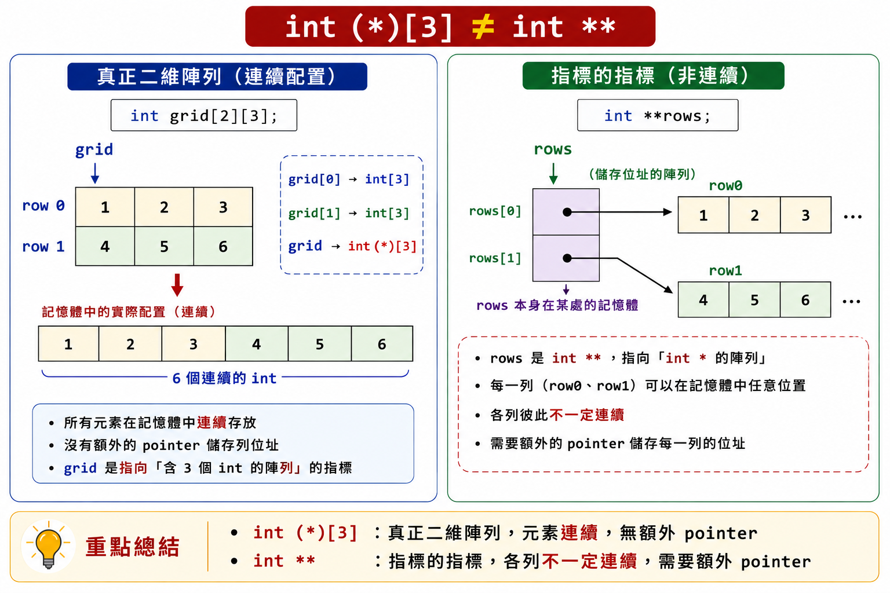
</p>

## Section XVI. `int **` 需要兩層指標結構

參數：

```c
void print_rows(
    int **rows,
    size_t height,
    size_t width
);
```

期待：

```text
rows
→ 指向第一個 int *
→ 每個 int * 再指向一列 int
```

也就是記憶體中必須真的存在一個「列指標陣列」。

---

### 24. 真正二維陣列沒有列指標陣列

```c
int grid[2][3];
```

記憶體直接保存六個連續整數：

```text
grid[0][0] grid[0][1] grid[0][2]
grid[1][0] grid[1][1] grid[1][2]
```

其中沒有額外存放：

```text
&grid[0]
&grid[1]
```

這兩個指標值的陣列。

因此：

```c
print_rows(grid, 2, 3);
```

不能將 `int (*)[3]` 當成 `int **`。

---

# Part F：使用指標陣列傳遞二維資料

## Section XVII. 建立列指標陣列

```c
#include <stdio.h>

void print_rows(
    int *const rows[],
    size_t height,
    size_t width
) {
    for (size_t i = 0; i < height; i++) {
        for (size_t j = 0; j < width; j++) {
            printf("%d ", rows[i][j]);
        }
        printf("\n");
    }
}

int main(void) {
    int grid[3][3] = {
        {1, 2, 3},
        {4, 5, 6},
        {7, 8, 9}
    };

    int *rows[3] = {
        grid[0],
        grid[1],
        grid[2]
    };

    print_rows(rows, 3, 3);

    return 0;
}
```

函式參數中的：

```c
int *const rows[]
```

會調整成指向列指標的指標。

---

### 25. 指標陣列提供了什麼額外資訊？

真正二維陣列只保存資料元素。

指標陣列額外保存：

```text
rows[0] → 第一列起始位置
rows[1] → 第二列起始位置
rows[2] → 第三列起始位置
```

因此可傳給需要兩層指標結構的函式。

---

### 26. 可以重新排列列順序

<p align="center">
  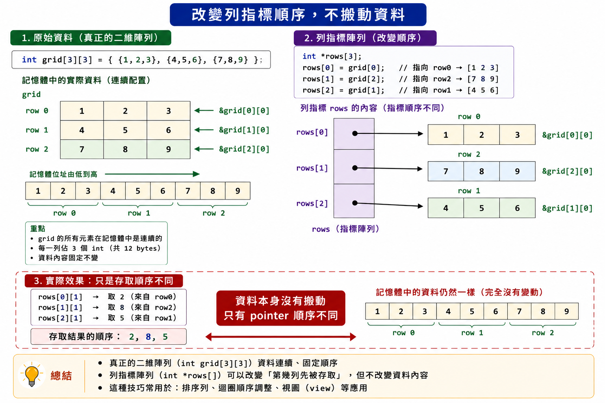
</p>

```c
int *rows[3] = {
    grid[0],
    grid[2],
    grid[1]
};
```

輸出順序會變成：

```text
第一列
第三列
第二列
```

而 `grid` 內部資料配置沒有被搬動。

---

### 27. 可以指向不同長度的列

```c
int first[4] = {1, 2, 3, 4};
int second[2] = {5, 6};
int third[3] = {7, 8, 9};

int *rows[3] = {
    first,
    second,
    third
};
```

但此時不能使用同一個固定 `width` 安全走訪所有列。

需要另外保存每列長度：

```c
size_t widths[3] = {4, 2, 3};
```

---

# Part G：傳遞任意長寬二維資料

<p align="center">
  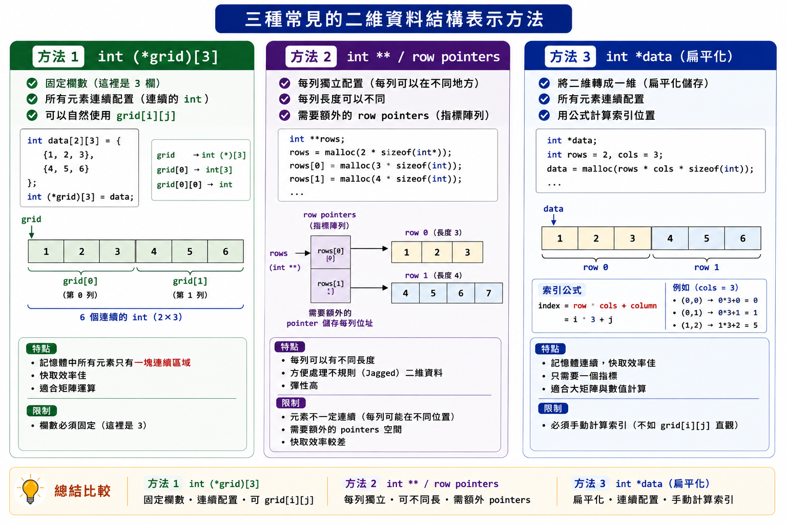
</p>

## Section XVIII. 方法一：固定欄數的陣列指標

```c
void print_grid(
    const int (*grid)[3],
    size_t height
);
```

優點：

- 保留真正二維陣列的列型態。
- 可直接使用 `grid[i][j]`。
- 編譯器知道每列寬度。

限制：

- 欄數 `3` 是型態的一部分。
- 不能直接處理欄數不同的陣列。

---

## Section XIX. 方法二：列指標陣列

```c
void print_rows(
    int *const rows[],
    size_t height,
    const size_t widths[]
);
```

優點：

- 每列可以位於不同位置。
- 每列可以具有不同長度。
- 可重新排列列順序。

限制：

- 呼叫端必須真正建立列指標。
- 需要額外指標儲存空間。
- 不能直接把真正二維陣列轉成 `int **`。

---

## Section XX. 方法三：扁平化指標與寬度

來源最後將連續二維資料視為一串 `int`，使用：

```text
索引 = row * width + column
```

存取：

```c
*(data + row * width + column)
```

---

### 28. 完整扁平化範例

```c
#include <stdio.h>

void print_flat(
    const int *data,
    size_t height,
    size_t width
) {
    for (size_t i = 0; i < height; i++) {
        for (size_t j = 0; j < width; j++) {
            printf(
                "%d ",
                *(data + i * width + j)
            );
        }
        printf("\n");
    }
}

int main(void) {
    int grid[3][3] = {
        {1, 2, 3},
        {4, 5, 6},
        {7, 8, 9}
    };

    print_flat(
        &grid[0][0],
        3,
        3
    );

    return 0;
}
```

---

### 29. 索引推導

<p align="center">
  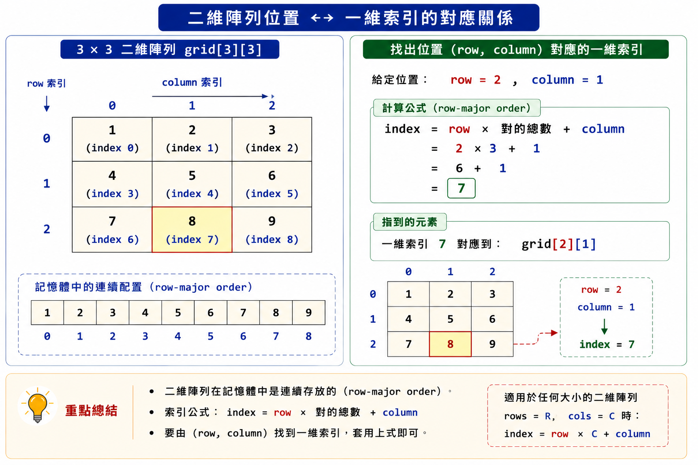
</p>

對位置：

```text
row = 2
column = 1
width = 3
```

一維索引：

```text
2 × 3 + 1 = 7
```

對應：

```c
grid[2][1]
```

也就是數值：

```text
8
```

---

### 30. 來源方法的前提

此方法假設：

- 所有元素按列連續排列。
- `width` 與原資料實際欄數一致。
- 呼叫端提供的高度、寬度沒有超過合法範圍。

若 `width` 錯誤，程式會以錯誤位置切分每列。

---

### 31. 教材補充：保留二維型態的 VLA 參數

若編譯環境支援 C99 可變長度陣列參數，可寫：

```c
void print_vla(
    size_t height,
    size_t width,
    const int grid[height][width]
);
```

這不是本批投影片的主要方法，但它能在保留 `grid[i][j]` 寫法的同時，讓寬度於執行期間決定。

---
# Part H：常見宣告閱讀法

<p align="center">
  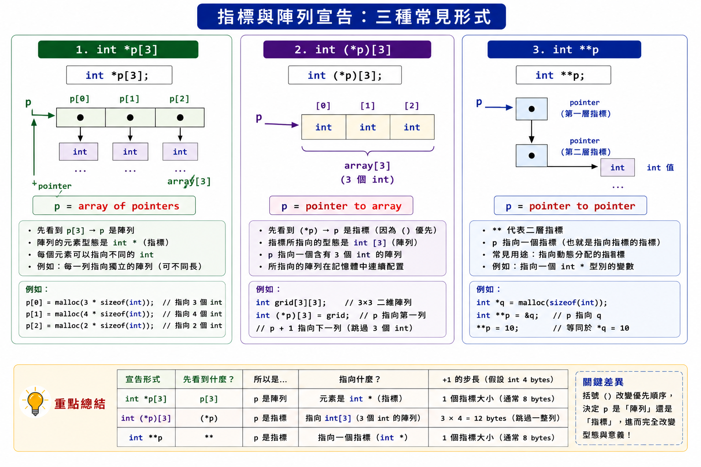
</p>

## Section XXI. 從變數名稱向外閱讀

### 48. `int *p[3]`

```text
p
→ 先遇到 [3]
→ p 是三元素陣列
→ 再遇到 *
→ 每個元素是指向 int 的指標
```

---

### 49. `int (*p)[3]`

```text
p
→ 括號內先遇到 *
→ p 是指標
→ 再遇到 [3]
→ 指向三元素 int 陣列
```

---

### 50. `int **p`

```text
p
→ 是指標
→ 指向另一個 int *
```

這不會自動等同於：

```c
int matrix[rows][columns];
```

---

### 51. `char *p[100]`

```text
p
→ 是一百元素陣列
→ 每個元素是 char *
```

適合保存多個字串起始位置。

---
# Part I：容易搞混的重點

## Section XXII. 指標陣列不等於二維陣列

指標陣列：

```c
int *rows[3];
```

包含三個位址。

真正二維陣列：

```c
int grid[3][3];
```

包含九個整數，沒有三個列指標物件。

---

## Section XXIII. 陣列指標不等於元素指標

```c
int *element_pointer;
```

加一移動一個 `int`。

```c
int (*row_pointer)[3];
```

加一移動一整列，也就是三個 `int`。

---

## Section XXIV. 位址數字相同不代表型態相同

對 `int grid[3][3]`：

```c
grid
&grid[0]
&grid
&grid[0][0]
```

在輸出時可能顯示同一起始數字，但型態與指標加一的距離不同。

---

## Section XXV. `int **` 不能修正錯誤型態

即使使用強制轉型把真正二維陣列轉成 `int **`，記憶體中仍不存在列指標陣列。

函式會把前幾個整數內容錯當成位址，造成未定義行為。

強制轉型只改變編譯器看待運算式的型態，不會重新建立正確記憶體結構。

---

## Section XXVI. 每列長度不同時要保存長度

```c
int *rows[3];
```

只知道三個列起始位置。

不知道各列有多少元素。

應另外保存：

```c
size_t widths[3];
```

---
# Part J：快速概念檢查

## Section XXVII. 選擇題與簡答

### Q1. `int *p[3]` 中，`p` 是什麼？

<details>
<summary>查看答案</summary>

三元素陣列，每個元素都是 `int *`。

</details>

---

### Q2. `int (*p)[3]` 中，`p` 是什麼？

<details>
<summary>查看答案</summary>

指向三元素 `int` 陣列的指標。

</details>

---

### Q3. 哪一個宣告需要括號才能表示陣列指標？

<details>
<summary>查看答案</summary>

```c
int (*p)[3];
```

</details>

---

### Q4. `pointers[i][j]` 的第一個下標選擇什麼？

<details>
<summary>查看答案</summary>

第 `i` 個指標元素，也就是選擇一列的起始位址。

</details>

---

### Q5. 指標陣列中的每一列可以有不同長度嗎？

<details>
<summary>查看答案</summary>

可以，但程式必須另外知道各列長度。

</details>

---

### Q6. `&values` 的型態是什麼？

已知：

```c
int values[3];
```

<details>
<summary>查看答案</summary>

```c
int (*)[3]
```

</details>

---

### Q7. 為什麼固定長度陣列指標函式不能處理任意長度？

<details>
<summary>查看答案</summary>

因為陣列長度是指標所指型態的一部分，例如 `int (*)[3]` 與 `int (*)[5]` 不同。

</details>

---

### Q8. 函式參數 `int values[10]` 真的接收十元素陣列副本嗎？

<details>
<summary>查看答案</summary>

不會。在函式參數中會調整為 `int *values`。

</details>

---

### Q9. 二維陣列名稱 `grid` 會轉成 `int **` 嗎？

<details>
<summary>查看答案</summary>

不會。若每列有三個 `int`，會轉成 `int (*)[3]`。

</details>

---

### Q10. 為什麼二維陣列函式通常必須知道欄數？

<details>
<summary>查看答案</summary>

編譯器需要知道每列大小，才能計算下一列的起始位置及 `grid[i][j]`。

</details>

---

### Q11. 真正二維陣列能直接傳給 `int **` 嗎？

<details>
<summary>查看答案</summary>

不能。真正二維陣列沒有額外的列指標陣列。

</details>

---

### Q12. 如何讓真正二維陣列資料可傳給 `int **` 介面？

<details>
<summary>查看答案</summary>

另外建立列指標陣列：

```c
int *rows[] = {
    grid[0],
    grid[1],
    grid[2]
};
```

再傳入 `rows`。

</details>

---

### Q13. 扁平化二維索引公式是什麼？

<details>
<summary>查看答案</summary>

```text
row * width + column
```

</details>

---
# Part K：程式閱讀練習

## Section XXVIII. 追蹤指標與陣列

### 題目 1

```c
int values[3] = {10, 20, 30};
int *p[3] = {
    &values[2],
    &values[0],
    &values[1]
};

*p[1] = 99;
```

<details>
<summary>查看答案</summary>

`p[1]` 指向 `values[0]`，所以：

```text
values = {99, 20, 30}
```

</details>

---

### 題目 2

```c
int values[3] = {1, 2, 3};
int (*p)[3] = &values;

(*p)[1] = 8;
```

<details>
<summary>查看答案</summary>

```text
values = {1, 8, 3}
```

</details>

---

### 題目 3

```c
int a[4] = {1, 2, 3, 4};
int b[2] = {5, 6};

int *rows[2] = {a, b};
```

`rows[1][2]` 是否合法？

<details>
<summary>查看答案</summary>

不合法。`rows[1]` 指向長度二的 `b`，索引 `2` 越界。

</details>

---

### 題目 4

```c
int grid[2][3];
```

`grid + 1` 移動多少個 `int`？

<details>
<summary>查看答案</summary>

移動一整列，也就是三個 `int`。

</details>

---

### 題目 5

```c
int grid[2][3];
int **p;
```

可以直接寫：

```c
p = grid;
```

嗎？

<details>
<summary>查看答案</summary>

不可以。右邊是 `int (*)[3]`，左邊是 `int **`，而且兩種記憶體結構不同。

</details>

---

### 題目 6

```c
int grid[3][3];
int *rows[3] = {
    grid[2],
    grid[0],
    grid[1]
};
```

`rows[0][1]` 對應哪個元素？

<details>
<summary>查看答案</summary>

```c
grid[2][1]
```

</details>

---
# Part L：實作練習

## Section XXIX. 實作檢測題

### TODO 1：反向指標陣列

建立：

```c
int values[5] = {1, 2, 3, 4, 5};
```

使用指標陣列讓：

```text
p[0] 指向 values[4]
p[1] 指向 values[3]
...
```

再透過 `p` 反向輸出。

---

### TODO 2：多個獨立變數

建立四個普通整數及一個指標陣列，使用迴圈將四個整數全部乘以二。

---

### TODO 3：不等長列

建立三個不同長度陣列：

```text
4、2、5
```

使用：

```c
int *rows[3];
size_t widths[3];
```

安全輸出所有元素。

---

### TODO 4：陣列指標歸零

建立：

```c
int values[6];
```

使用：

```c
int (*p)[6];
```

將所有元素設為零。

---

### TODO 5：固定陣列列印函式

撰寫：

```c
void print_four(
    const int (*values)[4]
);
```

在函式內使用 `sizeof` 計算元素數量。

---

### TODO 6：任意長度一維陣列

改成：

```c
void print_values(
    const int *values,
    size_t length
);
```

測試長度 `3`、`5` 與 `8`。

---

### TODO 7：固定欄數二維陣列

撰寫：

```c
int sum_grid(
    const int grid[][4],
    size_t height
);
```

計算所有元素總和。

---

### TODO 8：列指標重新排序

建立 `3×3` 陣列，使用列指標陣列以：

```text
第三列、第一列、第二列
```

順序輸出。

---

### TODO 9：不等長二維資料

建立三個不同長度列，使用 `int **` 風格函式及 `widths[]` 輸出。

---

### TODO 10：扁平化索引

撰寫：

```c
int flat_at(
    const int *data,
    size_t width,
    size_t row,
    size_t column
);
```

回傳指定元素。

---
# Part M：課後延伸

## Section XXX. 課後小練習

### 練習 1：列總和

使用列指標陣列與每列長度，計算每一列總和。

---

### 練習 2：選擇列順序

讓使用者輸入列索引順序，只重新排列列指標，不搬動真正資料。

---

### 練習 3：矩陣轉置輸出

對固定欄數的真正二維陣列，使用交換 `i`、`j` 的方式輸出轉置結果。

---

### 練習 4：扁平化矩陣乘常數

使用：

```c
int *data
height
width
```

將所有元素乘以指定值。

---
# Part N：常見錯誤提醒

## Section XXXI. 常見錯誤

### 錯誤 1：漏掉陣列指標括號

```c
int *p[3];
```

不是陣列指標，而是指標陣列。

---

### 錯誤 2：將指標陣列當成所有列等長

指標陣列本身不保存列長度。

---

### 錯誤 3：使用超過該列實際長度的第二個下標

會造成未定義行為。

---

### 錯誤 4：使用 `sizeof(pointer)` 計算呼叫端陣列長度

只會得到指標大小。

---

### 錯誤 5：以為 `int (*p)[]` 可以知道陣列長度

所指陣列型態不完整，無法取得完整 `sizeof(*p)`。

---

### 錯誤 6：省略二維陣列參數的欄數

編譯器無法計算下一列位置。

---

### 錯誤 7：把真正二維陣列傳給 `int **`

兩種記憶體結構不同。

---

### 錯誤 8：使用強制轉型掩蓋 `int (*)[N]` 與 `int **` 的不相容

轉型不會建立列指標陣列。

---

### 錯誤 9：解讀相同位址數字時忽略型態

`grid`、`&grid[0]` 與 `&grid` 的移動單位不同。

---

### 錯誤 10：扁平化時使用錯誤欄數

會計算出錯誤元素位置。

---
# Part O：Mermaid 流程圖

## Section XXXII. 宣告與資料結構流程圖

### 1. 指標陣列

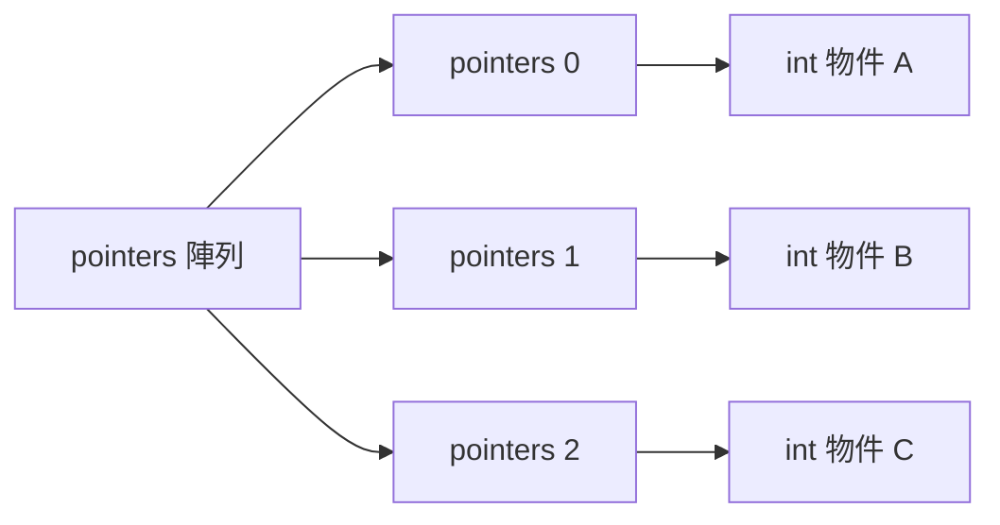
```mermaid
flowchart LR
    A[pointers 陣列] --> B[pointers 0]
    A --> C[pointers 1]
    A --> D[pointers 2]
    B --> E[int 物件 A]
    C --> F[int 物件 B]
    D --> G[int 物件 C]
```

---

### 2. 陣列指標

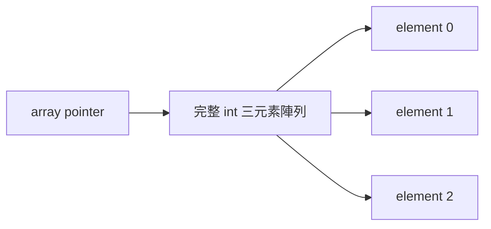
```mermaid
flowchart LR
    A[array pointer] --> B[完整 int 三元素陣列]
    B --> C[element 0]
    B --> D[element 1]
    B --> E[element 2]
```

---

### 3. 真正二維陣列

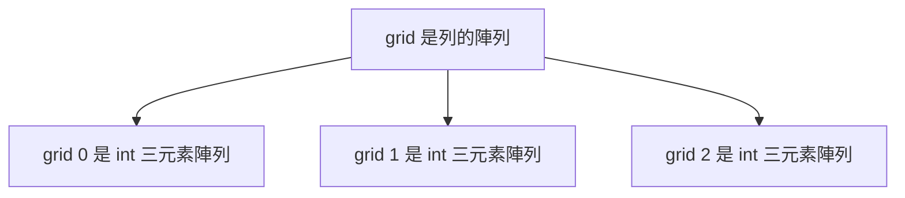
```mermaid
flowchart TD
    A[grid 是列的陣列] --> B[grid 0 是 int 三元素陣列]
    A --> C[grid 1 是 int 三元素陣列]
    A --> D[grid 2 是 int 三元素陣列]
```

---

### 4. 指標陣列表示列

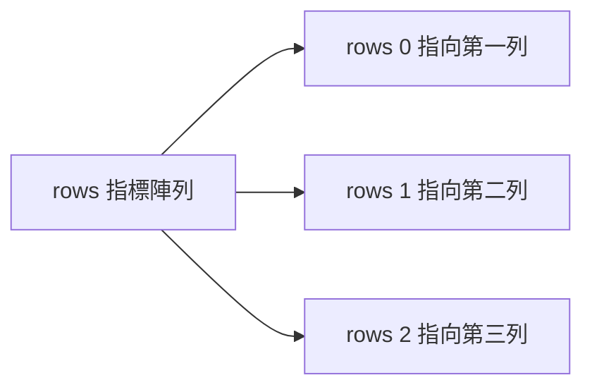
```mermaid
flowchart LR
    A[rows 指標陣列] --> B[rows 0 指向第一列]
    A --> C[rows 1 指向第二列]
    A --> D[rows 2 指向第三列]
```

---

### 5. 扁平化索引

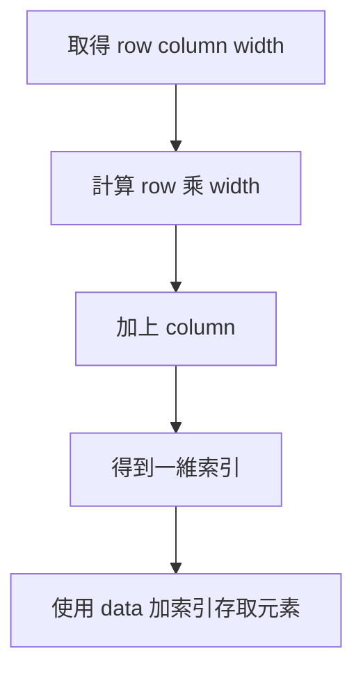
```mermaid
flowchart TD
    A[取得 row column width] --> B[計算 row 乘 width]
    B --> C[加上 column]
    C --> D[得到一維索引]
    D --> E[使用 data 加索引存取元素]
```

---
# 本章完成標準

完成本章後，你應該能做到：

1. 正確判讀 `int *p[N]`。
2. 正確判讀 `int (*p)[N]`。
3. 說明括號如何改變宣告意義。
4. 使用指標陣列指向多個普通變數。
5. 使用指標陣列指向同一陣列的不同元素。
6. 使用指標陣列以不同順序存取元素。
7. 使用指標陣列表示多個一維陣列。
8. 使用 `p[i][j]` 存取列元素。
9. 說明每列長度可以不同。
10. 避免超過單列合法範圍。
11. 使用 `&array` 取得完整陣列位址。
12. 宣告指向完整陣列的指標。
13. 使用 `(*p)[i]` 存取元素。
14. 使用固定長度陣列指標傳入函式。
15. 使用 `sizeof(*p)` 取得完整固定陣列大小。
16. 說明陣列長度是陣列指標型態的一部分。
17. 改用元素指標與長度處理任意長度陣列。
18. 說明函式參數中的陣列會調整成指標。
19. 說明二維陣列是陣列的陣列。
20. 判斷二維陣列名稱轉型後的型態。
21. 使用固定欄數參數傳遞二維陣列。
22. 另外傳入高度控制列數。
23. 分辨 `grid`、`&grid[0]` 與 `&grid`。
24. 說明真正二維陣列不能直接傳給 `int **`。
25. 建立列指標陣列。
26. 將列指標陣列傳給兩層指標介面。
27. 重新排列列指標而不搬動資料。
28. 為不等長列另外保存長度。
29. 使用扁平化索引存取連續二維資料。
30. 推導 `row * width + column`。
