# Lesson 03：Pointer Conversions 指標轉型

> 這堂課的重點：理解指標型態不只是「位址」而已。不同指標型態會告訴編譯器，所指物件的型態、一次存取多少資料，以及指標加一時要移動多遠。本章會先從陣列指標無法共用同一函式的問題開始，再整理合法的隱性轉型、`void *`、`const`、指標與整數之間的轉型，以及不同指標型態間的強制轉型與記憶體對齊。

> 本章依照 `29-01` 到 `29-04` 的投影片編排。來源投影片中的記憶體對齊圖以「假設 `char` 對齊為 1、`int` 對齊為 4」說明概念；實際型態大小與對齊要求由 C 實作與硬體環境決定。

---

## Section I. 今天要做什麼？

1. 複習普通資料型態之間的轉型。
2. 複習陣列在運算式中轉成第一個元素指標。
3. 回顧固定長度陣列指標參數。
4. 比較 `int (*)[3]` 與 `int (*)[5]`。
5. 理解陣列長度是陣列型態的一部分。
6. 找出為三元素陣列撰寫的函式無法直接處理五元素陣列的原因。
7. 嘗試使用 `int (*)[]` 表示未知長度陣列。
8. 理解不完整陣列型態不能使用 `sizeof(*pointer)` 取得完整大小。
9. 嘗試使用 `int **` 接收陣列位址。
10. 理解 `int **` 與 `int (*)[N]` 是不同型態及不同記憶體結構。
11. 理解大多數不同目標型態的指標不能直接隱性互轉。
12. 比較 `int *`、`double *`、`int **` 與陣列指標。
13. 認識合法的隱性轉型。
14. 複習整數型態內的隱性轉型。
15. 複習浮點型態內的隱性轉型。
16. 複習整數與浮點型態間的隱性轉型。
17. 理解陣列名稱可以隱性轉成第一個元素指標。
18. 理解指標可以增加 `const` 限制。
19. 將 `int *` 隱性轉成 `const int *`。
20. 理解不能安全地隱性移除 `const`。
21. 認識通用物件指標 `void *`。
22. 將一般物件指標隱性轉成 `void *`。
23. 將 `void *` 隱性轉回物件指標。
24. 理解物件指標轉成 `void *` 再轉回原型態，應得到相同指標值。
25. 理解 `void *` 本身不能直接解參照。
26. 說明 `malloc()` 為什麼可以回傳 `void *`。
27. 認識指標與整數之間的強制轉型。
28. 理解指標用來保存記憶體位址。
29. 理解 C 不規定實際記憶體位址必須如何編號或表示。
30. 將指標強制轉成整數。
31. 理解轉換結果通常由實作定義。
32. 理解普通 `int` 不一定能容納完整指標表示。
33. 將整數強制轉成指標。
34. 理解整數轉成指標的結果由實作定義。
35. 避免把任意整數轉成指標後直接解參照。
36. 認識 `uintptr_t` 與 `intptr_t` 的用途。
37. 理解 `uintptr_t` 與 `intptr_t` 是可選的整數型態。
38. 認識不同物件指標間的強制轉型。
39. 使用 `(TargetType *)pointer` 改變指標運算式型態。
40. 理解強制轉型不會搬動資料。
41. 理解強制轉型不會改變原物件的實際型態。
42. 理解強制轉型不會自動修正記憶體對齊。
43. 認識記憶體對齊 alignment。
44. 理解某些型態只能從符合特定條件的位址開始存放。
45. 使用來源假設比較 `char` 與 `int` 的對齊。
46. 理解可存放 `int` 的位址通常也可存放 `char`。
47. 理解可存放 `char` 的位址不一定符合 `int` 對齊。
48. 理解型態大小與對齊要求通常由實作決定。
49. 理解對齊限制可能與硬體存取效率有關。
50. 判斷 TypeA 指標轉成 TypeB 指標後能否安全轉回。
51. 理解若 TypeB 的對齊要求不嚴於 TypeA，轉回原型態應恢復原指標值。
52. 分辨「能轉型」、「能轉回」與「能安全解參照」。
53. 認識透過 `unsigned char *` 觀察物件表示的特殊用途。
54. 使用 `memcpy()` 在不同物件之間複製位元組，而不是任意改型態解參照。
55. 找出移除 `const`、任意整數指標、對齊不足及不相容解參照等錯誤。
56. 使用概念檢查、程式閱讀與實作題整合本章。

---

## Section II. 今天的學習方式

1. 每次轉型都寫出：
   ```text
   來源型態 → 目標型態
   ```
2. 分辨轉型是：
   - 隱性轉型
   - 明確強制轉型
3. 指標題另外記錄：
   - 位址值有沒有改變
   - 指標型態有沒有改變
   - 所指物件的實際型態有沒有改變
4. 不把「編譯器接受」直接等同於「程式安全」。
5. 使用 `void *` 時，記錄原始物件型態。
6. 使用 `const` 時，確認是增加限制還是移除限制。
7. 指標與整數轉型時，先比較兩種型態是否足以保存完整表示。
8. 任意整數轉成指標後，不進行解參照實驗。
9. 進行指標間強制轉型時，先確認：
   - 目標位址是否符合對齊
   - 實際物件是否適合以目標型態存取
10. 來源的記憶體圖使用簡化編號；實際系統位址不必從 `0` 逐格增加。
11. 所有完整且應合法的 C 程式都使用嚴格 C17 選項編譯。
12. 具有實作定義或未定義風險的程式只作靜態分析，不會作為安全執行範例。

---

## Section III. 轉型總覽

<p align="center">
  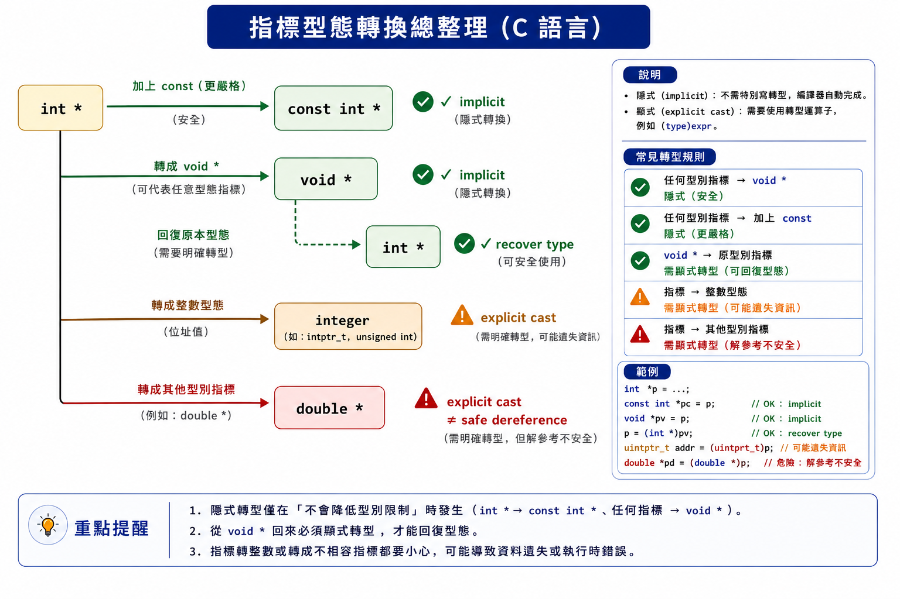
</p>

| 來源 | 目標 | 是否可隱性轉型 | 本章重點 |
| --- | --- | --- | --- |
| `int` | `double` | 可以 | 一般算術轉型 |
| `double` | `int` | 可以 | 小數部分會被捨去 |
| `int[N]` | `int *` | 多數運算式中可以 | 轉成第一個元素指標 |
| `int *` | `const int *` | 可以 | 增加唯讀限制 |
| `const int *` | `int *` | 不可以安全隱性轉型 | 會移除限制 |
| `Type *` | `void *` | 可以 | 通用物件指標 |
| `void *` | `Type *` | 可以 | 應恢復正確原型態 |
| `Type *` | 整數 | 需要強制轉型 | 結果多半由實作定義 |
| 整數 | `Type *` | 需要強制轉型 | 結果由實作定義 |
| `TypeA *` | `TypeB *` | 大多不可直接隱性轉型 | 可強制轉型，但不代表可安全存取 |

---

# Part A：為什麼指標型態不能任意互換？

## Section IV. 固定長度陣列指標的限制

<p align="center">
  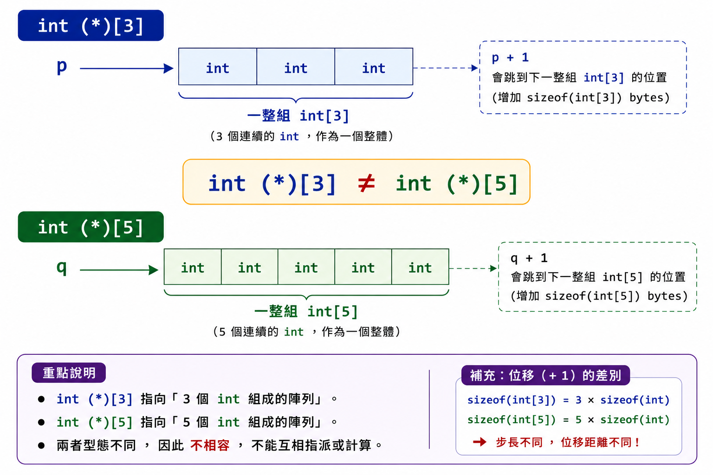
</p>

### 1. 三元素陣列版本

```c
#include <stdio.h>

void print_three(
    const int (*values)[3]
) {
    size_t length =
        sizeof(*values) / sizeof((*values)[0]);

    for (size_t i = 0; i < length; i++) {
        printf("%d ", (*values)[i]);
    }

    printf("\n");
}

int main(void) {
    int values[] = {1, 2, 3};

    print_three(&values);

    return 0;
}
```

參數型態：

```text
const int (*)[3]
```

所指的是完整三元素陣列，因此函式內可以使用：

```c
sizeof(*values)
```

取得完整陣列大小。

---

### 2. 五元素陣列需要不同型態

```c
int values[] = {1, 2, 3, 4, 5};
```

完整陣列位址：

```c
&values
```

型態是：

```text
int (*)[5]
```

不是：

```text
int (*)[3]
```

因此原本的三元素版本不能直接共用。

---

### 3. 陣列長度是型態的一部分

```text
int[3]  與 int[5]  是不同型態
```

所以：

```text
int (*)[3] 與 int (*)[5] 也是不同指標型態
```

這正是來源投影片提出的限制。

---

## Section V. 使用未知長度陣列指標？

來源接著嘗試：

```c
void print(int (*values)[]);
```

`values` 指向：

```text
元素數量未知的 int 陣列
```

這是一個不完整陣列型態。

---

### 4. 不完整型態不能取得完整大小

不能使用：

```c
sizeof(*values)
```

因為編譯器不知道所指陣列有多少元素。

因此也不能依靠：

```c
sizeof(*values) / sizeof((*values)[0])
```

自動算出呼叫端陣列長度。

---

### 5. 一般解法仍是元素指標加長度

```c
#include <stdio.h>

void print_values(
    const int *values,
    size_t length
) {
    for (size_t i = 0; i < length; i++) {
        printf("%d ", values[i]);
    }

    printf("\n");
}

int main(void) {
    int first[] = {1, 2, 3};
    int second[] = {1, 2, 3, 4, 5};

    print_values(first, 3);
    print_values(second, 5);

    return 0;
}
```

這個介面不需要在指標型態中固定陣列長度，但呼叫者必須另外傳入正確的 `length`。

---

## Section VI. 為什麼不能改成 `int **`？

<p align="center">
  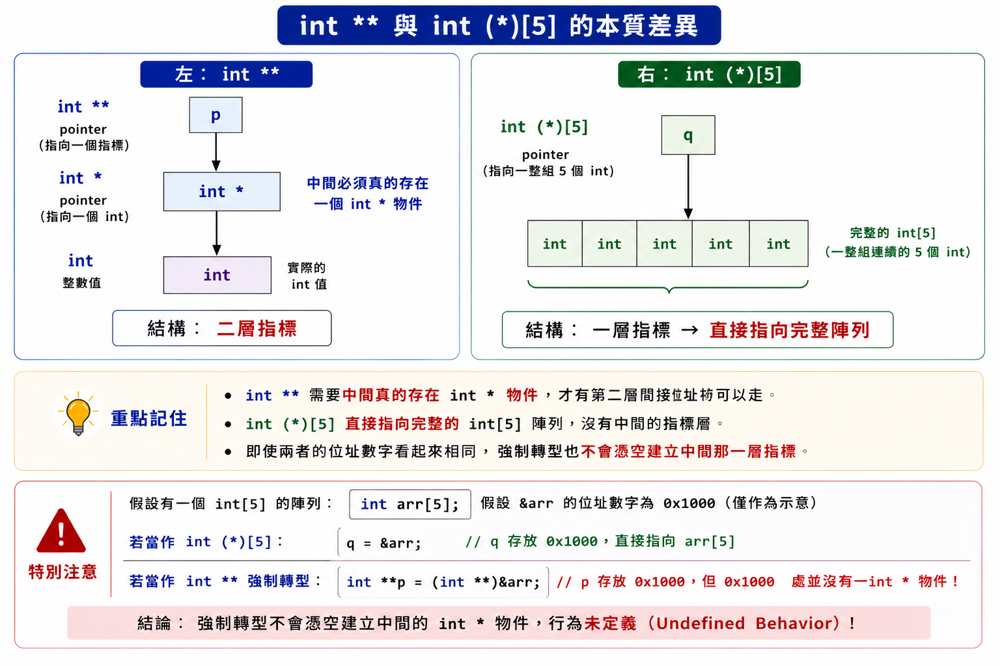
</p>

來源嘗試：

```c
void print(int **values);
```

再將：

```c
&array
```

傳入。

但：

```text
&array 的型態是 int (*)[N]
```

而函式需要：

```text
int **
```

兩者不同。

---

### 6. `int **` 的記憶體結構

```c
int **pointer;
```

表示：

```text
pointer
→ 指向一個 int *
→ 該 int * 再指向 int
```

記憶體中應真正存在一個 `int *` 物件。

---

### 7. 陣列指標的記憶體結構

```c
int (*pointer)[5];
```

表示：

```text
pointer
→ 直接指向一個包含五個 int 的完整陣列
```

中間沒有額外的 `int *` 物件。

---

### 8. 相同位址數字不表示型態相容

對同一陣列而言：

```c
array
&array[0]
&array
```

輸出時可能顯示相同的起始位址數字。

但它們的型態與指標加一的移動單位不同。

強行改成 `int **` 不會自動在記憶體中建立中間那一層指標。

---

## Section VII. 大多數不同指標型態不能直接隱性轉型

來源列出：

```c
int int_value;
double double_value;
int int_array[3];
```

下列型態彼此不同：

```text
int *
double *
int **
int (*)[3]
int (*)[]
```

例如：

```c
/* int *p = &double_value; */
/* double *q = &int_value; */
/* int **r = &int_value; */
/* int **s = &int_array; */
```

嚴格編譯器應對這些不相容指派提供診斷。

---

### 9. 一個重要例外：增加 `const`

```c
int value = 10;
int *writable = &value;
const int *readonly = writable;
```

合法。

`readonly` 仍指向同一個 `int`，但不能透過 `readonly` 修改它。

---

# Part B：合法的隱性轉型

## Section VIII. 普通數值的隱性轉型

來源先以普通型態說明：

```c
int int_value = 3;
char char_value = '3';
float float_value = 3.5f;
double double_value = 3.5;
```

同類型別之間可以轉型：

```c
float_value = double_value;
int_value = char_value;
```

整數與浮點數之間也可以轉型：

```c
int_value = double_value;
double_value = int_value;
```

---

### 10. 浮點數轉整數

```c
double value = 3.9;
int result = value;
```

`result` 會取得：

```text
3
```

小數部分向零方向捨去。

若數值超出整數型態可表示範圍，結果不能依賴；這是教材安全補充。

---

## Section IX. 陣列轉成第一個元素指標

```c
int values[3];
int *pointer;

pointer = values;
```

在這個運算式中：

```c
values
```

轉成：

```c
&values[0]
```

型態為：

```text
int *
```

---

### 11. 這不是陣列整體轉成指標變數

`values` 本身仍是：

```text
int[3]
```

只是它在多數運算式中產生第一個元素指標。

陣列名稱仍不能被重新賦值：

```c
/* values = pointer; */
```

---

## Section X. 增加 `const`

<p align="center">
  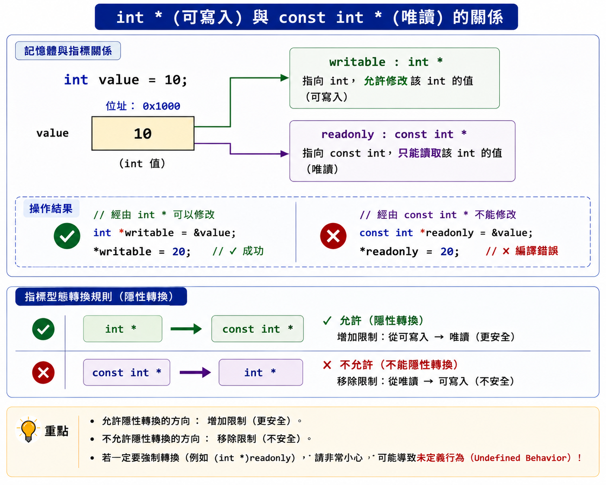
</p>

```c
int values[3] = {1, 2, 3};
int *writable = values;
const int *readonly = writable;
```

合法。

可以：

```c
*writable = 10;
```

不能：

```c
/* *readonly = 10; */
```

---

### 12. `const` 限制的是透過哪一條路修改

原物件：

```c
int values[3];
```

本身不是 `const`。

因此仍可透過 `writable` 修改。

只是 `readonly` 這個存取介面不允許修改。

---

### 13. 不能安全地反向移除 `const`

```c
const int *readonly = values;

/* int *writable = readonly; */
```

這會移除唯讀限制，嚴格編譯器應提供診斷。

即使使用：

```c
int *writable = (int *)readonly;
```

也不代表原本真正的 `const` 物件變成可修改。

---

# Part C：`void *` 通用物件指標

## Section XI. 一般物件指標轉成 `void *`

```c
int value = 3;
void *generic = &value;
```

合法。

`void *` 可以保存一般物件的位址，但不記錄具體所指型態。

---

## Section XII. `void *` 轉回原型態

<p align="center">
  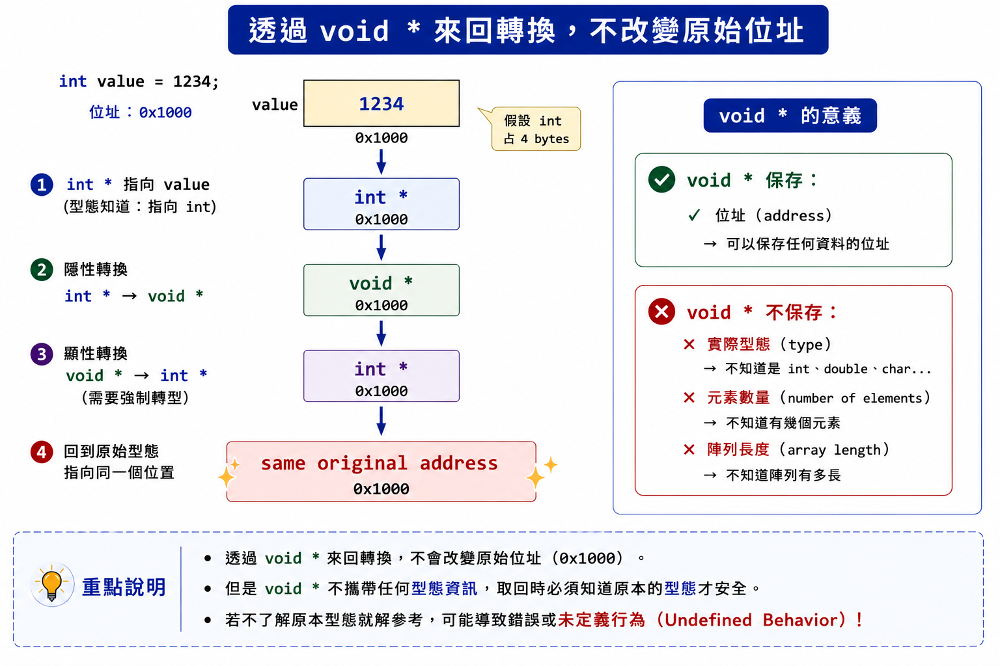
</p>

```c
int *pointer = generic;
```

在 C 中合法。

完整範例：

```c
#include <stdio.h>

int main(void) {
    int value = 3;

    void *generic = &value;
    int *pointer = generic;

    printf("%d\n", *pointer);

    return 0;
}
```

輸出：

```text
3
```

---

### 14. 轉過去再轉回來

來源總結：

```text
Type * → void * → Type *
```

轉回原本型態後，指標值應與原本相同。

---

### 15. `void *` 不能直接解參照

錯誤：

```c
void *generic = &value;

/* printf("%d", *generic); */
```

`void` 沒有大小，也沒有可以直接讀取的物件表示方式。

必須先轉回正確型態：

```c
int *pointer = generic;
```

再：

```c
*pointer
```

---

## Section XIII. `malloc()` 與 `void *`

```c
void *malloc(size_t size);
```

`malloc()` 不知道呼叫者要配置：

```text
int
double
Student
其他物件
```

因此回傳 `void *`。

在 C 中可以直接：

```c
int *numbers =
    malloc(10 * sizeof(numbers[0]));
```

不需要將回傳值強制轉成 `int *`。

---

### 16. `void *` 的限制

它只能表示：

```text
某個物件的位址
```

不會自動保存：

- 物件型態
- 元素數量
- 陣列長度
- 配置容量

程式必須在其他地方保留這些資訊。

---

# Part D：指標與整數之間的轉型

## Section XIV. 電腦如何表示位址？

來源將記憶體畫成連續格子，每一格都有唯一編號。

這只是概念模型。

C 規範不要求：

- 位址一定由 `0` 開始。
- 每個位址一定只以普通整數方式表示。
- 所有指標型態大小都與 `int` 相同。
- 不同系統使用相同位址格式。

---

## Section XV. 指標轉成整數

需要明確強制轉型：

```c
int value = 3;
int *pointer = &value;

/* 只作概念示例，不建議使用普通 int 保存 */
int address = (int)(long)pointer;
```

上面不是可攜寫法，因此完整安全範例不採用它。

---

### 17. 來源規則

來源整理：

```text
Type * → 整數
```

通常需要強制轉型。

若目標整數型態足以保存轉換結果，結果由實作定義。

若整數型態不足以表示結果，程式不能依賴轉換結果。

---

### 18. 為什麼普通 `int` 可能不夠？

例如某個環境：

```text
sizeof(int)      = 4
sizeof(void *)   = 8
```

四位元組整數無法保證保存八位元組指標的全部資訊。

因此不應假設：

```c
int address = (int)pointer;
```

可以完整保存位址。

---

## Section XVI. 整數轉成指標

來源示例：

```c
int *pointer = (int *)123;
```

轉型本身可能通過編譯，但結果由實作定義。

不能因為取得一個非 `NULL` 指標值，就直接：

```c
/* *pointer = 456; */
```

任意整數不一定對應程式可以合法存取的物件。

---

### 19. 不要將地址編號想成可自由使用的陣列索引

即使概念圖將記憶體畫成：

```text
0 1 2 3 4 ...
```

程式也不能任意選一個數字並宣稱它是可讀寫位址。

作業系統、硬體、對齊、物件生命週期及存取權限都會限制可用位址。

---

## Section XVII. 教材補充：`uintptr_t` 與 `intptr_t`

<p align="center">
  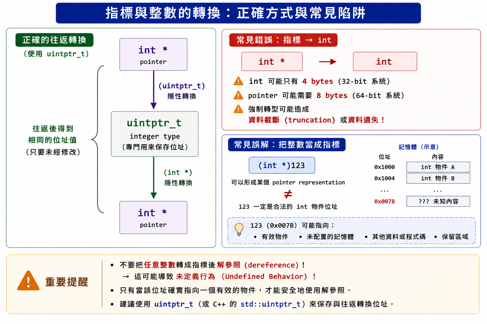
</p>

標頭：

```c
#include <stdint.h>
```

某些 C 實作提供：

```c
uintptr_t
intptr_t
```

它們是能保存 `void *` 轉換結果的無號與有號整數型態。

---

### 20. 指標表示值往返示範

```c
#include <inttypes.h>
#include <stdint.h>
#include <stdio.h>

int main(void) {
    int value = 3;
    int *original = &value;

    uintptr_t representation =
        (uintptr_t)original;

    int *restored =
        (int *)representation;

    printf(
        "same pointer: %s\n",
        restored == original ? "yes" : "no"
    );
    printf(
        "representation: %" PRIuPTR "\n",
        representation
    );

    return 0;
}
```

> `uintptr_t` 是可選型態。若某個 C 實作沒有提供，就不能使用這個方法。

---

### 21. 整數形式主要適合什麼？

常見用途包括：

- 記錄或輸出低階位址表示。
- 與硬體或作業系統介面交換位址資料。
- 進行明確平台相關的底層程式設計。

不應隨意修改整數值後再轉回並解參照。

---

# Part E：指標與指標間的強制轉型

## Section XVIII. 基本語法

```c
TypeA *first;
TypeB *second;

second = (TypeB *)first;
```

強制轉型讓編譯器將 `first` 的位址值視為 `TypeB *`。

---

### 22. 強制轉型不會做什麼？

<p align="center">
  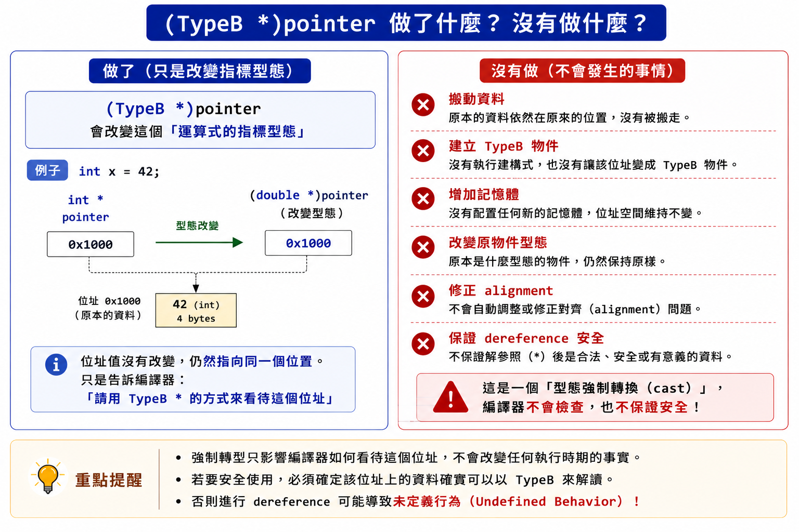
</p>

它不會：

- 搬動原物件。
- 建立新的 `TypeB` 物件。
- 改變原物件內容。
- 增加儲存空間。
- 修正位址對齊。
- 保證解參照安全。

它只改變這個運算式的指標型態。

---

## Section XIX. 記憶體對齊

<p align="center">
  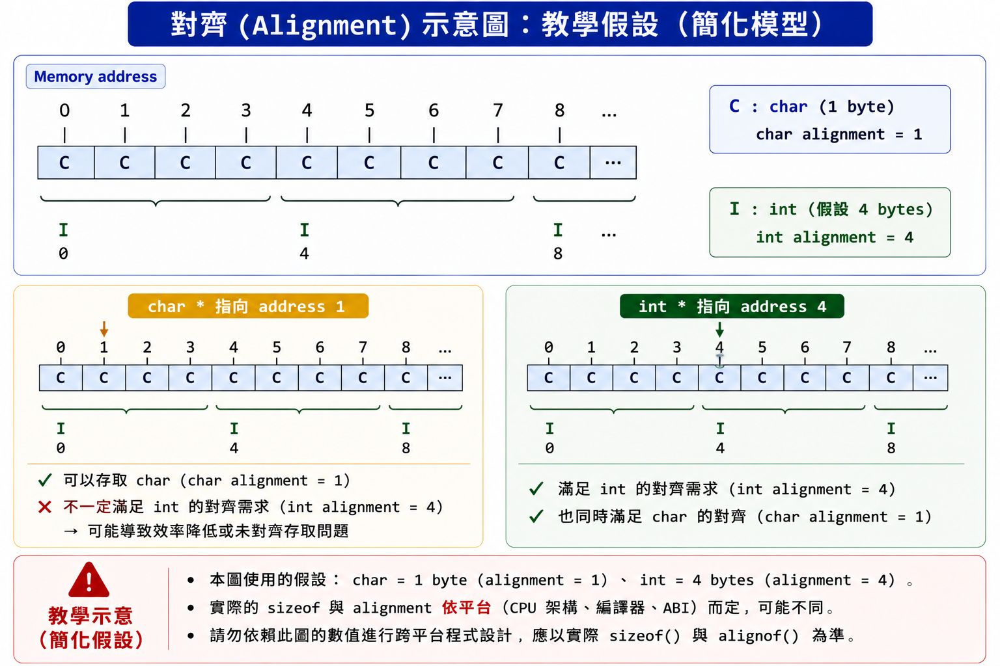
</p>

### 23. 什麼是對齊？

某些型態要求物件起始位址符合特定倍數。

來源以簡化例子假設：

```text
char 對齊要求 = 1
int  對齊要求 = 4
```

則 `int` 可能只能從：

```text
0、4、8、12……
```

這些位置開始存放。

---

### 24. 為什麼需要對齊？

來源指出，對齊限制通常與硬體一次存取多個位元組的效率有關。

某些硬體：

- 對齊存取較快。
- 未對齊存取較慢。
- 或完全不允許未對齊存取。

---

### 25. 型態大小與對齊不是同一件事

來源的圖以：

```text
int 大小假設為 4
int 對齊假設為 4
```

說明。

但一般而言：

```text
sizeof(Type)
```

與：

```text
_Alignof(Type)
```

是兩個不同性質。

它們都由實作決定。

---

## Section XX. 觀察實際環境的大小與對齊

```c
#include <stdio.h>

int main(void) {
    printf(
        "sizeof(char) = %zu\n",
        sizeof(char)
    );
    printf(
        "_Alignof(char) = %zu\n",
        _Alignof(char)
    );
    printf(
        "sizeof(int) = %zu\n",
        sizeof(int)
    );
    printf(
        "_Alignof(int) = %zu\n",
        _Alignof(int)
    );
    printf(
        "sizeof(double) = %zu\n",
        sizeof(double)
    );
    printf(
        "_Alignof(double) = %zu\n",
        _Alignof(double)
    );

    return 0;
}
```

不要硬背所有系統都與來源假設相同。

---

## Section XXI. 哪個方向的對齊比較安全？

仍使用來源假設：

```text
char 對齊 = 1
int 對齊  = 4
```

### 26. `int *` 轉成 `char *`

若某位址已符合 `int` 對齊，它通常也符合較寬鬆的 `char` 對齊。

因此從對齊角度看：

```text
int * → char *
```

較不容易因對齊失敗。

---

### 27. `char *` 轉成 `int *`

一個合法的 `char` 位址可能是：

```text
1、2、3、5……
```

這些位置不一定符合 `int` 對齊。

因此：

```text
char * → int *
```

可能產生對齊不足的指標。

---

### 28. 來源的往返規則

來源總結：

若：

```text
TypeB 的對齊要求不比 TypeA 嚴格
```

則：

```text
TypeA * → TypeB * → TypeA *
```

轉回後應恢復原指標值。

這只保證指標值往返條件，不代表中間可以安全地以 `TypeB *` 解參照。

---

## Section XXII. 「可以轉回」不等於「可以讀成另一型態」

<p align="center">
  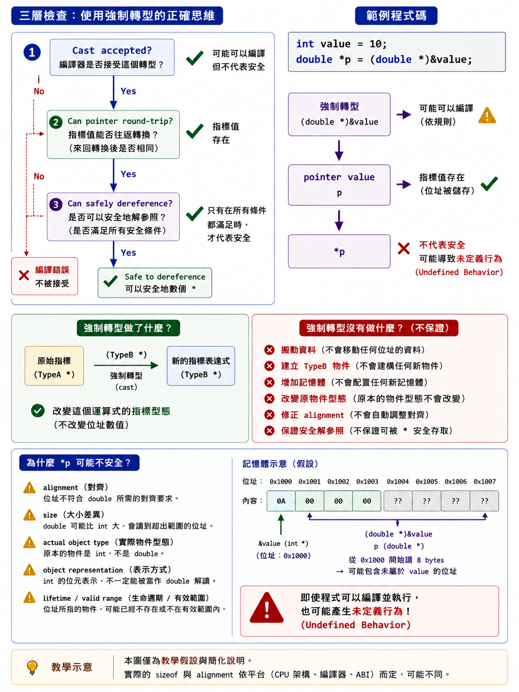
</p>

```c
int value = 10;

double *as_double =
    (double *)&value;
```

強制轉型可能通過編譯。

但不能因此安全寫：

```c
/* printf("%f\n", *as_double); */
```

可能問題包括：

- `double` 對齊要求更嚴格。
- `double` 大小可能大於 `int`。
- 原位置實際存在的是 `int` 物件。
- 讀取範圍可能超出原物件。
- 物件表示方式不同。

---

### 29. 安全往返而不解參照

```c
#include <stdio.h>

int main(void) {
    int value = 10;
    int *original = &value;

    void *generic = original;
    int *restored = generic;

    printf(
        "same pointer: %s\n",
        restored == original ? "yes" : "no"
    );
    printf("%d\n", *restored);

    return 0;
}
```

這是來源明確支持的：

```text
Type * → void * → Type *
```

往返方式。

---

# Part F：字元指標的特殊用途

## Section XXIII. 使用 `unsigned char *` 觀察物件表示

<p align="center">
  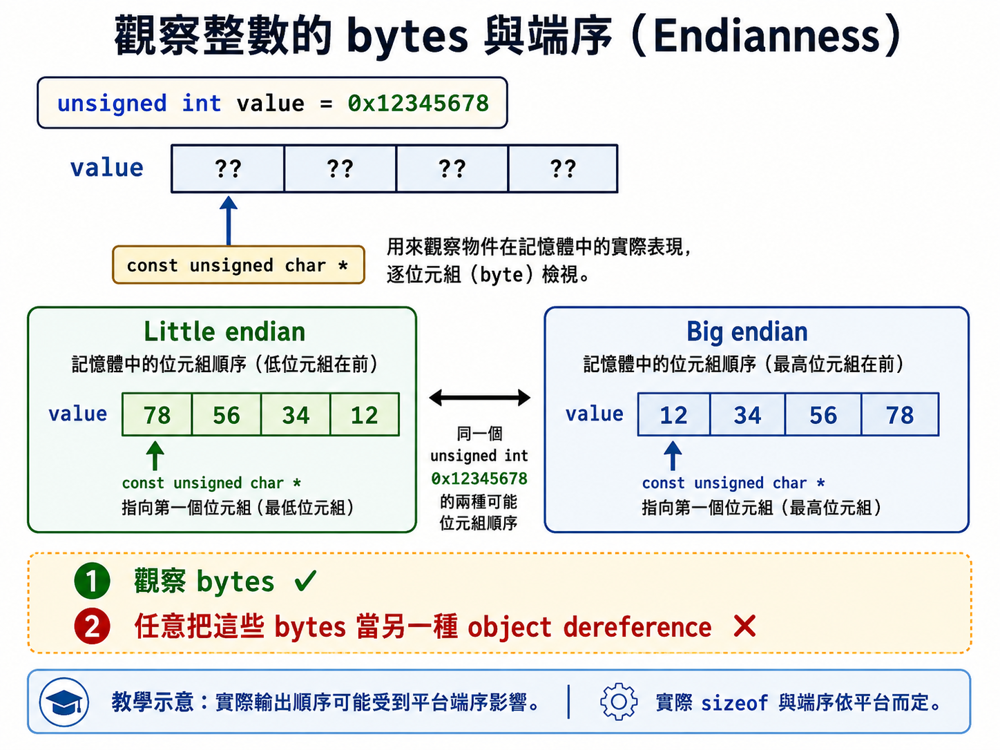
</p>

教材補充：

C 允許透過字元型態指標觀察物件的各個位元組。

```c
#include <stdio.h>

int main(void) {
    unsigned int value = 0x12345678U;
    const unsigned char *bytes =
        (const unsigned char *)&value;

    for (size_t i = 0; i < sizeof(value); i++) {
        printf("%02X ", bytes[i]);
    }

    printf("\n");

    return 0;
}
```

輸出順序可能因平台端序不同而不同。

---

### 30. 這不表示可以任意反向改型態

能使用 `unsigned char *` 觀察物件表示，不表示任意字元位置都能轉成其他型態指標後解參照。

仍然要考慮：

- 對齊
- 儲存空間大小
- 物件生命週期
- 實際物件型態

---

## Section XXIV. 需要複製位元組時使用 `memcpy()`

```c
#include <stdio.h>
#include <string.h>

int main(void) {
    unsigned int source = 0x12345678U;
    unsigned int destination = 0;

    memcpy(
        &destination,
        &source,
        sizeof(destination)
    );

    printf("%u\n", destination);

    return 0;
}
```

`memcpy()` 複製物件表示，不需要將來源指標假裝成另一種不相容物件指標並解參照。

---

# Part G：實用判斷流程

## Section XXV. 遇到指標轉型時先問什麼？

### 31. 第一問：真的需要轉型嗎？

若只是將陣列傳入函式，通常使用：

```c
const int *values,
size_t length
```

比使用不相容指標轉型更清楚。

---

### 32. 第二問：是否只是增加 `const`？

```c
int * → const int *
```

通常可以直接隱性轉型，不需要強制轉型。

---

### 33. 第三問：是否使用 `void *` 保存通用物件位址？

```c
Type * → void * → Type *
```

可以，但必須記住正確原型態。

---

### 34. 第四問：是否正把指標改成整數？

確認：

- 是否真的需要整數表示。
- 是否有 `uintptr_t`。
- 程式是否明確依賴特定平台。

---

### 35. 第五問：是否要以另一物件型態解參照？

這是風險最高的情況。

必須另外確認：

- 位址符合對齊要求。
- 空間足以容納目標型態。
- 該位置確實存在適合存取的物件。
- 存取沒有超出物件生命週期。

只加入強制轉型不能完成這些保證。

---

# Part H：快速概念檢查

## Section XXVI. 選擇題與簡答

### Q1. 為什麼 `int (*)[3]` 不能直接接收 `int (*)[5]`？

<details>
<summary>查看答案</summary>

因為 `int[3]` 與 `int[5]` 是不同型態，陣列長度是型態的一部分。

</details>

---

### Q2. `int (*)[]` 可以使用 `sizeof` 計算完整陣列大小嗎？

<details>
<summary>查看答案</summary>

不可以。它指向不完整陣列型態，元素數量未知。

</details>

---

### Q3. `int **` 與 `int (*)[5]` 相同嗎？

<details>
<summary>查看答案</summary>

不同。

- `int **` 指向一個 `int *`。
- `int (*)[5]` 指向完整五元素 `int` 陣列。

</details>

---

### Q4. `int values[3]` 在大多數運算式中會轉成什麼？

<details>
<summary>查看答案</summary>

```c
&values[0]
```

型態為 `int *`。

</details>

---

### Q5. `int *` 可以隱性轉成 `const int *` 嗎？

<details>
<summary>查看答案</summary>

可以，這是增加唯讀限制。

</details>

---

### Q6. `const int *` 可以安全地隱性轉成 `int *` 嗎？

<details>
<summary>查看答案</summary>

不可以，這會移除唯讀限制。

</details>

---

### Q7. `void *` 可以直接解參照嗎？

<details>
<summary>查看答案</summary>

不可以，因為 `void` 沒有可直接存取的物件大小與型態。

</details>

---

### Q8. `Type *` 轉成 `void *` 再轉回同一個 `Type *` 會怎樣？

<details>
<summary>查看答案</summary>

應得到與原本相同的指標值。

</details>

---

### Q9. 普通 `int` 一定能保存指標嗎？

<details>
<summary>查看答案</summary>

不一定。`int` 可能比指標窄。

</details>

---

### Q10. 將任意整數轉成指標後可以直接解參照嗎？

<details>
<summary>查看答案</summary>

不可以。該整數不一定表示可合法存取的物件位址。

</details>

---

### Q11. 指標強制轉型會改變原物件型態嗎？

<details>
<summary>查看答案</summary>

不會，只改變指標運算式的型態。

</details>

---

### Q12. 指標強制轉型會自動修正對齊嗎？

<details>
<summary>查看答案</summary>

不會。

</details>

---

### Q13. 假設 `char` 對齊為 1、`int` 對齊為 4，合法 `char` 位址一定可存放 `int` 嗎？

<details>
<summary>查看答案</summary>

不一定。它可能不是四的倍數。

</details>

---

### Q14. 合法 `int` 位址通常也符合 `char` 對齊嗎？

<details>
<summary>查看答案</summary>

在來源假設中是，因為 `char` 的對齊要求較寬鬆。

</details>

---

### Q15. `TypeA *` 轉成 `TypeB *` 再轉回的條件是什麼？

<details>
<summary>查看答案</summary>

來源指出，若 `TypeB` 的對齊要求不比 `TypeA` 嚴格，轉回原型態應恢復原指標值。

</details>

---

### Q16. 能安全轉回是否代表能安全解參照中間的 `TypeB *`？

<details>
<summary>查看答案</summary>

不代表。解參照還要考慮實際物件型態、大小、對齊及生命週期。

</details>

---

### Q17. 觀察物件原始位元組可使用哪種指標？

<details>
<summary>查看答案</summary>

```c
const unsigned char *
```

</details>

---

### Q18. 為什麼 `memcpy()` 通常比不相容指標解參照更適合複製位元組？

<details>
<summary>查看答案</summary>

`memcpy()` 明確複製物件表示，不需要假裝來源位置已經存在另一型態物件。

</details>

---

# Part I：程式閱讀練習

## Section XXVII. 判斷型態與結果

### 題目 1

```c
int values[5];
int *pointer = values;
```

右邊發生什麼轉型？

<details>
<summary>查看答案</summary>

`values` 從 `int[5]` 轉成指向第一個元素的 `int *`。

</details>

---

### 題目 2

```c
int value = 10;
int *first = &value;
const int *second = first;
```

可以透過 `second` 修改 `value` 嗎？

<details>
<summary>查看答案</summary>

不可以透過 `second` 修改，但仍可透過 `first` 修改。

</details>

---

### 題目 3

```c
int value = 10;
void *generic = &value;
int *pointer = generic;
```

`pointer` 指向哪裡？

<details>
<summary>查看答案</summary>

仍指向 `value`。

</details>

---

### 題目 4

```c
int value = 10;
double *pointer = (double *)&value;
```

這一行是否會建立新的 `double`？

<details>
<summary>查看答案</summary>

不會。它只將同一位址值視為 `double *`。

</details>

---

### 題目 5

```c
int *pointer = (int *)123;
```

可以直接讀取 `*pointer` 嗎？

<details>
<summary>查看答案</summary>

不可以。轉換結果由實作定義，`123` 不一定是可存取的 `int` 物件位址。

</details>

---

### 題目 6

```c
int value = 10;
int *original = &value;
void *generic = original;
int *restored = generic;
```

`restored == original` 應為何？

<details>
<summary>查看答案</summary>

應為真。

</details>

---

### 題目 7

```c
char buffer[16];
int *pointer = (int *)(buffer + 1);
```

主要風險是什麼？

<details>
<summary>查看答案</summary>

`buffer + 1` 不一定符合 `int` 的對齊要求，而且該位置也不一定存在可作為 `int` 存取的物件。

</details>

---

### 題目 8

```c
int value = 10;
const unsigned char *bytes =
    (const unsigned char *)&value;
```

可以讀取 `bytes[i]` 嗎？

<details>
<summary>查看答案</summary>

在 `i < sizeof(value)` 的範圍內，可以用來觀察 `value` 的物件表示。

</details>

---

### 題目 9

```c
const int value = 10;
const int *readonly = &value;
int *writable = (int *)readonly;
```

強制轉型後可以安全寫入 `*writable` 嗎？

<details>
<summary>查看答案</summary>

不可以。強制轉型沒有讓原本的 `const int` 變成可修改物件。

</details>

---

### 題目 10

```c
int values[3];
int **pointer = (int **)&values;
```

強制轉型是否會建立三個列指標？

<details>
<summary>查看答案</summary>

不會。記憶體中仍只有三個 `int`，沒有 `int *` 物件陣列。

</details>

---

# Part J：實作練習

## Section XXVIII. 實作檢測題

### TODO 1：列出運算式型態

對以下運算式寫出型態：

```c
values
&values[0]
&values
pointer
&pointer
```

其中：

```c
int values[4];
int *pointer = values;
```

---

### TODO 2：固定陣列與一般指標介面

分別撰寫：

```c
void print_four(
    const int (*values)[4]
);
```

與：

```c
void print_values(
    const int *values,
    size_t length
);
```

比較兩者優缺點。

---

### TODO 3：增加 `const`

建立可修改整數陣列，將 `int *` 指派給 `const int *`，測試哪些操作可編譯。

---

### TODO 4：`void *` 往返

將 `double *` 轉成 `void *`，再轉回 `double *`，確認：

```c
restored == original
```

---

### TODO 5：通用交換介面分析

研究標準函式：

```c
void *bsearch(...);
void qsort(...);
```

只分析它們為什麼需要 `void *`；不要在本題實作函式指標。

---

### TODO 6：大小與對齊

輸出以下型態的 `sizeof` 與 `_Alignof`：

```text
char
short
int
long
double
void *
```

整理成表格。

---

### TODO 7：指標與整數表示

在有 `uintptr_t` 的環境中，將指標轉成 `uintptr_t` 再轉回，確認是否相等。

---

### TODO 8：禁止任意解參照

建立一段只示範：

```c
(int *)123
```

的程式，但不得解參照；在註解中說明原因。

---

### TODO 9：對齊檢查

使用：

```c
uintptr_t address =
    (uintptr_t)pointer;
```

檢查位址是否為 `_Alignof(int)` 的倍數。

這只是低階觀察，不代表物件型態一定正確。

---

### TODO 10：字元檢視

使用 `const unsigned char *` 輸出：

```c
unsigned int value
```

的每個位元組。

---

### TODO 11：端序觀察

將 `value` 設為：

```c
0x01020304U
```

觀察第一個位元組，描述目前環境的位元組順序。

---

### TODO 12：安全複製

使用 `memcpy()` 將一個 `double` 的物件表示複製到 `unsigned char bytes[sizeof(double)]`。

---

### TODO 13：找出不相容指標

分析下列指派是否可隱性轉型：

```c
int * → double *
int * → const int *
const int * → int *
int * → void *
void * → int *
int (*)[3] → int **
```

---

### TODO 14：強制轉型檢查表

為每個強制轉型回答：

```text
位址有沒有改？
物件有沒有搬動？
實際物件型態有沒有改？
對齊是否保證？
可以安全解參照嗎？
```

---

### TODO 15：重構錯誤介面

將一個使用：

```c
void print(int **values);
```

錯誤接收普通一維陣列的程式，改成：

```c
void print(
    const int *values,
    size_t length
);
```

---

# Part K：課後小練習

## Section XXIX. 延伸練習

### 練習 1：通用資料保存

設計一個結構：

```c
typedef struct {
    void *data;
    size_t size;
} RawObject;
```

只保存位址與大小，不負責判斷實際型態。

說明使用者還必須保存哪些資訊。

---

### 練習 2：唯讀介面

將一組只讀取陣列的函式參數全部改成：

```c
const Type *
```

確認呼叫端的可修改陣列仍能傳入。

---

### 練習 3：位元組雜湊

使用 `const unsigned char *` 逐位元組計算一個簡單總和。

說明此結果可能受物件表示與端序影響。

---

### 練習 4：對齊實驗

比較：

```c
_Alignof(char)
_Alignof(int)
_Alignof(double)
_Alignof(long double)
```

不要假設結果與其他電腦相同。

---

### 練習 5：診斷不安全程式

為一段含有以下問題的程式加註解：

```text
移除 const
把陣列指標當成 int **
任意整數轉指標並解參照
未對齊的 char * 轉 int *
```

---

# Part L：常見錯誤提醒

## Section XXX. 常見錯誤

### 錯誤 1：把所有指標都當成相同型態

不同指標型態具有不同的所指物件資訊與指標算術單位。

---

### 錯誤 2：用 `int **` 取代任何陣列指標

`int **` 需要真正的 `int *` 物件層。

---

### 錯誤 3：以為強制轉型會改變記憶體配置

轉型不會建立缺少的指標陣列或重新排列資料。

---

### 錯誤 4：以為未知長度陣列指標可以使用 `sizeof`

不完整陣列型態沒有可計算的完整大小。

---

### 錯誤 5：不必要地強制轉型陣列名稱

一般一維陣列傳入元素指標函式不需要轉型。

---

### 錯誤 6：移除 `const` 後修改真正的 `const` 物件

屬於未定義行為。

---

### 錯誤 7：直接解參照 `void *`

必須先轉回正確物件指標型態。

---

### 錯誤 8：使用普通 `int` 保存指標

`int` 可能不足以保存完整指標表示。

---

### 錯誤 9：把指標的整數表示當成可任意運算的索引

修改後的數值不一定仍表示合法物件位址。

---

### 錯誤 10：將任意整數轉成指標後解參照

可能存取不存在、無權限或未對齊的位置。

---

### 錯誤 11：以為強制轉成 `double *` 就得到 `double`

原位置可能只有一個 `int` 物件。

---

### 錯誤 12：忽略目標型態對齊

位址可能不符合目標型態要求。

---

### 錯誤 13：只確認對齊，就認為解參照一定安全

對齊只是條件之一，還要考慮物件型態、大小與生命週期。

---

### 錯誤 14：假設 `sizeof(int) == 4`

來源圖只是教學假設，實際由環境決定。

---

### 錯誤 15：假設所有指標大小相同

許多常見平台如此，但 C 語言不能讓程式任意依賴此假設。

---

### 錯誤 16：假設轉成另一指標再轉回永遠相同

來源的不同物件指標往返規則與對齊條件有關；最明確保證的是物件指標與 `void *` 的往返。

---

### 錯誤 17：使用不相容指標直接讀取不同物件表示

可能產生未定義行為。

---

### 錯誤 18：需要複製資料時卻使用指標轉型

應考慮正常賦值、逐元素處理或 `memcpy()`。

---

# Part M：Mermaid 流程圖

## Section XXXI. 轉型判斷流程

### 1. 指標轉型決策

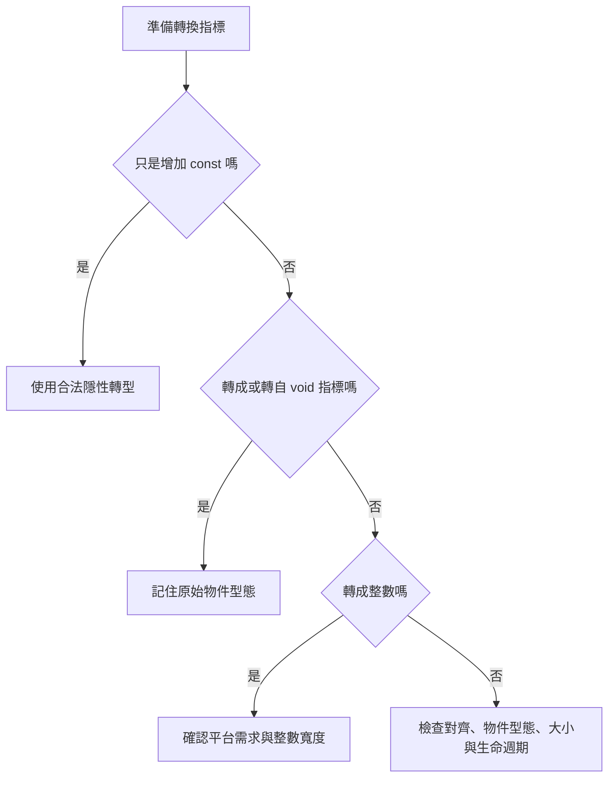

---

### 2. 陣列指標與雙重指標

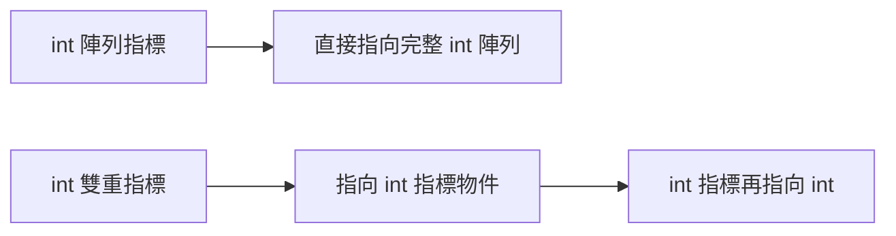

---

### 3. `void *` 往返

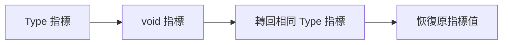

---

### 4. 指標與整數

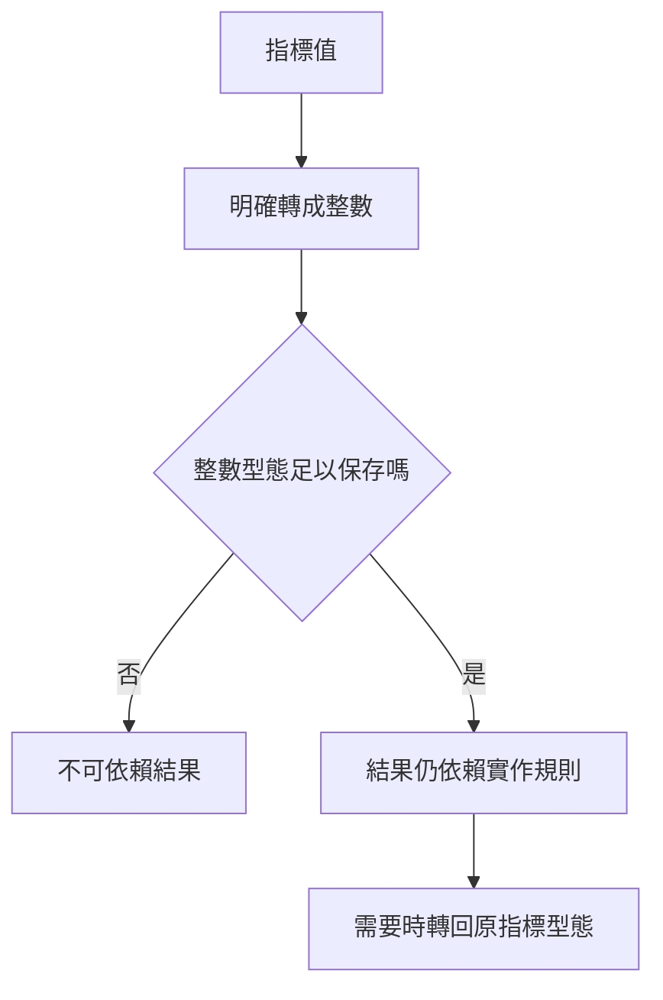

---

### 5. 強制轉型與實際物件

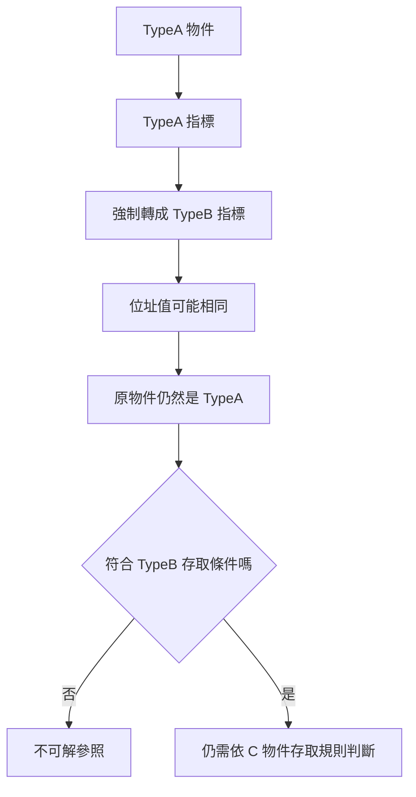

---

### 6. 記憶體對齊

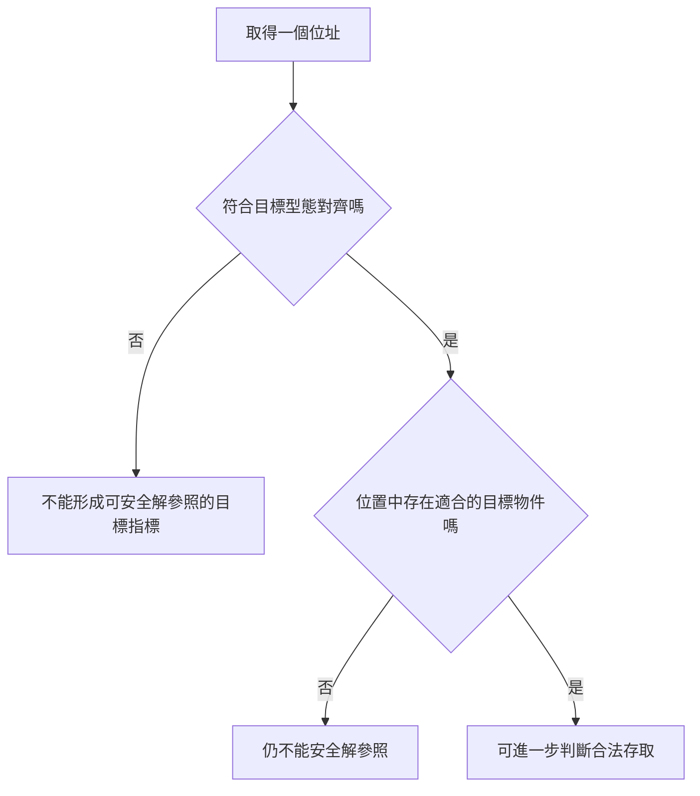

---

# 本章完成標準

完成本章後，你應該能做到：

1. 說明陣列長度是陣列型態的一部分。
2. 分辨 `int (*)[3]` 與 `int (*)[5]`。
3. 說明不完整陣列型態不能使用 `sizeof` 求完整大小。
4. 分辨陣列指標與雙重指標。
5. 說明強制轉型不會建立缺少的指標層。
6. 找出大多數不相容指標指派。
7. 說明陣列名稱轉成第一個元素指標。
8. 將 `Type *` 隱性轉成 `const Type *`。
9. 避免隱性移除 `const`。
10. 使用 `void *` 保存一般物件位址。
11. 將 `void *` 轉回正確原指標型態。
12. 說明 `Type * → void * → Type *` 的往返保證。
13. 避免直接解參照 `void *`。
14. 說明 `malloc()` 為何回傳 `void *`。
15. 說明 C 不規定位址必須如何編號。
16. 說明指標轉整數通常需要強制轉型。
17. 說明普通 `int` 不一定能保存指標。
18. 說明整數轉指標的結果由實作定義。
19. 避免解參照任意整數產生的指標。
20. 在可用環境中使用 `uintptr_t` 或 `intptr_t`。
21. 說明指標間強制轉型只改變運算式型態。
22. 說明強制轉型不會改變原物件型態。
23. 說明強制轉型不會修正對齊。
24. 解釋記憶體對齊的基本概念。
25. 使用 `_Alignof` 查詢實際對齊要求。
26. 不把來源假設的對齊數值當成所有平台固定答案。
27. 判斷較嚴格與較寬鬆的對齊方向。
28. 說明不同物件指標往返與對齊的關係。
29. 分辨能轉型、能轉回與能解參照。
30. 使用 `unsigned char *` 觀察物件表示。
31. 使用 `memcpy()` 安全複製物件位元組。
32. 找出移除 `const`、對齊不足及錯誤物件存取問題。
