# Lesson 04：Function Pointers 函式指標

> 這堂課的重點：理解函式也有自己的型態與名稱，但函式型態本身不能像一般物件型態一樣被複製。若要保存、選擇或傳遞某個函式，必須保存「指向該函式的指標」。接著會分析函式指示符、取址運算子 `&`、間接運算子 `*` 和函式呼叫運算子 `()` 之間的特殊關係，最後將 `add()`、`multiply()` 等函式傳入另一個函式。

> 本章依照 `31-01` 到 `31-04` 的投影片順序編排。投影片中的無參數函式使用 `void hello()`；本講義的完整 C17 程式改用 `void hello(void)`，明確表示不接收任何參數。

---

## Section I. 今天要做什麼？

1. 複習普通物件指標。
2. 使用 `int *` 保存整數物件的位址。
3. 使用 `*pointer` 間接修改原物件。
4. 複習函式定義與函式呼叫。
5. 宣告一個不接收參數且不回傳資料的函式。
6. 使用函式名稱搭配 `()` 呼叫函式。
7. 理解函式也有型態。
8. 將 `void hello(void)` 的型態讀成「不接收參數並回傳 `void` 的函式」。
9. 理解函式型態與函式指標型態不同。
10. 嘗試建立另一個函式並用既有函式初始化。
11. 找出「函式型態不能複製」的編譯問題。
12. 宣告函式指標 `void (*func)(void)`。
13. 使用 `&hello` 取得函式指標。
14. 使用函式指標保存函式位置。
15. 使用 `(*func)()` 呼叫函式。
16. 使用 `func()` 簡化函式指標呼叫。
17. 比較：
    ```c
    void hello(void);
    void (*func)(void);
    ```
18. 理解括號在函式指標宣告中的重要性。
19. 比較：
    ```c
    int *function(int, int);
    int (*function)(int, int);
    ```
20. 認識「函式指示符」function designator。
21. 理解函式名稱可以代表某個特定函式。
22. 比較函式與物件的相似處。
23. 理解物件名稱可以用來存取特定物件。
24. 理解函式名稱／指示符可以用來代表特定函式。
25. 理解物件和函式都可以使用 `&` 取得指標。
26. 理解物件指標與函式指標都可以保存相對應的位置。
27. 理解普通物件指標使用 `*` 取得所指物件。
28. 理解函式指標使用 `*` 取得所指函式的函式指示符。
29. 比較 `printf`、`&printf` 與 `*printf`。
30. 理解函式指示符在大多數運算式中會轉成函式指標。
31. 理解 `hello` 可以初始化相容的函式指標。
32. 理解 `&hello` 也可以初始化相容的函式指標。
33. 理解函式指標本身也能直接搭配 `()` 呼叫。
34. 分析：
    ```c
    printf(...);
    (&printf)(...);
    (*printf)(...);
    ```
35. 理解為什麼三種寫法都能呼叫同一函式。
36. 化簡 `*printf` 的型態轉換過程。
37. 化簡函式指標前方的多個 `*`。
38. 理解多個 `*` 的寫法雖可成立，但可讀性極差。
39. 使用最簡單的 `func()` 寫法呼叫函式指標。
40. 認識具有參數與回傳值的函式型態。
41. 判讀 `int add(int, int)`。
42. 宣告指向 `int (int, int)` 型態函式的指標。
43. 使用函式指標呼叫 `add()`。
44. 讓同一個函式指標改指向 `multiply()`。
45. 理解只有相容型態的函式才能安全共用同一函式指標。
46. 將計算過程中的 `result + i` 改成 `add(result, i)`。
47. 將固定呼叫 `add()` 改成呼叫函式指標參數 `op()`。
48. 宣告：
    ```c
    int calculate(int (*op)(int, int));
    ```
49. 將 `add` 傳入 `calculate()`。
50. 將 `multiply` 傳入 `calculate()`。
51. 使用同一套迴圈執行加總或連乘。
52. 理解「在函式間傳遞函式」實際上是傳遞函式指標值。
53. 理解函式指標參數仍然是以值傳遞。
54. 理解回呼函式 callback 的基本概念。
55. 判斷函式參數型態與回傳型態是否相容。
56. 找出不相容函式指標指派的危險。
57. 避免以強制轉型掩蓋函式型態不相容。
58. 理解函式指標不能進行一般指標算術。
59. 使用 `NULL` 表示目前沒有可呼叫函式。
60. 呼叫函式指標前檢查是否為 `NULL`。
61. 比較函式指標是否指向同一個函式。
62. 使用 `typedef` 簡化函式指標型態。
63. 建立函式指標陣列。
64. 使用函式指標陣列實作簡易操作選單。
65. 區分來源內容與教材補充內容。
66. 使用概念檢查、程式閱讀與實作題整合本章。

---

## Section II. 今天的學習方式

1. 從變數名稱開始向外閱讀函式指標宣告。
2. 遇到：
   ```c
   int (*op)(int, int);
   ```
   先看到：
   ```text
   op 被括號包住並與 * 結合
   ```
3. 接著再看到：
   ```text
   op 指向一個接收兩個 int 的函式
   ```
4. 最後讀取最左側：
   ```text
   該函式回傳 int
   ```
5. 每次比較宣告時，分別記錄：
   - 變數本身是函式還是指標
   - 函式參數型態
   - 函式回傳型態
6. 分析 `hello`、`&hello`、`*hello` 時，逐步寫出：
   - 目前是函式指示符還是函式指標
   - 是否發生隱性轉型
7. 函式指標呼叫題先使用完整形式：
   ```c
   (*func)();
   ```
8. 理解後再簡化為：
   ```c
   func();
   ```
9. 傳遞函式題先畫出：
   ```text
   add 函式
       ↓ 轉成函式指標
   calculate 的 op 參數
       ↓
   op(result, i)
   ```
10. 不把「程式可以編譯」直接當成「函式型態一定相容」。
11. 來源投影片使用的特殊多重 `*` 寫法只用來理解規則，不作為正常程式風格。
12. 完整合法程式使用：
    ```text
    clang -std=c17 -Wall -Wextra -Werror
    ```
    檢查。

---

## Section III. 核心宣告對照

<p align="center">
  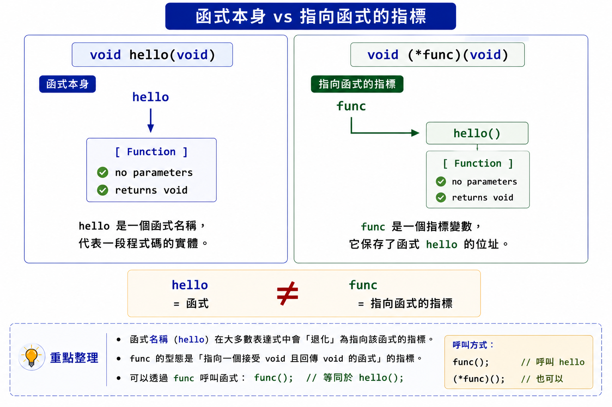
</p>

| 宣告 | 從名稱向外閱讀 | 意義 |
| --- | --- | --- |
| `int value` | `value` 是變數 | 保存 `int` |
| `int *pointer` | `pointer` 是指標 | 指向 `int` |
| `void hello(void)` | `hello` 是函式 | 不接收參數，回傳 `void` |
| `void (*func)(void)` | `func` 是指標 | 指向不接收參數且回傳 `void` 的函式 |
| `int add(int, int)` | `add` 是函式 | 接收兩個 `int`，回傳 `int` |
| `int (*op)(int, int)` | `op` 是指標 | 指向接收兩個 `int` 並回傳 `int` 的函式 |
| `int *make_value(void)` | `make_value` 是函式 | 不接收參數，回傳 `int *` |
| `int (*operations[3])(int, int)` | `operations` 是陣列 | 每個元素都是二元整數函式指標 |

---

# Part A：從普通指標到函式指標

## Section IV. 普通物件指標複習

```c
#include <stdio.h>

int main(void) {
    int a = 3;
    int *b = &a;

    *b = 5;

    printf("a = %d\n", a);

    return 0;
}
```

輸出：

```text
a = 5
```

推導：

```text
b
→ &a
→ *b 等價於 *&a
→ 取得 a 物件
```

---

## Section V. 一般函式定義與呼叫

```c
#include <stdio.h>

void hello(void) {
    printf("Hello world!\n");
}

int main(void) {
    hello();

    return 0;
}
```

`hello` 是函式名稱，也可稱為函式指示符。

函式型態：

```text
void (void)
```

表示：

```text
不接收參數
回傳 void
```

---

## Section VI. 函式宣告與定義

```c
void hello(void);
```

是函式宣告。

```c
void hello(void) {
    printf("Hello world!\n");
}
```

是函式定義。

宣告讓編譯器先知道：

- 函式名稱
- 參數型態
- 回傳型態

---

## Section VII. 函式型態不能像物件一樣複製

來源投影片嘗試：

```c
void hello(void);

/* 錯誤概念 */
void func(void) = hello;
```

問題：

```text
func 被宣告成另一個函式
不是一個可以保存函式位址的變數
```

函式型態不能透過賦值複製成另一個函式。

---

### 1. 普通物件型態可以建立變數

```c
int a = 3;
int b = a;
```

`b` 會取得 `a` 的值副本。

---

### 2. 函式型態不能建立可賦值的函式變數

不能將：

```c
hello
```

的函式內容複製成另一個名為 `func` 的函式物件。

若要保存「要呼叫哪一個函式」，必須保存函式指標。

---

# Part B：函式指標基本語法

## Section VIII. 宣告函式指標

```c
void (*func)(void);
```

由 `func` 向外閱讀：

```text
func
→ 是指標
→ 指向不接收參數
→ 並回傳 void 的函式
```

---

### 3. 為什麼需要括號？

<p align="center">
  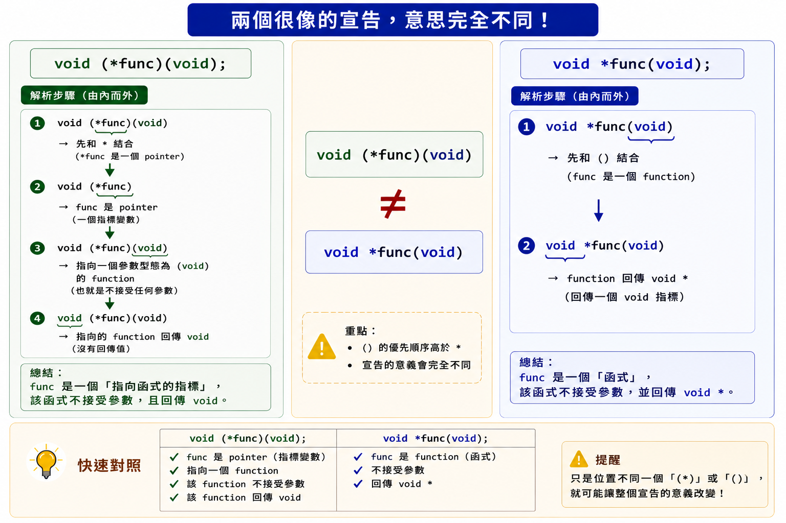
</p>

```c
void (*func)(void);
```

括號讓：

```c
*func
```

先結合，表示 `func` 是指標。

若寫成：

```c
void *func(void);
```

意思變成：

```text
func 是函式
→ 不接收參數
→ 回傳 void *
```

這不是函式指標。

---

## Section IX. 讓函式指標指向函式

<p align="center">
  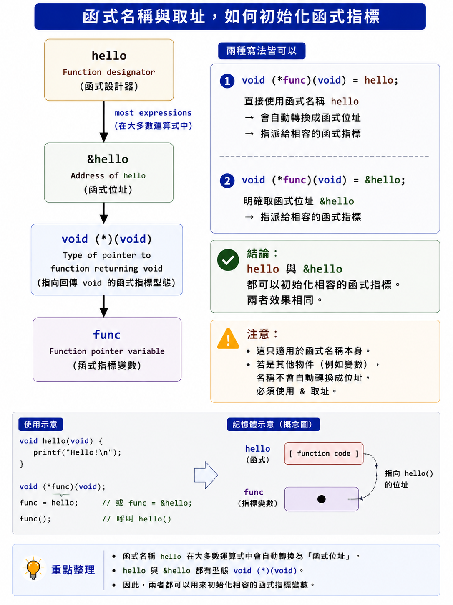
</p>

```c
void (*func)(void) = &hello;
```

- `&hello` 是指向 `hello` 的函式指標。
- `func` 的型態與 `&hello` 相容。

---

## Section X. 透過函式指標呼叫

完整形式：

```c
(*func)();
```

完整程式：

```c
#include <stdio.h>

void hello(void);

int main(void) {
    void (*func)(void) = &hello;

    (*func)();

    return 0;
}

void hello(void) {
    printf("Hello world!\n");
}
```

輸出：

```text
Hello world!
```

---

## Section XI. 簡化呼叫方式

<p align="center">
  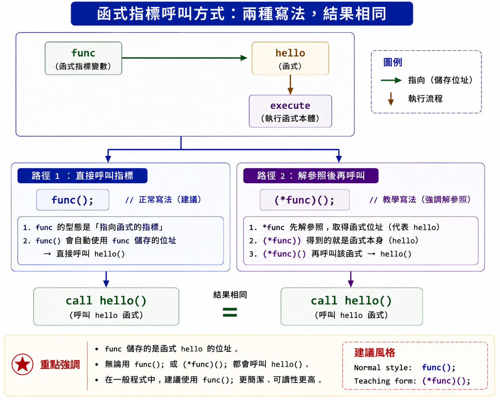
</p>

函式指標也可以直接寫：

```c
func();
```

完整程式：

```c
#include <stdio.h>

void hello(void);

int main(void) {
    void (*func)(void) = hello;

    func();

    return 0;
}

void hello(void) {
    printf("Hello world!\n");
}
```

這是正常程式較常使用的形式。

---

# Part C：函式與物件的相似與不同

## Section XII. 共用「名稱」的概念

普通變數名稱：

```c
int value = 3;
```

`value` 用來代表特定 `int` 物件。

函式名稱／函式指示符：

```c
void hello(void);
```

`hello` 用來代表特定函式。

---

## Section XIII. 都可以使用取址運算子

物件：

```c
&value
```

取得物件指標：

```text
int *
```

函式：

```c
&hello
```

取得函式指標：

```text
void (*)(void)
```

---

## Section XIV. 都能使用指標保存位置

```c
int *object_pointer = &value;
void (*function_pointer)(void) = &hello;
```

但兩者是不同種類的指標：

- 物件指標指向資料物件。
- 函式指標指向可執行函式。

不能假設它們可以任意互相轉換。

---

## Section XV. 都可以使用 `*` 間接運算

物件指標：

```c
*object_pointer
```

取得所指的物件。

函式指標：

```c
*function_pointer
```

取得所指函式的函式指示符。

函式指示符之後可搭配：

```c
()
```

執行呼叫。

---

# Part D：函式指示符的特殊性

## Section XVI. 什麼是函式指示符？

對已宣告的函式：

```c
void hello(void);
```

運算式：

```c
hello
```

代表該函式，稱為函式指示符。

在大多數運算式情境中，它會自動轉成：

```c
&hello
```

也就是函式指標。

---

## Section XVII. `hello` 與 `&hello`

下列兩種初始化都合法：

```c
void (*first)(void) = hello;
void (*second)(void) = &hello;
```

完整程式：

```c
#include <stdio.h>

void hello(void);

int main(void) {
    void (*first)(void) = hello;
    void (*second)(void) = &hello;

    first();
    second();

    return 0;
}

void hello(void) {
    printf("Hello world!\n");
}
```

輸出：

```text
Hello world!
Hello world!
```

---

## Section XVIII. 使用標準函式觀察規則

<p align="center">
  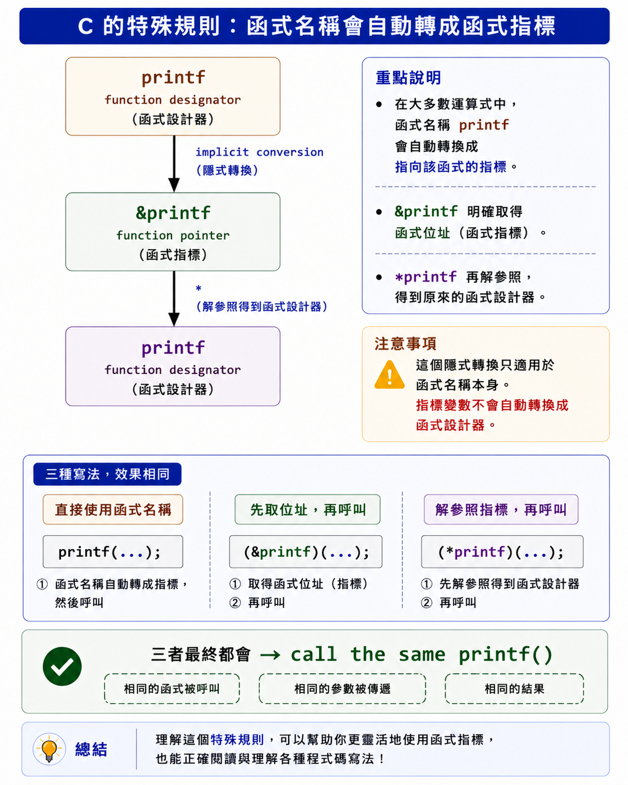
</p>

來源使用：

```c
printf("Hello world!\n");
(&printf)("Hello world!\n");
(*printf)("Hello world!\n");
```

完整程式：

```c
#include <stdio.h>

int main(void) {
    printf("Hello world!\n");
    (&printf)("Hello world!\n");
    (*printf)("Hello world!\n");

    return 0;
}
```

三行都呼叫 `printf()`。

---

### 4. `printf(...)`

`printf` 是函式指示符。

搭配函式呼叫運算子：

```c
()
```

完成呼叫。

---

### 5. `(&printf)(...)`

```c
&printf
```

取得指向 `printf` 的函式指標。

函式指標也能直接搭配：

```c
()
```

完成呼叫。

---

### 6. `(*printf)(...)`

推導：

```text
printf
→ 在 * 的運算元位置轉成 &printf
→ *(&printf)
→ 取得 printf 函式指示符
→ 搭配 () 呼叫
```

---

## Section XIX. 來源中的化簡關係

來源整理：

```text
*printf
→ *(&printf)
→ printf
→ 在需要指標的情境中又可轉成 &printf
```

因此以下形式可能仍可呼叫：

```c
(*func)();
(**func)();
(******func)();
```

但正常程式不應加入沒有意義的多重 `*`。

最清楚的寫法是：

```c
func();
```

或在教學中明確表示間接呼叫時：

```c
(*func)();
```

---

## Section XX. 教材補充：函式指示符轉換的例外

函式指示符在大多數情境中轉成函式指標，但對它直接使用：

```c
&
```

時，不需要先轉型，會直接取得函式位址。

函式不是可用 `sizeof` 測量的物件：

```c
/* sizeof(hello)  不合法 */
```

---

# Part E：具有參數與回傳值的函式指標

## Section XXI. 函式型態

```c
int add(int a, int b) {
    return a + b;
}
```

函式型態：

```text
int (int, int)
```

表示：

```text
接收兩個 int
回傳 int
```

---

## Section XXII. 對應的函式指標型態

<p align="center">
  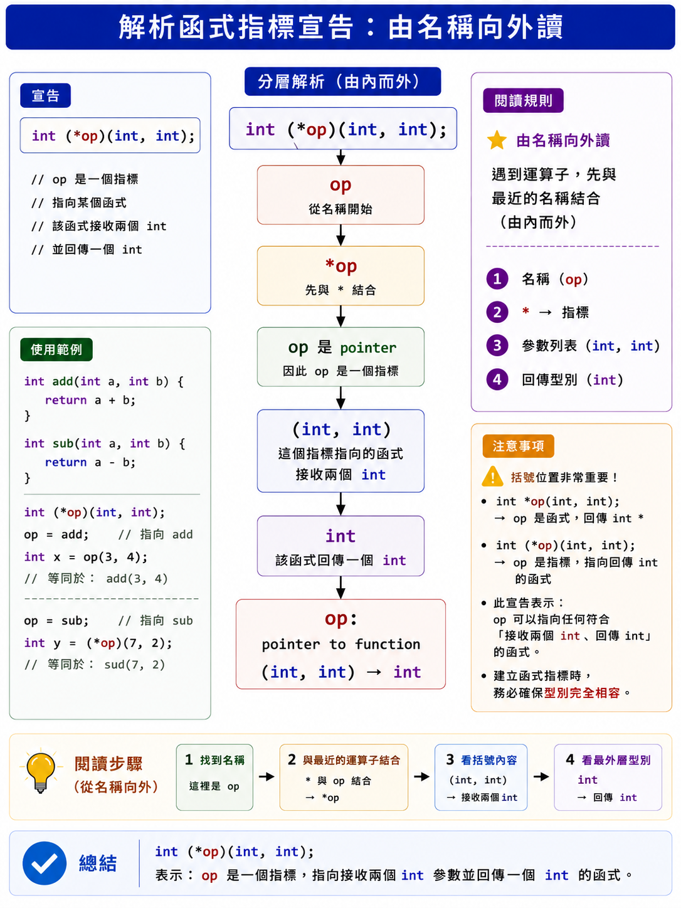
</p>

```c
int (*op)(int, int);
```

表示：

```text
op 是指標
→ 指向接收兩個 int
→ 並回傳 int 的函式
```

---

## Section XXIII. 指向 `add()`

```c
#include <stdio.h>

int add(int a, int b);

int main(void) {
    int (*op)(int, int) = add;
    int result = op(3, 5);

    printf("%d\n", result);

    return 0;
}

int add(int a, int b) {
    return a + b;
}
```

輸出：

```text
8
```

---

## Section XXIV. 改指向 `multiply()`

<p align="center">
  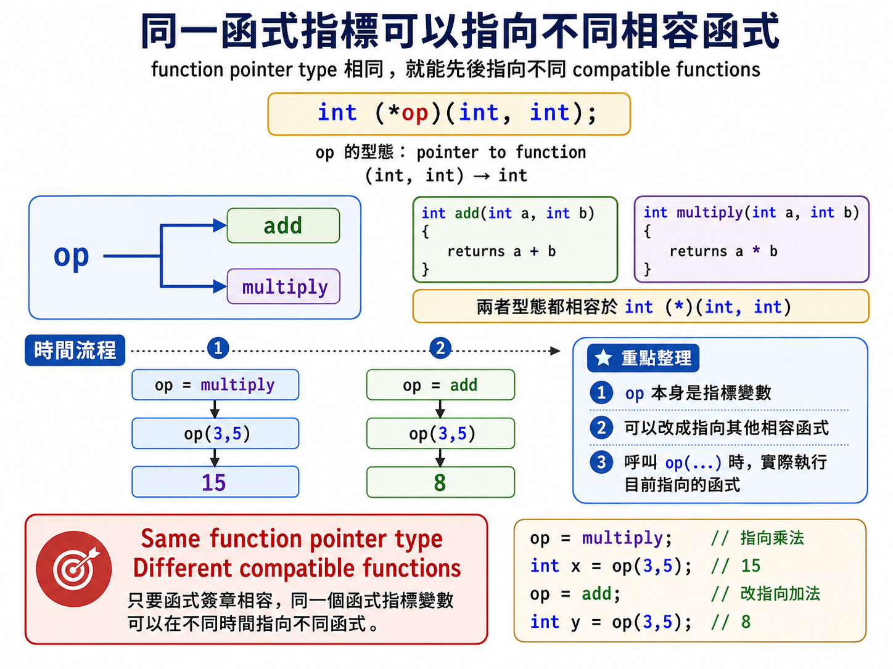
</p>

```c
#include <stdio.h>

int add(int a, int b);
int multiply(int a, int b);

int main(void) {
    int (*op)(int, int) = multiply;

    printf("%d\n", op(3, 5));

    op = add;

    printf("%d\n", op(3, 5));

    return 0;
}

int add(int a, int b) {
    return a + b;
}

int multiply(int a, int b) {
    return a * b;
}
```

輸出：

```text
15
8
```

同一個函式指標可以先後指向不同函式，只要函式型態相容。

---

# Part F：函式指標型態相容性

## Section XXV. 必須比較哪些部分？

<p align="center">
  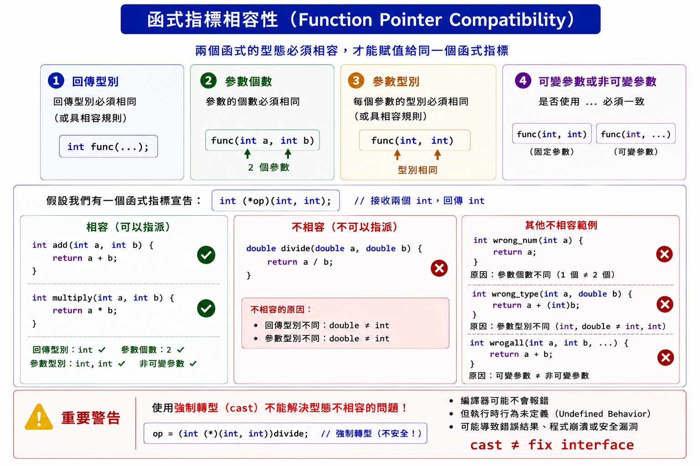
</p>

函式指標要安全指向某函式，至少需要正確匹配：

1. 回傳型態。
2. 參數數量。
3. 每個參數型態。
4. 是否使用可變參數。

---

### 7. 相容範例

```c
int add(int, int);
int multiply(int, int);

int (*op)(int, int);
```

`op` 可以指向 `add` 或 `multiply`。

---

### 8. 不相容範例

```c
double divide(double, double);
int (*op)(int, int);

/* op = divide; */
```

回傳型態與參數型態都不同。

---

### 9. 不要用強制轉型掩蓋問題

危險：

```c
op = (int (*)(int, int))divide;
```

強制轉型可能讓編譯器不再顯示原本的不相容診斷，但呼叫時仍會按照錯誤的參數與回傳規則執行，可能造成未定義行為。

---

## Section XXVI. 教材補充：無參數函式的正確宣告

在 C 中：

```c
void hello();
```

表示參數資訊未完整指定，不等同於明確表示「沒有參數」。

本講義使用：

```c
void hello(void);
```

明確表示不接收任何參數。

同理，函式指標寫成：

```c
void (*func)(void);
```

---

# Part G：在函式間傳遞函式

## Section XXVII. 原始固定計算方式

來源先計算：

```text
1 + 2 + 3 + 4 + 5
```

```c
int calculate(void) {
    int result = 1;

    for (int i = 2; i <= 5; i++) {
        result = result + i;
    }

    return result;
}
```

輸出：

```text
15
```

---

## Section XXVIII. 把加法抽成函式

```c
int add(int a, int b) {
    return a + b;
}
```

迴圈改成：

```c
result = add(result, i);
```

計算結果不變。

---

## Section XXIX. 將操作函式變成參數

函式宣告：

```c
int calculate(
    int (*op)(int, int)
);
```

函式定義：

```c
int calculate(
    int (*op)(int, int)
) {
    int result = 1;

    for (int i = 2; i <= 5; i++) {
        result = op(result, i);
    }

    return result;
}
```

---

## Section XXX. 傳入 `add()`

```c
calculate(add)
```

呼叫過程：

```text
add
→ 轉成指向 add 的函式指標
→ 複製到 calculate 的 op 參數
→ op(result, i)
→ 實際呼叫 add(result, i)
```

---

## Section XXXI. 傳入 `multiply()`

```c
calculate(multiply)
```

同一個迴圈改成執行：

```text
1 × 2 × 3 × 4 × 5
```

結果：

```text
120
```

---

## Section XXXII. 完整來源核心程式

```c
#include <stdio.h>

int calculate(int (*op)(int, int));
int add(int a, int b);
int multiply(int a, int b);

int main(void) {
    printf("%d\n", calculate(add));
    printf("%d\n", calculate(multiply));

    return 0;
}

int calculate(int (*op)(int, int)) {
    int result = 1;

    for (int i = 2; i <= 5; i++) {
        result = op(result, i);
    }

    return result;
}

int add(int a, int b) {
    return a + b;
}

int multiply(int a, int b) {
    return a * b;
}
```

輸出：

```text
15
120
```

---

## Section XXXIII. 這就是 callback

<p align="center">
  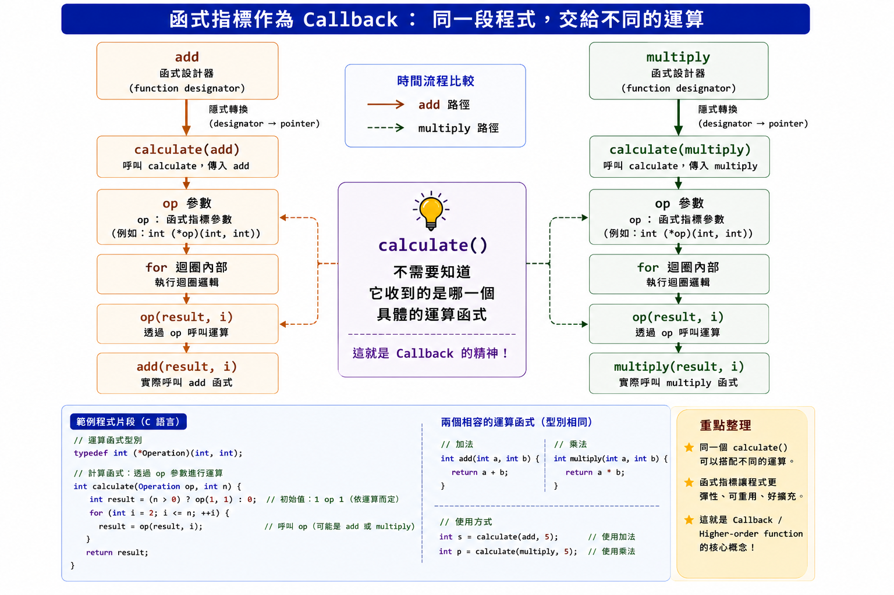
</p>

`calculate()` 不知道自己收到的一定是加法或乘法。

它只知道：

```text
op 必須指向接收兩個 int 並回傳 int 的函式
```

`calculate()` 在需要時呼叫 `op()`。

這種「將某個函式交給另一個函式，讓後者在適當時機呼叫」的設計通常稱為：

```text
callback
回呼函式
```

---

## Section XXXIV. 函式指標參數仍然是傳值

呼叫：

```c
calculate(add)
```

實際上將：

```text
指向 add 的函式指標值
```

複製到 `op`。

`op` 是函式內的參數副本，但它和呼叫端提供的指標值指向同一個函式。

---

# Part H：教材補充——簡化函式指標宣告

## Section XXXV. 使用 `typedef`

<p align="center">
  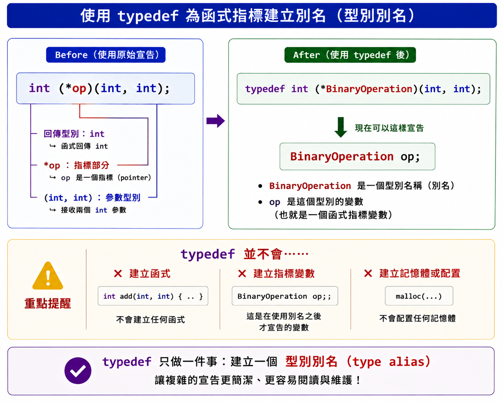
</p>

完整函式指標型態：

```c
int (*op)(int, int);
```

可以建立別名：

```c
typedef int (*BinaryOperation)(int, int);
```

之後：

```c
BinaryOperation op;
```

等價於：

```c
int (*op)(int, int);
```

---

### 10. 使用 `typedef` 改寫 `calculate()`

```c
#include <stdio.h>

typedef int (*BinaryOperation)(int, int);

int calculate(BinaryOperation op);
int add(int a, int b);
int multiply(int a, int b);

int main(void) {
    printf("%d\n", calculate(add));
    printf("%d\n", calculate(multiply));

    return 0;
}

int calculate(BinaryOperation op) {
    int result = 1;

    for (int i = 2; i <= 5; i++) {
        result = op(result, i);
    }

    return result;
}

int add(int a, int b) {
    return a + b;
}

int multiply(int a, int b) {
    return a * b;
}
```

`typedef` 不會建立新的函式或指標，只替型態取一個較容易閱讀的名稱。

---

## Section XXXVI. 參數名稱可以省略

函式宣告：

```c
int calculate(
    int (*)(int, int)
);
```

參數名稱可以省略。

函式定義需要在函式內使用該參數，因此通常寫出名稱：

```c
int calculate(
    int (*op)(int, int)
) {
    /* 使用 op */
}
```

---

## Section XXXVII. 函式型態參數會調整成函式指標

教材補充：

以下函式參數宣告：

```c
int calculate(
    int op(int, int)
);
```

在函式參數位置會調整成：

```c
int calculate(
    int (*op)(int, int)
);
```

為了讓指標性質更清楚，本講義主要使用第二種寫法。

---

# Part I：教材補充——函式指標陣列

## Section XXXVIII. 宣告函式指標陣列

<p align="center">
  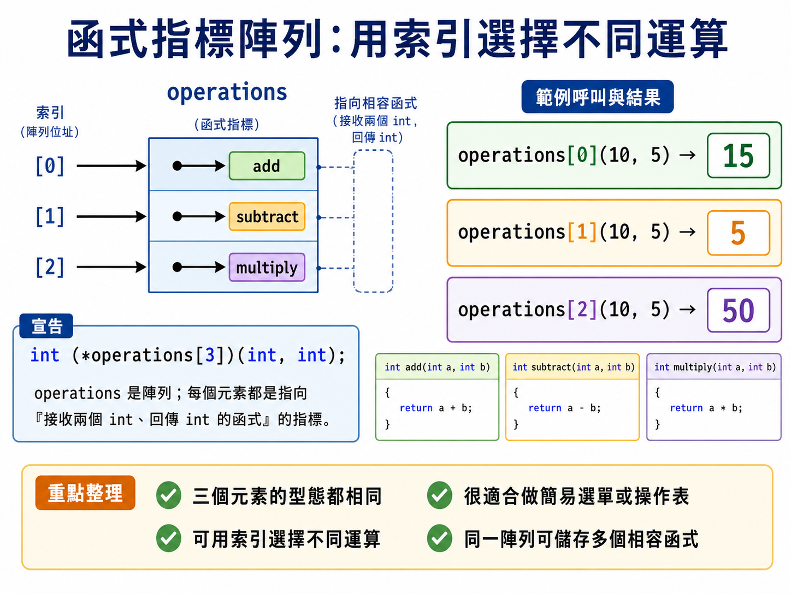
</p>

```c
int (*operations[3])(int, int);
```

由名稱向外讀：

```text
operations
→ 是三元素陣列
→ 每個元素是指標
→ 指向接收兩個 int
→ 並回傳 int 的函式
```

---

## Section XXXIX. 初始化函式指標陣列

```c
int (*operations[3])(int, int) = {
    add,
    subtract,
    multiply
};
```

每個元素保存不同函式的位置。

---

## Section XL. 使用索引選擇操作

```c
#include <stdio.h>

int add(int a, int b);
int subtract(int a, int b);
int multiply(int a, int b);

int main(void) {
    int (*operations[3])(int, int) = {
        add,
        subtract,
        multiply
    };

    int left = 10;
    int right = 5;

    for (int i = 0; i < 3; i++) {
        printf("%d\n", operations[i](left, right));
    }

    return 0;
}

int add(int a, int b) {
    return a + b;
}

int subtract(int a, int b) {
    return a - b;
}

int multiply(int a, int b) {
    return a * b;
}
```

輸出：

```text
15
5
50
```

---

## Section XLI. 使用 `typedef` 簡化陣列

```c
typedef int (*BinaryOperation)(int, int);

BinaryOperation operations[3] = {
    add,
    subtract,
    multiply
};
```

可讀性通常比完整宣告高。

---

# Part J：函式指標的限制與安全使用

## Section XLII. 函式指標不能進行算術運算

普通陣列元素指標可在合法陣列範圍內：

```c
pointer + 1
pointer++
```

函式並不是陣列元素。

不能寫：

```c
/* func++; */
/* func + 1; */
```

C 沒有定義函式指標算術。

---

## Section XLIII. 使用 `NULL`

函式指標可以表示目前沒有指向任何函式：

```c
int (*op)(int, int) = NULL;
```

呼叫前：

```c
if (op != NULL) {
    int result = op(3, 5);
}
```

不能呼叫 `NULL` 函式指標。

---

## Section XLIV. 比較函式指標

相容函式指標可以比較是否相等：

```c
if (op == add) {
    printf("Current operation is add.\n");
}
```

這可以判斷目前指向哪一個函式。

---

## Section XLV. 函式指標不是 `void *`

教材補充：

`void *` 是通用**物件指標**。

C 標準不保證函式指標可以安全轉成 `void *` 再轉回。

不要假設：

```c
void *generic = (void *)add;
```

是可攜的函式保存方式。

應使用正確的函式指標型態。

---

## Section XLVI. 函式指標型態必須正確

錯誤型態可能導致：

- 參數使用錯誤暫存器或堆疊位置。
- 回傳值被使用錯誤方式解讀。
- 呼叫端與被呼叫端對參數數量理解不同。
- 未定義行為。

強制轉型不能修正真正的函式介面。

---

# Part K：容易搞混的重點

## Section XLVII. 函式與函式指標

```c
int add(int, int);
```

`add` 是函式。

```c
int (*op)(int, int);
```

`op` 是函式指標變數。

---

## Section XLVIII. 回傳指標的函式與函式指標

```c
int *make_value(void);
```

`make_value` 是函式，回傳 `int *`。

```c
int (*make_value)(void);
```

`make_value` 是指標，指向回傳 `int` 的函式。

變數名稱周圍的括號決定意義。

---

## Section XLIX. `*func()` 與 `(*func)()`

假設：

```c
int *(*func)(void);
```

```c
*func()
```

會先呼叫 `func()` 所指的函式，再對回傳的指標解參照。

```c
(*func)()
```

先對函式指標使用 `*` 取得函式指示符，再呼叫。

括號位置不同，運算順序不同。

---

## Section L. `hello` 與 `hello()`

<p align="center">
  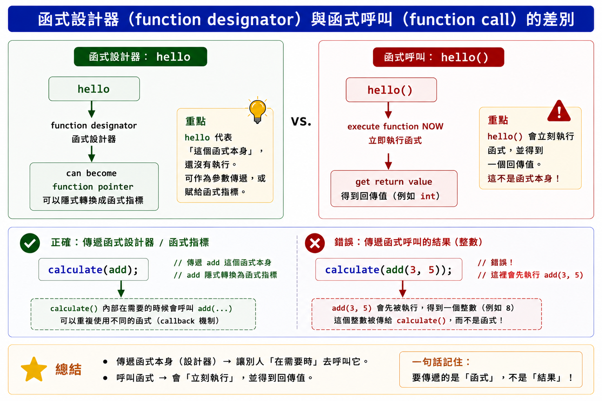
</p>

```c
hello
```

代表函式指示符，在大多數情境中轉成函式指標。

```c
hello()
```

會真正執行函式。

傳入 callback 時應傳：

```c
calculate(add);
```

不是：

```c
/* calculate(add(3, 5)); */
```

後者會先執行 `add()`，得到整數 `8`，不是函式指標。

---

# Part L：快速概念檢查

## Section LI. 選擇題與簡答

### Q1. `void hello(void)` 中，`hello` 是什麼？

<details>
<summary>查看答案</summary>

函式名稱／函式指示符，代表一個不接收參數並回傳 `void` 的函式。

</details>

---

### Q2. 函式型態可以像 `int` 一樣被複製到另一個函式變數嗎？

<details>
<summary>查看答案</summary>

不可以。若要保存某個函式，應使用函式指標。

</details>

---

### Q3. `void (*func)(void)` 表示什麼？

<details>
<summary>查看答案</summary>

`func` 是函式指標，指向不接收參數並回傳 `void` 的函式。

</details>

---

### Q4. `void *func(void)` 表示什麼？

<details>
<summary>查看答案</summary>

`func` 是函式，不接收參數，回傳 `void *`。

</details>

---

### Q5. `func = hello;` 與 `func = &hello;` 哪個合法？

<details>
<summary>查看答案</summary>

若 `func` 是相容的函式指標，兩者都合法。

</details>

---

### Q6. `func()` 與 `(*func)()` 哪個可以呼叫函式指標？

<details>
<summary>查看答案</summary>

兩者都可以，通常 `func()` 較簡單。

</details>

---

### Q7. `hello` 與 `hello()` 的差異是什麼？

<details>
<summary>查看答案</summary>

- `hello` 代表函式，通常會轉成函式指標。
- `hello()` 會執行函式。

</details>

---

### Q8. 為什麼 `(&printf)(...)` 可以呼叫函式？

<details>
<summary>查看答案</summary>

`&printf` 是函式指標，而函式指標可以直接搭配 `()` 呼叫。

</details>

---

### Q9. `*printf` 的結果概念上是什麼？

<details>
<summary>查看答案</summary>

先將 `printf` 轉成函式指標，再使用 `*` 取得所指函式的函式指示符。

</details>

---

### Q10. `int (*op)(int, int)` 可以指向 `double divide(double, double)` 嗎？

<details>
<summary>查看答案</summary>

不可以安全指向，函式型態不相容。

</details>

---

### Q11. `calculate(add)` 傳入的是 `add()` 的結果嗎？

<details>
<summary>查看答案</summary>

不是。傳入的是指向 `add` 的函式指標。

</details>

---

### Q12. `calculate(add())` 正確嗎？

<details>
<summary>查看答案</summary>

不正確，而且 `add()` 需要兩個參數。即使提供參數，得到的也是整數結果，不是函式指標。

</details>

---

### Q13. callback 是什麼？

<details>
<summary>查看答案</summary>

將函式指標交給另一個函式，讓後者在需要時呼叫它。

</details>

---

### Q14. 函式指標參數是傳值還是傳址？

<details>
<summary>查看答案</summary>

仍然是以值傳遞，複製的是函式指標值。

</details>

---

### Q15. 函式指標可以使用 `++` 嗎？

<details>
<summary>查看答案</summary>

不可以，C 沒有定義函式指標算術。

</details>

---

### Q16. 可以呼叫值為 `NULL` 的函式指標嗎？

<details>
<summary>查看答案</summary>

不可以，呼叫前必須確認它指向有效且型態相容的函式。

</details>

---

### Q17. `typedef` 會建立新的函式嗎？

<details>
<summary>查看答案</summary>

不會，只會替函式指標型態建立別名。

</details>

---

### Q18. 函式指標陣列的用途是什麼？

<details>
<summary>查看答案</summary>

可以透過索引選擇要執行的相容函式，例如操作選單或狀態處理。

</details>

---

# Part M：程式閱讀練習

## Section LII. 追蹤函式指標

### 題目 1

```c
void (*func)(void) = hello;

func();
```

實際呼叫什麼？

<details>
<summary>查看答案</summary>

呼叫 `hello()`。

</details>

---

### 題目 2

```c
int (*op)(int, int) = add;

int result = op(4, 6);
```

<details>
<summary>查看答案</summary>

`result` 為：

```text
10
```

</details>

---

### 題目 3

```c
int (*op)(int, int) = multiply;

op = add;
```

最後 `op` 指向哪個函式？

<details>
<summary>查看答案</summary>

`add()`。

</details>

---

### 題目 4

```c
int result = calculate(multiply);
```

來源的 `calculate()` 會得到什麼？

<details>
<summary>查看答案</summary>

```text
1 × 2 × 3 × 4 × 5 = 120
```

</details>

---

### 題目 5

```c
int (*operations[3])(int, int) = {
    add,
    subtract,
    multiply
};

operations[2](3, 5);
```

<details>
<summary>查看答案</summary>

呼叫 `multiply(3, 5)`，結果為 `15`。

</details>

---

### 題目 6

```c
void (*func)(void) = NULL;

if (func != NULL) {
    func();
}
```

會呼叫函式嗎？

<details>
<summary>查看答案</summary>

不會，條件為假。

</details>

---

### 題目 7

```c
void (*func)(void) = hello;

if (func == hello) {
    func();
}
```

<details>
<summary>查看答案</summary>

比較為真，會呼叫 `hello()`。

</details>

---

### 題目 8

```c
int (*op)(int, int) = add;

int result = (*op)(2, 7);
```

<details>
<summary>查看答案</summary>

結果為 `9`。

</details>

---

### 題目 9

```c
int (*op)(int, int) = add;

int result = (******op)(2, 7);
```

<details>
<summary>查看答案</summary>

依來源說明的函式指示符與函式指標轉換規則，仍會呼叫 `add(2, 7)`，結果為 `9`。

這種寫法不應用於正常程式。

</details>

---

### 題目 10

```c
calculate(add(3, 5));
```

問題是什麼？

<details>
<summary>查看答案</summary>

`add(3, 5)` 先產生整數 `8`，但 `calculate()` 需要函式指標，不是整數。

</details>

---

# Part N：實作練習

## Section LIII. 實作檢測題

### TODO 1：第一個函式指標

建立：

```c
void greet(void);
```

再建立函式指標並用：

```c
(*func)();
func();
```

各呼叫一次。

---

### TODO 2：兩種初始化

分別使用：

```c
func = greet;
func = &greet;
```

確認都能呼叫。

---

### TODO 3：宣告閱讀

說明以下兩個宣告的差異：

```c
int *create(void);
int (*create)(void);
```

---

### TODO 4：二元操作函式

建立：

```c
int add(int, int);
int subtract(int, int);
int multiply(int, int);
```

使用同一個 `op` 指標依序呼叫三者。

---

### TODO 5：重寫 `calculate()`

完成來源的：

```c
int calculate(
    int (*op)(int, int)
);
```

測試加法與乘法。

---

### TODO 6：新增最大值操作

建立：

```c
int maximum(int a, int b);
```

傳入 `calculate()`，觀察從 `1–5` 反覆比較後的結果。

---

### TODO 7：新增最小值操作

思考 `calculate()` 的初始值是否適合最小值操作，必要時重新設計函式，使初始值也能由呼叫端提供。

---

### TODO 8：一般化 fold

設計：

```c
int fold_range(
    int start,
    int end,
    int initial,
    int (*op)(int, int)
);
```

---

### TODO 9：`typedef`

建立：

```c
typedef int (*BinaryOperation)(int, int);
```

並使用它重寫 TODO 8。

---

### TODO 10：操作陣列

建立函式指標陣列，讓索引：

```text
0 → add
1 → subtract
2 → multiply
```

---

### TODO 11：簡易選單

讀入使用者選擇與兩個整數，再透過函式指標陣列執行運算。

必須檢查索引範圍。

---

### TODO 12：`NULL` 檢查

建立可能為 `NULL` 的函式指標，只有在非 `NULL` 時呼叫。

---

### TODO 13：比較目前操作

讓程式輸出：

```text
Current operation: add
```

或：

```text
Current operation: multiply
```

方式是比較函式指標。

---

### TODO 14：型態錯誤分析

分析以下函式為何不能指派給 `int (*)(int, int)`：

```c
double average(double, double);
int print_value(int);
void reset(void);
```

---

### TODO 15：移除多餘運算

將：

```c
(******op)(3, 5)
```

重構成最容易閱讀的正常寫法。

---

# Part O：課後延伸

## Section LIV. 課後小練習

### 練習 1：套用一元函式

設計：

```c
void transform(
    int values[],
    size_t length,
    int (*operation)(int)
);
```

將操作套用到每個元素。

---

### 練習 2：條件計數

設計：

```c
size_t count_if(
    const int values[],
    size_t length,
    int (*predicate)(int)
);
```

可傳入：

```text
is_even
is_positive
is_multiple_of_three
```

---

### 練習 3：自訂比較

設計一個簡單排序函式，接收：

```c
int (*compare)(int, int);
```

用不同函式控制遞增或遞減。

---

### 練習 4：狀態處理

建立多個：

```c
void state_x(void);
```

函式，再使用函式指標表示目前狀態的處理方式。

---

### 練習 5：事件回呼

設計：

```c
void run_task(
    void (*on_start)(void),
    void (*on_finish)(void)
);
```

在工作開始與結束時呼叫不同函式。

---

# Part P：常見錯誤提醒

## Section LV. 常見錯誤

### 錯誤 1：漏掉函式指標括號

```c
int *op(int, int);
```

這是回傳 `int *` 的函式，不是函式指標。

---

### 錯誤 2：把函式型態當成可賦值變數

```c
void func(void) = hello;
```

函式型態不能這樣複製。

---

### 錯誤 3：函式指標型態不相容

參數或回傳型態不同時不能安全共用。

---

### 錯誤 4：以強制轉型隱藏函式型態問題

轉型不會改變函式真正的呼叫介面。

---

### 錯誤 5：傳入函式呼叫結果

```c
calculate(add(3, 5));
```

傳入的是整數，不是函式。

---

### 錯誤 6：呼叫 `NULL` 函式指標

必須先檢查：

```c
op != NULL
```

---

### 錯誤 7：對函式指標進行 `++`

函式指標沒有合法的陣列算術。

---

### 錯誤 8：把函式指標當成 `void *`

C 不保證函式指標與物件指標可以可攜地互轉。

---

### 錯誤 9：使用 `void hello()` 表示沒有參數

在 C 中應使用：

```c
void hello(void)
```

明確表示沒有參數。

---

### 錯誤 10：過度使用 `(*func)()`

此寫法合法，但正常情況下：

```c
func()
```

更容易閱讀。

---

### 錯誤 11：加入多個無意義的 `*`

來源用來展示特殊規則，但不適合作為程式風格。

---

### 錯誤 12：混淆函式與函式指標變數

`add` 是函式；`op` 是可改指向其他相容函式的指標變數。

---

### 錯誤 13：函式指標陣列索引越界

```c
operations[choice]
```

呼叫前必須檢查 `choice` 的合法範圍。

---

### 錯誤 14：忘記初始化函式指標

未初始化的區域函式指標具有不確定值，不能呼叫。

---

### 錯誤 15：假設 callback 會自動知道額外資料

函式指標只指定函式。若 callback 需要額外狀態，必須透過參數、結構或其他明確方式提供。

---

### 錯誤 16：把 `typedef` 名稱誤認成函式

`BinaryOperation` 是型態名稱，不是可呼叫函式。

---

### 錯誤 17：忽略可變參數差異

像 `printf` 一樣的可變參數函式，型態與固定參數函式不同。

---

### 錯誤 18：callback 的初始值不適合所有操作

來源的 `result = 1` 適合加法與乘法示範，但一般化時應由呼叫端提供正確初始值。

---

# Part Q：Mermaid 流程圖

## Section LVI. 函式指標流程圖

### 1. 函式指標建立


```mermaid
flowchart LR
    A[hello 函式] --> B[取得函式指標]
    B --> C[func 保存指標值]
    C --> D[使用 func 呼叫 hello]
```

---

### 2. 函式名稱的隱性轉型

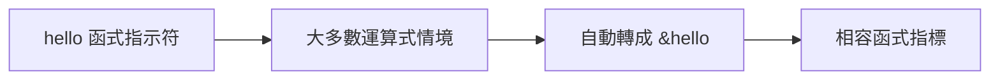
```mermaid
flowchart LR
    A[hello 函式指示符] --> B[大多數運算式情境]
    B --> C[自動轉成 &hello]
    C --> D[相容函式指標]
```

---

### 3. `*func` 的化簡

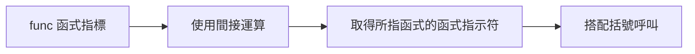
```mermaid
flowchart LR
    A[func 函式指標] --> B[使用間接運算]
    B --> C[取得所指函式的函式指示符]
    C --> D[搭配括號呼叫]
```

---

### 4. 傳遞 callback

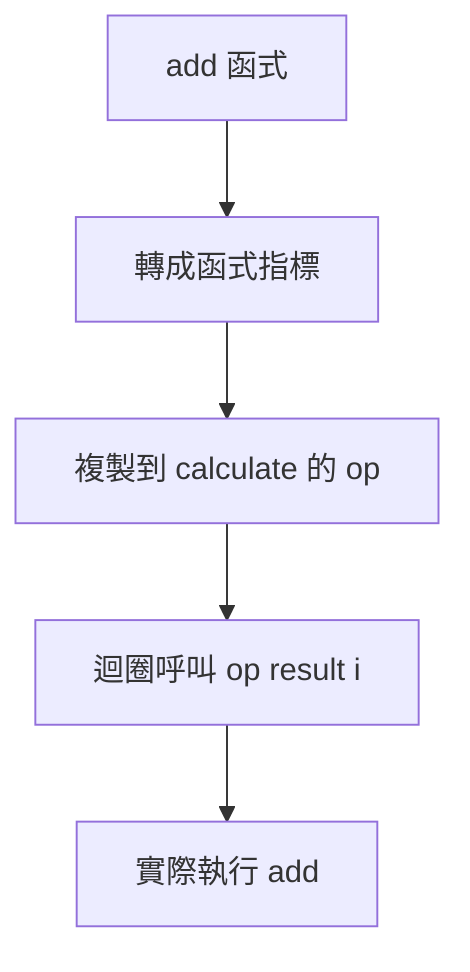
```mermaid
flowchart TD
    A[add 函式] --> B[轉成函式指標]
    B --> C[複製到 calculate 的 op]
    C --> D[迴圈呼叫 op result i]
    D --> E[實際執行 add]
```

---

### 5. 加法與乘法共用流程

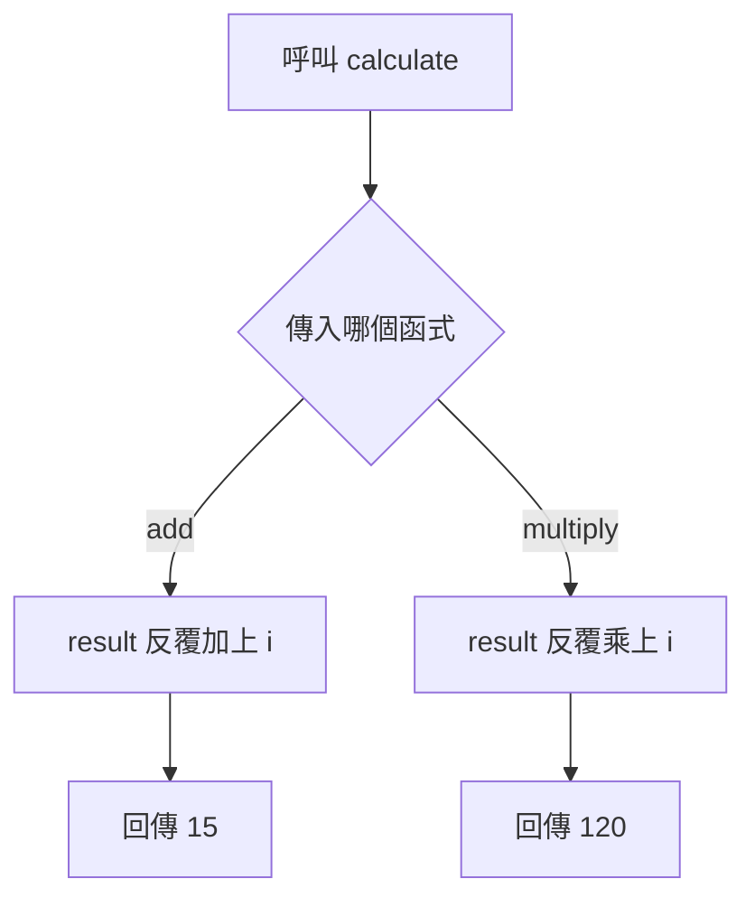
```mermaid
flowchart TD
    A[呼叫 calculate] --> B{傳入哪個函式}
    B -- add --> C[result 反覆加上 i]
    B -- multiply --> D[result 反覆乘上 i]
    C --> E[回傳 15]
    D --> F[回傳 120]
```

---

### 6. 安全呼叫

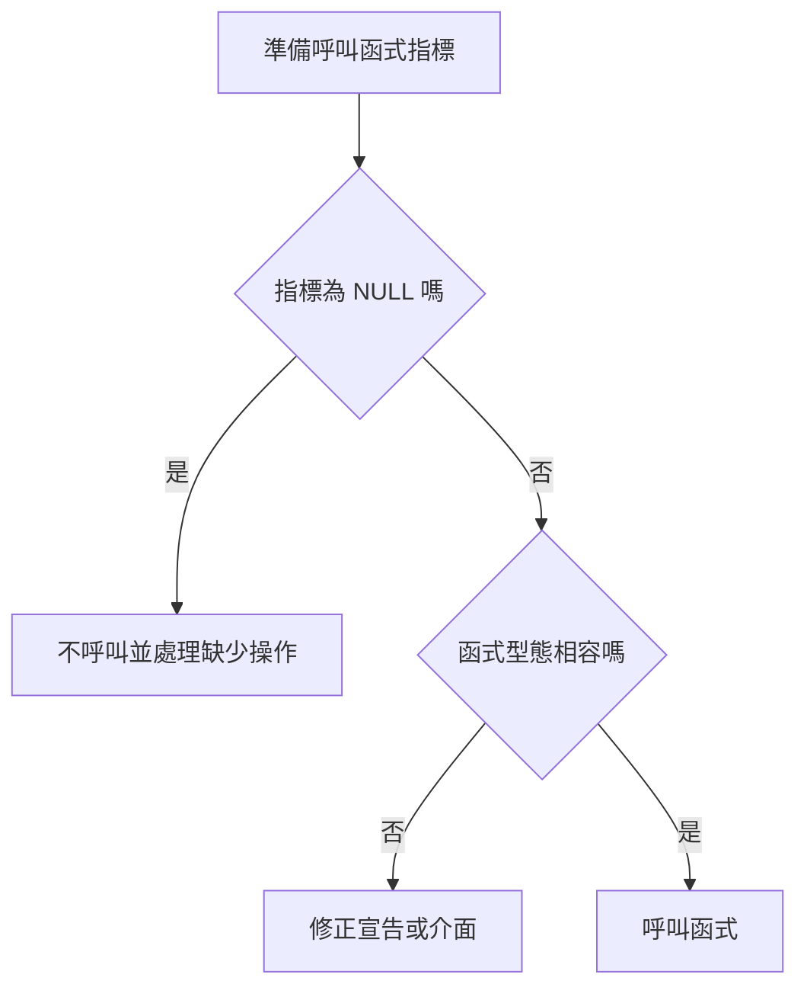
```mermaid
flowchart TD
    A[準備呼叫函式指標] --> B{指標為 NULL 嗎}
    B -- 是 --> C[不呼叫並處理缺少操作]
    B -- 否 --> D{函式型態相容嗎}
    D -- 否 --> E[修正宣告或介面]
    D -- 是 --> F[呼叫函式]
```

---

### 7. 函式指標陣列

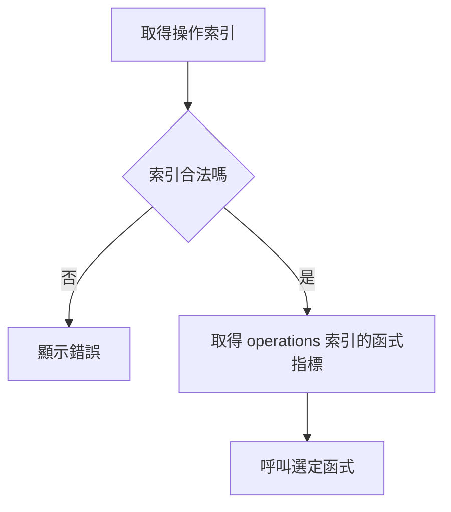
```mermaid
flowchart TD
    A[取得操作索引] --> B{索引合法嗎}
    B -- 否 --> C[顯示錯誤]
    B -- 是 --> D[取得 operations 索引的函式指標]
    D --> E[呼叫選定函式]
```

---

# 本章完成標準

完成本章後，你應該能做到：

1. 複習普通物件指標的取址與間接存取。
2. 說明函式名稱代表特定函式。
3. 說明函式具有參數型態與回傳型態。
4. 說明函式型態不能像普通物件一樣複製。
5. 宣告 `void (*func)(void)`。
6. 使用 `&hello` 初始化函式指標。
7. 使用 `hello` 的隱性轉型初始化函式指標。
8. 使用 `(*func)()` 呼叫函式。
9. 使用 `func()` 簡化呼叫。
10. 分辨回傳指標的函式與函式指標。
11. 從變數名稱向外判讀函式指標宣告。
12. 說明函式與物件共用名稱、取址和間接運算的部分概念。
13. 說明函式指示符的意義。
14. 解釋 `printf`、`&printf` 與 `*printf` 的關係。
15. 說明函式指示符在大多數情境中轉成函式指標。
16. 化簡來源中的函式指標相關運算。
17. 避免在正常程式中使用多重無意義的 `*`。
18. 宣告 `int (*op)(int, int)`。
19. 使用函式指標呼叫 `add()`。
20. 讓同一指標改指向 `multiply()`。
21. 比較函式參數型態與回傳型態。
22. 找出不相容函式指標指派。
23. 避免以強制轉型掩蓋不相容函式介面。
24. 宣告函式指標參數。
25. 將 `add` 傳入 `calculate()`。
26. 將 `multiply` 傳入 `calculate()`。
27. 說明傳遞函式實際上是傳遞函式指標值。
28. 說明 callback 的基本概念。
29. 說明函式指標參數仍是以值傳遞。
30. 使用 `typedef` 簡化函式指標型態。
31. 建立函式指標陣列。
32. 使用索引選擇要執行的函式。
33. 避免對函式指標進行算術運算。
34. 使用 `NULL` 表示沒有可呼叫函式。
35. 呼叫前檢查函式指標。
36. 比較兩個相容函式指標。
37. 說明函式指標與 `void *` 不應被視為可攜互換。
38. 使用函式指標設計可替換行為的程式。
