# 在 VS Code 設定 C／C++ 編譯環境完整教學

> 本章目標：讓學生在 Windows、macOS 或 Linux 上完成 C／C++ 開發環境設定，並能在 VS Code 中編寫、編譯、執行與除錯程式。

> 最重要的觀念：**VS Code 是程式碼編輯器，不是 C／C++ compiler。**  
> 安裝 VS Code 的 C/C++ extension 之後，仍然必須另外安裝 compiler 與 debugger。

---

## 1. 開發環境由哪些工具組成？

```text
VS Code
   │
   ├── C/C++ extension
   │      ├── Syntax highlighting
   │      ├── IntelliSense
   │      ├── Error hints
   │      └── Debug integration
   │
   ├── C compiler
   │      ├── gcc
   │      └── clang
   │
   ├── C++ compiler
   │      ├── g++
   │      └── clang++
   │
   └── Debugger
          ├── gdb
          └── lldb
```

<p align="center">
  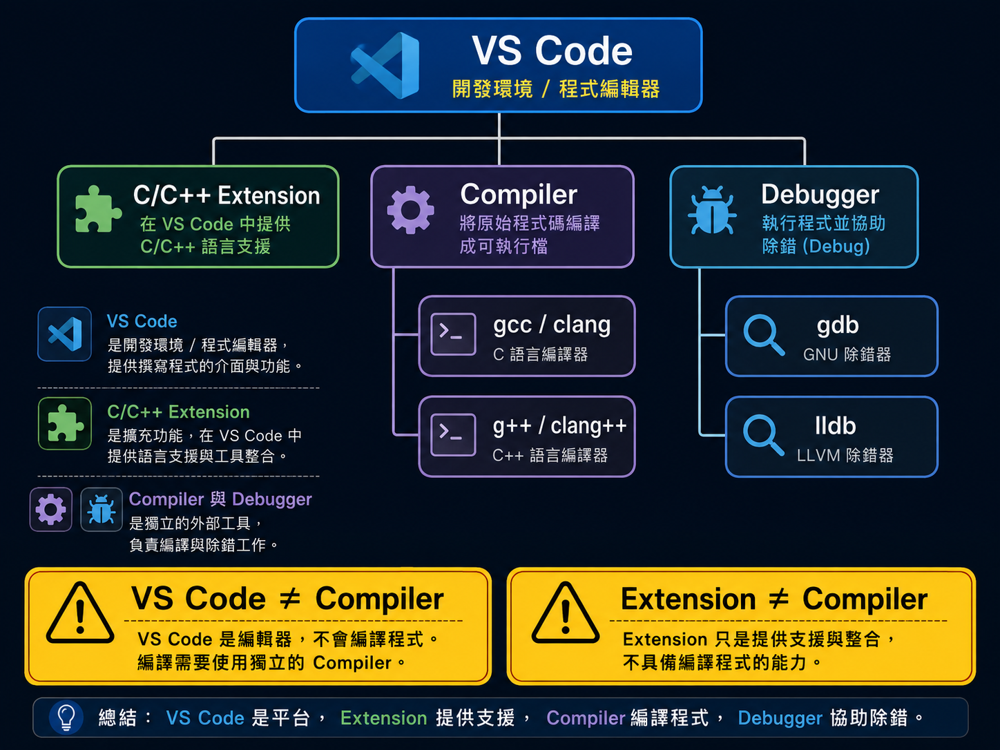
</p>

| 工具 | 功能 |
| --- | --- |
| VS Code | 編輯程式碼與管理專案 |
| C/C++ extension | IntelliSense、程式碼導覽與 debugger 整合 |
| `gcc`／`clang` | 編譯 C |
| `g++`／`clang++` | 編譯 C++ |
| `gdb`／`lldb` | 暫停程式、查看變數與逐步執行 |
| `tasks.json` | 告訴 VS Code 如何編譯 |
| `launch.json` | 告訴 VS Code 如何啟動 debugger |
| `c_cpp_properties.json` | 設定 IntelliSense 使用的 compiler 與標準 |

---

## 2. 各作業系統建議工具

| 作業系統 | C Compiler | C++ Compiler | Debugger |
| --- | --- | --- | --- |
| Windows | GCC `gcc.exe` | GCC `g++.exe` | GDB `gdb.exe` |
| macOS | Clang `clang` | Clang `clang++` | LLDB `lldb` |
| Ubuntu／Debian Linux | GCC `gcc` | GCC `g++` | GDB `gdb` |

<p align="center">
  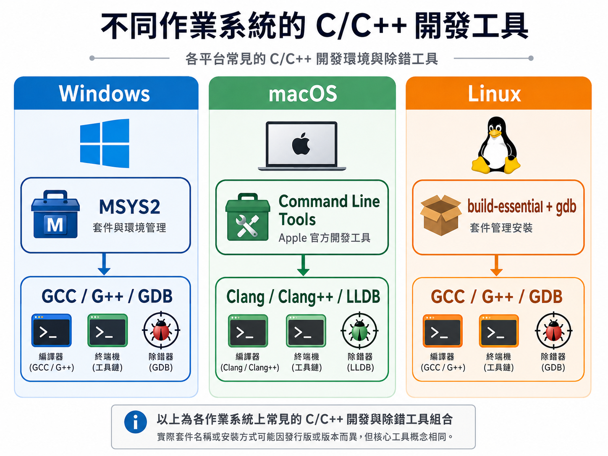
</p>

---

# Part A：安裝 VS Code 與 Extension

## 3. 安裝 Visual Studio Code

1. 從 Visual Studio Code 官方網站下載。
2. 安裝適合自己的 Windows、macOS 或 Linux 版本。
3. 開啟 VS Code。

---

## 4. 安裝 Microsoft C/C++ Extension

在 VS Code 左側選擇：

```text
Extensions
```

快捷鍵：

```text
Windows／Linux：Ctrl + Shift + X
macOS：Command + Shift + X
```

搜尋：

```text
C/C++
```

安裝發行者為 Microsoft 的 extension：

```text
C/C++
Extension ID：ms-vscode.cpptools
```

<p align="center">
  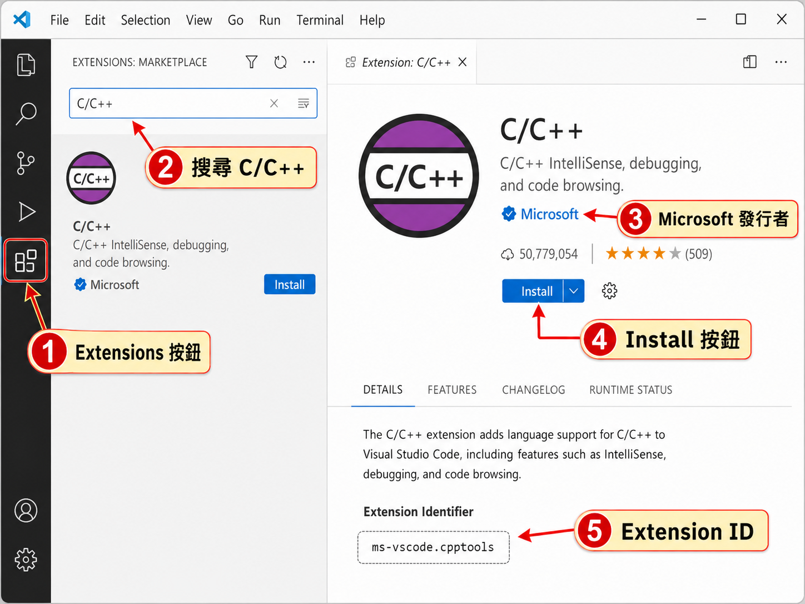
</p>

---

## 5. Extension 不等於 Compiler

C/C++ extension 提供：

- 程式碼上色。
- 自動完成。
- 型別提示。
- 找尋定義。
- Debugger 整合。
- 錯誤訊息整合。

它不包含：

- C compiler。
- C++ compiler。
- GDB／LLDB。

因此下一步仍要依作業系統安裝 compiler。

---

# Part B：Windows 安裝 GCC、G++ 與 GDB

## 6. 使用 MSYS2 UCRT64

本教材建議：

```text
MSYS2
+
MinGW-w64 UCRT64 toolchain
```

安裝後會得到：

```text
gcc.exe
g++.exe
gdb.exe
```

---

## 7. 安裝 MSYS2

1. 前往 MSYS2 官方網站。
2. 下載並執行 installer。
3. 使用預設位置安裝。

常見位置：

```text
C:\msys64
```

完成後開啟：

```text
MSYS2 UCRT64
```

---

## 8. 更新 MSYS2

在 MSYS2 UCRT64 terminal 中執行：

```bash
pacman -Syu
```

若要求關閉 terminal：

1. 關閉視窗。
2. 重新開啟 `MSYS2 UCRT64`。
3. 再執行：

```bash
pacman -Syu
```

---

## 9. 安裝 Toolchain

```bash
pacman -S --needed base-devel mingw-w64-ucrt-x86_64-toolchain
```

遇到套件清單時可按：

```text
Enter
```

接受預設全部套件，再輸入：

```text
Y
```

確認安裝。

---

## 10. 加入 Windows PATH

將以下資料夾加入使用者的 `Path`：

```text
C:\msys64\ucrt64\bin
```

步驟：

1. 搜尋 `environment variables`。
2. 選擇 `Edit environment variables for your account`。
3. 選取使用者的 `Path`。
4. 按 `Edit`。
5. 按 `New`。
6. 貼上：
   ```text
   C:\msys64\ucrt64\bin
   ```
7. 按下所有 `OK`。
8. **完全關閉並重新開啟 VS Code。**

<p align="center">
  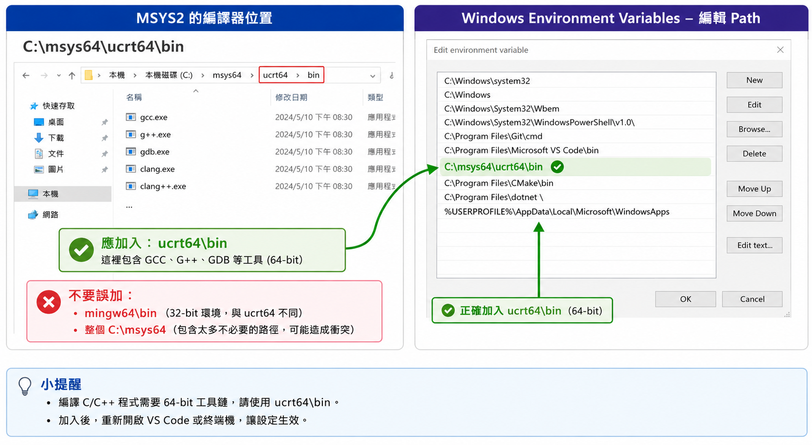
</p>

---

## 11. Windows 驗證安裝

在新的 VS Code terminal、PowerShell 或 Command Prompt 執行：

```bash
gcc --version
g++ --version
gdb --version
```

三個命令都應顯示版本資訊。

若出現：

```text
'g++' is not recognized
```

檢查：

- Toolchain 是否真的安裝。
- PATH 是否正確。
- 是否使用 `ucrt64\bin`。
- VS Code 是否重新啟動。

---

# Part C：macOS 安裝 Clang 與 LLDB

## 12. 安裝 Apple Command Line Tools

開啟 Terminal：

```bash
xcode-select --install
```

<p align="center">
  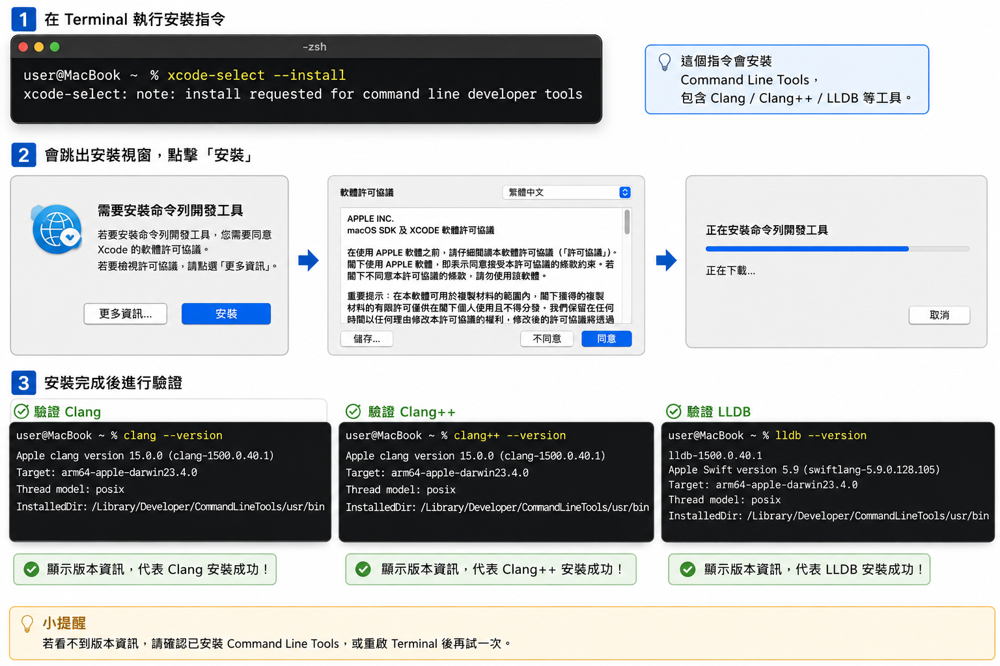
</p>

依畫面指示完成。

它通常提供：

```text
clang
clang++
lldb
make
```

---

## 13. macOS 驗證

```bash
clang --version
clang++ --version
lldb --version
```

若 developer path 異常，可先嘗試：

```bash
sudo xcode-select --reset
```

再重新檢查。

---

## 14. 安裝 `code .` 命令

在 VS Code 開啟 Command Palette：

```text
Command + Shift + P
```

搜尋：

```text
Shell Command: Install 'code' command in PATH
```

之後可在 terminal 使用：

```bash
code .
```

---

# Part D：Linux 安裝 GCC 與 GDB

## 15. Ubuntu／Debian

```bash
sudo apt update
sudo apt install build-essential gdb
```

`build-essential` 通常包含：

```text
gcc
g++
make
必要 headers 與 libraries
```

---

## 16. Linux 驗證

```bash
gcc --version
g++ --version
gdb --version
```

其他發行版的套件名稱可能不同，應以該發行版官方文件為準。

---

# Part E：建立第一個 Workspace

## 17. Open Folder，不要只 Open File

建議結構：

```text
hello_project/
├── hello.c
└── hello.cpp
```

<p align="center">
  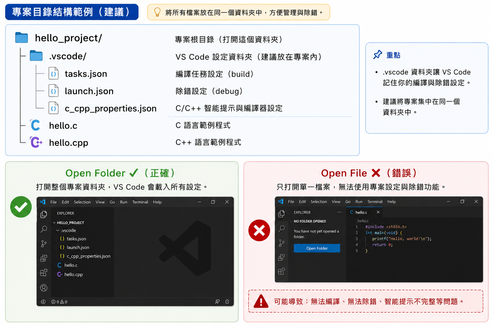
</p>

VS Code 設定通常存放在：

```text
hello_project/.vscode/
```

請使用：

```text
File
→ Open Folder
```

---

## 18. 使用 Terminal 建立專案

macOS／Linux：

```bash
mkdir -p ~/projects/hello_project
cd ~/projects/hello_project
code .
```

Windows Command Prompt：

```bat
mkdir projects
cd projects
mkdir hello_project
cd hello_project
code .
```

---

# Part F：第一個 C 程式

## 19. 建立 `hello.c`

```c
// VALIDATE_C
#include <stdio.h>

int main(void) {
    printf("Hello, C!\n");

    return 0;
}
```

---

## 20. 編譯 C

Windows／Linux：

```bash
gcc -std=c17 -Wall -Wextra -Wpedantic hello.c -o hello_c
```

macOS：

```bash
clang -std=c17 -Wall -Wextra -Wpedantic hello.c -o hello_c
```

---

## 21. 執行 C

macOS／Linux：

```bash
./hello_c
```

Windows PowerShell：

```powershell
.\hello_c.exe
```

輸出：

```text
Hello, C!
```

---

# Part G：第一個 C++ 程式

## 22. 建立 `hello.cpp`

```cpp
// VALIDATE_CPP
#include <iostream>

int main() {
    std::cout
        << "Hello, C++!"
        << '\n';

    return 0;
}
```

---

## 23. 編譯 C++

Windows／Linux：

```bash
g++ -std=c++17 -Wall -Wextra -Wpedantic hello.cpp -o hello_cpp
```

macOS：

```bash
clang++ -std=c++17 -Wall -Wextra -Wpedantic hello.cpp -o hello_cpp
```

---

## 24. 執行 C++

macOS／Linux：

```bash
./hello_cpp
```

Windows PowerShell：

```powershell
.\hello_cpp.exe
```

輸出：

```text
Hello, C++!
```

---

## 25. `gcc` 與 `g++` 的差異

C：

```bash
gcc program.c
```

C++：

```bash
g++ program.cpp
```

macOS：

```bash
clang program.c
clang++ program.cpp
```

C++ 不建議直接使用：

```bash
gcc program.cpp
```

因為它可能沒有自動連結 C++ standard library。

---

## 26. 常用 Compiler Options

| Option | 意義 |
| --- | --- |
| `-std=c17` | 使用 C17 |
| `-std=c++17` | 使用 C++17 |
| `-Wall` | 開啟常見 warnings |
| `-Wextra` | 開啟額外 warnings |
| `-Wpedantic` | 檢查標準相容問題 |
| `-Werror` | 將 warning 視為 error |
| `-g` | 加入 debugger symbols |
| `-O0` | 關閉主要最佳化 |
| `-o name` | 指定輸出檔名 |

建議 Debug build：

```bash
g++ -std=c++17 \
  -Wall -Wextra -Wpedantic \
  -g -O0 \
  hello.cpp \
  -o hello_cpp
```


---

# Part H：使用 VS Code Play Button

## 27. 單檔程式快速執行

1. 開啟 `hello.cpp`。
2. 確認它是目前 active file。
3. 按右上角 Play 按鈕。
4. 選擇偵測到的 compiler。

Windows：

```text
C/C++: g++.exe build and debug active file
```

macOS：

```text
C/C++: clang++ build and debug active file
```

Linux：

```text
C/C++: g++ build and debug active file
```

首次選擇後，VS Code 通常會建立：

```text
.vscode/tasks.json
```

---

## 28. Active File 是什麼？

Active file 是目前正在編輯的檔案。

如果目前開啟：

```text
tasks.json
```

卻執行 C++ build active file，VS Code 可能嘗試把 JSON 當成 source。

編譯前應先點選：

```text
hello.c
```

或：

```text
hello.cpp
```

---

# Part I：建立 `tasks.json`

<p align="center">
  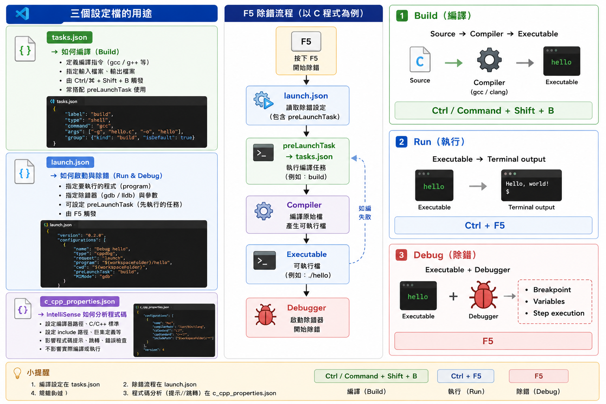
</p>

## 29. `tasks.json` 的功能

它告訴 VS Code：

- 使用哪個 compiler。
- 使用哪些 compiler arguments。
- 編譯哪個 source。
- 輸出檔放在哪裡。
- 如何辨認 compiler error。

建立資料夾：

```text
.vscode/
```

並建立：

```text
.vscode/tasks.json
```

---

## 30. Windows：C 與 C++ Build Tasks

```json
{
  "version": "2.0.0",
  "tasks": [
    {
      "label": "Build active C file",
      "type": "process",
      "command": "C:/msys64/ucrt64/bin/gcc.exe",
      "args": [
        "-std=c17",
        "-Wall",
        "-Wextra",
        "-Wpedantic",
        "-g",
        "-O0",
        "${file}",
        "-o",
        "${fileDirname}/${fileBasenameNoExtension}.exe"
      ],
      "options": {
        "cwd": "${fileDirname}"
      },
      "problemMatcher": [
        "$gcc"
      ],
      "group": "build"
    },
    {
      "label": "Build active C++ file",
      "type": "process",
      "command": "C:/msys64/ucrt64/bin/g++.exe",
      "args": [
        "-std=c++17",
        "-Wall",
        "-Wextra",
        "-Wpedantic",
        "-g",
        "-O0",
        "${file}",
        "-o",
        "${fileDirname}/${fileBasenameNoExtension}.exe"
      ],
      "options": {
        "cwd": "${fileDirname}"
      },
      "problemMatcher": [
        "$gcc"
      ],
      "group": {
        "kind": "build",
        "isDefault": true
      }
    }
  ]
}
```

---

## 31. macOS：C 與 C++ Build Tasks

```json
{
  "version": "2.0.0",
  "tasks": [
    {
      "label": "Build active C file",
      "type": "process",
      "command": "/usr/bin/clang",
      "args": [
        "-std=c17",
        "-Wall",
        "-Wextra",
        "-Wpedantic",
        "-g",
        "-O0",
        "${file}",
        "-o",
        "${fileDirname}/${fileBasenameNoExtension}"
      ],
      "options": {
        "cwd": "${fileDirname}"
      },
      "problemMatcher": [
        "$gcc"
      ],
      "group": "build"
    },
    {
      "label": "Build active C++ file",
      "type": "process",
      "command": "/usr/bin/clang++",
      "args": [
        "-std=c++17",
        "-Wall",
        "-Wextra",
        "-Wpedantic",
        "-g",
        "-O0",
        "${file}",
        "-o",
        "${fileDirname}/${fileBasenameNoExtension}"
      ],
      "options": {
        "cwd": "${fileDirname}"
      },
      "problemMatcher": [
        "$gcc"
      ],
      "group": {
        "kind": "build",
        "isDefault": true
      }
    }
  ]
}
```

---

## 32. Linux：C 與 C++ Build Tasks

```json
{
  "version": "2.0.0",
  "tasks": [
    {
      "label": "Build active C file",
      "type": "process",
      "command": "/usr/bin/gcc",
      "args": [
        "-std=c17",
        "-Wall",
        "-Wextra",
        "-Wpedantic",
        "-g",
        "-O0",
        "${file}",
        "-o",
        "${fileDirname}/${fileBasenameNoExtension}"
      ],
      "options": {
        "cwd": "${fileDirname}"
      },
      "problemMatcher": [
        "$gcc"
      ],
      "group": "build"
    },
    {
      "label": "Build active C++ file",
      "type": "process",
      "command": "/usr/bin/g++",
      "args": [
        "-std=c++17",
        "-Wall",
        "-Wextra",
        "-Wpedantic",
        "-g",
        "-O0",
        "${file}",
        "-o",
        "${fileDirname}/${fileBasenameNoExtension}"
      ],
      "options": {
        "cwd": "${fileDirname}"
      },
      "problemMatcher": [
        "$gcc"
      ],
      "group": {
        "kind": "build",
        "isDefault": true
      }
    }
  ]
}
```

---

## 33. 執行 Build Task

快捷鍵：

```text
Windows／Linux：Ctrl + Shift + B
macOS：Command + Shift + B
```

或：

```text
Terminal
→ Run Build Task
```

選擇：

```text
Build active C file
```

或：

```text
Build active C++ file
```

---

## 34. 常用 VS Code Variables

| 變數 | 意義 |
| --- | --- |
| `${file}` | Active file 完整路徑 |
| `${fileDirname}` | Active file 所在資料夾 |
| `${fileBasename}` | 含副檔名的檔名 |
| `${fileBasenameNoExtension}` | 不含副檔名的檔名 |
| `${workspaceFolder}` | Workspace 根目錄 |

---

# Part J：設定 IntelliSense

## 35. IntelliSense 不等於真正編譯

VS Code 的紅色波浪線來自 extension 的分析。

真正是否能編譯，由：

```text
gcc
g++
clang
clang++
```

決定。

若程式能編譯但有紅線，通常是：

- `compilerPath` 錯誤。
- IntelliSense mode 錯誤。
- 專案 include path 未設定。

---

## 36. 開啟 IntelliSense 設定

Command Palette：

```text
C/C++: Edit Configurations (UI)
```

或建立：

```text
.vscode/c_cpp_properties.json
```

---

## 37. Windows `c_cpp_properties.json`

```json
{
  "configurations": [
    {
      "name": "Windows GCC",
      "includePath": [
        "${workspaceFolder}/**"
      ],
      "defines": [],
      "compilerPath": "C:/msys64/ucrt64/bin/g++.exe",
      "cStandard": "c17",
      "cppStandard": "c++17",
      "intelliSenseMode": "windows-gcc-x64"
    }
  ],
  "version": 4
}
```

---

## 38. macOS `c_cpp_properties.json`

Apple Silicon：

```json
{
  "configurations": [
    {
      "name": "macOS Clang",
      "includePath": [
        "${workspaceFolder}/**"
      ],
      "defines": [],
      "compilerPath": "/usr/bin/clang++",
      "cStandard": "c17",
      "cppStandard": "c++17",
      "intelliSenseMode": "macos-clang-arm64"
    }
  ],
  "version": 4
}
```

Intel Mac 可改為：

```text
macos-clang-x64
```

---

## 39. Linux `c_cpp_properties.json`

```json
{
  "configurations": [
    {
      "name": "Linux GCC",
      "includePath": [
        "${workspaceFolder}/**"
      ],
      "defines": [],
      "compilerPath": "/usr/bin/g++",
      "cStandard": "c17",
      "cppStandard": "c++17",
      "intelliSenseMode": "linux-gcc-x64"
    }
  ],
  "version": 4
}
```

---

## 40. 專案自己的 Header

若結構為：

```text
project/
├── include/
│   └── math_utils.hpp
└── src/
    └── main.cpp
```

可設定：

```json
"includePath": [
  "${workspaceFolder}/include",
  "${workspaceFolder}/**"
]
```

系統 standard library paths 通常可由正確的 `compilerPath` 自動推斷，不必手動加入。

---

# Part K：設定 Debugger

## 41. `launch.json` 的功能

它告訴 VS Code：

- 執行哪個 executable。
- 使用 GDB 還是 LLDB。
- 工作目錄。
- Command-line arguments。
- 執行前要先跑哪個 build task。

建立：

```text
.vscode/launch.json
```

---

## 42. Windows GDB：C++ `launch.json`

```json
{
  "version": "0.2.0",
  "configurations": [
    {
      "name": "Debug active C++ file",
      "type": "cppdbg",
      "request": "launch",
      "program": "${fileDirname}/${fileBasenameNoExtension}.exe",
      "args": [],
      "stopAtEntry": false,
      "cwd": "${fileDirname}",
      "environment": [],
      "externalConsole": false,
      "MIMode": "gdb",
      "miDebuggerPath": "C:/msys64/ucrt64/bin/gdb.exe",
      "preLaunchTask": "Build active C++ file",
      "setupCommands": [
        {
          "description": "Enable GDB pretty printing",
          "text": "-enable-pretty-printing",
          "ignoreFailures": true
        }
      ]
    }
  ]
}
```

---

## 43. Linux GDB：C++ `launch.json`

```json
{
  "version": "0.2.0",
  "configurations": [
    {
      "name": "Debug active C++ file",
      "type": "cppdbg",
      "request": "launch",
      "program": "${fileDirname}/${fileBasenameNoExtension}",
      "args": [],
      "stopAtEntry": false,
      "cwd": "${fileDirname}",
      "environment": [],
      "externalConsole": false,
      "MIMode": "gdb",
      "miDebuggerPath": "/usr/bin/gdb",
      "preLaunchTask": "Build active C++ file",
      "setupCommands": [
        {
          "description": "Enable GDB pretty printing",
          "text": "-enable-pretty-printing",
          "ignoreFailures": true
        }
      ]
    }
  ]
}
```

---

## 44. macOS LLDB：C++ `launch.json`

```json
{
  "version": "0.2.0",
  "configurations": [
    {
      "name": "Debug active C++ file",
      "type": "cppdbg",
      "request": "launch",
      "program": "${fileDirname}/${fileBasenameNoExtension}",
      "args": [],
      "stopAtEntry": false,
      "cwd": "${fileDirname}",
      "environment": [],
      "externalConsole": false,
      "MIMode": "lldb",
      "preLaunchTask": "Build active C++ file"
    }
  ]
}
```

---

## 45. `preLaunchTask` 必須相同

`launch.json`：

```json
"preLaunchTask": "Build active C++ file"
```

必須完全對應 `tasks.json`：

```json
"label": "Build active C++ file"
```

大小寫、空白都要相同。

---

## 46. 傳入程式參數

例如：

```bash
app input.txt 10
```

設定：

```json
"args": [
  "input.txt",
  "10"
]
```

---

## 47. 停在 `main()`

第一次學 debugger 可設定：

```json
"stopAtEntry": true
```

一般情況可使用：

```json
"stopAtEntry": false
```

並自行在程式碼行號左側建立 breakpoint。

---

# Part L：執行與除錯

<p align="center">
  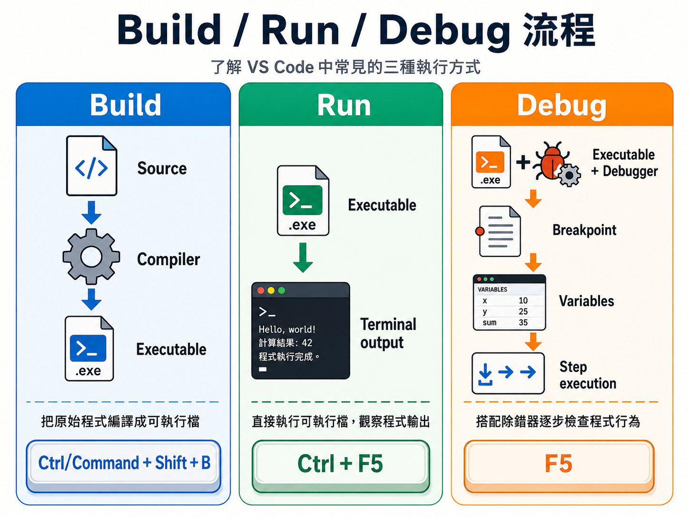
</p>

## 48. 只編譯

```text
Terminal
→ Run Build Task
```

---

## 49. Run Without Debugging

```text
Run
→ Run Without Debugging
```

常用快捷鍵：

```text
Ctrl + F5
```

---

## 50. Start Debugging

```text
Run
→ Start Debugging
```

快捷鍵：

```text
F5
```

---

## 51. Debugger 常用功能

| 功能 | 說明 |
| --- | --- |
| Continue | 繼續執行 |
| Step Over | 執行下一行，不進函式 |
| Step Into | 進入函式 |
| Step Out | 執行到目前函式返回 |
| Restart | 重新執行 |
| Stop | 停止 |
| Variables | 查看變數 |
| Watch | 監看 expression |
| Call Stack | 查看呼叫鏈 |

<p align="center">
  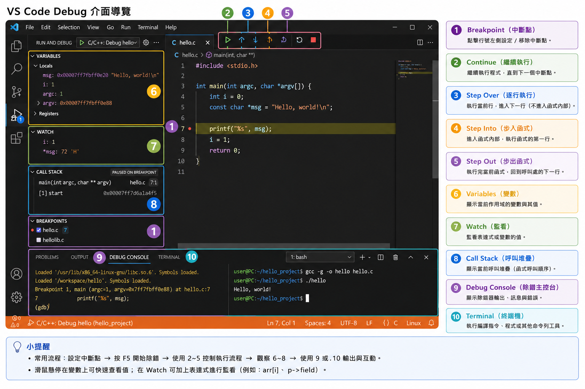
</p>

---

# Part M：需要鍵盤輸入的程式

## 52. C++ 輸入範例

```cpp
// VALIDATE_CPP
#include <iostream>

int main() {
    int first = 0;
    int second = 0;

    std::cin
        >> first
        >> second;

    std::cout
        << first + second
        << '\n';

    return 0;
}
```

---

## 53. 在哪裡輸入？

程式執行後，點選：

```text
TERMINAL
```

不要在以下面板輸入：

```text
OUTPUT
PROBLEMS
DEBUG CONSOLE
```

一般 `cin` 與 `scanf` 應在 integrated terminal 中輸入。

---

# Part N：多檔案 C 專案

## 54. 結構

```text
c_project/
├── include/
│   └── math_utils.h
└── src/
    ├── main.c
    └── math_utils.c
```

---

## 55. `include/math_utils.h`

```c
#ifndef MATH_UTILS_H
#define MATH_UTILS_H

int add(int first, int second);

#endif
```

---

## 56. `src/math_utils.c`

```c
#include "math_utils.h"

int add(int first, int second) {
    return first + second;
}
```

---

## 57. `src/main.c`

```c
#include "math_utils.h"

#include <stdio.h>

int main(void) {
    printf(
        "%d\n",
        add(10, 20)
    );

    return 0;
}
```

---

## 58. 編譯多檔案 C

Linux：

```bash
mkdir -p build

gcc \
  -std=c17 \
  -Wall -Wextra -Wpedantic \
  -Iinclude \
  src/main.c \
  src/math_utils.c \
  -o build/app
```

macOS 將 `gcc` 換成：

```text
clang
```

Windows PowerShell：

```powershell
New-Item -ItemType Directory -Force build

gcc `
  -std=c17 `
  -Wall -Wextra -Wpedantic `
  -Iinclude `
  src/main.c `
  src/math_utils.c `
  -o build/app.exe
```

---

# Part O：多檔案 C++ 專案

## 59. 結構

```text
cpp_project/
├── include/
│   └── math_utils.hpp
└── src/
    ├── main.cpp
    └── math_utils.cpp
```

---

## 60. `include/math_utils.hpp`

```cpp
#ifndef MATH_UTILS_HPP
#define MATH_UTILS_HPP

int add(
    int first,
    int second
);

#endif
```

---

## 61. `src/math_utils.cpp`

```cpp
#include "math_utils.hpp"

int add(
    int first,
    int second
) {
    return
        first +
        second;
}
```

---

## 62. `src/main.cpp`

```cpp
#include "math_utils.hpp"

#include <iostream>

int main() {
    std::cout
        << add(
               10,
               20
           )
        << '\n';

    return 0;
}
```

---

## 63. 編譯多檔案 C++

Linux：

```bash
mkdir -p build

g++ \
  -std=c++17 \
  -Wall -Wextra -Wpedantic \
  -Iinclude \
  src/main.cpp \
  src/math_utils.cpp \
  -o build/app
```

macOS 將 `g++` 換成：

```text
clang++
```

Windows PowerShell：

```powershell
New-Item -ItemType Directory -Force build

g++ `
  -std=c++17 `
  -Wall -Wextra -Wpedantic `
  -Iinclude `
  src/main.cpp `
  src/math_utils.cpp `
  -o build/app.exe
```

---

## 64. Active-file Task 的限制

以下 task：

```json
"${file}"
```

只會編譯目前 active file。

若專案有：

```text
main.cpp
math_utils.cpp
student.cpp
```

只編譯 `main.cpp` 可能出現：

```text
undefined reference
```

多檔案專案應：

- 明確列出所有 `.cpp`。
- 使用 Makefile。
- 使用 CMake。

---

# Part P：CMake 最小範例

## 65. `CMakeLists.txt`

```cmake
cmake_minimum_required(VERSION 3.16)

project(
    HelloProject
    LANGUAGES CXX
)

set(
    CMAKE_CXX_STANDARD 17
)

set(
    CMAKE_CXX_STANDARD_REQUIRED ON
)

set(
    CMAKE_CXX_EXTENSIONS OFF
)

add_executable(
    hello_app
    src/main.cpp
    src/math_utils.cpp
)

target_include_directories(
    hello_app
    PRIVATE
        include
)
```

---

## 66. 使用 CMake Build

```bash
cmake -S . -B build
cmake --build build
```

常見 macOS／Linux 執行位置：

```bash
./build/hello_app
```

Windows 常見：

```powershell
.\build\hello_app.exe
```

實際位置可能依 generator 與 build configuration 不同。


---

# Part Q：常見錯誤排除

<p align="center">
  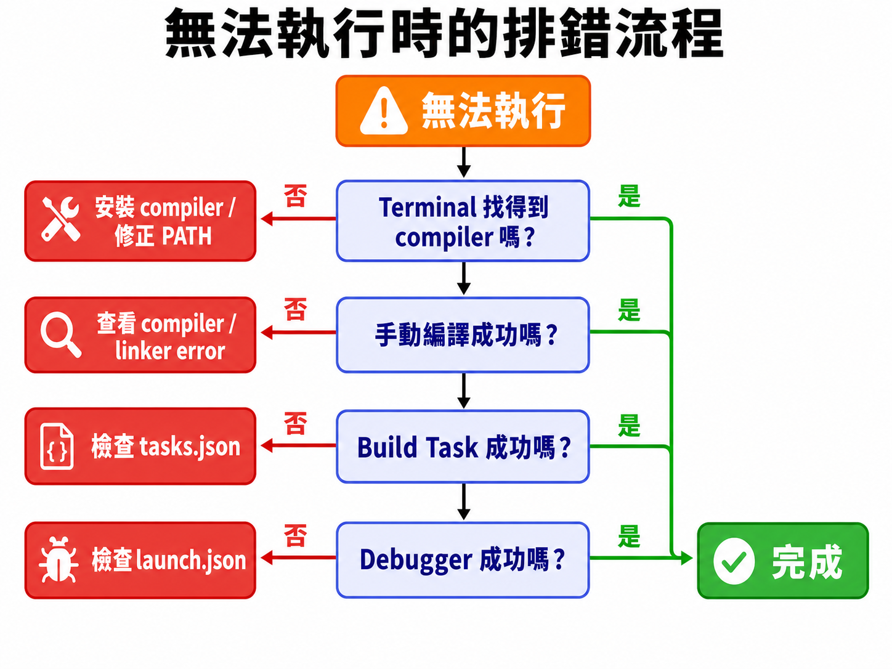
</p>

## 67. `gcc`／`g++` Command Not Found

Windows：

```text
'g++' is not recognized
```

macOS／Linux：

```text
command not found: g++
```

檢查：

1. Compiler 是否已安裝。
2. PATH 是否正確。
3. 是否重新開啟 VS Code。
4. `tasks.json` 的 `command` 路徑是否存在。

---

## 68. `iostream: No Such File or Directory`

常見原因：

- 使用 `gcc` 編譯 C++。
- C++ compiler 沒有安裝完整。
- `compilerPath` 指向 C compiler 或錯誤位置。
- C++ standard library headers 缺少。

C++ 應使用：

```bash
g++ program.cpp
```

或：

```bash
clang++ program.cpp
```

---

## 69. `undefined reference`

表示 source 可能已編譯，但 linker 找不到定義。

常見原因：

- 忘記加入某個 `.cpp`。
- 使用 `gcc` 連結 C++。
- 函式宣告與定義不同。
- Namespace 不同。
- 忘記連結 library。

錯誤：

```bash
g++ src/main.cpp -Iinclude -o app
```

正確：

```bash
g++ \
  src/main.cpp \
  src/math_utils.cpp \
  -Iinclude \
  -o app
```

---

## 70. `multiple definition`

常見原因：

- Header 定義一般 global variable。
- 同一 `.cpp` 被編譯兩次。
- 直接 include `.cpp`。
- 非 inline function definition 放在 header。

應該：

```cpp
#include "math_utils.hpp"
```

不要：

```cpp
/* #include "math_utils.cpp" */
```

---

## 71. Red Squiggles，但程式可以編譯

這通常是 IntelliSense 設定問題。

開啟：

```text
C/C++: Select IntelliSense Configuration
```

或：

```text
C/C++: Edit Configurations (UI)
```

確認：

```json
"compilerPath": "正確的 compiler 路徑"
```

---

## 72. 程式一直執行舊版本

編譯前先儲存：

```text
Windows／Linux：Ctrl + S
macOS：Command + S
```

也可開啟：

```text
File
→ Auto Save
```

---

## 73. Windows 無法覆寫 `.exe`

常見原因：

```text
舊程式仍然在執行
```

先：

- 停止 debugger。
- 在 terminal 按 `Ctrl + C`。
- 關閉正在執行的 `.exe`。

再重新 build。

---

## 74. macOS／Linux 執行時找不到程式

若 executable 在目前資料夾：

```bash
./app
```

不能只輸入：

```bash
app
```

因為目前資料夾通常不在 PATH。

---

## 75. `Permission denied`

可能原因：

- 目前資料夾沒有寫入權限。
- 執行錯誤檔案。
- Executable 沒有 execute permission。
- 輸出檔被其他程序使用。

必要時可檢查：

```bash
ls -l app
```

並設定：

```bash
chmod +x app
```

由 compiler 建立的 executable 通常已具備執行權限。

---

## 76. 無法輸入 `cin`／`scanf`

確認游標在：

```text
TERMINAL
```

不要在：

```text
OUTPUT
PROBLEMS
DEBUG CONSOLE
```

若使用某個 extension 的 Code Runner，輸出可能跑到不能輸入的面板。初學階段建議直接使用本教材的 terminal command、build task 或官方 C/C++ extension。

---

## 77. Play Button 編譯錯誤檔案

按下 Play 前，確認 active tab 是：

```text
hello.c
```

或：

```text
hello.cpp
```

不要停留在：

```text
tasks.json
launch.json
c_cpp_properties.json
```

---

## 78. `preLaunchTask` Not Found

檢查 `launch.json`：

```json
"preLaunchTask": "Build active C++ file"
```

是否與 `tasks.json`：

```json
"label": "Build active C++ file"
```

完全相同。

---

## 79. Windows GDB 找不到

先測試：

```bash
gdb --version
```

再確認：

```json
"miDebuggerPath": "C:/msys64/ucrt64/bin/gdb.exe"
```

---

## 80. macOS LLDB 無法啟動

檢查：

```bash
lldb --version
```

以及：

```json
"MIMode": "lldb"
```

程式也應使用：

```text
-g
```

編譯。

---

## 81. 路徑中有空白

手動 command 需要加引號：

```bash
g++ "My Project/main.cpp" -o "My Project/app"
```

VS Code 的 `${file}` 等變數放在 `args` array 中時，通常能正確處理空白。

---

## 82. 多個 `main()` 發生衝突

如果同一命令同時編譯：

```text
question1.cpp
question2.cpp
question3.cpp
```

而三個檔案都有 `main()`，會出現：

```text
multiple definition of main
```

每個練習應：

- 分別編譯。
- 放到不同資料夾。
- 或建立不同 CMake targets。

---

# Part R：建議的學生資料夾

## 83. 每個練習一個資料夾

```text
C_CPP_Learning/
├── lesson_01_hello/
│   ├── hello.c
│   └── hello.cpp
├── lesson_02_input/
│   ├── input.c
│   └── input.cpp
├── lesson_03_condition/
└── lesson_04_loop/
```

這樣可以避免：

- 多個 `main()` 被一起編譯。
- Executable 名稱互相覆蓋。
- 設定與資料混在一起。

---

# Part S：環境設定檢查表

## 84. 基本工具

- [ ] 已安裝 VS Code。
- [ ] 已安裝 Microsoft C/C++ extension。
- [ ] 已安裝 C compiler。
- [ ] 已安裝 C++ compiler。
- [ ] 已安裝 debugger。

---

## 85. Terminal 驗證

Windows／Linux：

```bash
gcc --version
g++ --version
gdb --version
```

macOS：

```bash
clang --version
clang++ --version
lldb --version
```

- [ ] 所有命令都能顯示版本。
- [ ] 沒有 command not found。
- [ ] 修改 PATH 後已重新啟動 VS Code。

---

## 86. C 測試

- [ ] 可以編譯 `hello.c`。
- [ ] 可以執行輸出檔。
- [ ] 可以看到 `Hello, C!`。
- [ ] 沒有 compiler warning。

---

## 87. C++ 測試

- [ ] 可以編譯 `hello.cpp`。
- [ ] 可以執行輸出檔。
- [ ] 可以看到 `Hello, C++!`。
- [ ] `#include <iostream>` 沒有錯誤。
- [ ] IntelliSense 能顯示提示。

---

## 88. VS Code 測試

- [ ] `Ctrl／Command + Shift + B` 可以 build。
- [ ] F5 可以啟動 debugger。
- [ ] Breakpoint 可以停下。
- [ ] Variables 面板可以看到變數。
- [ ] `cin`／`scanf` 可以在 terminal 輸入。

---

# Part T：概念檢查

## 89. 問題與答案

### Q1. VS Code 本身是 compiler 嗎？

<details><summary>查看答案</summary>

不是。VS Code 是編輯器，必須另外安裝 compiler。

</details>

### Q2. C/C++ extension 是否包含 GCC？

<details><summary>查看答案</summary>

不包含。它提供語言支援、IntelliSense 與 debugger 整合。

</details>

### Q3. C 程式通常使用什麼編譯？

<details><summary>查看答案</summary>

Windows／Linux 常用 `gcc`，macOS 常用 `clang`。

</details>

### Q4. C++ 程式通常使用什麼編譯？

<details><summary>查看答案</summary>

Windows／Linux 常用 `g++`，macOS 常用 `clang++`。

</details>

### Q5. Windows 應加入哪個 PATH？

<details><summary>查看答案</summary>

```text
C:\msys64\ucrt64\bin
```

</details>

### Q6. macOS 安裝 compiler 的命令？

<details><summary>查看答案</summary>

```bash
xcode-select --install
```

</details>

### Q7. Ubuntu 安裝 compiler 與 debugger 的命令？

<details><summary>查看答案</summary>

```bash
sudo apt update
sudo apt install build-essential gdb
```

</details>

### Q8. `tasks.json` 有什麼用途？

<details><summary>查看答案</summary>

定義 build command、compiler arguments 與輸出檔位置。

</details>

### Q9. `launch.json` 有什麼用途？

<details><summary>查看答案</summary>

定義如何啟動 executable 與 debugger。

</details>

### Q10. `c_cpp_properties.json` 有什麼用途？

<details><summary>查看答案</summary>

設定 IntelliSense 的 compiler path、include path 與語言標準。

</details>

### Q11. 為什麼 C++ 應使用 `g++`？

<details><summary>查看答案</summary>

`g++` 會自動連結 C++ standard library。

</details>

### Q12. `-std=c++17` 的作用？

<details><summary>查看答案</summary>

要求 compiler 使用 C++17 標準。

</details>

### Q13. `-Wall -Wextra -Wpedantic` 的作用？

<details><summary>查看答案</summary>

開啟較完整的 compiler warnings。

</details>

### Q14. `-g -O0` 適合什麼？

<details><summary>查看答案</summary>

建立方便 debugger 使用的 Debug build。

</details>

### Q15. 為什麼應 Open Folder？

<details><summary>查看答案</summary>

VS Code 的 workspace 設定、`.vscode` 檔案與多檔案專案以資料夾為基礎。

</details>

### Q16. Active-file task 適合多檔案專案嗎？

<details><summary>查看答案</summary>

通常不適合。它只編譯目前檔案，多檔案專案應列出所有 sources 或使用 CMake。

</details>

### Q17. `undefined reference` 屬於什麼錯誤？

<details><summary>查看答案</summary>

Linker error。

</details>

### Q18. 程式需要輸入時應在哪裡輸入？

<details><summary>查看答案</summary>

VS Code integrated terminal 或外部 terminal。

</details>

### Q19. 修改 PATH 後為什麼要重開 VS Code？

<details><summary>查看答案</summary>

已經開啟的程序通常不會自動取得新的環境變數。

</details>

### Q20. Breakpoint 有什麼用途？

<details><summary>查看答案</summary>

讓程式在指定行暫停，以查看變數與執行流程。

</details>

---

# Part U：實作練習

## 90. 練習題

### TODO 1

確認自己的 C compiler、C++ compiler 與 debugger 版本。

### TODO 2

建立、編譯並執行 `hello.c`。

### TODO 3

建立、編譯並執行 `hello.cpp`。

### TODO 4

建立 C 程式，讀入兩個整數並輸出總和。

### TODO 5

建立 C++ 程式，讀入姓名與分數。

### TODO 6

建立適合自己作業系統的 `tasks.json`。

### TODO 7

使用 `Ctrl／Command + Shift + B` 編譯 active file。

### TODO 8

建立 `launch.json`，並在 `main()` 設定 breakpoint。

### TODO 9

建立兩個 `.cpp` 與一個 `.hpp` 的多檔案專案。

### TODO 10

故意漏掉一個 `.cpp`，觀察 `undefined reference`，再修正。

### TODO 11

故意建立未使用變數，觀察 warning。

### TODO 12

建立含 `cin` 的程式，確認 integrated terminal 可以輸入。

### TODO 13

使用 `std::optional` 確認 C++17 設定正確。

### TODO 14

建立 CMake 最小專案並完成 build。

### TODO 15

請另一位同學依照本教材從零完成設定。

---

# Part V：常見錯誤整理

## 91. 常見錯誤

1. 只安裝 VS Code，沒有安裝 compiler。
2. 誤以為 C/C++ extension 已包含 compiler。
3. Windows 安裝 MSYS2 後沒有安裝 toolchain。
4. Windows 沒有加入 UCRT64 PATH。
5. 修改 PATH 後沒有重開 VS Code。
6. macOS 沒有安裝 Command Line Tools。
7. Linux 沒有安裝 GDB。
8. 使用 `gcc` 編譯 C++。
9. 沒有先儲存檔案。
10. Active file 是 JSON，不是 source。
11. 只 Open File，沒有 Open Folder。
12. `tasks.json` compiler path 錯誤。
13. `preLaunchTask` 與 label 不一致。
14. `launch.json` executable 名稱錯誤。
15. Windows 忘記 `.exe`。
16. macOS／Linux 忘記 `./`。
17. 在 Debug Console 輸入 `cin`。
18. 多檔案專案只編譯 `main.cpp`。
19. 直接 include `.cpp`。
20. 多個 `main()` 一起編譯。
21. 將 IntelliSense 紅線視為唯一編譯結果。
22. 完全忽略 compiler warnings。
23. 路徑有空白卻沒有正確處理。
24. Windows 程式仍執行時覆寫 `.exe`。
25. 沒使用 `-g` 卻期待完整 debug 資訊。
26. 高最佳化下期待每一行都能精準單步。
27. 把 build、run 與 debug 當成同一件事。
28. 新專案複製舊設定後沒有修改輸出名稱。
29. Compiler 成功後仍執行另一個舊 executable。
30. 未先用 terminal 手動驗證 compiler 就開始修改 JSON。

---

# Part W：Mermaid 圖解

## 92. 工具關係

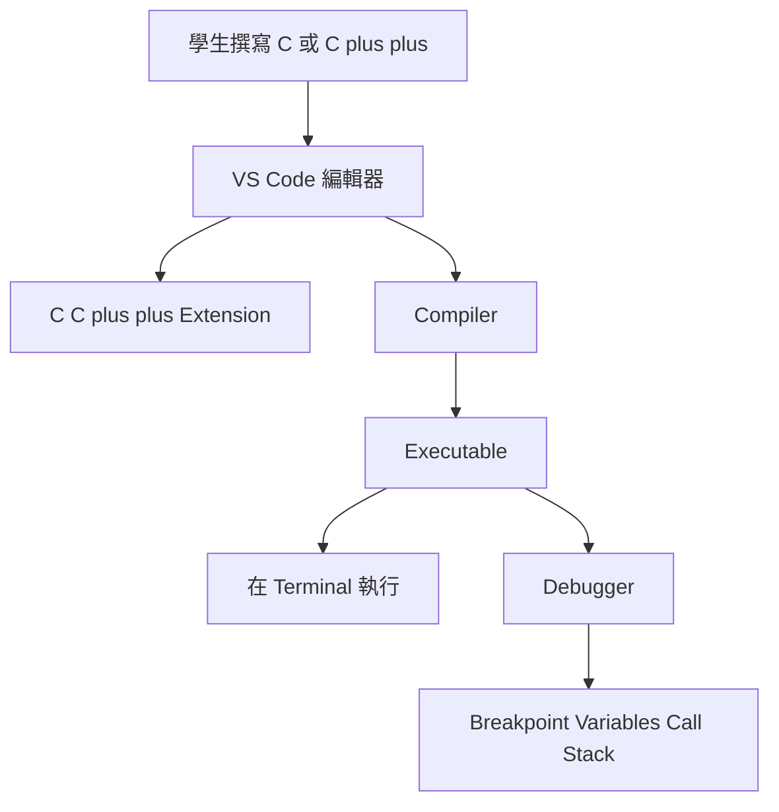

---

## 93. 安裝流程

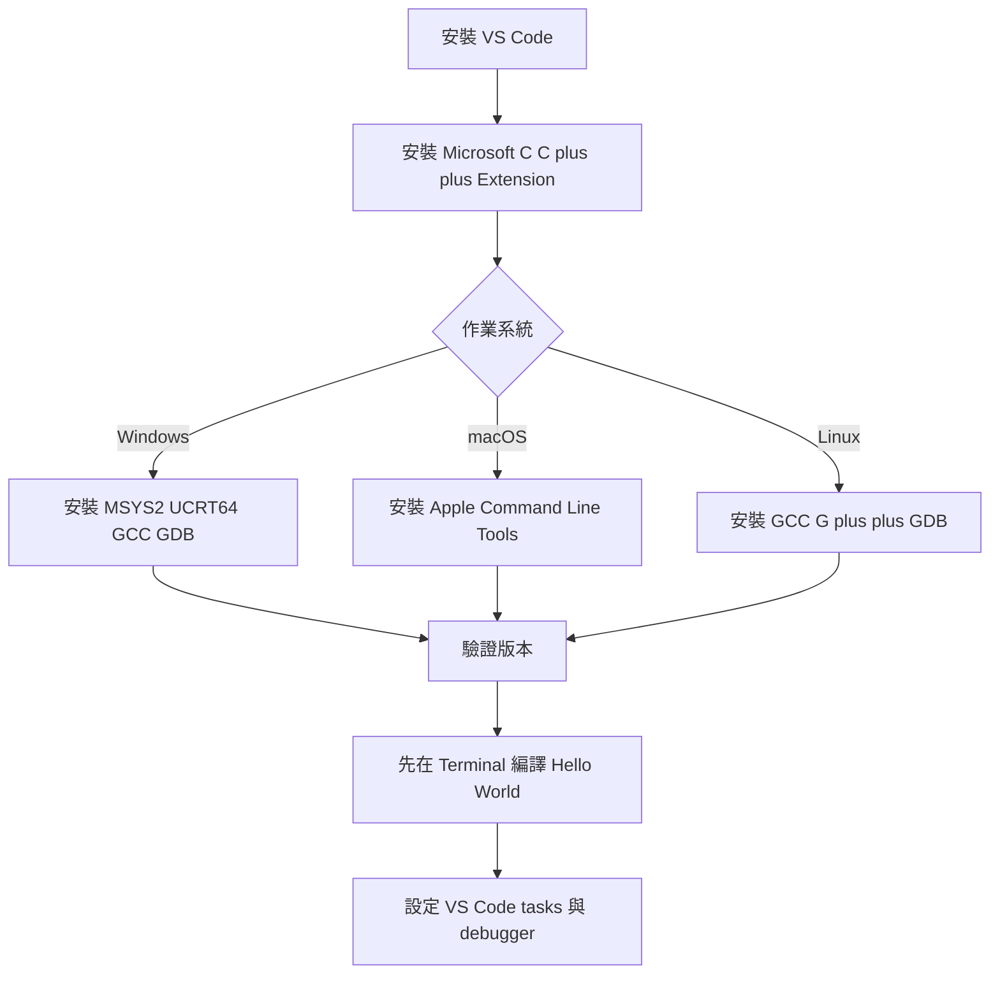

---

## 94. Build 流程

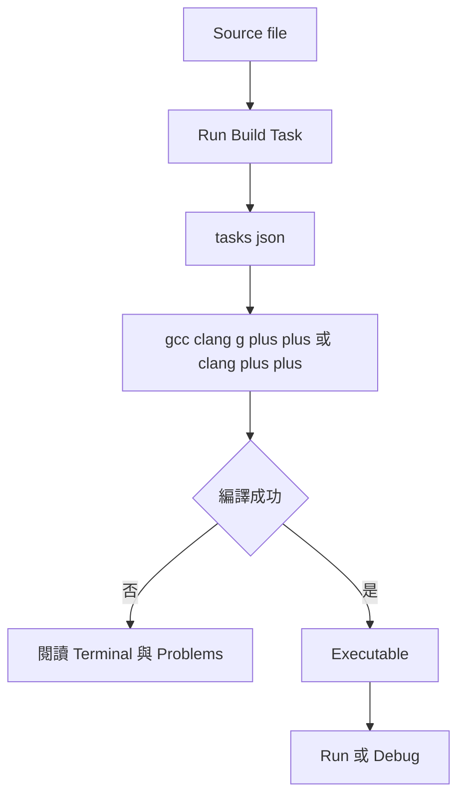

---

## 95. 問題排除流程

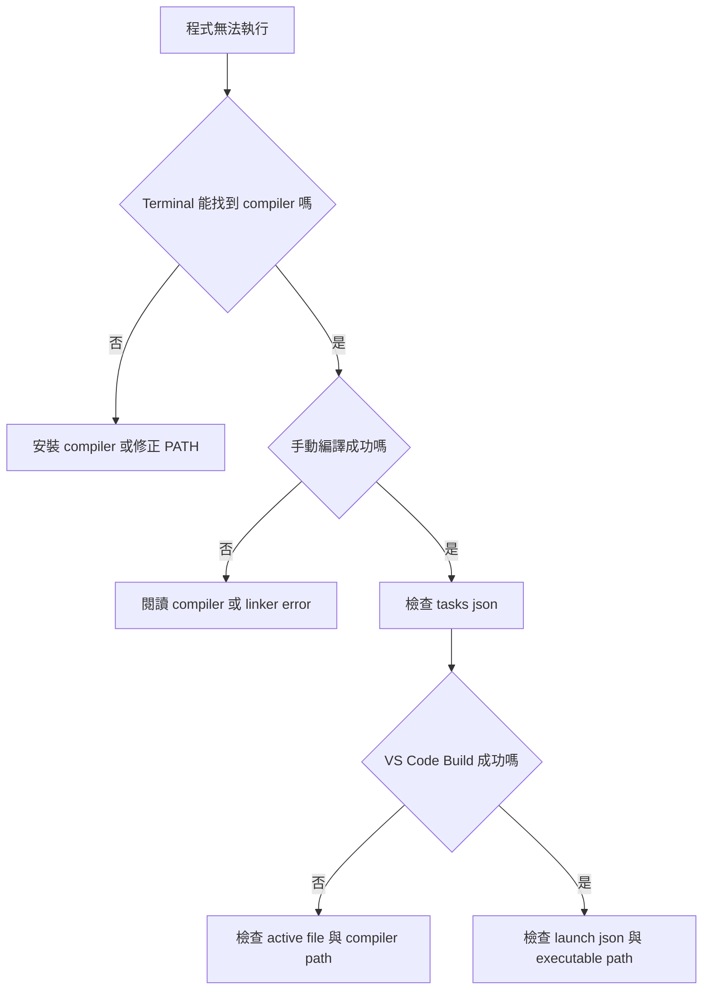

---

# 本章完成標準

完成本章後，你應該能做到：

1. 說明 VS Code 不是 compiler。
2. 安裝 Microsoft C/C++ extension。
3. 依作業系統安裝 compiler。
4. 依作業系統安裝 debugger。
5. 驗證 compiler 與 debugger 版本。
6. 將 Windows toolchain 加入 PATH。
7. 在 macOS 安裝 Command Line Tools。
8. 在 Linux 安裝 build-essential。
9. 建立 VS Code workspace。
10. 編譯第一個 C 程式。
11. 編譯第一個 C++ 程式。
12. 在 terminal 執行 executable。
13. 區分 `gcc` 與 `g++`。
14. 區分 `clang` 與 `clang++`。
15. 使用 C17 與 C++17。
16. 開啟 compiler warnings。
17. 建立 Debug build。
18. 使用 Play button 編譯 active file。
19. 建立 `tasks.json`。
20. 使用 Run Build Task。
21. 理解 VS Code task variables。
22. 建立 `c_cpp_properties.json`。
23. 設定 `compilerPath`。
24. 建立 `launch.json`。
25. 設定 GDB 或 LLDB。
26. 使用 breakpoint。
27. 查看 debugger variables。
28. 在 integrated terminal 輸入資料。
29. 編譯多檔案 C 專案。
30. 編譯多檔案 C++ 專案。
31. 解決 undefined reference。
32. 解決 multiple definition。
33. 判斷 IntelliSense 與 compiler 的差異。
34. 使用最小 CMake 專案。
35. 排除 PATH 問題。
36. 排除 task 設定問題。
37. 排除 launch 設定問題。
38. 避免同時編譯多個 `main()`。
39. 從 terminal 開始逐層排錯。
40. 從零完成可編譯、執行與除錯的環境。

---

# 隱藏答案區

> Answer hidden — try it first.

<details><summary>TODO 1 答案</summary>

Windows／Linux：

```bash
gcc --version
g++ --version
gdb --version
```

macOS：

```bash
clang --version
clang++ --version
lldb --version
```

</details>

<details><summary>TODO 2 答案</summary>

Windows／Linux：

```bash
gcc -std=c17 -Wall -Wextra -Wpedantic hello.c -o hello_c
```

macOS 使用 `clang`。

</details>

<details><summary>TODO 3 答案</summary>

Windows／Linux：

```bash
g++ -std=c++17 -Wall -Wextra -Wpedantic hello.cpp -o hello_cpp
```

macOS 使用 `clang++`。

</details>

<details><summary>TODO 4 答案</summary>

```c
#include <stdio.h>

int main(void) {
    int first = 0;
    int second = 0;

    scanf(
        "%d%d",
        &first,
        &second
    );

    printf(
        "%d\n",
        first + second
    );

    return 0;
}
```

</details>

<details><summary>TODO 5 答案</summary>

```cpp
#include <iostream>
#include <string>

int main() {
    std::string name;
    int score = 0;

    std::cin
        >> name
        >> score;

    std::cout
        << name
        << " "
        << score
        << '\n';

    return 0;
}
```

</details>

<details><summary>TODO 6 答案</summary>

依作業系統選擇本章 Windows、macOS 或 Linux 範例，並確認 compiler path 真實存在。

</details>

<details><summary>TODO 7 答案</summary>

先開啟要編譯的 `.c` 或 `.cpp`，再執行：

```text
Terminal
→ Run Build Task
```

</details>

<details><summary>TODO 8 答案</summary>

建立對應 GDB／LLDB 的 `launch.json`，設定 breakpoint 或：

```json
"stopAtEntry": true
```

</details>

<details><summary>TODO 9 答案</summary>

```text
include/math_utils.hpp
src/math_utils.cpp
src/main.cpp
```

編譯時同時加入兩個 `.cpp`。

</details>

<details><summary>TODO 10 答案</summary>

錯誤：

```bash
g++ src/main.cpp -Iinclude -o app
```

修正：

```bash
g++ src/main.cpp src/math_utils.cpp -Iinclude -o app
```

</details>

<details><summary>TODO 11 答案</summary>

建立未使用的 local variable，使用 `-Wall -Wextra` 編譯，閱讀 warning 後修正。

</details>

<details><summary>TODO 12 答案</summary>

執行程式後點選 integrated terminal，再輸入測試資料。

</details>

<details><summary>TODO 13 答案</summary>

```cpp
#include <optional>
```

並使用：

```bash
g++ -std=c++17 program.cpp -o program
```

</details>

<details><summary>TODO 14 答案</summary>

```bash
cmake -S . -B build
cmake --build build
```

</details>

<details><summary>TODO 15 答案</summary>

檢查對方是否能只依教材完成：

```text
安裝
驗證版本
Build
Run
Debug
輸入資料
排除錯誤
```

</details>

---

# 官方參考資料

- [C/C++ for Visual Studio Code](https://code.visualstudio.com/docs/languages/cpp)
- [Microsoft C/C++ Extension](https://marketplace.visualstudio.com/items?itemName=ms-vscode.cpptools)
- [Using GCC with MinGW on Windows](https://code.visualstudio.com/docs/cpp/config-mingw)
- [Using Clang on macOS](https://code.visualstudio.com/docs/cpp/config-clang-mac)
- [Using GCC on Linux](https://code.visualstudio.com/docs/cpp/config-linux)
- [Configure C/C++ IntelliSense](https://code.visualstudio.com/docs/cpp/configure-intellisense)
- [Debug C++ in Visual Studio Code](https://code.visualstudio.com/docs/cpp/cpp-debug)
- [MSYS2](https://www.msys2.org/)
